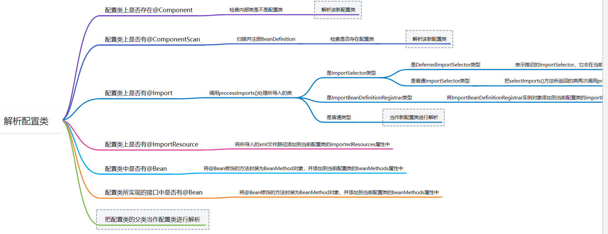

# invokeBeanFactoryPostProcessors与ConfigurationClassPostProcessor解析配置类

[配置类解析横向流程-ProcessOn](https://www.processon.com/view/link/614c83cae0b34d7b342f6d14)

在创建AnnotationConfigApplicationContext中，会先添加AutowiredAnnotationBeanPostProcessor, CommonAnnotationBeanPostProcessor,  ConfigurationClassPostProcessor等， 其中ConfigurationClassPostProcessor负责解析配置类；

```java
AnnotationConfigApplicationContext context = new AnnotationConfigApplicationContext(Config.class);
```

 而Config类会被解析为BeanDefinition放入BeanFactory;

在invokeBeanFactoryPostProcessor中，会先执行BeanDefinitionRegistryPostProcessor, 再BeanFactoryPostProcessor, 而ConfigurationClassPostProcessor实现了这两个接口；

## invokeBeanFactoryPostProcessor

1. 先执行手动添加到AppContext#addBeanFactoryPostProcessor中的BeanDefinitionRegistryPostProcessor
2. 再获取实现了PriorityOrdered接口的BeanDefinitionRegistryPostProcessor， 排序，执行；
3. 再获取实现了Ordered接口的BeanDefinitionRegistryPostProcessor，排序，执行；
4. 再获取BeanDefinitionRegistryPostProcessor类型的所有Bean名称，获取除了2、3步骤之外的bean, 再进行实例化， 排序， 执行；
   - 若是执行后，BeanDefinitionRegistryPostProcessor的名称变多了，则需要再次执行；
5. 执行先执行手动添加到AppContext#addBeanFactoryPostProcessor中的BeanFactoryPostProcessor#postProcessorBeanFactory
6. 执行所有BeanDefinitionRegistryPostProcessor对象的postProcessorBeanFactory回调；
7. 获取实现了PriorityOrdered接口的BeanFactoryPostProcessor对象， 排序，执行；
8. 获取实现了Ordered接口的BeanFactoryPostProcessor对象，排序，执行；
9. 获取没有实现Ordered接口的BeanFactoryPostProcessor对象，执行；

```java
//PostProcessorRegistrationDelegate#invokeBeanFactoryPostProcessors
public static void invokeBeanFactoryPostProcessors(
      ConfigurableListableBeanFactory beanFactory, List<BeanFactoryPostProcessor> beanFactoryPostProcessors) {

   // Invoke BeanDefinitionRegistryPostProcessors first, if any.
   Set<String> processedBeans = new HashSet<>();

   if (beanFactory instanceof BeanDefinitionRegistry) {
      BeanDefinitionRegistry registry = (BeanDefinitionRegistry) beanFactory;
      List<BeanFactoryPostProcessor> regularPostProcessors = new ArrayList<>();
      List<BeanDefinitionRegistryPostProcessor> registryProcessors = new ArrayList<>();

      for (BeanFactoryPostProcessor postProcessor : beanFactoryPostProcessors) {
         if (postProcessor instanceof BeanDefinitionRegistryPostProcessor) {
            BeanDefinitionRegistryPostProcessor registryProcessor =
                  (BeanDefinitionRegistryPostProcessor) postProcessor;
            registryProcessor.postProcessBeanDefinitionRegistry(registry);
            registryProcessors.add(registryProcessor);
         }
         else {
            regularPostProcessors.add(postProcessor);
         }
      }

      List<BeanDefinitionRegistryPostProcessor> currentRegistryProcessors = new ArrayList<>();

      // First, invoke the BeanDefinitionRegistryPostProcessors that implement PriorityOrdered.
      String[] postProcessorNames =
            beanFactory.getBeanNamesForType(BeanDefinitionRegistryPostProcessor.class, true, false);
      for (String ppName : postProcessorNames) {
         if (beanFactory.isTypeMatch(ppName, PriorityOrdered.class)) {
            currentRegistryProcessors.add(beanFactory.getBean(ppName, BeanDefinitionRegistryPostProcessor.class));
            processedBeans.add(ppName);
         }
      }
      sortPostProcessors(currentRegistryProcessors, beanFactory);
      registryProcessors.addAll(currentRegistryProcessors);
      invokeBeanDefinitionRegistryPostProcessors(currentRegistryProcessors, registry);
      currentRegistryProcessors.clear();

      // Next, invoke the BeanDefinitionRegistryPostProcessors that implement Ordered.
      postProcessorNames = beanFactory.getBeanNamesForType(BeanDefinitionRegistryPostProcessor.class, true, false);
      for (String ppName : postProcessorNames) {
         if (!processedBeans.contains(ppName) && beanFactory.isTypeMatch(ppName, Ordered.class)) {
            currentRegistryProcessors.add(beanFactory.getBean(ppName, BeanDefinitionRegistryPostProcessor.class));
            processedBeans.add(ppName);
         }
      }
      sortPostProcessors(currentRegistryProcessors, beanFactory);
      registryProcessors.addAll(currentRegistryProcessors);
      invokeBeanDefinitionRegistryPostProcessors(currentRegistryProcessors, registry);
      currentRegistryProcessors.clear();

      // Finally, invoke all other BeanDefinitionRegistryPostProcessors until no further ones appear.
      boolean reiterate = true;
      while (reiterate) {
         reiterate = false;
         postProcessorNames = beanFactory.getBeanNamesForType(BeanDefinitionRegistryPostProcessor.class, true, false);
         for (String ppName : postProcessorNames) {
            if (!processedBeans.contains(ppName)) {
               currentRegistryProcessors.add(beanFactory.getBean(ppName, BeanDefinitionRegistryPostProcessor.class));
               processedBeans.add(ppName);
               reiterate = true;
            }
         }
         sortPostProcessors(currentRegistryProcessors, beanFactory);
         registryProcessors.addAll(currentRegistryProcessors);
         invokeBeanDefinitionRegistryPostProcessors(currentRegistryProcessors, registry);
         currentRegistryProcessors.clear();
      }

      // Now, invoke the postProcessBeanFactory callback of all processors handled so far.
      invokeBeanFactoryPostProcessors(registryProcessors, beanFactory);
      invokeBeanFactoryPostProcessors(regularPostProcessors, beanFactory);
   }

   else {
      // Invoke factory processors registered with the context instance.
      invokeBeanFactoryPostProcessors(beanFactoryPostProcessors, beanFactory);
   }

   // Do not initialize FactoryBeans here: We need to leave all regular beans
   // uninitialized to let the bean factory post-processors apply to them!
   String[] postProcessorNames =
         beanFactory.getBeanNamesForType(BeanFactoryPostProcessor.class, true, false);

   // Separate between BeanFactoryPostProcessors that implement PriorityOrdered,
   // Ordered, and the rest.
   List<BeanFactoryPostProcessor> priorityOrderedPostProcessors = new ArrayList<>();
   List<String> orderedPostProcessorNames = new ArrayList<>();
   List<String> nonOrderedPostProcessorNames = new ArrayList<>();
   for (String ppName : postProcessorNames) {
      if (processedBeans.contains(ppName)) {
         // skip - already processed in first phase above
      }
      else if (beanFactory.isTypeMatch(ppName, PriorityOrdered.class)) {
         priorityOrderedPostProcessors.add(beanFactory.getBean(ppName, BeanFactoryPostProcessor.class));
      }
      else if (beanFactory.isTypeMatch(ppName, Ordered.class)) {
         orderedPostProcessorNames.add(ppName);
      }
      else {
         nonOrderedPostProcessorNames.add(ppName);
      }
   }

   // First, invoke the BeanFactoryPostProcessors that implement PriorityOrdered.
   sortPostProcessors(priorityOrderedPostProcessors, beanFactory);
   invokeBeanFactoryPostProcessors(priorityOrderedPostProcessors, beanFactory);

   // Next, invoke the BeanFactoryPostProcessors that implement Ordered.
   List<BeanFactoryPostProcessor> orderedPostProcessors = new ArrayList<>(orderedPostProcessorNames.size());
   for (String postProcessorName : orderedPostProcessorNames) {
      orderedPostProcessors.add(beanFactory.getBean(postProcessorName, BeanFactoryPostProcessor.class));
   }
   sortPostProcessors(orderedPostProcessors, beanFactory);
   invokeBeanFactoryPostProcessors(orderedPostProcessors, beanFactory);

   // Finally, invoke all other BeanFactoryPostProcessors.
   List<BeanFactoryPostProcessor> nonOrderedPostProcessors = new ArrayList<>(nonOrderedPostProcessorNames.size());
   for (String postProcessorName : nonOrderedPostProcessorNames) {
      nonOrderedPostProcessors.add(beanFactory.getBean(postProcessorName, BeanFactoryPostProcessor.class));
   }
   invokeBeanFactoryPostProcessors(nonOrderedPostProcessors, beanFactory);

   // Clear cached merged bean definitions since the post-processors might have
   // modified the original metadata, e.g. replacing placeholders in values...
   beanFactory.clearMetadataCache();
}
```

在执行实现了PriorityOrdered接口的BeanDefinitionRegistryPostProcessor过程中，由于容器刚启动，只有内置BeanDefinitionRegistryPostProcessor的只有ConfigurationClassPostProcessor， 因此会最先执行ConfigurationClassPostProcessor#postProcessBeanDefinitionRegsitry回调；

```java
private static void invokeBeanDefinitionRegistryPostProcessors(
      Collection<? extends BeanDefinitionRegistryPostProcessor> postProcessors, BeanDefinitionRegistry registry) {

   for (BeanDefinitionRegistryPostProcessor postProcessor : postProcessors) {
      postProcessor.postProcessBeanDefinitionRegistry(registry);
   }
}
```


## ConfigurationClassPostProcessor解析配置类

```java
public class ConfigurationClassPostProcessor implements BeanDefinitionRegistryPostProcessor,
      PriorityOrdered, ResourceLoaderAware, BeanClassLoaderAware, EnvironmentAware {
          @Override
public void postProcessBeanDefinitionRegistry(BeanDefinitionRegistry registry) {
	//...省略
   processConfigBeanDefinitions(registry);
}

/**
 * Prepare the Configuration classes for servicing bean requests at runtime
 * by replacing them with CGLIB-enhanced subclasses.
 */
@Override
public void postProcessBeanFactory(ConfigurableListableBeanFactory beanFactory) {
	//...省略
   enhanceConfigurationClasses(beanFactory);
   beanFactory.addBeanPostProcessor(new ImportAwareBeanPostProcessor(beanFactory));
}
}
```

每个配置类解析过程中都对应一个ConfigurationClass对象，属性beanMethods存放被@Bean修饰的方法、importResources存放@ImportResource注解的资源路径与资源读取器、属性importBeanDefinitinRegistrars存放@Import注解中，导入类型为ImportBeanDefinitionRegistrar的对象；

```java
final class ConfigurationClass {
   @Nullable
   private String beanName;

   private final Set<ConfigurationClass> importedBy = new LinkedHashSet<>(1);

   private final Set<BeanMethod> beanMethods = new LinkedHashSet<>();

   private final Map<String, Class<? extends BeanDefinitionReader>> importedResources =
         new LinkedHashMap<>();

   private final Map<ImportBeanDefinitionRegistrar, AnnotationMetadata> importBeanDefinitionRegistrars =
         new LinkedHashMap<>();

}
```


postProcessBeanDefinitionRegistry回调流程


1. 获取BeanFactory中的BeanDefinition,获取配置类，排序；
2. 创建ConfigurationClassParser对象解析配置类，每个配置类对应一个ConfigurationClass；
   - 若类上存在**@Component， 则会获取类的内部类，若内部类也是配置类，则递归解析该配置类**；(深度搜索)
   - 若类上存在**@PropertySource**， 则会解析资源配置文件为**PropertySource**对象，加入环境Environment变量中；
     - 若存在名称相同的PropertySource,  则合并后替换掉原来的Environment的环境变量；
   - 若类上存在@**ComponentScan**， 利用**ComponentScanParser**会扫描包的路径，创建所有组件的BeanDefinition, 放入BeanFactory的beanDefinitionMap中。若扫出来的BeanDefinition是配置类，递归**解析扫出来的配置类**；
   - 若类上存在@Import，获取所有的@Import注解导入的类
     - 若导入类是**ImportBeanDefinitionRegistrar**， 则加入**importBeanDefinitionRegistrars**属性中；
     - 若导入类为**ImportSelector**类， 则
       - 若是**DeferedImportSelector**类型，则加入ConfigurationClassParser属性DeferredImportSelectorHandler的deferredImportSelectors中；
       - 若非**DeferedImportSelector**类型， 则调用执行selectImports方法得到类名，然后在把这个类当做导入类进行解析
     - 若导入类不是上面两种情况，则会当做配置类递归解析处理；
   - 若类上存在**@ImportResouce**， 获取资源路径与读取器加入**ImportResources**属性中；
   - 检索类的所有方法、若方法上存在@Bean, 获取@Bean标记的方法加入**beanMethods**属性；
   - 获取类实现的接口中存在@Bean标记的方法，则获取并加入beanMethods属性；（深度搜索）
   - 若存在父类，则递归解析父类；
   - 处理DeferedImportSelector类型的配置类（**SpringBoot的自动装配**）；
     - 遍历属性deferredImportSelectorHandler#deferredImportSelectors集合
       - 拿到ImportSelector是否重写getImportGroup方法，返回Group对象，不重写默认为null;
       - 若group为null， 会调用ImportSelector#selectImport方法，或者若group非null,  则会调用Group对象process方法加载， 得到一批待导入的全限定类名；
         - 再遍历一批全限定名， 导入这批类，流程与处理@Import一样；
3. 创建ConfigurationClassBeanDefinitionReader对象加载BeanDefinition;
   - 遍历扫描到的ConfigurationClass, 分别加载@Bean, @ImportResource, ImportBeanDefinitionRegistry类；
     - 遍历ConfigurationClass的beanMethods， 每个BeanMethod创建对应的ConfigurationClassBeanDefinition, 赋值属性，放入BeanDefinitionMap;
     - 遍历ImportResources， 从缓存中获取XMLBeanDefinitionReader, 调用reader#loadBeanDefinitions加载XML文件的Bean定义
     - 遍历importBeanDefinitionReigisty,  调用ImportBeanDefinitionRegistry#registryBeanDefinitions方法， 加载其他的Bean定义；
4. 若是通过Reader加载出其他的配置类BeanDefinition，则循环解析配置类；
   - 获取所有的BeanDefinition, 若是配置类，且未被加载，则再次执行解析配置类。

```java
public void processConfigBeanDefinitions(BeanDefinitionRegistry registry) {
   List<BeanDefinitionHolder> configCandidates = new ArrayList<>();
   String[] candidateNames = registry.getBeanDefinitionNames();
   for (String beanName : candidateNames) {
      BeanDefinition beanDef = registry.getBeanDefinition(beanName);
	 if (ConfigurationClassUtils.checkConfigurationClassCandidate(beanDef, this.metadataReaderFactory)) {
         configCandidates.add(new BeanDefinitionHolder(beanDef, beanName));
      }
   }
   // Parse each @Configuration class
   ConfigurationClassParser parser = new ConfigurationClassParser(
         this.metadataReaderFactory, this.problemReporter, this.environment,
         this.resourceLoader, this.componentScanBeanNameGenerator, registry);

   Set<BeanDefinitionHolder> candidates = new LinkedHashSet<>(configCandidates);
   Set<ConfigurationClass> alreadyParsed = new HashSet<>(configCandidates.size());
   do {
      parser.parse(candidates);
      parser.validate();

      Set<ConfigurationClass> configClasses = new LinkedHashSet<>(parser.getConfigurationClasses());
      configClasses.removeAll(alreadyParsed);

      // Read the model and create bean definitions based on its content
      if (this.reader == null) {
         this.reader = new ConfigurationClassBeanDefinitionReader(
               registry, this.sourceExtractor, this.resourceLoader, this.environment,
               this.importBeanNameGenerator, parser.getImportRegistry());
      }
      this.reader.loadBeanDefinitions(configClasses);
      alreadyParsed.addAll(configClasses);

      candidates.clear();
      if (registry.getBeanDefinitionCount() > candidateNames.length) {
         String[] newCandidateNames = registry.getBeanDefinitionNames();
         Set<String> oldCandidateNames = new HashSet<>(Arrays.asList(candidateNames));
         Set<String> alreadyParsedClasses = new HashSet<>();
         for (ConfigurationClass configurationClass : alreadyParsed) {
            alreadyParsedClasses.add(configurationClass.getMetadata().getClassName());
         }
         for (String candidateName : newCandidateNames) {
            if (!oldCandidateNames.contains(candidateName)) {
               BeanDefinition bd = registry.getBeanDefinition(candidateName);
               if (ConfigurationClassUtils.checkConfigurationClassCandidate(bd, this.metadataReaderFactory) &&
                     !alreadyParsedClasses.contains(bd.getBeanClassName())) {
                  candidates.add(new BeanDefinitionHolder(bd, candidateName));
               }
            }
         }
         candidateNames = newCandidateNames;
      }
   }
   while (!candidates.isEmpty());
   
}
```



​       