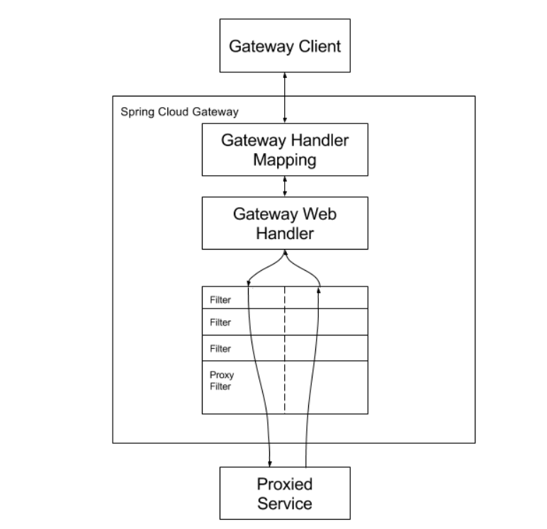
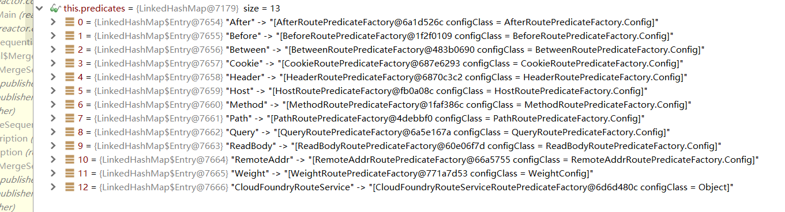
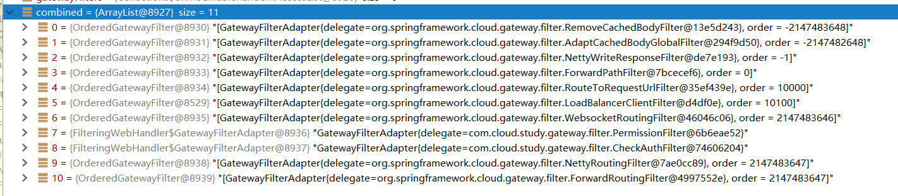

# Gateway源码分析

```xml
<!-- gateway网关 -->
<dependency>
   <groupId>org.springframework.cloud</groupId>
   <artifactId>spring-cloud-starter-gateway</artifactId>
</dependency>
```

依赖

```xml
<dependency>
  <groupId>org.springframework.cloud</groupId>
  <artifactId>spring-cloud-gateway-server</artifactId>
  <version>2.2.9.RELEASE</version>
  <scope>compile</scope>
</dependency>
```

xml配置：

```yml
spring:
  application:
    name: gateway
  #配置nacos注册中心地址
  cloud:
    nacos:
      discovery:
        server-addr: 127.0.0.1:8848
    gateway:
      enabled: true
      routes:
      - id: feign-provider  #路由ID，全局唯一，建议配合服务名
#        #uri: http://localhost:8020  #目标微服务的请求地址和端口
        uri: lb://feign-provider  #lb 整合负载均衡器ribbon,loadbalancer
        predicates:
#        #Path路径匹配
        - Path=/provider/**
      - id: feign-consumer  #路由ID，全局唯一，建议配合服务名
        uri: lb://feign-consumer  #lb 整合负载均衡器ribbon,loadbalancer
        predicates:
        - Path=/consumer/**
```

spring.cloud.gateway.routes 配置绑定 GatewayProperties routes属性List<RouteDefinition>

每个id对应一个Route、 每个predicates对应List<PredicateDefinition>集合；

```properties
# Auto Configure
org.springframework.boot.autoconfigure.EnableAutoConfiguration=\
org.springframework.cloud.gateway.config.GatewayClassPathWarningAutoConfiguration,\
org.springframework.cloud.gateway.config.GatewayAutoConfiguration,\
org.springframework.cloud.gateway.config.GatewayHystrixCircuitBreakerAutoConfiguration,\
org.springframework.cloud.gateway.config.GatewayResilience4JCircuitBreakerAutoConfiguration,\
org.springframework.cloud.gateway.config.GatewayLoadBalancerClientAutoConfiguration,\
org.springframework.cloud.gateway.config.GatewayNoLoadBalancerClientAutoConfiguration,\
org.springframework.cloud.gateway.config.GatewayMetricsAutoConfiguration,\
org.springframework.cloud.gateway.config.GatewayRedisAutoConfiguration,\
org.springframework.cloud.gateway.discovery.GatewayDiscoveryClientAutoConfiguration,\
org.springframework.cloud.gateway.config.SimpleUrlHandlerMappingGlobalCorsAutoConfiguration,\
org.springframework.cloud.gateway.config.GatewayReactiveLoadBalancerClientAutoConfiguration
```

GatewayAutoConfiguration ：

-  向容器注入 多个路由断言工厂RoutePredicateFactory、全局过滤器GlobalFilter；
- 注入RoutePredicateHandlerMapping， 寻找合适的路由处理器(对应SpringMVC的HandlerMapping)
- 注入RouteDefinitionLocator路由定位器；
- PropertiesRouteDefinitionLocator ： 配置路由定义定位器、即根据yml文件配置的routes获取路由定义；

GatewayLoadBalancerClientAutoConfiguration ：

- 往容器中注入LoadBalancerClientFilter负载均衡全局过滤器；

- FilteringWebHandler ： 类似SpringMVC的Handler、 对于Gateway而言、只有这个处理器、需要传入GlobalFilter集合参数；

  


## Spring Cloud工作流程图



客户端请求经过网关后、 由GatewayHandlerMapping找到GatewayWebHandler,每个GatewayWebHandler包含一组过滤器链、 执行完后、转发请求到服务提供者；

SpringCloud Gateway使用MVC WebFlux响应式编程、与Spring MVC有区别：

 对比
DispatcherServlet======   DispatcherHandler
HanderMapping======HanderMapping
HanderAdapter======HanderAdapter
MethodHandle ======WebHandler


DispatcherHandler#handle

```java
public Mono<Void> handle(ServerWebExchange exchange) {
    return this.handlerMappings == null ? this.createNotFoundError() : Flux.fromIterable(this.handlerMappings).concatMap((mapping) -> {
        return mapping.getHandler(exchange);
    }).next().switchIfEmpty(this.createNotFoundError()).flatMap((handler) -> {
        return this.invokeHandler(exchange, handler);
    }).flatMap((result) -> {
        return this.handleResult(exchange, result);
    });
}
```

ServerWebExchange : 封装了HttpRequest, HttpResponse， 类似ThreadLocal;

### HandlerMapping#getHandler

HandlerMapping#getHandler : Gateway中使用配置往容器中注入RoutePredicateHandlerMapping的Bean, 用来获取WebHandler;

- RoutePredicateHandlerMapping#getHandlerInternal

  - RoutePredicateHandlerMapping#lookupRoute ： 寻找目标路由处理器

    - Flux<Route> routes = this.routeDefinitionLocator.getRouteDefinitions().map(this::convertToRoute);

      - this.routeLocator.getRoutes() : 

        - RouteDefinitionRouteLocator#getRoutes() ：实现了RouteLocator接口、获取所有的路由配置；
          - PropertiesRouteDefinitionLocator#getRouteDefinitions ：实现了RouteDefinitionLocator， 从GatewayProperties获取所有的路由定义
            - return Flux.fromIterable(this.properties.getRoutes()) 

      - this::convertToRoute

        - AsyncPredicate<ServerWebExchange> predicate = this.combinePredicates(routeDefinition) ：通过断言工厂获取断言；

          - RoutePredicateFactory<Object> factory = (RoutePredicateFactory)this.predicates.get(predicate.getName())  : 根据Predicate配置名、从断言工厂Map中获取断言工厂；
          - return factory.applyAsync(config) ： 调用断言工厂apply方法、获取断言；
            - PathRoutePredicateFactory#apply : 返回GatewayPredicate实例

        - List<GatewayFilter> gatewayFilters = this.getFilters(routeDefinition) ：默认为空；

        - return ((AsyncBuilder)Route.async(routeDefinition).asyncPredicate(predicate)

          .replaceFilters(gatewayFilters)).build() ：构建路由返回 

  - exchange.getAttributes().put(ServerWebExchangeUtils.GATEWAY_HANDLER_MAPPER_ATTR, this.getSimpleName()) : 上下文设置当前处理器映射器名称；

  - exchange.getAttributes().put(ServerWebExchangeUtils.GATEWAY_ROUTE_ATTR, r) ：上下文中设置路由处理器、

  - return Mono.just(this.webHandler) : 返回WebHandler、类型为FilterWebHandler;

- 最终返回Route对象；




### DispatchHandler#invokeHandler

找到WebHandler后、执行处理器；

```java
private Mono<HandlerResult> invokeHandler(ServerWebExchange exchange, Object handler) {
    if (this.handlerAdapters != null) {
        Iterator var3 = this.handlerAdapters.iterator();

        while(var3.hasNext()) {
            HandlerAdapter handlerAdapter = (HandlerAdapter)var3.next();
            if (handlerAdapter.supports(handler)) {
                return handlerAdapter.handle(exchange, handler);
            }
        }
    }

    return Mono.error(new IllegalStateException("No HandlerAdapter: " + handler));
}
```

类似SpringMVC、 会找到匹配的HandlerAdapter、 调用HandlerAdapter#handle方法；

负责处理WebHandler的HandlerApater为SimpleHandlerAdapter；

- SimpleHandlerAdapter#supports

  - WebHandler.class.isAssignableFrom(handler.getClass());

- SimpleHandlerAdapter#handle

  - webHandler.handle(exchange) : 执行FilterWebHandler#handle

    - Route route = (Route)exchange.getRequiredAttribute(ServerWebExchangeUtils.GATEWAY_ROUTE_ATTR) : 从上下文中获取路由；

    - List<GatewayFilter> combined = new ArrayList(this.globalFilters) ：获取容器中的所有全局过滤器； 

    - AnnotationAwareOrderComparator.sort(combined) ：全局过滤器排序；

    - (new FilteringWebHandler.DefaultGatewayFilterChain(combined)).filter(exchange)： 构造过滤器链调用，按顺序调用全局过滤器；

      


注意 GlobalFilter 是全局过滤器接口、而调用时，类型为GatewayFilter ?

在容器启动时、会往容器中注入FilteringWebHandler的Bean，构造器注入容器中的全局过滤器；遍历全局过滤器GlobalFilter， 创建GatewayFilterAdapter对象、包装GlobalFilter，而GatewayFilterAdapter实现了GatewayFilter接口，因此类型也为GatewayFilter， 过滤器链调用GatewayFilter#filter时、是调用GatewayFilterAdapter#filter，会调用GlobalFilter#filter方法 ===> 适配器模式

```java
public class FilteringWebHandler implements WebHandler {
    protected static final Log logger = LogFactory.getLog(FilteringWebHandler.class);
    private final List<GatewayFilter> globalFilters;

    public FilteringWebHandler(List<GlobalFilter> globalFilters) {
        this.globalFilters = loadFilters(globalFilters);
    }

    private static List<GatewayFilter> loadFilters(List<GlobalFilter> filters) {
        return (List)filters.stream().map((filter) -> {
            FilteringWebHandler.GatewayFilterAdapter gatewayFilter = new FilteringWebHandler.GatewayFilterAdapter(filter);
            if (filter instanceof Ordered) {
                int order = ((Ordered)filter).getOrder();
                return new OrderedGatewayFilter(gatewayFilter, order);
            } else {
                return gatewayFilter;
            }
        }).collect(Collectors.toList());
    }
}
private static class GatewayFilterAdapter implements GatewayFilter {
    private final GlobalFilter delegate;

    GatewayFilterAdapter(GlobalFilter delegate) {
        this.delegate = delegate;
    }

    public Mono<Void> filter(ServerWebExchange exchange, GatewayFilterChain chain) {
        return this.delegate.filter(exchange, chain);
    }
}

```


请求URL：[localhost:8888/provider/get](http://localhost:8888/provider/get)

- RouteToRequestUrlFilter#filter
  - URI uri = exchange.getRequest().getURI() ：即浏览器地址；
  - URI routeUri = route.getUri() ： 获取yml路由配置的URI=》 lb://feign-provider
  - URI mergedUrl = UriComponentsBuilder.fromUri(uri).scheme(routeUri.getScheme()).host(routeUri.getHost()).port(routeUri.getPort()).build(encoded).toUri() : 构建目标服务的URI=>lb://feign-provider/provider/get
  - exchange.getAttributes().put(ServerWebExchangeUtils.GATEWAY_REQUEST_URL_ATTR, mergedUrl) : 设置目标URI给上下文；

- LoadBalancerClientFilter#filter

  - URI url = (URI)exchange.getAttribute(ServerWebExchangeUtils.GATEWAY_REQUEST_URL_ATTR) : 获取目标URI
  - url != null && ("lb".equals(url.getScheme()) || "lb".equals(schemePrefix)) ； 协议为lb;
  - ServiceInstance instance = this.choose(exchange) : 负载均衡、从Nacos中获取某个服务提供者实例；
  - URI uri = exchange.getRequest().getURI() ： 即浏览器地址
  - URI requestUrl = this.loadBalancer.reconstructURI(new DelegatingServiceInstance(instance, overrideScheme), uri) ： 重新构建url ，将服务名替换服务提供者的IP，port号 =》 http://192.168.200.1:8050/provider/findById?id=1
  - exchange.getAttributes().put(ServerWebExchangeUtils.GATEWAY_REQUEST_URL_ATTR, requestUrl) : 将目标服务请求URL放入上下文中；
  - return chain.filter(exchange) ： 调用下一个过滤器处理

- NettyRoutingFilter#filter

  - URI requestUrl = (URI)exchange.getRequiredAttribute(ServerWebExchangeUtils.GATEWAY_REQUEST_URL_ATTR) ：从上下文中拿出目标请求URL

  - ServerHttpRequest request = exchange.getRequest() ： 从上下文中获取请求

  - HttpMethod method = HttpMethod.valueOf(request.getMethodValue()) ： 获取请求方式、GET/POST

  - ```java
    HttpHeaders filtered = HttpHeadersFilter.filterRequest(this.getHeadersFilters(), exchange);
    DefaultHttpHeaders httpHeaders = new DefaultHttpHeaders();
    filtered.forEach(httpHeaders::set);
    ```

    获取并设置请求头

  - Route route = (Route)exchange.getAttribute(ServerWebExchangeUtils.GATEWAY_ROUTE_ATTR)：获取路由对象

  - (RequestSender)this.getHttpClient(route, exchange) : 获取HttpClient客户端；

  - nettyOutbound.send(request.getBody().map(this::getByteBuf)) ： 通过NettyClient发起Http请求；


个人理解 ： springcloud 可与 JavaWEB类比，是分布式的JavaWEB:

Spring Cloud    JavaWeb

Gateway			Filter

SpringBoot      Servlet


