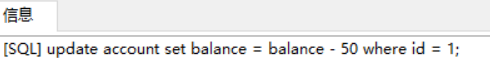

# Mysql事务、隔离级别与优化

## 事务及其ACID属性

事务是一组操作要么全部成功，要么全部失败，目的是为了保证数据最终的一致性。

原子性：一组操作要全部成功，要么都失败；原子性有undo日志保证；

一致性：一组操作由一个状态 变为 最终状态， 不存在中间状态；

隔离性：多个事务并发运行，内部操作互不干扰；由锁机制与MVCC机制保证；

持久性：一组操作全部成功，事务提交后，数据修改是永久性的；有redo日志保证；

### 并发事务处理带来的问题

更新丢失或脏写 : 两个事务操作同一条数据，事务A提交数据后，事务B覆盖事务A提交的数据；

脏读： 事务A读取到事务B未提交的数据；

不可重复读：事务相同的查询，不同时刻，前后结果数据不一致；

幻读：事务A读取到事务B提交的数据；

## 事务隔离级别

Mysql通过不同的隔离级别 级别解决 脏读，不可重复读， 幻读问题；


**数据库的事务隔离越严格,并发副作用越小,但付出的代价也就越大,因为事务隔离实质上就是使事务在一定程度上“串行化”进行,这显然与“并发”是矛盾的。**

同时,不同的应用对读一致性和事务隔离程度的要求也是不同的,比如许多应用对“不可重复读"和“幻读”并不敏感,可能更关心数据并发访问的能力。

查看当前数据库的事务隔离级别: show variables like 'tx_isolation';

设置事务隔离级别：set tx_isolation='REPEATABLE-READ';

**Mysql默认的事务隔离级别是可重复读，用Spring开发程序时，如果不设置隔离级别默认用Mysql设置的隔离级别，如果Spring设置了就用已经设置的隔离级别**


## **事务隔离级别案例分析**

```mysql
CREATE TABLE `account` (
  `id` int(11) NOT NULL AUTO_INCREMENT,
  `name` varchar(255) DEFAULT NULL,
  `balance` int(11) DEFAULT NULL,
  PRIMARY KEY (`id`)
) ENGINE=InnoDB DEFAULT CHARSET=utf8;
INSERT INTO `test`.`account` (`name`, `balance`) VALUES ('lilei', '450');
INSERT INTO `test`.`account` (`name`, `balance`) VALUES ('hanmei', '16000');
INSERT INTO `test`.`account` (`name`, `balance`) VALUES ('lucy', '2400');
```


- 读未提交

  1. 事务A：开启事务，第一次查询数据

  ```java
  //开启读未提交
  set tx_isolation='read-uncommitted';
  //开启事务
  BEGIN;
  //查询
  select * from account;
  ```

  


2.  事务B：开启事务，更新id=1的数据，事务不提交；

```java
set tx_isolation='read-uncommitted';
BEGIN;
update account set balance = balance - 50 where id = 1;
select * from account;
```


3. 事务A重启查询：查到了事务B未提交的数据，**即脏读**


4. 事务B回滚， 则事务A读取数据为脏数据；

```
ROLLBACK;

select * from account;
```


5. 事务A 执行更新数据；

```mysql
update account set balance = balance - 50 where id = 1;

select * from account;
```


问题：事务A读取到的是400， sql执行后还是400？

更新SQL执行时， MySQL先读取到最新数据450， 再执行-50操作， 因此结果是400；（正常）

**在应用程序中，从数据库读取数据到内存，在Java代码中操作，我们会 用400-50=350，而不知道其他会话回滚了，要想解决这个问题可以采用读已提交的隔离级别；**


- 读已提交

1. 打开一个客户端A，并设置当前事务模式为read committed（未提交读），查询表account的所有记录：

```mysql
# 设置为 读已提交
set tx_isolation='read-committed';
# 开启事务
BEGIN;
select * from account;
```


2. 在客户端A的事务提交之前，打开另一个客户端B，更新表account： 

```mysql
set tx_isolation='read-committed';
BEGIN;
update account set balance = balance - 50 where id = 1;
select * from account;
```


3. 在客户端A再次查询， 并不能查询到客户端B修改的数据，解决了脏读问题；


4. 客户端B提交事务

```mysql
COMMIT;
```

5. 客户端A重新执行同样的SQL查询， 数据发生变化，即**产生不可重复读问题**；


- 可重复读
  - 在事务开启后，首次查询的是已提交的最新数据，并生成快照；
  -  事务中，下次SQL查询的是该快照中的数据；
  - 其他事务若修改并提交数据，则对本事务无影响；
  - 若当前事务修改了某条数据，则当前事务下次查询到的是更新后的数据；

1. 打开一个客户端A，并设置当前事务模式为repeatable read，查询表account的所有记录

```mysql
set tx_isolation='repeatable-read';
BEGIN;
select * from account;
```


2. 在客户端A的事务提交之前，打开另一个客户端B，更新表account并提交

```java
set tx_isolation='repeatable-read';
BEGIN;
update account set balance = balance - 50 where id = 1;
select * from account;
```


3. 在客户端A查询表account的所有记录，与步骤（1）查询结果一致，没有出现不可重复读的问题

```mysql
select * from account;
```


和一步骤查出的数据一致，不可重复读问题解决；

4. 在客户端A，接着执行update account set balance = balance - 50 where id = 1，balance没有变成400， 而是350；

```mysql
update account set balance = balance - 50 where id = 1;
select * from account;
```


因为客户端B已经修改为400了， 所以更新为350保证了一致性问题； 

**可重复读使用了MVCC机制，保证事务的隔离性， select使用读快照(历史版本),  insert, update, delete使用当前读(当前版本)；**

5. 重新打开客户端B，插入一条新数据后提交

```mysql
set tx_isolation='repeatable-read';
BEGIN;
INSERT INTO account VALUES (4, 'yaoyao', 100);
COMMIT;
```

6. 在客户端A查询表account的所有记录，没有查出新增数据，所以没有出现幻读

```mysql
select * from account;
```


7. 验证幻读

在客户端A执行update account set balance=888 where id = 4；能更新成功，再次查询能查到客户端B新增的数据

```mysql
update account set balance=888 where id = 4;
select * from account;
```


8. 写写阻塞

打开客户端A， 开启事务， 更新id=1的数据；

```mysql
set tx_isolation='repeatable-read';
BEGIN;
select * from account;
update account set balance = balance - 50 where id = 1;
```

打开客户端B， 开启事务， 更新id=1的数据； 更新SQL执行阻塞了， 因为id=1的数据被锁了， 行锁；

```mysql
set tx_isolation='repeatable-read';
BEGIN;
update account set balance = balance - 50 where id = 1;
```


客户端A提交事务；

```mysql
COMMIT;
```

客户端B获取到行锁， 阻塞自动接触，


**可重复读使用MVCC机制解决了事务读写数据的并发问题，使数据的读写可以同时执行；**


- 串行化 : 重置i=1数据为450；

1. 打开一个客户端A，并设置当前事务模式为serializable，查询表account的初始值：

```mysql
set tx_isolation='serializable';
BEGIN;
select * from account where id = 1;
```


2. 打开一个客户端B，并设置当前事务模式为serializable，更新相同的id为1的记录会被阻塞等待，更新id为2的记录可以成功，说明在串行模式下innodb的查询也会被加上行锁，如果查询的记录不存在会给这条不存在的记录加上锁;

```mysql
set tx_isolation='serializable';
BEGIN;
update account set balance = balance - 50 where id = 1;
```



**对于同一条记录，读写，写写不可同时执行；**


如果客户端A执行的是一个范围查询，那么该**范围内的所有行包括每行记录所在的间隙区间范围都会被加锁**。此时如果客户端B在该范围内插入数据都会被阻塞，所以就避免了幻读。

这种隔离级别并发性极低，开发中很少会用。  


## **事务问题定位**

```mysql
#查询执行时间超过1秒的事务，详细的定位问题方法后面讲完锁课程后会一起讲解
SELECT
	* 
FROM
	information_schema.innodb_trx 
WHERE
	TIME_TO_SEC( timediff( now( ), trx_started ) ) > 1;
 
 #强制结束事务
 kill 事务对应的线程id(就是上面语句查出结果里的trx_mysql_thread_id字段的值)
```

## **大事务的影响**

1. 锁定太多数据，会导致阻塞和锁超时；
2. undo log日志越长， 回滚时间越久；
3. 导致死锁；
4. 并发情况下，数据库连接池容易被撑爆

## 事务优化

1. 将查询等数据准备操作放到事务外
2. 事务中避免远程调用，远程调用需要设置超时，防止事务等待时间长；
3. 事务中避免一次性处理太多数据，可以拆分成多个事务分次处理
4. 能异步处理就异步处理；
5. 涉及加锁的操作尽可能放最后执行；


### 查询操作方法需要使用事务吗？

需要看具体业务场景， 如果统计报表，需要基于某一时刻的数据做统计，则需要加事务， 若不加事务，在统计时，若是其他事务把统计的数据修改了，那么统计出来的数据会有问题；若加事务，会生成读快照， 读取的都是快照中的数据，而不是其他事务提交后的数据。


### 事务持久性

MySQL引入了redo log，Buffer Pool内存写完了，然后会写一份redo log，这份redo log记载着这次在某个页上做了什么修改。

即便MySQL在中途挂了，我们还可以根据redo log来对数据进行恢复。

redo log 是顺序写的，写入速度很快。并且它记录的是物理修改（xxxx页做了xxx修改），文件的体积很小，恢复速度也很快。

