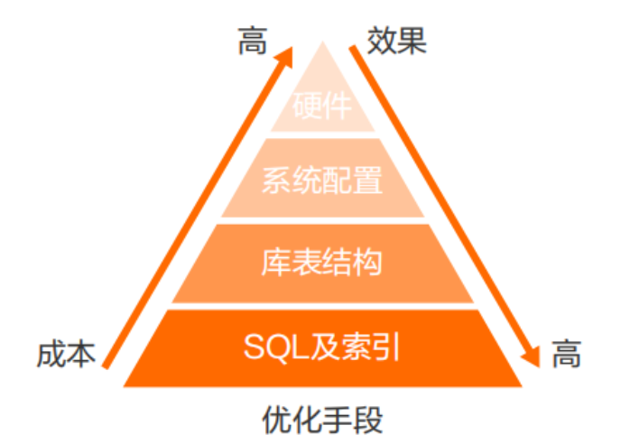

# MySQL全局参数 与 MySQL8.0



数据库优化 首当考虑优化SQL和索引， 优化完后，性能还不达标，就得使用主从环境，分库分表优化；

## my.ini或my.cnf的全局参数

假设服务器配置为：

- CPU：32核
- 内存：64G
- DISK：2T SSD

下面参数都是服务端参数，默认在配置文件的 [mysqld] 标签下

- 最大连接数：max_connections 数据库最大支持的连接数；

```ini
max_connections=3000
```

一个链接至少占256KB，最大64MB, 超过最大值，放在磁盘上；

因此占用最大内存为 3000 * 64 = 192G；


- 最大用户连接数量：max_user_connections  

```ini
max_user_connections=2980  
```

允许用户连接最大数量，剩余连接数给DBA用来管理；

- 暂存连接数量：back_log

```ini
back_log=300
```

超过最大数量后，超额的请求会放到堆栈中，等待某一条连接释放， 堆栈数量就是back_log，超过数量会被拒绝；

- JDBC断开时间：wait_timeout         

```ini
wait_timeout=300
```

指的是app引用通过jdbc连接mysql操作完毕后，空闲300断开，默认28800,8小时；

- mysql client 断开时间 interactive_timeout

```ini
interactive_timeout=300
```

指的是mysql client连接mysql进行操作完毕后，空闲300秒后断开，默认是28800，单位秒，即8个小时。

- 工作线程并发数 innodb_thread_concurrency

```ini
innodb_thread_concurrency=64
```

默认为0， 不限制；手动设置，可设置为CPU核心数的2被；不宜太多，线程切换和线程锁的竞争会降低性能；

- 工作缓冲区大小innodb_buffer_pool_size

```ini
innodb_buffer_pool_size=40G
```

buffer pool缓存大小， 一般是机器物理内存的60%-70%；

- 行锁等待时间

```ini
innodb_lock_wait_timeout=10
```

默认50s, 有需求就按业务设置；

- redo log写入磁盘策略innodb_flush_log_at_trx_commit

```ini
innodb_flush_log_at_trx_commit=1
```

0 : 写到redo lo buffer；

1： 写入redo log buffer, 再写入磁盘；

2：写入redo log buffer, 再写入page cache;

- binlog写入磁盘策略sync_binlog

```ini
sync_binlog=1
```

- 排序缓冲区大小

```ini
sort_buffer_size=4M
```

每个工作线程需要排序时，分配该大小的缓冲区，用于order by和group by操作；

是个connection级别的参数，第一次排序时，一次分配设置的内存；

设置过大，耗尽内存， 每个连接都10MB，3000 * 10 = 30G了；


- 表连接缓冲区大小

```ini
join_buffer_size=4M
```

 用于表关联缓存的大小，和sort_buffer_size一样，该参数对应的分配内存也是每个连接独享。


类似线程池；

## Mysql 8.0新特性详解

### 新增降序索引

5.7支持降序索引语法，但是建立索引后，还是升序；

8.0后，真正实现了降序索引；

```
# ====MySQL 5.7演示====
mysql> create table t1(c1 int,c2 int,index idx_c1_c2(c1,c2 desc));
Query OK, 0 rows affected (0.04 sec)

mysql> insert into t1 (c1,c2) values(1, 10),(2,50),(3,50),(4,100),(5,80);
Query OK, 5 rows affected (0.02 sec)

mysql> show create table t1\G
*************************** 1. row ***************************
       Table: t1
Create Table: CREATE TABLE `t1` (
  `c1` int(11) DEFAULT NULL,
  `c2` int(11) DEFAULT NULL,
  KEY `idx_c1_c2` (`c1`,`c2`)    --注意这里，c2字段是升序
) ENGINE=InnoDB DEFAULT CHARSET=latin1
1 row in set (0.00 sec)

mysql> explain select * from t1 order by c1,c2 desc;  --5.7也会使用索引，但是Extra字段里有filesort文件排序
+----+-------------+-------+------------+-------+---------------+-----------+---------+------+------+----------+-----------------------------+
| id | select_type | table | partitions | type  | possible_keys | key       | key_len | ref  | rows | filtered | Extra                       |
+----+-------------+-------+------------+-------+---------------+-----------+---------+------+------+----------+-----------------------------+
|  1 | SIMPLE      | t1    | NULL       | index | NULL          | idx_c1_c2 | 10      | NULL |    1 |   100.00 | Using index; Using filesort |
+----+-------------+-------+------------+-------+---------------+-----------+---------+------+------+----------+-----------------------------+
1 row in set, 1 warning (0.01 sec)


# ====MySQL 8.0演示====
mysql> create table t1(c1 int,c2 int,index idx_c1_c2(c1,c2 desc));
Query OK, 0 rows affected (0.02 sec)

mysql> insert into t1 (c1,c2) values(1, 10),(2,50),(3,50),(4,100),(5,80);
Query OK, 5 rows affected (0.02 sec)

mysql> show create table t1\G
*************************** 1. row ***************************
       Table: t1
Create Table: CREATE TABLE `t1` (
  `c1` int DEFAULT NULL,
  `c2` int DEFAULT NULL,
  KEY `idx_c1_c2` (`c1`,`c2` DESC)  --注意这里的区别，降序索引生效了
) ENGINE=InnoDB DEFAULT CHARSET=utf8mb4 COLLATE=utf8mb4_0900_ai_ci
1 row in set (0.00 sec)

mysql> explain select * from t1 order by c1,c2 desc;  --Extra字段里没有filesort文件排序，充分利用了降序索引
+----+-------------+-------+------------+-------+---------------+-----------+---------+------+------+----------+-------------+
| id | select_type | table | partitions | type  | possible_keys | key       | key_len | ref  | rows | filtered | Extra       |
+----+-------------+-------+------------+-------+---------------+-----------+---------+------+------+----------+-------------+
|  1 | SIMPLE      | t1    | NULL       | index | NULL          | idx_c1_c2 | 10      | NULL |    1 |   100.00 | Using index |
+----+-------------+-------+------------+-------+---------------+-----------+---------+------+------+----------+-------------+
1 row in set, 1 warning (0.00 sec)

mysql> explain select * from t1 order by c1 desc,c2;  --Extra字段里有Backward index scan，意思是反向扫描索引;
+----+-------------+-------+------------+-------+---------------+-----------+---------+------+------+----------+----------------------------------+
| id | select_type | table | partitions | type  | possible_keys | key       | key_len | ref  | rows | filtered | Extra                            |
+----+-------------+-------+------------+-------+---------------+-----------+---------+------+------+----------+----------------------------------+
|  1 | SIMPLE      | t1    | NULL       | index | NULL          | idx_c1_c2 | 10      | NULL |    1 |   100.00 | Backward index scan; Using index |
+----+-------------+-------+------------+-------+---------------+-----------+---------+------+------+----------+----------------------------------+
1 row in set, 1 warning (0.00 sec)

mysql> explain select * from t1 order by c1 desc,c2 desc;  --Extra字段里有filesort文件排序，排序必须按照每个字段定义的排序或按相反顺序才能充分利用索引
+----+-------------+-------+------------+-------+---------------+-----------+---------+------+------+----------+-----------------------------+
| id | select_type | table | partitions | type  | possible_keys | key       | key_len | ref  | rows | filtered | Extra                       |
+----+-------------+-------+------------+-------+---------------+-----------+---------+------+------+----------+-----------------------------+
|  1 | SIMPLE      | t1    | NULL       | index | NULL          | idx_c1_c2 | 10      | NULL |    1 |   100.00 | Using index; Using filesort |
+----+-------------+-------+------------+-------+---------------+-----------+---------+------+------+----------+-----------------------------+
1 row in set, 1 warning (0.00 sec)

mysql> explain select * from t1 order by c1,c2;    --Extra字段里有filesort文件排序，排序必须按照每个字段定义的排序或按相反顺序才能充分利用索引
+----+-------------+-------+------------+-------+---------------+-----------+---------+------+------+----------+-----------------------------+
| id | select_type | table | partitions | type  | possible_keys | key       | key_len | ref  | rows | filtered | Extra                       |
+----+-------------+-------+------------+-------+---------------+-----------+---------+------+------+----------+-----------------------------+
|  1 | SIMPLE      | t1    | NULL       | index | NULL          | idx_c1_c2 | 10      | NULL |    1 |   100.00 | Using index; Using filesort |
+----+-------------+-------+------------+-------+---------------+-----------+---------+------+------+----------+-----------------------------+
1 row in set, 1 warning (0.00 sec)
```

业务场景：经常会有根据时间降序显示，可用上；

###  group by 不再隐式排序

8.0之前，group by默认都会升序排列后，再分组显示；

8.0以后，group by不会排序， 直接分组显示，若需要排序，需要加order by;

```
# ====MySQL 5.7演示====
mysql> select count(*),c2 from t1 group by c2;
+----------+------+
| count(*) | c2   |
+----------+------+
|        1 |   10 |
|        2 |   50 |
|        1 |   80 |
|        1 |  100 |
+----------+------+
4 rows in set (0.00 sec)


# ====MySQL 8.0演示====
mysql> select count(*),c2 from t1 group by c2;   --8.0版本group by不再默认排序
+----------+------+
| count(*) | c2   |
+----------+------+
|        1 |   10 |
|        2 |   50 |
|        1 |  100 |
|        1 |   80 |
+----------+------+
4 rows in set (0.00 sec)

mysql> select count(*),c2 from t1 group by c2 order by c2;  --8.0版本group by不再默认排序，需要自己加order by
+----------+------+
| count(*) | c2   |
+----------+------+
|        1 |   10 |
|        2 |   50 |
|        1 |   80 |
|        1 |  100 |
+----------+------+
4 rows in set (0.00 sec)
```

### 增加隐藏索引

会维护索引树，查询时，优化器不会使用该索引； 如果真正需要使用索引时，将隐藏恢复为可见。

主键不能设置为 invisible。

```
# 创建t2表，里面的c2字段为隐藏索引
mysql> create table t2(c1 int, c2 int, index idx_c1(c1), index idx_c2(c2) invisible);
Query OK, 0 rows affected (0.02 sec)

mysql> show index from t2\G
*************************** 1. row ***************************
        Table: t2
   Non_unique: 1
     Key_name: idx_c1
 Seq_in_index: 1
  Column_name: c1
    Collation: A
  Cardinality: 0
     Sub_part: NULL
       Packed: NULL
         Null: YES
   Index_type: BTREE
      Comment: 
Index_comment: 
      Visible: YES
   Expression: NULL
*************************** 2. row ***************************
        Table: t2
   Non_unique: 1
     Key_name: idx_c2
 Seq_in_index: 1
  Column_name: c2
    Collation: A
  Cardinality: 0
     Sub_part: NULL
       Packed: NULL
         Null: YES
   Index_type: BTREE
      Comment: 
Index_comment: 
      Visible: NO   --隐藏索引不可见
   Expression: NULL
2 rows in set (0.00 sec)

mysql> explain select * from t2 where c1=1;
+----+-------------+-------+------------+------+---------------+--------+---------+-------+------+----------+-------+
| id | select_type | table | partitions | type | possible_keys | key    | key_len | ref   | rows | filtered | Extra |
+----+-------------+-------+------------+------+---------------+--------+---------+-------+------+----------+-------+
|  1 | SIMPLE      | t2    | NULL       | ref  | idx_c1        | idx_c1 | 5       | const |    1 |   100.00 | NULL  |
+----+-------------+-------+------------+------+---------------+--------+---------+-------+------+----------+-------+
1 row in set, 1 warning (0.00 sec)

mysql> explain select * from t2 where c2=1;  --隐藏索引c2不会被使用
+----+-------------+-------+------------+------+---------------+------+---------+------+------+----------+-------------+
| id | select_type | table | partitions | type | possible_keys | key  | key_len | ref  | rows | filtered | Extra       |
+----+-------------+-------+------------+------+---------------+------+---------+------+------+----------+-------------+
|  1 | SIMPLE      | t2    | NULL       | ALL  | NULL          | NULL | NULL    | NULL |    1 |   100.00 | Using where |
+----+-------------+-------+------------+------+---------------+------+---------+------+------+----------+-------------+
1 row in set, 1 warning (0.00 sec)

mysql> select @@optimizer_switch\G   --查看各种参数
*************************** 1. row ***************************
@@optimizer_switch: index_merge=on,index_merge_union=on,index_merge_sort_union=on,index_merge_intersection=on,engine_condition_pushdown=on,index_condition_pushdown=on,mrr=on,mrr_cost_based=on,block_nested_loop=on,batched_key_access=off,materialization=on,semijoin=on,loosescan=on,firstmatch=on,duplicateweedout=on,subquery_materialization_cost_based=on,use_index_extensions=on,condition_fanout_filter=on,derived_merge=on,use_invisible_indexes=off,skip_scan=on,hash_join=on
1 row in set (0.00 sec)

mysql> set session optimizer_switch="use_invisible_indexes=on";  ----在会话级别设置查询优化器可以看到隐藏索引
Query OK, 0 rows affected (0.00 sec)

mysql> select @@optimizer_switch\G
*************************** 1. row ***************************
@@optimizer_switch: index_merge=on,index_merge_union=on,index_merge_sort_union=on,index_merge_intersection=on,engine_condition_pushdown=on,index_condition_pushdown=on,mrr=on,mrr_cost_based=on,block_nested_loop=on,batched_key_access=off,materialization=on,semijoin=on,loosescan=on,firstmatch=on,duplicateweedout=on,subquery_materialization_cost_based=on,use_index_extensions=on,condition_fanout_filter=on,derived_merge=on,use_invisible_indexes=on,skip_scan=on,hash_join=on
1 row in set (0.00 sec)

mysql> explain select * from t2 where c2=1;
+----+-------------+-------+------------+------+---------------+--------+---------+-------+------+----------+-------+
| id | select_type | table | partitions | type | possible_keys | key    | key_len | ref   | rows | filtered | Extra |
+----+-------------+-------+------------+------+---------------+--------+---------+-------+------+----------+-------+
|  1 | SIMPLE      | t2    | NULL       | ref  | idx_c2        | idx_c2 | 5       | const |    1 |   100.00 | NULL  |
+----+-------------+-------+------------+------+---------------+--------+---------+-------+------+----------+-------+
1 row in set, 1 warning (0.00 sec)

mysql> alter table t2 alter index idx_c2 visible;
Query OK, 0 rows affected (0.02 sec)
Records: 0  Duplicates: 0  Warnings: 0

mysql> alter table t2 alter index idx_c2 invisible;
Query OK, 0 rows affected (0.01 sec)
Records: 0  Duplicates: 0  Warnings: 0

```

使用场景：一张数据量大的表存在某个索引，但是该索引由于业务优化不再使用，就会删除掉。又因为业务原因导致需要把索引加回来，数据量大生成索引树很费时间，此时可设置为隐藏索引；等到业务真正确定没用了，再删除；

### 新增函数索引

函数索引基于虚拟列功能实现，在MySQL中相当于新增了一个列，这个列会根据你的函数来进行计算结果，然后使用函数索引的时候就会用这个计算后的列作为索引。

```
mysql> create table t3(c1 varchar(10),c2 varchar(10));
Query OK, 0 rows affected (0.02 sec)

mysql> create index idx_c1 on t3(c1);     --创建普通索引
Query OK, 0 rows affected (0.03 sec)
Records: 0  Duplicates: 0  Warnings: 0

mysql> create index func_idx on t3((UPPER(c2)));  --创建一个大写的函数索引
Query OK, 0 rows affected (0.03 sec)
Records: 0  Duplicates: 0  Warnings: 0

mysql> show index from t3\G
*************************** 1. row ***************************
        Table: t3
   Non_unique: 1
     Key_name: idx_c1
 Seq_in_index: 1
  Column_name: c1
    Collation: A
  Cardinality: 0
     Sub_part: NULL
       Packed: NULL
         Null: YES
   Index_type: BTREE
      Comment: 
Index_comment: 
      Visible: YES
   Expression: NULL
*************************** 2. row ***************************
        Table: t3
   Non_unique: 1
     Key_name: func_idx
 Seq_in_index: 1
  Column_name: NULL
    Collation: A
  Cardinality: 0
     Sub_part: NULL
       Packed: NULL
         Null: YES
   Index_type: BTREE
      Comment: 
Index_comment: 
      Visible: YES
   Expression: upper(`c2`)    --函数表达式
2 rows in set (0.00 sec)

mysql> explain select * from t3 where upper(c1)='ZHUGE';
+----+-------------+-------+------------+------+---------------+------+---------+------+------+----------+-------------+
| id | select_type | table | partitions | type | possible_keys | key  | key_len | ref  | rows | filtered | Extra       |
+----+-------------+-------+------------+------+---------------+------+---------+------+------+----------+-------------+
|  1 | SIMPLE      | t3    | NULL       | ALL  | NULL          | NULL | NULL    | NULL |    1 |   100.00 | Using where |
+----+-------------+-------+------------+------+---------------+------+---------+------+------+----------+-------------+
1 row in set, 1 warning (0.00 sec)

mysql> explain select * from t3 where upper(c2)='ZHUGE';  --使用了函数索引
+----+-------------+-------+------------+------+---------------+----------+---------+-------+------+----------+-------+
| id | select_type | table | partitions | type | possible_keys | key      | key_len | ref   | rows | filtered | Extra |
+----+-------------+-------+------------+------+---------------+----------+---------+-------+------+----------+-------+
|  1 | SIMPLE      | t3    | NULL       | ref  | func_idx      | func_idx | 43      | const |    1 |   100.00 | NULL  |
+----+-------------+-------+------------+------+---------------+----------+---------+-------+------+----------+-------+
1 row in set, 1 warning (0.00 sec)
```

### MyISAM系统表全部换成InnoDB表

8.0之前，mysql库中，部分表引擎是MyISAM， 8.0后，全部改为InnoDB；

### 元数据存储变动

8.0之前，InnoDB索引磁盘文件包括frm, ibd, 前者是表结构文件，8.0后，所有表的frm文件，全部合入mysql.ibd中；

### 新增innodb_dedicated_server自适应参数

InnoDB检测服务内存大小自动设置innodb_buffer_pool_size, innodb_log_file_size等参数， 尽可能占用系统资源提升性能；

服务器只有来运行MySQL的场景下，可以开启。若有其他应用，不建议开启；

```
mysql> show variables like '%innodb_dedicated_server%';   --默认是OFF关闭，修改为ON打开
+-------------------------+-------+
| Variable_name           | Value |
+-------------------------+-------+
| innodb_dedicated_server | OFF   |
+-------------------------+-------+
1 row in set (0.02 sec)
```


### 自增变量持久化

- 在8.0之前，自增主键AUTO_INCREMENT的值如果大于max(primary key)+1，在MySQL重启后，会重置AUTO_INCREMENT=max(primary key)+1，这种现象在某些情况下会导致业务主键冲突或者其他难以发现的问题。

- 8.0版本将会对AUTO_INCREMENT值进行持久化，MySQL重启后，该值将不会改变

#### bug场景

表 自增id  ；

第一次插入 id=1;

第二次插入 id=2;

第三次插入 id=3;

第四次插入 id=4;

第五次插入 id=5;

此时删除id=4,id=5的数据， 内存中，最大id, 下次新增id=6;(磁盘中最大为3， 内存最大为5)

重启数据库；读取最大id(内存中不存在， 读磁盘最大为3， 再+1=4)

第六次插入 id=4; 而不是=6；


导致业务出现的问题：

删除数据的时候，业务表 删除id=4, 删除id=5的数据， 其他表关联日志数据可能不会清理,这些数据中存在id=4, id=5的数据；

重启数据库后， 新增了id=4的数据；

导致日志查询中，通过id反查业务表，反而能查出来数据， 导致数据错乱；


```
# ====MySQL 5.7演示====
mysql> create table t(id int auto_increment primary key,c1 varchar(20));
Query OK, 0 rows affected (0.03 sec)

mysql> insert into t(c1) values('zhuge1'),('zhuge2'),('zhuge3');
Query OK, 3 rows affected (0.00 sec)
Records: 3  Duplicates: 0  Warnings: 0

mysql> select * from t;
+----+--------+
| id | c1     |
+----+--------+
|  1 | zhuge1 |
|  2 | zhuge2 |
|  3 | zhuge3 |
+----+--------+
3 rows in set (0.00 sec)

mysql> delete from t where id = 3;
Query OK, 1 row affected (0.01 sec)

mysql> select * from t;
+----+--------+
| id | c1     |
+----+--------+
|  1 | zhuge1 |
|  2 | zhuge2 |
+----+--------+
2 rows in set (0.00 sec)

mysql> exit;
Bye

# 重启MySQL服务，并重新连接MySQL
mysql> insert into t(c1) values('zhuge4');
Query OK, 1 row affected (0.01 sec)

mysql> select * from t;
+----+--------+
| id | c1     |
+----+--------+
|  1 | zhuge1 |
|  2 | zhuge2 |
|  3 | zhuge4 |
+----+--------+
3 rows in set (0.00 sec)

mysql> update t set id = 5 where c1 = 'zhuge1';
Query OK, 1 row affected (0.01 sec)
Rows matched: 1  Changed: 1  Warnings: 0

mysql> select * from t;
+----+--------+
| id | c1     |
+----+--------+
|  2 | zhuge2 |
|  3 | zhuge4 |
|  5 | zhuge1 |
+----+--------+
3 rows in set (0.00 sec)

mysql> insert into t(c1) values('zhuge5');
Query OK, 1 row affected (0.01 sec)

mysql> select * from t;
+----+--------+
| id | c1     |
+----+--------+
|  2 | zhuge2 |
|  3 | zhuge4 |
|  4 | zhuge5 |
|  5 | zhuge1 |
+----+--------+
4 rows in set (0.00 sec)

mysql> insert into t(c1) values('zhuge6');
ERROR 1062 (23000): Duplicate entry '5' for key 'PRIMARY'


# ====MySQL 8.0演示====
mysql> create table t(id int auto_increment primary key,c1 varchar(20));
Query OK, 0 rows affected (0.02 sec)

mysql> insert into t(c1) values('zhuge1'),('zhuge2'),('zhuge3');
Query OK, 3 rows affected (0.00 sec)
Records: 3  Duplicates: 0  Warnings: 0

mysql> select * from t;
+----+--------+
| id | c1     |
+----+--------+
|  1 | zhuge1 |
|  2 | zhuge2 |
|  3 | zhuge3 |
+----+--------+
3 rows in set (0.00 sec)

mysql> delete from t where id = 3;
Query OK, 1 row affected (0.01 sec)

mysql> select * from t;
+----+--------+
| id | c1     |
+----+--------+
|  1 | zhuge1 |
|  2 | zhuge2 |
+----+--------+
2 rows in set (0.00 sec)

mysql> exit;
Bye
[root@localhost ~]# service mysqld restart
Shutting down MySQL.... SUCCESS! 
Starting MySQL... SUCCESS! 

# 重新连接MySQL
mysql> insert into t(c1) values('zhuge4');
Query OK, 1 row affected (0.00 sec)

mysql> select * from t;  --生成的id为4，不是3
+----+--------+
| id | c1     |
+----+--------+
|  1 | zhuge1 |
|  2 | zhuge2 |
|  4 | zhuge4 |
+----+--------+
3 rows in set (0.00 sec)

mysql> update t set id = 5 where c1 = 'zhuge1';
Query OK, 1 row affected (0.01 sec)
Rows matched: 1  Changed: 1  Warnings: 0

mysql> select * from t;
+----+--------+
| id | c1     |
+----+--------+
|  2 | zhuge2 |
|  4 | zhuge4 |
|  5 | zhuge1 |
+----+--------+
3 rows in set (0.00 sec)

mysql> insert into t(c1) values('zhuge5');
Query OK, 1 row affected (0.00 sec)

mysql> select * from t;
+----+--------+
| id | c1     |
+----+--------+
|  2 | zhuge2 |
|  4 | zhuge4 |
|  5 | zhuge1 |
|  6 | zhuge5 |
+----+--------+
4 rows in set (0.00 sec)
```

###  DDL原子化

- mysql库表全改为InnoDB引擎，而不是MyISAM，因此可支持事务功能；

- InnoDB表的DDL支持事务完整性，要么成功要么回滚。- 

- MySQL 8.0 开始支持原子 DDL 操作，其中与表相关的原子 DDL 只支持 InnoDB 存储引擎。一个原子 DDL 操作内容包括：更新数据字典，存储引擎层的操作，在 binlog 中记录 DDL 操作。支持与表相关的 DDL：数据库、表空间、表、索引的 CREATE、ALTER、DROP 以及 TRUNCATE TABLE。支持的其它 DDL ：存储程序、触发器、视图、UDF 的 CREATE、DROP 以及ALTER 语句。支持账户管理相关的 DDL：用户和角色的 CREATE、ALTER、DROP 以及适用的 RENAME等等。

```
# MySQL 5.7
mysql> show tables;
+----------------+
| Tables_in_test |
+----------------+
| account        |
| actor          |
| employee       |
| film           |
| film_actor     |
| leaf_id        |
| t1             |
| test_innodb    |
| test_myisam    |
| test_order_id  |
+----------------+
10 rows in set (0.01 sec)

mysql> drop table t1,t2;  //删除表报错不会回滚，t1表会被删除
ERROR 1051 (42S02): Unknown table 'test.t2'
mysql> show tables;
+----------------+
| Tables_in_test |
+----------------+
| account        |
| actor          |
| employee       |
| film           |
| film_actor     |
| leaf_id        |
| test_innodb    |
| test_myisam    |
| test_order_id  |
+----------------+
9 rows in set (0.00 sec)


# MySQL 8.0  
mysql> show tables;
+----------------+
| Tables_in_test |
+----------------+
| account        |
| actor          |
| employee       |
| film           |
| film_actor     |
| leaf_id        |
| t1             |
| test_innodb    |
| test_myisam    |
| test_order_id  |
+----------------+
10 rows in set (0.00 sec)

mysql> drop table t1,t2;  //删除表报错会回滚，t1表依然还在
ERROR 1051 (42S02): Unknown table 'test.t2'
mysql> show tables;  
+----------------+
| Tables_in_test |
+----------------+
| account        |
| actor          |
| employee       |
| film           |
| film_actor     |
| leaf_id        |
| t1             |
| test_innodb    |
| test_myisam    |
| test_order_id  |
+----------------+
10 rows in set (0.00 sec)
```

