# SQL执行过程 与 日志

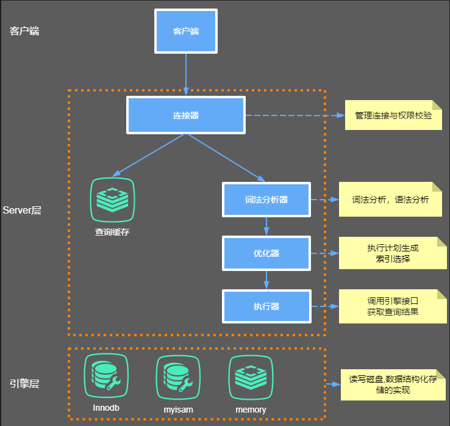

更新SQL执行过程：

1. 连接器 校验 连接的账号密码，权限， 若权限不够或账户有误，报错；
2. 词法分析器 对SQL进行 关键词解析， 语法校验， 若语法有误，报错；
3. 优化器 会对SQL进行优化， 决定是否使用索引还是全表扫描， 生成执行计划等；
4. 执行器 调用 存储引擎接口 获取结果；
   -  从磁盘ibd文件加载一页数据到buffer pool中；
   - 若是更新操作，则写入undo回滚日志；
   - 修改buffer pool符合条件的数据；
   - 写redo log日志；
     - 先写入redo  log buffer 缓冲区；
     - 默认情况下，redo log buffer缓冲区数据顺序写入磁盘；
   - 写入binlog日志磁盘文件；
   - 写入commit提交标记给redo日志， 提交事务完成；
   - buffer pool 修改的数据通过IO线程异步随机写入磁盘文件；

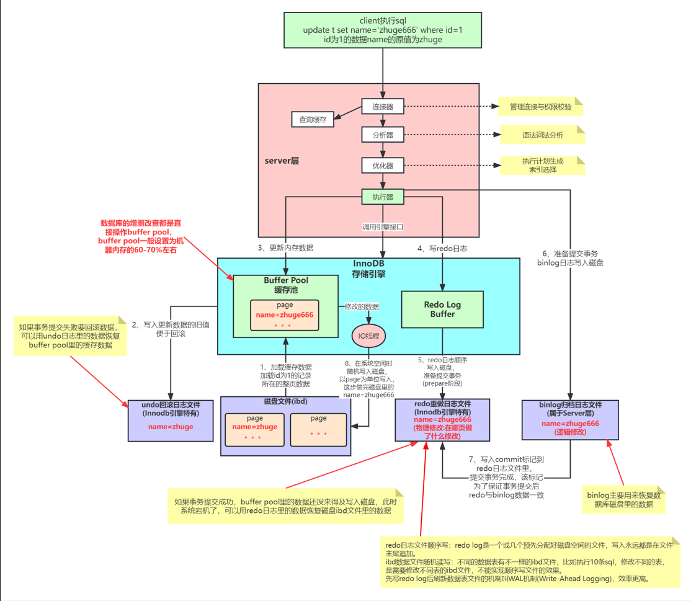

提前写undo log 日志：**若是事务执行失败， 通过undo log回滚修改的数据；**

写入redo log 日志：**事务提交后，数据库宕机，更新数据还未写入磁盘，数据库重启后，会读取redo log日志，将数据重新写入磁盘；**

顺序写：**申请了一大块的磁盘空间， 每次写入的时候，需要先找到 申请的磁盘空间 的起始地址， 然后把buffer数据在末尾加入，效率比较快。**

随机写：**数据放在磁盘上的不同位置，因此每次写入前，需要找到数据在磁盘上的位置， 然后再写入；**

buffer pool 中的数据随机存放，如果把数据同步写回磁盘文件，每个数据都需要找到位置，耗时长，因此使用的是异步写入；

WAL 预写日志： **先写入redo log 再刷新数据表文件就是WAL机制**；

## redo log重做日志

### redo log重做日志关键参数

**innodb_log_buffer_size** : redo log buffer 大小，默认是16M, 最大可设置4G，最小1M

查看：

```mysql
show variables like '%innodb_log_buffer_size%';
```

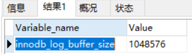

> The size in bytes of the buffer that InnoDB uses to write to the log files on disk. The default is 16MB. A large log buffer enables large transactions to run without the need to write the log to disk before the transactions commit. Thus, if you have transactions that update, insert, or delete many rows, making the log buffer larger saves disk I/O. For related information, see Memory Configuration, and Section 8.5.4, “Optimizing InnoDB Redo Logging”. For general I/O tuning advice, see Section 8.5.8, “Optimizing InnoDB Disk I/O”.

**innodb_log_group_home_dir** ：redo log 文件存放的目录位置，默认是"./";

```mysql
show variables like '%innodb_log_group_home_dir%';
```


这里是相对目录，不知道mysql数据存放位置，也无法找出文件位置；

**datadir**: Mysql数据存放目录;

```mysql
show  global  variables  like  "%datadir%"
```


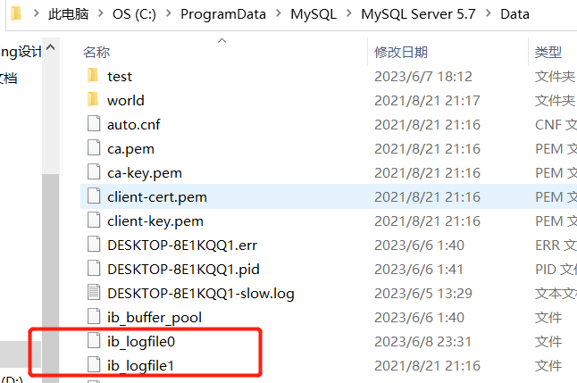****


**innodb_log_files_in_group** ： redo log 日志文件个数， 默认为2个，最大100；命名方式如: ib_logfile0, iblogfile1... iblogfileN；

```mysql
show variables like '%innodb_log_files_in_group%';
```

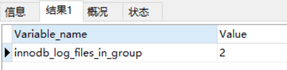

**innodb_log_file_size** ： redo日志文件大小， 默认48M， 最大值为512G，最大值是所有日志文件大小综合；

```mysql
show variables like '%innodb_log_file_size%';
```


为InnoDB引擎设置合适的Redo log空间对于写敏感的工作负载来说是非常重要的，然而，这项工作是要做出权衡的。配置的Redo空间越大，InnoDB就能更好的优化写操作；然而，增大Redo空间也意味着更长的恢复时间当出现崩溃或掉电等意外时。

### redo log 写入磁盘过程分析

写入redo日志时， 第一个日志文件写满后，会往另一个日志文件开始写，直到最后一个日志文件写满，再回到第一个日志文件继续写；

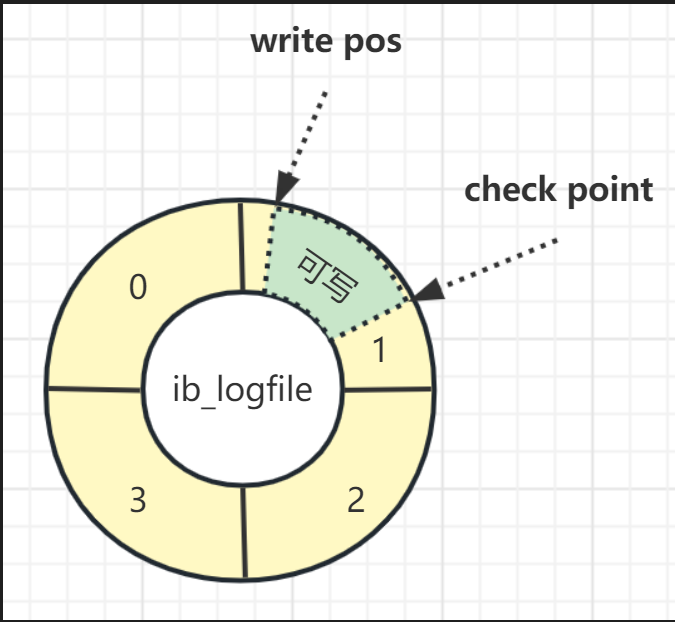

存在两个指针write, check指针；两个指针之间的位置可写的；

write指针：记录当前位置，边写边移动；

check指针：检查要擦除的位置，擦除位置后往后移动，腾出空间；擦除位置时，判断redo日志是否需要执行，若需要则执行后再进行擦除；

 若write指针追上check指针，表示redo写满了，停下来先擦除一些记录， 再把check指针推进；


**innodb_flush_log_at_trx_commit **： redo写入策略

- 0 : 每次事务提交后，只写到redo log buffer, 不直接写入磁盘， 数据库宕机会丢失数据。
- 1：每次事务提交后，写入redo log buffer, 再写入磁盘，最安全，宕机不丢失数据；
- 2： 每次事务提交后， 写入redo log buffer， 再写入操作系统page cache缓存， 由操作系统决定什么时候写入磁盘文件；数据库宕机不会丢失数据， 机器宕机还没有写入磁盘文件，会丢失数据；

若为0, 2时，如何写入磁盘文件？

使用定时任务， 每个一秒， 把redo log buffer的日志，调用操作系统函数write 写到文件系统的page cache, 再调用操作系统函数fsync异步持久化到磁盘文件；


page cache ：内存与磁盘交互，效率非常慢。操作系统中从内存中划分一块内存，专门用来写入磁盘文件的。解决内存与磁盘速度不匹配问题；

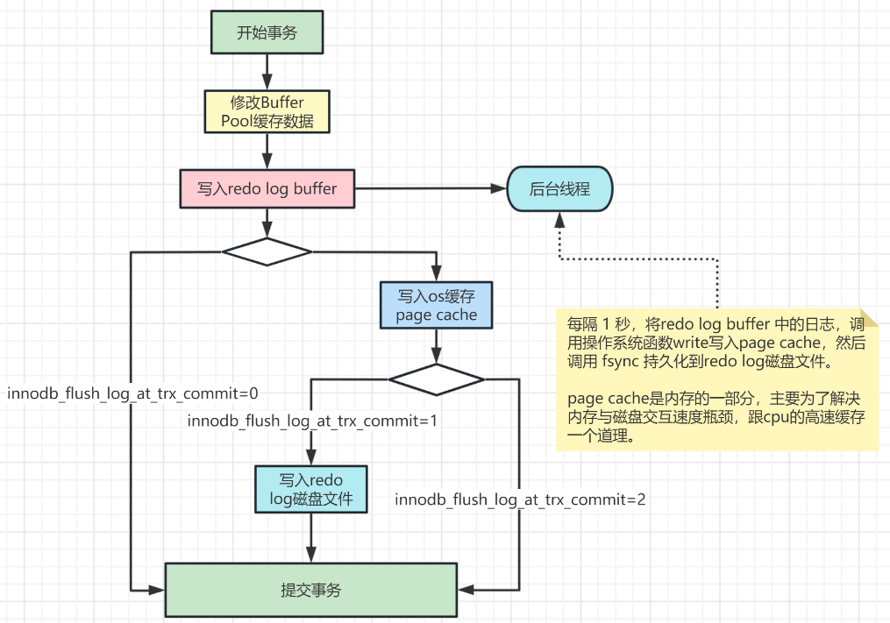

查看写入策略设置：

```mysql
# 查看innodb_flush_log_at_trx_commit参数值：
show variables like 'innodb_flush_log_at_trx_commit';
# 设置innodb_flush_log_at_trx_commit参数值(也可以在my.ini或my.cnf文件里配置)：
set global innodb_flush_log_at_trx_commit=1;  
```


## undo log回滚日志

Mysql 5.6之前，undo log文件管理采用段方式， 即文件有一个回滚段；回滚段记录了1024个undo log  segment(段落), 每个事务只会使用一个undo log segment(段落)。只能支持1024个并发事务；

Mysql5.6后，InnoDb undo日志包含128个回滚段，每个回滚段支持1024个事务，事务并发数变为1024  * 128个；

相关参数：

- innodb_undo_directory：日志文件位置，该参数的默认值为"./"，即innodb数据文件存储位置，目录下ibdata1文件就是undo log存储的位置。

  ```mysql
  show variables like 'innodb_undo_directory';
  ```

  


- innodb_undo_logs: 设置回滚段的个数，默认值为128。

  ```mysql
  show variables like 'innodb_undo_logs';
  ```

  

- innodb_undo_tablespaces: 

  - 设置undo log文件的数量，回滚段平均分布多个文件中。
  - 设置该参数后，会在路径innodb_undo_directory看到undo为前缀的文件。 默认值为0，表示不独立设置undo的tablespace
  - 需要修改init文件，再重启才能生效；不支持全局修改；

  ```mysql
  show variables like 'innodb_undo_tablespaces';
  ```

  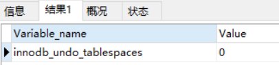

###  undo log日志什么时候删除

insert事务提交后，undo log日志就可删除了；

update事务提交后，该修改会放入MVCC历史日志版本链， 需要等mvcc undo日志历史版本链没有事务引用时，就可删除；

### undo log日志什么时候落盘

MySQL中的Undo Log严格的讲不是Log，而是数据，因此他的管理和落盘都跟数据是一样的：

- Undo的磁盘结构并不是顺序的，而是像数据一样按Page管理
- Undo写入时，也像数据一样产生对应的Redo Log
- Undo的Page也像数据一样缓存在Buffer Pool中，跟数据Page一起做LRU换入换出，以及刷脏。Undo Page的刷脏也像数据一样要等到对应的Redo Log 落盘之后

之所以这样实现，首要的原因是MySQL中的Undo Log不只是承担Crash Recovery时保证Atomic的作用，更需要承担MVCC对历史版本的管理的作用，设计目标是高事务并发，方便的管理和维护。因此当做数据更合适。

但既然还叫Log，就还是需要有Undo Log的责任，那就是保证Crash Recovery时，如果看到数据的修改，一定要能看到其对应Undo的修改，这样才有机会通过事务的回滚保证Crash Atomic。标准的Undo Log这一步是靠WAL实现的，也就是要求Undo写入先于数据落盘。而InnoDB中Undo Log作为一种特殊的数据，这一步是通过redo的min-transaction保证的，简单的说就是数据的修改和对应的Undo修改，他们所对应的redo log被放到同一个min-transaction中，同一个min-transaction中的所有redo log在Crash Recovery时以一个整体进行重放，要么全部重放，要么全部丢弃。


### 为什么Mysql不能直接更新磁盘上的数据而设置这么一套复杂的机制来执行SQL了？

数据在磁盘上是随机分布的，请求对磁盘文件执行随机读写， 更新磁盘文件效率低；

磁盘随机读写性能太差，直接更新磁盘文件不能抗住高并发请求的；

而这套随机机制，看似复杂，但每个请求都是更新内存bufferpool在顺序写日志文件，还能保证各种情况下的数据一致性；

更新内存性能高，顺序写磁盘的日志文件性能也很高，远高于随机读写；


## binlog二进制归档日志

binlog二进制日志记录保存所有执行过的修改语句，不保存查询语句。如果Mysql服务意外停止，可以通过binlog排查， 用户操作或者表结构操作， 从而回复数据库数据；

启动binlog记录功能，会影响服务器性能；在主从环境下，好处大于对服务器影响；

```mysql
# 查看binlog相关参数
show variables like '%log_bin%';
```

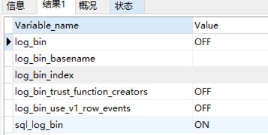

Mysql5.7中，默认关闭，8.0默认打开；若需要binlog工鞥呢，需要修改ini文件，重启服务；

在配置文件中的[mysqld]部分增加如下配置:

```properties
# log-bin设置binlog的存放位置，可以是绝对路径，也可以是相对路径，这里写的相对路径，则binlog文件默认会放在data数据目录下
log-bin=mysql-binlog
# Server Id是数据库服务器id，随便写一个数都可以，这个id用来在mysql集群环境中标记唯一mysql服务器，集群环境中每台mysql服务器的id不能一样，不加启动会报错
server-id=1
# 其他配置
binlog_format = row # 日志文件格式，下面会详细解释
expire_logs_days = 15 # 执行自动删除距离当前15天以前的binlog日志文件的天数， 默认为0， 表示不自动删除
max_binlog_size = 200M # 单个binlog日志文件的大小限制，默认为 1GB
```


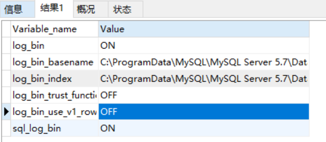

```
log_bin：binlog日志是否打开状态
log_bin_basename：是binlog日志的基本文件名，后面会追加标识来表示每一个文件，binlog日志文件会滚动增加
log_bin_index：指定的是binlog文件的索引文件，这个文件管理了所有的binlog文件的目录。
sql_log_bin：sql语句是否写入binlog文件，ON代表需要写入，OFF代表不需要写入。如果想在主库上执行一些操作，但不复制到slave库上，可以通过修改参数sql_log_bin来实现。比如说，模拟主从同步复制异常
```


查看Mysql数据目录下，多了两个binlog日志文件

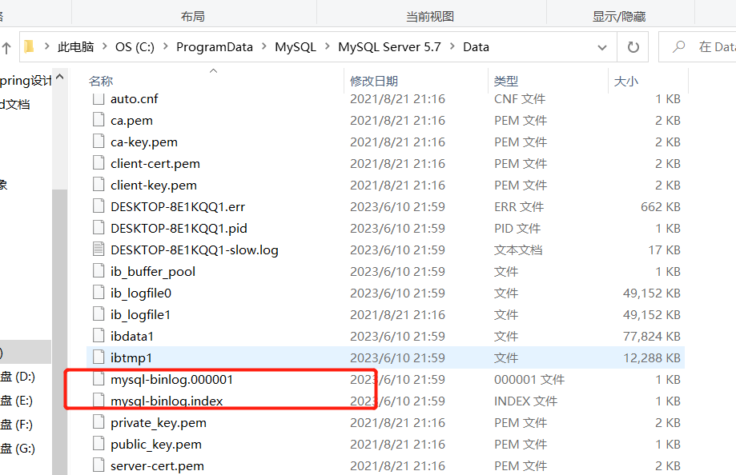

第一个就是binlog日志文件，第二个是binlog文件的索引文件，这个文件管理了所有的binlog文件的目录。

当然也可以执行命令查看有binlog文件列表以及大小

```mysql
show binary logs;
```


### binlog日志格式

参数binlog_format可设置binlog日志的记录格式，mysql支持三种类型；

- STATEMENT: 每条修改sql都会记录, 日志量小，性能高， 若是sql中包含函数UUID(), SYSDATE()等函数，同步到slave机器执行后结果不一致；
- ROW：基于行的赋值， 每行数据的修改都会记录，可解决函数问题；但是批量修改时，日志量较大；
- MIXED: 混合模式， 前两种结合，如果SQL中有函数，则用Row， 其他情况用STATEMENT；性能较好；


### binlog写入磁盘机制

有sync_binlog参数控制，默认0；

- 0： 表示每次提交事务只提交到page cache, 由系统自动执行fsync写入磁盘；机器宕机，pagecache数据会丢失；
- 1： 每次提交事务都会执行fsync写入磁盘， 最安全；
- 设置为N>1 : 每次事务提交都write到page cache, 第N个事务调用fsync写入磁盘；宕机丢失N个事务的binlog;


### binlog重新生成时间点

- 服务器重启或者启动；
- 服务器刷新日志，执行命令flush logs;
- 日志文件达到最大值，默认为1G;


### **查看 binlog 日志文件**

可以用mysql自带的命令工具 mysqlbinlog 查看binlog日志内容

可以把binlog文件移动到别的地方，如果是服务器上，则通过文件工具传到本地；


```mysql
#mysqlbinlog --no-defaults -v --base64-output=decode-rows C:\ProgramData\MySQL\MySQL Server 5.7\Data\Datamysql-binlog.000001
mysqlbinlog --no-defaults -v --base64-output=decode-rows E:\Java_MySQL\mysql-binlog.000001
```

```mysql
/*!50530 SET @@SESSION.PSEUDO_SLAVE_MODE=1*/;
/*!50003 SET @OLD_COMPLETION_TYPE=@@COMPLETION_TYPE,COMPLETION_TYPE=0*/;
DELIMITER /*!*/;
# at 4
#230610 21:59:32 server id 1  end_log_pos 123 CRC32 0xa4c63540  Start: binlog v 4, server v 5.7.29-log created 230610 21:59:32 at startup
# Warning: this binlog is either in use or was not closed properly.
ROLLBACK/*!*/;
# at 123
#230610 21:59:32 server id 1  end_log_pos 154 CRC32 0x7feae4c1  Previous-GTIDs
# [empty]
# at 154
#230610 22:21:54 server id 1  end_log_pos 219 CRC32 0xb61ff92b  Anonymous_GTID  last_committed=0        sequence_number=1       rbr_only=yes
/*!50718 SET TRANSACTION ISOLATION LEVEL READ COMMITTED*//*!*/;
SET @@SESSION.GTID_NEXT= 'ANONYMOUS'/*!*/;
# at 219
#230610 22:21:54 server id 1  end_log_pos 291 CRC32 0x29a492f9  Query   thread_id=6     exec_time=0     error_code=0
SET TIMESTAMP=1686406914/*!*/;
SET @@session.pseudo_thread_id=6/*!*/;
SET @@session.foreign_key_checks=1, @@session.sql_auto_is_null=0, @@session.unique_checks=1, @@session.autocommit=1/*!*/;
SET @@session.sql_mode=1344274432/*!*/;
SET @@session.auto_increment_increment=1, @@session.auto_increment_offset=1/*!*/;
/*!\C utf8 *//*!*/;
SET @@session.character_set_client=33,@@session.collation_connection=33,@@session.collation_server=8/*!*/;
SET @@session.lc_time_names=0/*!*/;
SET @@session.collation_database=DEFAULT/*!*/;
BEGIN
/*!*/;
# at 291
#230610 22:21:54 server id 1  end_log_pos 345 CRC32 0x285e787f  Table_map: `test`.`account` mapped to number 109
# at 345
#230610 22:21:54 server id 1  end_log_pos 398 CRC32 0x3054b01d  Write_rows: table id 109 flags: STMT_END_F
### INSERT INTO `test`.`account`
### SET
###   @1=30
###   @2='zhaoxing'
###   @3=777
# at 398
#230610 22:21:54 server id 1  end_log_pos 429 CRC32 0x22716557  Xid = 45
COMMIT/*!*/;
# at 429
#230610 22:22:17 server id 1  end_log_pos 494 CRC32 0xed3d0099  Anonymous_GTID  last_committed=1        sequence_number=2       rbr_only=yes
/*!50718 SET TRANSACTION ISOLATION LEVEL READ COMMITTED*//*!*/;
SET @@SESSION.GTID_NEXT= 'ANONYMOUS'/*!*/;
# at 494
#230610 22:22:17 server id 1  end_log_pos 566 CRC32 0x19cbd421  Query   thread_id=6     exec_time=0     error_code=0
SET TIMESTAMP=1686406937/*!*/;
BEGIN
/*!*/;
# at 566
#230610 22:22:17 server id 1  end_log_pos 620 CRC32 0x87f9e3e7  Table_map: `test`.`account` mapped to number 109
# at 620
#230610 22:22:17 server id 1  end_log_pos 675 CRC32 0xb4748e1c  Write_rows: table id 109 flags: STMT_END_F
### INSERT INTO `test`.`account`
### SET
###   @1=40
###   @2='zhaoyuzhen'
###   @3=1000
# at 675
#230610 22:22:17 server id 1  end_log_pos 706 CRC32 0x28b56527  Xid = 47
COMMIT/*!*/;
# at 706
```

能看到里面有具体执行的修改伪sql语句以及执行时的相关情况。

### binlog日志文件恢复数据

插入id=30, 40的数据，从binlog日志可以找到2个insert关键字，现在把这两条数据删除，再给恢复回来。

方法：

1. 找到第一条更新语句的BEGIN 前面的位置标识at xxx;
2. 找到最后一条更新语句的COMMIT后的位置标识at xxx;

```
# at 219
#230610 22:21:54 server id 1  end_log_pos 291 CRC32 0x29a492f9  Query   thread_id=6     exec_time=0     error_code=0
SET TIMESTAMP=1686406914/*!*/;
SET @@session.pseudo_thread_id=6/*!*/;
SET @@session.foreign_key_checks=1, @@session.sql_auto_is_null=0, @@session.unique_checks=1, @@session.autocommit=1/*!*/;
SET @@session.sql_mode=1344274432/*!*/;
SET @@session.auto_increment_increment=1, @@session.auto_increment_offset=1/*!*/;
/*!\C utf8 *//*!*/;
SET @@session.character_set_client=33,@@session.collation_connection=33,@@session.collation_server=8/*!*/;
SET @@session.lc_time_names=0/*!*/;
SET @@session.collation_database=DEFAULT/*!*/;
BEGIN
/*!*/;
# at 291
#230610 22:21:54 server id 1  end_log_pos 345 CRC32 0x285e787f  Table_map: `test`.`account` mapped to number 109
# at 345
#230610 22:21:54 server id 1  end_log_pos 398 CRC32 0x3054b01d  Write_rows: table id 109 flags: STMT_END_F
### INSERT INTO `test`.`account`
### SET
###   @1=30
###   @2='zhaoxing'
###   @3=777
# at 398
#230610 22:21:54 server id 1  end_log_pos 429 CRC32 0x22716557  Xid = 45
COMMIT/*!*/;
# at 429
#230610 22:22:17 server id 1  end_log_pos 494 CRC32 0xed3d0099  Anonymous_GTID  last_committed=1        sequence_number=2       rbr_only=yes
/*!50718 SET TRANSACTION ISOLATION LEVEL READ COMMITTED*//*!*/;
SET @@SESSION.GTID_NEXT= 'ANONYMOUS'/*!*/;
# at 494
#230610 22:22:17 server id 1  end_log_pos 566 CRC32 0x19cbd421  Query   thread_id=6     exec_time=0     error_code=0
SET TIMESTAMP=1686406937/*!*/;
BEGIN
/*!*/;
# at 566
#230610 22:22:17 server id 1  end_log_pos 620 CRC32 0x87f9e3e7  Table_map: `test`.`account` mapped to number 109
# at 620
#230610 22:22:17 server id 1  end_log_pos 675 CRC32 0xb4748e1c  Write_rows: table id 109 flags: STMT_END_F
### INSERT INTO `test`.`account`
### SET
###   @1=40
###   @2='zhaoyuzhen'
###   @3=1000
# at 675
#230610 22:22:17 server id 1  end_log_pos 706 CRC32 0x28b56527  Xid = 47
COMMIT/*!*/;
# at 706
```


1. 根据位置标识恢复数据： 上面的开始位置为219， COMMIT位置标识为：706

```
mysqlbinlog  --no-defaults --start-position=219 --stop-position=706 --database=test E:\Java_MySQL\mysql-binlog.000001 | mysql -uroot -p123456 -v test
```

执行后，数据恢复；


2. 根据时间戳恢复数据

   1. 找到第一条sql BEGIN前面的时间戳标记 SET TIMESTAMP=1686406914，转成datetime:2023-06-10 22:21:54
   2. 再找到第二条sql COMMIT后面的时间戳标记 SET TIMESTAMP=1686417380，转成datetime:2023-06-11 01:16:20

   ```mysql
   # 补充一个根据时间来恢复数据的命令，
   mysqlbinlog  --no-defaults --start-datetime="2023-06-10 22:21:54" --stop-datetime="2023-06-11 01:16:20" --database=test E:\Java_MySQL\mysql-binlog.000001 | mysql -uroot -p123456 -v test
   ```

   执行后，数据恢复。


### 删库跑路数据恢复

1. 数据库若是没有备份，所有的binlog日志都存在的话，就从第一个开始逐个恢复binlog文件的里的数据；
   - binlog文件比较大，早期文件会定期删除，可能性不大；
2. 做个脚本，每天做一次全量数据库备份，恢复数据库使用最近的全量备份 + 备份后的时间点binlog恢复数据；
   - 备份数据库可用mysqldump命令工具
     - mysqldump -u root 数据库名>备份文件名;   #备份整个数据库 
     - mysqldump -u root 数据库名 表名字>备份文件名;  #备份整个表 
     - mysql -u root test < 备份文件名 #恢复整个数据库，test为数据库名称，需要自己先建一个数据库test              
     - 数据库有密码：mysqldump -u root -p123456 test > E:\Java_MySQL\test


### 为什么会有redo log和binlog两份日志呢？

MySQL最开始并没有InnoDB， 自带的引擎是MyISAM，其并没有崩溃恢复能力，服务挂了，内存中的数据就丢了。无法恢复；binlog日志用于归档；

InnoDB 使用redo log实现了崩溃恢复能力，如果是在事务执行过程中，服务挂了， 可以使用undo日志回滚；如果是事务提交阶段，服务挂了， 则可以利用redo日志恢复，之前提交的记录，修改的记录不会丢失，也就是预写机制，保证了崩溃恢复能力。