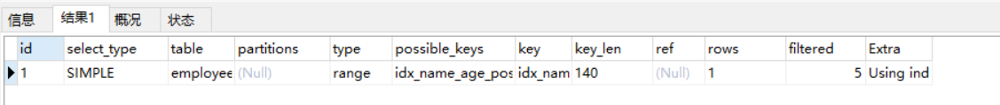

# Mysql索引优化实战(一)

```mysql
CREATE TABLE `employees` (
  `id` int(11) NOT NULL AUTO_INCREMENT,
  `name` varchar(24) NOT NULL DEFAULT '' COMMENT '姓名',
  `age` int(11) NOT NULL DEFAULT '0' COMMENT '年龄',
  `position` varchar(20) NOT NULL DEFAULT '' COMMENT '职位',
  `hire_time` timestamp NOT NULL DEFAULT CURRENT_TIMESTAMP COMMENT '入职时间',
  PRIMARY KEY (`id`),
  KEY `idx_name_age_position` (`name`,`age`,`position`) USING BTREE
) ENGINE=InnoDB AUTO_INCREMENT=1 DEFAULT CHARSET=utf8 COMMENT='员工记录表';

INSERT INTO employees(name,age,position,hire_time) VALUES('LiLei',22,'manager',NOW());
INSERT INTO employees(name,age,position,hire_time) VALUES('HanMeimei', 23,'dev',NOW());
INSERT INTO employees(name,age,position,hire_time) VALUES('Lucy',23,'dev',NOW());

-- 插入一些示例数据
drop procedure if exists insert_emp; 
delimiter ;;
create procedure insert_emp()        
begin
  declare i int;                    
  set i=1;                          
  while(i<=100000)do                 
    insert into employees(name,age,position) values(CONCAT('zhuge',i),i,'dev');  
    set i=i+1;                       
  end while;
end;;
delimiter ;
call insert_emp();
```

**1、联合索引第一个字段用范围不会走索引**

```mysql
EXPLAIN SELECT * FROM employees WHERE name > 'LiLei' AND age = 22 AND position ='manager';
```


结论：

**可能走索引，主要在于使用范围 查询出来的数据 与 表数据对比，若多，由于回表次数太多，效率不如全表扫描来的快，因此不会走索引，若少则会走索引；**


**2、强制走索引**

```mysql
EXPLAIN SELECT * FROM employees force index(idx_name_age_position) WHERE name > 'LiLei' AND age = 22 AND position ='manager';
```


结论：强制走了索引， rows数量下降， 效率不一定比全表扫描快， 回表比较耗费时间

```mysql
-- 关闭查询缓存
set global query_cache_size=0;  
set global query_cache_type=0;
-- 执行时间0.333s
SELECT * FROM employees WHERE name > 'LiLei';
-- 执行时间0.444s
SELECT * FROM employees force index(idx_name_age_position) WHERE name > 'LiLei';
```

**3、覆盖索引优化**

```mysql
EXPLAIN SELECT name,age,position FROM employees WHERE name > 'LiLei' AND age = 22 AND position ='manager';
```

若查询数据字段只需要从二级索引中获取，则可以走二级索引，数据直接从二级索引中获取，不需要回表操作；

**4、in和or在表数据量比较大的情况会走索引，在表记录不多的情况下会选择全表扫描**

```mysql
EXPLAIN SELECT * FROM employees WHERE name in ('LiLei','HanMeimei','Lucy') AND age = 22 AND position ='manager';
```


```mysql
EXPLAIN SELECT * FROM employees WHERE (name = 'LiLei' or name = 'HanMeimei') AND age = 22 AND position ='manager';
```


结论：in或者or数据量多时， 回表次数太多，不如全表扫描快； 数据量少时， 则回表次数少，可使用二级索引，效率比全表扫描快；

疑问：name查出了三个值后， 查出结果后，三个name对应的age不一定是有序的，为什么age也可以走索引？

**5、like KK% 一般情况都会走索引**

```mysql
EXPLAIN SELECT * FROM employees WHERE name like 'LiLei%' AND age = 22 AND position ='manager';
```




疑问：与in的疑问一样，为何age能走索引？

**索引下推**

对于辅助的联合索引(name,age,position)，正常情况按照最左前缀原则，**SELECT \* FROM employees WHERE name like 'LiLei%' AND age = 22 AND position ='manager'**  这种情况只会走name字段索引，因为根据name字段过滤完，得到的索引行里的age和position是无序的，无法很好的利用索引。

在MySQL5.6之前的版本，这个查询只能在联合索引里匹配到名字是 **'LiLei' 开头**的索引，然后拿这些索引对应的主键逐个回表，到主键索引上找出相应的记录，再比对**age**和**position**这两个字段的值是否符合。

在MySQL5.6之后，在索引遍历过程中，会先判断二级索引包含的所有字段条件， 减少回表结果集，再执行回表操作。因此匹配到"LiLei"开头后，会判断age,position条件，拿过滤完的主键ID再回表查询整行数据；

索引下推会减少回表次数，对于innodb引擎的表索引下推只能用于二级索引，innodb的主键索引（聚簇索引）树叶子节点上保存的是全行数据，所以这个时候索引下推并不会起到减少查询全行数据的效果。


**为什么范围查找Mysql没有用索引下推优化？**

估计应该是Mysql认为范围查找过滤的结果集过大，like KK% 在绝大多数情况来看，过滤后的结果集比较小，所以这里Mysql选择给 like KK% 用了索引下推优化，当然这也不是绝对的，有时like KK% 也不一定就会走索引下推。


**Mysql如何选择合适的索引**

```mysql
EXPLAIN select * from employees where name > 'a';
```


如果用name索引需要遍历name字段联合索引树，然后还需要根据遍历出来的主键值去主键索引树里再去查出最终数据，成本比全表扫描还高，可以用覆盖索引优化，这样只需要遍历name字段的联合索引树就能拿到所有结果，如下：

```mysql
EXPLAIN select name,age,position from employees where name > 'a' ;
```


```mysql
EXPLAIN select * from employees where name > 'zzz' ;
```


对于上面这两种 name>'a' 和 name>'zzz' 的执行结果，mysql最终是否选择走索引或者一张表涉及多个索引，mysql最终如何选择索引，我们可以用**trace工具**来一查究竟，开启trace工具会影响mysql性能，所以只能临时分析sql使用，用完之后立即关闭

**trace工具用法**

```mysql
mysql> set session optimizer_trace="enabled=on",end_markers_in_json=on;  --开启trace
mysql> select * from employees where name > 'a' order by position;
mysql> SELECT * FROM information_schema.OPTIMIZER_TRACE;

查看trace字段：
{
  "steps": [
    {
      "join_preparation": {    --第一阶段：SQL准备阶段，格式化sql
        "select#": 1,
        "steps": [
          {
            "expanded_query": "/* select#1 */ select `employees`.`id` AS `id`,`employees`.`name` AS `name`,`employees`.`age` AS `age`,`employees`.`position` AS `position`,`employees`.`hire_time` AS `hire_time` from `employees` where (`employees`.`name` > 'a') order by `employees`.`position`"
          }
        ] /* steps */
      } /* join_preparation */
    },
    {
      "join_optimization": {    --第二阶段：SQL优化阶段
        "select#": 1,
        "steps": [
          {
            "condition_processing": {    --条件处理
              "condition": "WHERE",
              "original_condition": "(`employees`.`name` > 'a')",
              "steps": [
                {
                  "transformation": "equality_propagation",
                  "resulting_condition": "(`employees`.`name` > 'a')"
                },
                {
                  "transformation": "constant_propagation",
                  "resulting_condition": "(`employees`.`name` > 'a')"
                },
                {
                  "transformation": "trivial_condition_removal",
                  "resulting_condition": "(`employees`.`name` > 'a')"
                }
              ] /* steps */
            } /* condition_processing */
          },
          {
            "substitute_generated_columns": {
            } /* substitute_generated_columns */
          },
          {
            "table_dependencies": [    --表依赖详情
              {
                "table": "`employees`",
                "row_may_be_null": false,
                "map_bit": 0,
                "depends_on_map_bits": [
                ] /* depends_on_map_bits */
              }
            ] /* table_dependencies */
          },
          {
            "ref_optimizer_key_uses": [
            ] /* ref_optimizer_key_uses */
          },
          {
            "rows_estimation": [    --预估表的访问成本
              {
                "table": "`employees`",
                "range_analysis": {
                  "table_scan": {     --全表扫描情况
                    "rows": 10123,    --扫描行数
                    "cost": 2054.7    --查询成本
                  } /* table_scan */,
                  "potential_range_indexes": [    --查询可能使用的索引
                    {
                      "index": "PRIMARY",    --主键索引
                      "usable": false,
                      "cause": "not_applicable"
                    },
                    {
                      "index": "idx_name_age_position",    --辅助索引
                      "usable": true,
                      "key_parts": [
                        "name",
                        "age",
                        "position",
                        "id"
                      ] /* key_parts */
                    }
                  ] /* potential_range_indexes */,
                  "setup_range_conditions": [
                  ] /* setup_range_conditions */,
                  "group_index_range": {
                    "chosen": false,
                    "cause": "not_group_by_or_distinct"
                  } /* group_index_range */,
                  "analyzing_range_alternatives": {    --分析各个索引使用成本
                    "range_scan_alternatives": [
                      {
                        "index": "idx_name_age_position",
                        "ranges": [
                          "a < name"      --索引使用范围
                        ] /* ranges */,
                        "index_dives_for_eq_ranges": true,
                        "rowid_ordered": false,    --使用该索引获取的记录是否按照主键排序
                        "using_mrr": false,
                        "index_only": false,       --是否使用覆盖索引
                        "rows": 5061,              --索引扫描行数
                        "cost": 6074.2,            --索引使用成本
                        "chosen": false,           --是否选择该索引
                        "cause": "cost"
                      }
                    ] /* range_scan_alternatives */,
                    "analyzing_roworder_intersect": {
                      "usable": false,
                      "cause": "too_few_roworder_scans"
                    } /* analyzing_roworder_intersect */
                  } /* analyzing_range_alternatives */
                } /* range_analysis */
              }
            ] /* rows_estimation */
          },
          {
            "considered_execution_plans": [
              {
                "plan_prefix": [
                ] /* plan_prefix */,
                "table": "`employees`",
                "best_access_path": {    --最优访问路径
                  "considered_access_paths": [   --最终选择的访问路径
                    {
                      "rows_to_scan": 10123,
                      "access_type": "scan",     --访问类型：为scan，全表扫描
                      "resulting_rows": 10123,
                      "cost": 2052.6,
                      "chosen": true,            --确定选择
                      "use_tmp_table": true
                    }
                  ] /* considered_access_paths */
                } /* best_access_path */,
                "condition_filtering_pct": 100,
                "rows_for_plan": 10123,
                "cost_for_plan": 2052.6,
                "sort_cost": 10123,
                "new_cost_for_plan": 12176,
                "chosen": true
              }
            ] /* considered_execution_plans */
          },
          {
            "attaching_conditions_to_tables": {
              "original_condition": "(`employees`.`name` > 'a')",
              "attached_conditions_computation": [
              ] /* attached_conditions_computation */,
              "attached_conditions_summary": [
                {
                  "table": "`employees`",
                  "attached": "(`employees`.`name` > 'a')"
                }
              ] /* attached_conditions_summary */
            } /* attaching_conditions_to_tables */
          },
          {
            "clause_processing": {
              "clause": "ORDER BY",
              "original_clause": "`employees`.`position`",
              "items": [
                {
                  "item": "`employees`.`position`"
                }
              ] /* items */,
              "resulting_clause_is_simple": true,
              "resulting_clause": "`employees`.`position`"
            } /* clause_processing */
          },
          {
            "reconsidering_access_paths_for_index_ordering": {
              "clause": "ORDER BY",
              "steps": [
              ] /* steps */,
              "index_order_summary": {
                "table": "`employees`",
                "index_provides_order": false,
                "order_direction": "undefined",
                "index": "unknown",
                "plan_changed": false
              } /* index_order_summary */
            } /* reconsidering_access_paths_for_index_ordering */
          },
          {
            "refine_plan": [
              {
                "table": "`employees`"
              }
            ] /* refine_plan */
          }
        ] /* steps */
      } /* join_optimization */
    },
    {
      "join_execution": {    --第三阶段：SQL执行阶段
        "select#": 1,
        "steps": [
        ] /* steps */
      } /* join_execution */
    }
  ] /* steps */
}

结论：全表扫描的成本低于索引扫描，所以mysql最终选择全表扫描

mysql> select * from employees where name > 'zzz' order by position;
mysql> SELECT * FROM information_schema.OPTIMIZER_TRACE;

查看trace字段可知索引扫描的成本低于全表扫描，所以mysql最终选择索引扫描

mysql> set session optimizer_trace="enabled=off";    --关闭trace
```

**常见sql深入优化**

**Order by与Group by优化**

例一：


利用最左前缀法则：中间字段不能断，因此查询用到了name索引，查出name="LiLei"后，结果age是有序的，从key_len=74也能看出，age索引列用在排序过程中，因为Extra字段里没有using filesort

例二：


查出name="LiLei"后， 只有再age相等情况下，position才是有序的， 因此跳过了age字段，使用position排序，出现 Using filesort;

例三：


在name="LiLei"数据后，age是有序的， age相等的情况下，position是有序的， order by age, postion表示 先根据age排序， age相等的情况下，再根据position排序， order by的条件与索引排序相同，因此无Using filesort;

例四：


和Case 3中explain的执行结果一样，但是出现了Using filesort，因为索引的创建顺序为name,age,position，但是排序的时候age和position颠倒位置了。

例五：


与Case 4对比，在Extra中并未出现Using filesort，因为age为常量，在排序中被优化，所以索引未颠倒，不会出现Using filesort。

例六：


索引排序默认是升序的， 虽然order by没有跳过字段， 但是position desc变为降序，与索引树排序不相同，因此需要文件排序，所以出现Using filesort;

例七：


查出name=LiLei, zhuge后， age是无序的，因此出现Using filesort;

例八：


全表扫描，因为范围查询结果集大，回表效率低，不如全表来得快；

如果查询数据只需要索引字段，则可以用覆盖索引优化


**优化总结**

1、**MySQL支持两种方式的排序filesort和index，Using index是指MySQL扫描索引本身完成排序。index效率高，filesort效率低。**

2、order by满足两种情况会使用Using index。

1) **order by语句使用索引最左前列。**

2) **使用where子句与order by子句条件列组合满足索引最左前列**。

3、尽量在索引列上完成排序，遵循索引建立（索引创建的顺序）时的最左前缀法则。

4、如果order by的条件不在索引列上，就会产生Using filesort。

5、**能用覆盖索引尽量用覆盖索引**

6、group by与order by很类似，其实质是先排序后分组，遵照索引创建顺序的最左前缀法则。对于group by的优化如果不需要排序的可以加上**order by null禁止排序**。注意，where高于having，能写在where中的限定条件就不要去having限定了。


**Using filesort文件排序原理详解**

- 单路排序：是一次性取出满足条件行的所有字段，然后在sort buffer中进行排序；用trace工具可以看到sort_mode信息里显示< sort_key, additional_fields >或者< sort_key, packed_additional_fields >
- 双路排序（又叫**回表**排序模式）：是首先根据相应的条件取出相应的**排序字段**和**可以直接定位行数据的行 ID**，然后在 sort buffer 中进行排序，排序完后需要再次取回其它需要的字段；用trace工具可以看到sort_mode信息里显示< sort_key, rowid >


查看下这条sql对应trace结果如下

```mysql
mysql> set session optimizer_trace="enabled=on",end_markers_in_json=on;  --开启trace
mysql> select * from employees where name = 'zhuge' order by position;
mysql> select * from information_schema.OPTIMIZER_TRACE;

trace排序部分结果：
"join_execution": {    --Sql执行阶段
        "select#": 1,
        "steps": [
          {
            "filesort_information": [
              {
                "direction": "asc",
                "table": "`employees`",
                "field": "position"
              }
            ] /* filesort_information */,
            "filesort_priority_queue_optimization": {
              "usable": false,
              "cause": "not applicable (no LIMIT)"
            } /* filesort_priority_queue_optimization */,
            "filesort_execution": [
            ] /* filesort_execution */,
            "filesort_summary": {                      --文件排序信息
              "rows": 10000,                           --预计扫描行数
              "examined_rows": 10000,                  --参与排序的行
              "number_of_tmp_files": 3,                --使用临时文件的个数，这个值如果为0代表全部使用的sort_buffer内存排序，否则使用的磁盘文件排序
              "sort_buffer_size": 262056,              --排序缓存的大小，单位Byte
              "sort_mode": "<sort_key, packed_additional_fields>"       --排序方式，这里用的单路排序
            } /* filesort_summary */
          }
        ] /* steps */
      } /* join_execution */
      
      
mysql> set max_length_for_sort_data = 10;    --employees表所有字段长度总和肯定大于10字节
mysql> select * from employees where name = 'zhuge' order by position;
mysql> select * from information_schema.OPTIMIZER_TRACE;

trace排序部分结果：
"join_execution": {
        "select#": 1,
        "steps": [
          {
            "filesort_information": [
              {
                "direction": "asc",
                "table": "`employees`",
                "field": "position"
              }
            ] /* filesort_information */,
            "filesort_priority_queue_optimization": {
              "usable": false,
              "cause": "not applicable (no LIMIT)"
            } /* filesort_priority_queue_optimization */,
            "filesort_execution": [
            ] /* filesort_execution */,
            "filesort_summary": {
              "rows": 10000,
              "examined_rows": 10000,
              "number_of_tmp_files": 2,
              "sort_buffer_size": 262136,   
              "sort_mode": "<sort_key, rowid>"         --排序方式，这里用的双路排序
            } /* filesort_summary */
          }
        ] /* steps */
      } /* join_execution */


mysql> set session optimizer_trace="enabled=off";    --关闭trace
```

单路排序过程：

1. 根据二级索引name = “LiLei”拿到主键id,  回表拿到id对应的整行记录， 存入sorted buffer;
2. 重复一步骤， 拿到 name="zhuge"的整行记录， 放入sorted buffer；
3. 直到所有符合条件的都放入sorted buffer;
4. 根据position进行排序， 返回结果给客户端；

双路排序过程：

1. 根据索引name="LiLei"拿到主键id
2. 回表拿到id整行记录， 拿到position，id放入sorted buffer;
3. 知道所有符合条件的都放入sorted buffer;
4. 根据position排序， 拍完序， 根据id回表拿到整行记录， 返回结果给客户端；


其实对比两个排序模式，单路排序会把所有需要查询的字段都放到 sort buffer 中，而双路排序只会把主键和需要排序的字段放到 sort buffer 中进行排序，然后再通过主键回到原表查询需要的字段。

如果 MySQL **排序内存** **sort_buffer** 配置的比较小并且没有条件继续增加了，可以适当把 max_length_for_sort_data 配置小点，让优化器选择使用**双路排序**算法，可以在sort_buffer 中一次排序更多的行，只是需要再根据主键回到原表取数据。

如果 MySQL 排序内存有条件可以配置比较大，可以适当增大 max_length_for_sort_data 的值，让优化器优先选择全字段排序(**单路排序**)，把需要的字段放到 sort_buffer 中，这样排序后就会直接从内存里返回查询结果了。

所以，MySQL通过 **max_length_for_sort_data** 这个参数来控制排序，在不同场景使用不同的排序模式，从而提升排序效率。

**注意**，如果全部使用sort_buffer内存排序一般情况下效率会高于磁盘文件排序，但不能因为这个就随便增大sort_buffer(默认1M)，mysql很多参数设置都是做过优化的，不要轻易调整。


## 索引设计原则

- 先开发业务，再添加索引

业务是复杂的， 不可能在建表时，想到所有业务， 因此需要等业务开发差不多时，结合开发完的SQL进行设计索引；

- 联合索引尽量覆盖条件

用1~2个联合索引覆盖where查询条件，且尽量满足最左前缀原则，避免建立过多单值索引；

- 不在数值变化不大的字段上加索引

业务表中，经常会存在各种状态字段， 结果为0和1， 这种字段建立索引意义不大；

一般建立索引，尽量使用那些基数比较大的字段，就是值比较多的字段，那么才能发挥出B+树快速二分查 找的优势来

- where与order by冲突时优先where

索引如果因为满足where,而不能满足order by, 出现filesort, 或者只能满足order by , 无法满足where, 则应该优先满足where, 过滤后的数据量少了， order by排序的数据量也少了，出现filesort影响也不大。

- 范围查询字段放在联合索引的最后字段

- 基于慢sql查询做优化

业务开发阶段，测试阶段，最好开一下SQL慢查询日志， 针对慢SQL进行索引优化操作；

### 索引设计实例


以社交场景APP来举例，我们一般会去搜索一些好友，这就涉及到对用户的筛选，是对用户user表搜索，这个表数据量会比较大，比如，我们一般会筛选地区(省市)，性别，年龄，身高，爱好之类；

- SQL中除过滤用户的各种条件，还需要分页之类的处理，会生成类似sql语句执行：select xx from user where xx=xx and xx=xx order by xx limit xx,xx

- 如何合理设计索引了，比如用户会根据省市优先筛选同城的用户，性别去筛选，是否应该设计一个联合索引 (province,city,sex) 了？但基数都不大，应该有，因为这些字段查询太频繁。

- 若用户根据年龄范围去筛选了，比如 where  province=xx and city=xx and age>=xx and age<=xx，我们尝试着把age字段加入联合索引 (province,city,sex,age)，
  - 注意，**一般这种范围查找的条件都要放在最后；联合索引范围之后条件的是不能用索引的；**
  - 对于当前这种情况用不到age索引字段，用户没有筛选sex字段，如何优化？
  - 优化sql写法：where  province=xx and city=xx and sex in ('female','male') and age>=xx and age<=xx
  - **即业务开发中，如果跳过状态索引字段导致索引失效时，可以将状态结果作为查询条件带上；**

- 对于爱好之类的字段可类似sex字段处理，可把爱好字段加入索引 (province,city,sex,hobby,age) 
  - **即业务开发中，如果跳过状态索引字段导致索引失效时，可以将状态结果作为查询条件带上；**
  - 爱好字段有一个枚举值，若没有选爱好，则所有枚举值作为查询条件带上SQL；

- 若还有一个筛选条件，筛选最近一周登录过的用户，对应sql：

  where  province=xx and city=xx and sex in ('female','male') and age>=xx and age<=xx and latest_login_time>= xx

  那是否能把 latest_login_time 字段加入索引？比如  (province,city,sex,hobby,age,latest_login_time) ，显然是不行的，如何优化？

  - **范围查询后，索引就失效了，因此latest_login_time是不会生效的。**
  - 设计字段is_login_in_latest_7_days，用户一周内有登录值就为1，否则为0，那么我们就可以把索引设计成 (province,city,sex,hobby,is_login_in_latest_7_days,age)  来满足上面那种场景了！
  - **业务开发中，设计索引出现多个范围查询字段时，为字段设计状态字段，通过业务代码实时维护这些字段，避免多个范围查询中，字段索引失效；为了索引生效而增加和维护新增字段业务代码，很繁琐了。因此要看具体情况而定，数据量不多的表可不加， 多的表则应加， 数据一多，查询就变得更慢；**

  

- 通过联合索引能够过滤掉绝大部分数据的，保留小部分数据下来基于磁盘文件进行order by排序，最后基于limit分页，性能比较高。

- 不过用户也会这么查询，查受欢迎度较高的女性，比如sql：where  sex = 'female'  order by score limit xx,xx，上面索引很难用上的，不能把太多的字段以及太多的值都用 in 语句拼接到sq，怎么办？其实再设计一个辅助的联合索引，比如 (sex,score)，就能满足查询要求了。

以上就是给大家讲的一些索引设计的思路了，核心思想就是，尽量利用一两个复杂的多字段联合索引，抗下你80%以上的查询，然后用一两个辅助索引尽量抗下剩余的一些非典型查询，保证这种大数据量表的查询尽可能多的都能充分利用索引，这样就能保证你的查询速度和性能了！