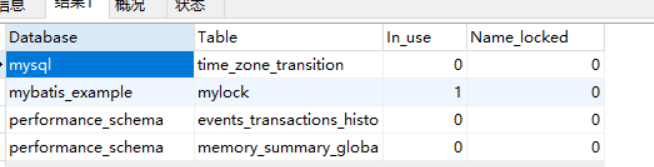
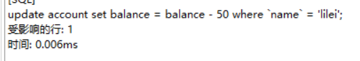
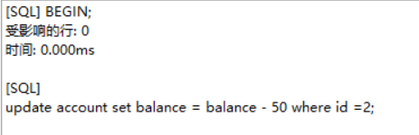
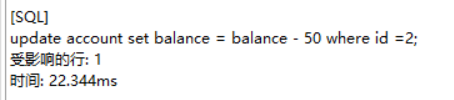
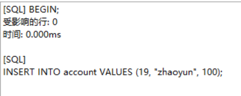
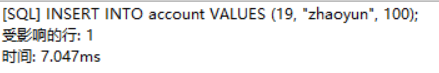
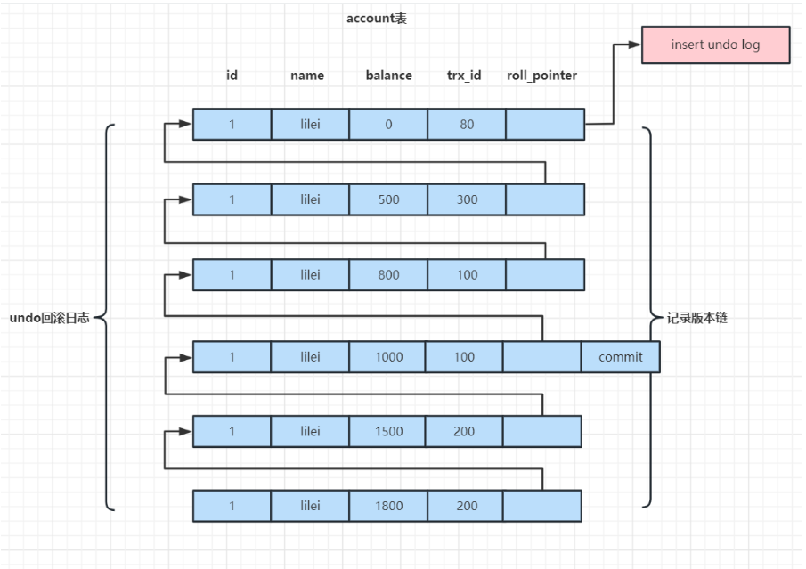
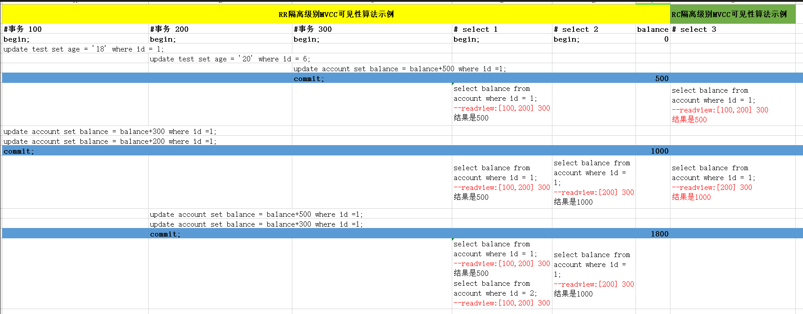

# MySQL锁机制

锁是计算机协调多个进程或线程并发访问某一资源的机制。

在数据库中，除了传统的计算资源（如CPU、RAM、I/O等）的争用以外，数据也是一种供需要用户共享的资源。如何保证数据并发访问的一致性、有效性是所有数据库必须解决的一个问题，锁冲突也是影响数据库并发访问性能的一个重要因素。

## **锁分类**

- 性能上可分为 乐观锁 与 悲观锁；

  - 乐观锁适合读多写少的场景；乐观锁中存在版本号， 每次修改数据就要更新版本号， 写场景多，则导致版本号频繁变更， 导致更新失败；

- 粒度上可分为 表锁，行锁；

  - 表锁：每次都锁住整张表，加锁快， 不会出现死锁；粒度大；锁冲突概率搞，并发度低；可用于整表数据迁移场景；

    ```mysql
    CREATE TABLE `mylock` (
      `id` int(11) NOT NULL AUTO_INCREMENT,
      `NAME` varchar(20) DEFAULT NULL,
      PRIMARY KEY (`id`)
    ) ENGINE=MyISAM AUTO_INCREMENT=6 DEFAULT CHARSET=utf8;
    
    INSERT INTO`test`.`mylock` (`id`, `NAME`) VALUES ('1', 'a');
    INSERT INTO`test`.`mylock` (`id`, `NAME`) VALUES ('2', 'b');
    INSERT INTO`test`.`mylock` (`id`, `NAME`) VALUES ('3', 'c');
    INSERT INTO`test`.`mylock` (`id`, `NAME`) VALUES ('4', 'd');
    ```

    ```mysql
    --手动增加表锁
    lock table 表名称 read(write),表名称2 read(write);
    ```

    ```mysql
    --查看表上加过的锁
    show open tables;
    ```

    

    ```mysql
    --删除表锁
    unlock tables;
    ```

  - 行锁：每次操作锁住一行数据，开销大，加锁慢；会出现死锁；锁定粒度小；锁冲突概率低；并发度高；

    - MyISAM 与InnoDB 的最大差别
      - InnoDB支持事务；
      - InnoDB支持行锁；
    - 加锁慢： InnoDB的行锁针对索引加的锁(在索引对应的索引项上做标记)， 不是针对整行记录加锁。 并且该索引不能失效， 否则RR级别会从行锁变为表锁(RC级别不会升级为表锁)

- 操作类型上可分为 读锁， 写锁, 意向锁(都是悲观锁)

  - 读锁 ： 共享锁，对同一份数据，多个读操作可同时进行；

    ```mysql
    select * from T where id=1 lock in share mode
    ```

  - 写锁：排他锁，针对同一份数据，在写操作未提交前， 阻断其他的读，写操作；

    ```mysql
    select * from T where id=1 for update
    ```

  - 意向锁： 针对表锁， 提高加表锁的效率；当事务给表数据加了行锁， 会给该表设置一个标识，代表已经存在行锁， 其他事务想加表锁时， 不必逐行判断是否存在行锁与表锁的冲突， 直接根据该标识就可以确定该不该加表锁； 逐行比较在数据量大的情况效率低，而这个标志就是意向锁；

  

### 行锁升级为表锁

1. 打开客户端A， 开启事务，根据name修改数据， name字段无建索引，因此加了表锁；

```mysql
BEGIN;
update account set balance = balance - 50 where name = 'lilei';
```



2. 打开客户端B， 开启事务， 根据id=2修改数据，整张表为锁住了，因此被阻塞；

```mysql
BEGIN;
update account set balance = balance - 50 where id =2;
```




3. 客户端A提交事务，表锁解除

   ```mysql
   commit;
   ```

4. 客户端B更新成功; 获取到id=2的行锁，更新成功；



#### 升级原因

- **name字段未建立索引， 等值查找相当于全表扫描， 扫描到数据后加行锁，太慢效率低。**
- **RR隔离级别下，需要解决不可重复读和幻读问题， 在遍历扫描聚集索引记录时， 为了防止扫描过的索引被其他事务修改(不可重复读问题) 或者 间隙被其他事务插入数据(幻读)，从而导致数据不一致， 把所有扫描过的索引记录和间隙全部锁上**， 并不是将整张表加锁， 因为不一定能加上表锁， 可能有其他事物锁住表里的其他记录；


### **间隙锁(Gap Lock)**

间隙锁，锁的是两个值之间的空隙；间隙锁在RR级别生效；

RR级别下有幻读问题，间隙锁可以解决幻读问题的；

account表有如下数据


区间间隙有(3,10), (10,20),(20, 正无穷);

1. 打开客户端A， 开启事务， 更新id=18的数据

```mysql
BEGIN;
update account set balance = balance - 50 where id =18;
```

2. 打开客户端B，开启事务， 插入id=19的数据， 由于整个区间被锁，插入被阻塞；

```mysql
BEGIN;
INSERT INTO account VALUES (19, "zhaoyun", 100);
```



3. 客户端A事务提交，间隙锁接触；

```mysql
commit;
```

4. 客户端B插入成功；



只要间隙范围内锁了一条不存在的记录， 就会锁住整个间隙范围，不锁住边界， 可防止其他事务在间隙范围内插入数据， 可解决RR级别的幻读问题；


### 临键锁

Next-Key Locks是行锁与间隙锁的组合


## **锁等待分析**

更新SQL语句的where最好根据索引字段作为条件， 降低行锁升级为表锁的概率；

```mysql
show status like 'innodb_row_lock%';

对各个状态量的说明如下：
Innodb_row_lock_current_waits: 当前正在等待锁定的数量
Innodb_row_lock_time: 从系统启动到现在锁定总时间长度
Innodb_row_lock_time_avg: 每次等待所花平均时间
Innodb_row_lock_time_max：从系统启动到现在等待最长的一次所花时间
Innodb_row_lock_waits: 系统启动后到现在总共等待的次数

对于这5个状态变量，比较重要的主要是：
Innodb_row_lock_time_avg （等待平均时长）
Innodb_row_lock_waits （等待总次数）
Innodb_row_lock_time（等待总时长）
```

尤其是当等待次数很高，而且每次等待时长也不小的时候，我们就需要分析系统中为什么会有如此多的等待，然后根据分析结果着手制定优化计划。

### **查看INFORMATION_SCHEMA系统库锁相关数据表**

```mysql
-- 查看事务
select * from INFORMATION_SCHEMA.INNODB_TRX;
-- 查看锁，8.0之后需要换成这张表performance_schema.data_locks
select * from INFORMATION_SCHEMA.INNODB_LOCKS;  
-- 查看锁等待，8.0之后需要换成这张表performance_schema.data_lock_waits
select * from INFORMATION_SCHEMA.INNODB_LOCK_WAITS;  

-- 释放锁，trx_mysql_thread_id可以从INNODB_TRX表里查看到
kill trx_mysql_thread_id

-- 查看锁等待详细信息
show engine innodb status; 
```

### **总结与锁优化实践**

- MyISAM 执行select前，给涉及所有表加读锁， 执行update, insert, delete给涉及的表加写锁； 读写阻塞， 写写阻塞；
- InnoDB执行select时， 不会加锁， 执行update,insert, delete会加行锁；

- 读锁阻塞写锁， 不会阻塞读， 写锁阻塞读写操作

- InnoDB实现行锁，执行锁定操作性能损耗高于表锁， 但整体并发处理能力远由于MyISAM的表锁，并发量高时，InnoDB性能和MyISAM性能差距就出来了；
- InnoDB行锁使用频繁使用不恰当导致行锁经常升级为表锁， 性能变现就会比MyISAM差了；
- 业务操作里， 更新SQL的where条件最好以索引字段作为条件，避免锁升级；
- 合理设计索引， 减小锁的范围；
- 尽量控制事务大小，减少锁定资源量和时间长度，涉及事务加锁的sql尽量放在事务最后执行
- 尽可能用低的事务隔离级别(不在乎不可重复读问题可使用RC)

## **MVCC多版本并发控制机制**

Mysql在可重复读条件保证隔离性，同样的查询SQL在一个事务里，多次执行，结果相同；其他事务更新数据也不影响当前查询SQL结果；

隔离性靠MVCC保证， 对一行数据读写不通过加锁保证隔离性，避免频繁加锁， 串行化隔离级别为了保证隔离性所有操作通过加锁实现；

Mysql读已提交与可重复读都实现MVCC机制；


**undo日志版本链与read view机制详解**

undo日志版本链：在每个事务修改后， Mysql都会保留修改前的数据，放入undo回滚日志， 并用两个隐藏字段trx_id事务ID  与 roll_pointer回滚指针串联起来， 形成一个历史日志版本链；




readView ：

在RR级别下，当事务开启，首次执行查询SQL会生成当前事务的一致性视图， 该事务在事务结束前不会发生变化；

在RC级别下， 当事务开启后，每次执行查询SQL都会生成事务的一致性视图；

视图 由 未提交的事务ID数组(数组最小ID为min_id) 和 已创建的最大事务ID(max_id)组成；


**事务里任何查询SQL结果 需要从 undo历史日志版本链里的最新数据开始逐条跟 一致性视图 做对比，最终拿到查询结果；**


版本链对比规则：

1. **如果row的trx_id 落在绿色部分(<min_id), 表示该版本是已提交事务生成的， 这个事务是可见的；**
2. **如果row的trx_id落在红色部分(>max_id), 表示该本是由将来事务生成的，是不可见的。(若 row 的 trx_id 就是当前自己的事务是可见的）**
3. **如果row的trx_id落在橙色部分(min_id <= trx_id <= max_id);**
   - **若row的trx_id在视图数组中， 则该版本是由未提交的事务生成，不可见；(若row的trx_id是当前事务ID，则是可见的)**
     - **若当前事务修改数据， 且未提交，事务数组就会存在当前事务ID，因此当前事务的修改数据后，后续查询可查询到修改后的数据；** 
   - **若row的trx_id不在视图数组中，则该版本事务是已提交了的，是可见的。**




对于删除的情况可以认为是update的特殊情况，会将版本链上最新的数据复制一份，然后将trx_id修改成删除操作的trx_id，同时在该条记录的头信息（record header）里的（deleted_flag）标记位写上true，来表示当前记录已经被删除，在查询时按照上面的规则查到对应的记录如果delete_flag标记位为true，意味着记录已被删除，则不返回数据。


read view 和 可见性算法记录了SQL查询那个时刻数据库里未提交和已提交的所有事物的状态；

要实现RR隔离级别， 事务里每次执行查询操作read view都是使用第一次生成的read view, 以第一次查询是数据库所有事务已提交和未提交状态来对比数据是否可见；

要实现RC隔离级别， 事务每次查询操作readview都会根据数据库当前状态重新生成read view, 每次查询都是跟数据库里当前所有事务提交状态对比数据是否可见。


begin/start transaction 命令并不是一个事务的起点，在执行到它们之后的第一个修改操作或加排它锁操作(比如select...for update)的语句，事务才真正启动，才会向mysql申请真正的事务id，mysql内部是严格按照事务的启动顺序来分配事务id的。


**总结**

MVCC机制实现就是通过read view和undo历史日志版本链 的比对机制， 使得不同的事务会根据对比规则 读取同一条数据在版本链上的不同版本数据；