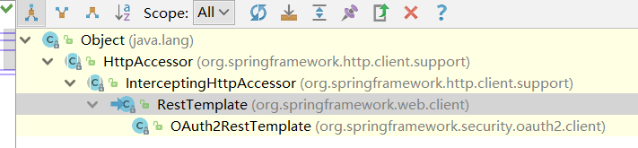
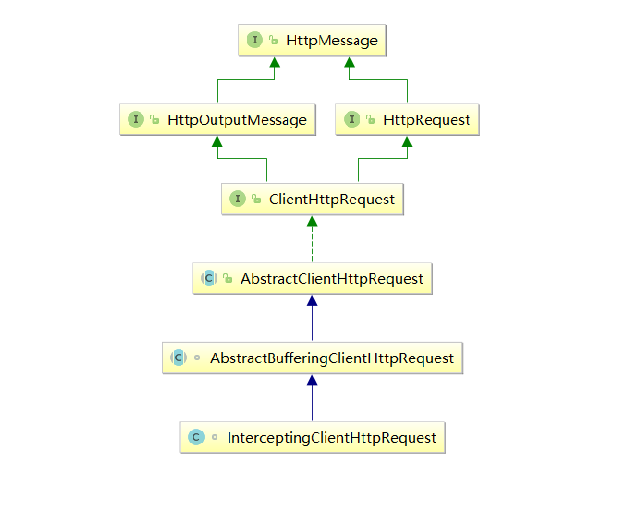
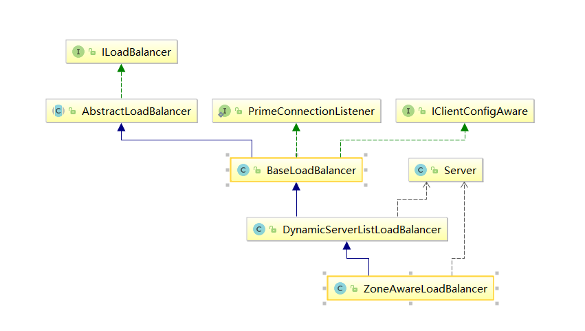
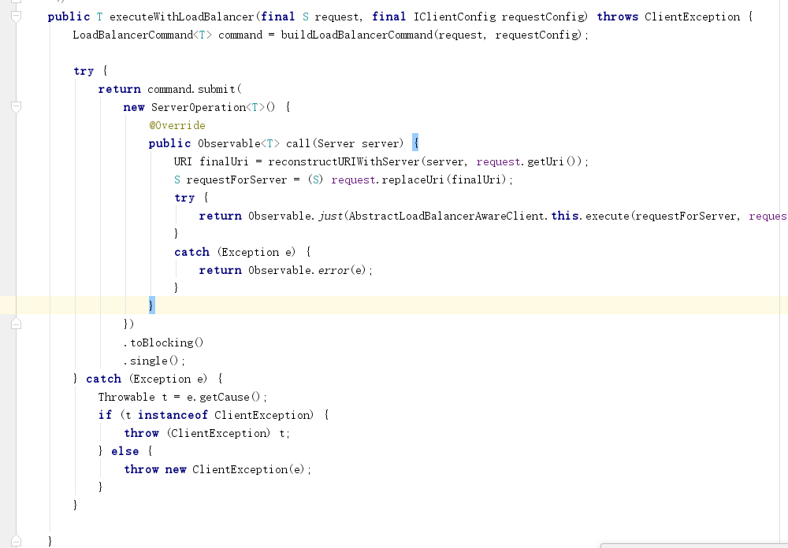

# Rabbon | Feign 源码分析

## Rabbon源码分析

### Rabbon自动配置分析

SpringCloud整合Rabbon需要引入依赖

```xml
<dependency>
  <groupId>org.springframework.cloud</groupId>
  <artifactId>spring-cloud-starter-netflix-ribbon</artifactId>
  <version>2.2.9.RELEASE</version>
  <scope>compile</scope>
  <optional>true</optional>
</dependency>
```
spring-cloud-starter-netflix-ribbon依赖spring-cloud-netflix-ribbon

```xml
<dependency>
  <groupId>org.springframework.cloud</groupId>
  <artifactId>spring-cloud-netflix-ribbon</artifactId>
  <version>2.2.9.RELEASE</version>
  <scope>compile</scope>
</dependency>
```

spring-cloud-netflix-ribbon依赖spring-cloud-commons

```xml
<dependency>
  <groupId>org.springframework.cloud</groupId>
  <artifactId>spring-cloud-commons</artifactId>
  <version>2.2.9.RELEASE</version>
  <scope>compile</scope>
  <optional>true</optional>
</dependency>
```

spring-cloud-netflix-ribbon的spring.factories文件引入自动配置RibbonAutoConfiguration：

```properties
org.springframework.boot.autoconfigure.EnableAutoConfiguration=\
org.springframework.cloud.netflix.ribbon.RibbonAutoConfiguration
```

spring-cloud-commons的spring.factories文件引入自动配置LoadBalancerAutoConfiguration：

```properties
# AutoConfiguration
org.springframework.boot.autoconfigure.EnableAutoConfiguration=\
org.springframework.cloud.client.loadbalancer.AsyncLoadBalancerAutoConfiguration,\
org.springframework.cloud.client.loadbalancer.LoadBalancerAutoConfiguration,\
org.springframework.cloud.client.serviceregistry.ServiceRegistryAutoConfiguration,\
org.springframework.cloud.commons.httpclient.HttpClientConfiguration,\
```

在RibbonAutoConfiguration配置类中、通过AutoConfigureBefore指定LoadBalancerAutoConfiguration自动配置类要先加载；

```java
@Configuration(proxyBeanMethods = false)
@ConditionalOnBean(LoadBalancerClient.class)
public class LoadBalancerAutoConfiguration {
   @LoadBalanced
   @Autowired(required = false)
   private List<RestTemplate> restTemplates = Collections.emptyList();

   @Autowired(required = false)
   private List<LoadBalancerRequestTransformer> transformers = Collections.emptyList();

   @Bean
   public SmartInitializingSingleton loadBalancedRestTemplateInitializerDeprecated(
         final ObjectProvider<List<RestTemplateCustomizer>> restTemplateCustomizers) {
      return () -> restTemplateCustomizers.ifAvailable(customizers -> {
         for (RestTemplate restTemplate : LoadBalancerAutoConfiguration.this.restTemplates) {
            for (RestTemplateCustomizer customizer : customizers) {
               customizer.customize(restTemplate);
            }
         }
      });
   }
	
    @Bean
	@ConditionalOnMissingBean
	public LoadBalancerRequestFactory loadBalancerRequestFactory(
			LoadBalancerClient loadBalancerClient) {
		return new LoadBalancerRequestFactory(loadBalancerClient, this.transformers);
	}
    
   @Configuration(proxyBeanMethods = false)
   static class LoadBalancerInterceptorConfig {
      @Bean
      public LoadBalancerInterceptor loadBalancerInterceptor(
            LoadBalancerClient loadBalancerClient,
            LoadBalancerRequestFactory requestFactory) {
         return new LoadBalancerInterceptor(loadBalancerClient, requestFactory);
      }

      @Bean
      @ConditionalOnMissingBean
      public RestTemplateCustomizer restTemplateCustomizer(
            final LoadBalancerInterceptor loadBalancerInterceptor) {
         return restTemplate -> {
            List<ClientHttpRequestInterceptor> list = new ArrayList<>(
                  restTemplate.getInterceptors());
            list.add(loadBalancerInterceptor);
            restTemplate.setInterceptors(list);
         };
      }
   }
}
```

**LoadBalancerAutoConfiguration**配置类主要功能：

- **LoadBalancerInterceptor** ： 注入负载均衡拦截器；
  - 拦截器实例化过程中、会先实例化LoadBalancerClient类型的Bean，RibbonAutoConfiguration配置类往容器中注入了**RabbonLoadBalancerClient**的Bean定义，会实例化该bean;
- **RestTemplateCustomizer** ： 模板定制器、**添加负载均衡拦截器**、并设置给restTempldate;
- **restTemplates** : 通过@Autowired注入所有被@LoadBalanced直接修饰的RestTemplate配置；
- **SmartInitializingSingleton** loadBalancedRestTemplateInitializerDeprecated ：
  - 往容器放入SmartInitializingSingleton 对象、在容器单例bean全部创建完后、调用afterSingletonsInstantiated方法；
  - 遍历restTemplates, 调用模板定制器给每个RestTempldate设置负载均衡拦截器LoadBalancerInterceptor；
- LoadBalancerRequestFactory : 负载均衡请求工厂， 用来创建负载均衡的请求，包装Request为ServletRequestWrapper, 通过ServletRequestWrapper#getURI将URI中的服务名替换为IP地址；

```java
@Configuration
@AutoConfigureBefore({ LoadBalancerAutoConfiguration.class,
      AsyncLoadBalancerAutoConfiguration.class })
public class RibbonAutoConfiguration {

   @Autowired(required = false)
   private List<RibbonClientSpecification> configurations = new ArrayList<>();

   @Bean
   @ConditionalOnMissingBean
   public SpringClientFactory springClientFactory() {
      SpringClientFactory factory = new SpringClientFactory();
      factory.setConfigurations(this.configurations);
      return factory;
   }

   @Bean
   @ConditionalOnMissingBean(LoadBalancerClient.class)
   public LoadBalancerClient loadBalancerClient() {
      return new RibbonLoadBalancerClient(springClientFactory());
   }

}
```

RibbonAutoConfiguration配置类主要工作：

- **SpringClientFactory**：设置defaultConfigType属性值为**RibbonClientConfiguration**.class
- **RibbonLoadBalancerClient** ： 往容器中注入Rabbon负载均衡客户端，依赖**SpringClientFactory**， 包装了获取负载均衡器、利用负载均衡器获取服务提供者，重新构建URI的核心功能；

RestTemplate类继承InterceptingHttpAccessor， InterceptingHttpAccessor继承HttpAccessor;




------

### Rabbon远程调用分析

```java
@RequestMapping(value = "/echo/{str}", method = RequestMethod.GET)
public String echo(@PathVariable String str) {
    return restTemplate.getForObject("http://service-provider/echo/" + str, String.class);
}
```

- RestTemplate#getForObject

  - RestTemplate#doExecute

    - ClientHttpRequest request = createRequest(url, method)

      - ClientHttpRequest request = getRequestFactory().createRequest(url, method);
        - InterceptingHttpAccessor#getRequestFactory() ： 返回拦截器类型工厂
          - 若拦截器数量不为空、则返回**InterceptingClientHttpRequestFactory**工厂
          - 若拦截器数量为空、则返回SimpleClientHttpRequestFactory工厂
        - InterceptingClientHttpRequestFactory#createRequest
          - new InterceptingClientHttpRequest(requestFactory, this.interceptors, uri, httpMethod) ： 返回拦截器类型请求；

    - response = request.execute()  

      - InterceptingClientHttpRequest#executeInternal

        - InterceptingRequestExecution requestExecution = new InterceptingRequestExecution();

          - this.iterator = interceptors.iterator() : 设置迭代器属性、值为拦截器集合；

        - requestExecution.execute(this, bufferedOutput);

          - LoadBalancerInterceptor#intercept：由于注入负载均衡拦截器、拦截器不为空、调用拦截器拦截方法；
            - this.loadBalancer.execute(serviceName,
                    this.requestFactory.createRequest(request, body, execution))  : loadBalancer类型为RibbonLoadBalancerClient
              - ILoadBalancer loadBalancer = getLoadBalancer(serviceId) ： 
                - 调用SpringClientFactory获取负载均衡器、第一次调用容器为空、会初始化Rabbon的IOC容器、加载配置类**RabbonClientAutoConfiguration**， 该配置类会注入ZoneAwareLoadBalancer负载均衡器；
              - **Server** server = getServer(loadBalancer, hint) ：根据服务列表根据负载均衡策略获取服务提供者
                - **loadBalancer.chooseServer(hint != null ? hint : "default")**
              - this.requestFactory.createRequest(request, body, execution) ： 利用拦截器请求工厂再次创建拦截器请求；
              - execute(serviceId, ribbonServer, request)
                - InterceptingClientHttpRequest#execute ： 由于拦截器已经执行完、所以if条件不成立；
        - ClientHttpRequest delegate = requestFactory.createRequest(request.getURI(), method) ： 创建Http请求、类型为SimpleBufferingClientHttpRequest
                  - request.getHeaders().forEach((key, value) -> delegate.getHeaders().addAll(key, value)) ： 设置请求头
                    - **SimpleBufferingClientHttpRequest**#executeInternal
                      - this.connection.connect() ：调用完connect方法后就发起了http调用；
        

获取负载均衡器

-  RibbonLoadBalancerClient#getLoadBalancer(serviceId)
  - this.clientFactory.getLoadBalancer(serviceId) ： 利用SpringClientFactory工厂获取负载均衡器；
    - SpringClientFactory#getInstance(name, ILoadBalancer.class);
      - C instance = super.getInstance(name, type)
        - AnnotationConfigApplicationContext context = getContext(name);
          - **AnnotationConfigApplicationContext#createContext** : 首次发起Rabbon远程调用时、容器为空，会创建Rabbon客户端IOC容器， 存放Rabbon使用的一些Bean;
            - **context.register(PropertyPlaceholderAutoConfiguration.class,this.defaultConfigType)** ： 往容器中注入RibbonClientConfiguration配置， 
            - **context.refresh()** ： 刷新容器、即IOC容器核心操作,  会解析RibbonClientConfiguration并创建Bean
              - **IRule** ：负载均衡策略、默认为ZoneAvoidanceRule
              - **ILoadBalancer** : 负载均衡器、默认为 ZoneAwareLoadBalancer， IOC容器创建该bean时、**会从Nacos根据服务名从拉取服务列表；**
    - 最终返回ILoadBalancer负载均衡器、类型为ZoneAwareLoadBalancer
- **Server** server = getServer(loadBalancer, hint) ：根据负载均衡策略获取服务提供者；
  - loadBalancer.chooseServer(hint != null ? hint : "default");
    - **ZoneAwareLoadBalancer#chooseServer**
      - getLoadBalancerStats().getAvailableZones().size() <= 1， 只有单个可用区域、则if成立；
      - super.chooseServer(key);
        - return **rule.choose(key);**
          - PredicateBasedRule#choose(Object key) ： ZoneAvoidanceRule集成PredicateBasedRule类
            - ILoadBalancer lb = getLoadBalancer() ：拿到负载均衡器；
            - **lb.getAllServers()** ： 拿出服务列表
            - AbstractServerPredicate#chooseRoundRobinAfterFiltering(List<Server> servers, Object loadBalancerKey)
              - List<Server> eligible = getEligibleServers(servers, loadBalancerKey) ：获取可用的服务提供者列表；
              - return Optional.of(eligible.get(incrementAndGetModulo(eligible.size()))) ：轮询方式从可用列表中获取服务提供者；

如何从Nacos注册中心获取服务列表？

- ZoneAwareLoadBalancer#<init> : 构造方法，Ribbon客户端IOC容器会调用构造方法并创建Bean；

  - 创建属性updateAction

    - ```java
      protected final ServerListUpdater.UpdateAction updateAction = new ServerListUpdater.UpdateAction() {
          @Override
          public void doUpdate() {
              updateListOfServers();
          }
      };
      ```

  - **ZoneAwareLoadBalancer#restOfInit(IClientConfig clientConfig)** 

    - enableAndInitLearnNewServersFeature() ：注册延迟定时任务、定时刷新服务列表；

      - serverListUpdater.start(updateAction)

        - Runnable wrapperRunnable = new Runnable() {public void run() {updateAction.doUpdate();}} : 创建线程任务；

        - ```java
          scheduledFuture = getRefreshExecutor().scheduleWithFixedDelay(
                  wrapperRunnable,
                  initialDelayMs,
                  refreshIntervalMs,
                  TimeUnit.MILLISECONDS
          );
          ```

          - 提交线程任务、延迟1s执行、每30s执行一次；
          - UpdateAction#doUpdate 
            - **DynamicServerListLoadBalancer#updateListOfServers()** : ZoneAwareLoadBalancer集成DynamicServerListLoadBalancer ： 相同业务逻辑

    - updateListOfServers() ：获取服务类表

      - updateAllServerList(servers);
        - servers = serverListImpl.getUpdatedListOfServers() ： 调用Nacos获取服务
          - **NacosServerList#getUpdatedListOfServers**
            - List<Instance> instances = this.discoveryProperties.namingServiceInstance().selectInstances(this.serviceId, group, true) ： 向Nacos发起Http请求，根据服务名获取服务列表；
          - updateAllServerList(servers) ： 更新Ribbon客户端服务缓存allServerList;

****

调用顺序： 

=> RestTempldate 

=> InterceptingClientHttpRequest

 => InterceptingClientHttpRequest#execute 

=> LoadBalancerInterceptor#intercept

=> this.loadBalancer.execute(serviceName, this.requestFactory.createRequest(request, body, execution));

​	=> Request request= this.requestFactory.createRequest(request, body, execution) : 包装Request为ServletRequestWrapper， 通过ServletRequestWrapper#getURI 将服务名替换为IP地址；

=> **ILoadBalancer** loadBalancer  = **RibbonLoadBalancerClient**#getLoadBalancer(serviceId) ： 

=> **Server** server = RibbonLoadBalancerClient#getServer(loadBalancer, hint)

=> **loadBalancer.chooseServer(hint != null ? hint : "default")**

=> InterceptingClientHttpRequest#execute 

​	=> request#getURI : 将服务名替换为IP地址；

​		=> **this.loadBalancer.reconstructURI(this.instance, getRequest().getURI())** : 利用负载均衡器重新构建URI

=> SimpleBufferingClientHttpRequest#execute 

=> this.connection.connect()

1. **调用RestTemplate模板方法**
2. **判断是否注入拦截器、如果有则创建InterceptingClientHttpRequest拦截器请求，再创建拦截器链执行；**
3. **遍历拦截器LoadIntercepter拦截方法**
4. **获取RibbonLoadBalancerClient客户端，并包装Request对象为ServletRequestWrapper,**
5. **调用RibbonLoadBalancerClient获取负载均衡器LoadBalancer, 并根据负载均衡策略 获取服务提供者**
   1. **若首次调用获取负载均衡器、Ribbon客户端IOC容器属于懒加载、首次调用时、先初始化IOC容器，加载RibbonClientConfiguration,往容器中注入默认IRule、ILoadBalancer的Bean对象；**
   2. **ILoadBalancer的默认实现为ZoneAwareLoadBalancer, 创建该对象时、会调用restOfInit方法，**
      1. **首先、先往定时线程池提交 服务刷新任务、 延迟1s，间隔30s执行；** 
      2. **其次、发起Http请求从Nacos根据服务名获取服务列表（NacosServerList）**
      3. **最终、更新allServerList属性、即更新Ribbon客户端缓存信息；**
6. **创建InterceptingClientHttpRequest拦截器请求并执行，由于拦截器执行完，if不成立；**
7. **调用ServletRequestWrapper#getURI，内部调用RibbonLoadBalancerClient#reconstructURI重新构建URI，将服务名替换为IP地址；**
8. **创建SimpleBufferingClientHttpRequest对象并执行， 创建TCP连接器、调用connect方法发起请求；**


#### 核心接口

IRule： 负载均衡策略；

ILoadBalancer: 负载均衡器；

IClientConfig: 客户端远程调用配置；

LoadBalancerClient: 微服务中代表客户端的负载均衡器、RibbonLoadBalacnerClient实现该接口，通过获取ILoadBalancer完成负载均衡从服务列表中选出服务；

ClientHttpRequestInterceptor：客户端请求拦截器、可在发起Http请求前做一些功能增强;LoadBalancerInterceptor实现该接口，完成负载均衡处理的入口；

LoadBalancerRequestFactory ： 负载均衡请求工厂、负责包装request对象， 返回ServiceRequestWrapper，重写getURI方法完成域名替换为IP过程；


InterceptingClientHttpRequest继承关系





## Feign源码分析

### Feign配置解析

SpringCloud使用Feign引入依赖spring-cloud-starter-openfeign

```xml
<dependency>
   <groupId>org.springframework.cloud</groupId>
   <artifactId>spring-cloud-starter-openfeign</artifactId>
</dependency>
```

spring-cloud-starter-openfeign依赖spring-cloud-openfeign-core

```xml
<dependency>
  <groupId>org.springframework.cloud</groupId>
  <artifactId>spring-cloud-openfeign-core</artifactId>
  <version>2.2.9.RELEASE</version>
  <scope>compile</scope>
</dependency>
```

spring-cloud-openfeign-core的spring.factories文件

```properties
org.springframework.boot.autoconfigure.EnableAutoConfiguration=\
org.springframework.cloud.openfeign.ribbon.FeignRibbonClientAutoConfiguration,\
org.springframework.cloud.openfeign.hateoas.FeignHalAutoConfiguration,\
org.springframework.cloud.openfeign.FeignAutoConfiguration,\
org.springframework.cloud.openfeign.encoding.FeignAcceptGzipEncodingAutoConfiguration,\
org.springframework.cloud.openfeign.encoding.FeignContentGzipEncodingAutoConfiguration,\
org.springframework.cloud.openfeign.loadbalancer.FeignLoadBalancerAutoConfiguration
```


FeignAutoConfiguration配置类

- FeignContext ： Feign的客户端IOC容器、defaultConfigType为FeignClientsConfiguration，首次Feign调用会创建客户端IOC容器、并加载FeignClientsConfiguration配置；
- DefaultFeignTargeterConfiguration ： 往容器中注入Targeter对象；


FeignRibbonClientAutoConfiguration配置类: 类上@Import 配置类

```java
@Import({ HttpClientFeignLoadBalancedConfiguration.class,
      OkHttpFeignLoadBalancedConfiguration.class,
      HttpClient5FeignLoadBalancedConfiguration.class,
      DefaultFeignLoadBalancedConfiguration.class })
```

- HttpClientFeignLoadBalancedConfiguration ：往容器注入LoadBalancerFeignClient，基于ApacheHttpClient, 即Feign的负载均衡客户端；

  - ```java
    @ConditionalOnProperty(value = "feign.httpclient.enabled", matchIfMissing = true)
    ```

    - 类上标记feign.httpclient.enabled， 默认为true, 因此该配置生效；

- OkHttpFeignLoadBalancedConfiguration：往容器注入LoadBalancerFeignClient，基于OkHttpClient, 即Feign的负载均衡客户端；

  - ```java
    @ConditionalOnProperty("feign.okhttp.enabled")
    ```

    - 一般不设置、因此不生效；

- HttpClient5FeignLoadBalancedConfiguration ： 需要存在类ApacheHttp5Client， 默认不生效；

- DefaultFeignLoadBalancedConfiguration ： 往容器中注入LoadBalancerFeignClient


- CachingSpringLoadBalancerFactory ： 依赖SpringClientFactory，该依赖由Ribbon组件完成注入， 因此CachingSpringLoadBalancerFactory工厂是Feign与Ribbon的整合点，通过利用SpringClientFactory的Ribbon客户端IOC容器的Bean完成 整合；


FeignContext客户端IOC加载时，会加载FeignClientsConfiguration

- Decoder : Feign相应内容的解码器

- Encoder ： Feign请求内容的编码器

- Contract ： Feign协议， 类型为SpringMvcContract，用来解析Feign接口参数的SpringMVC注解

- FeignLoggerFactory ： Feign日志工厂

  

### @EnableFeignClients注解解密

@Import(FeignClientsRegistrar.class) ： 注解类上存在@Import注解，导入FeignClientsRegistrar类，FeignClientsRegistrar实现了ImportBeanDefinitionRegistrar接口，Spring容器启动过程中会调用registerBeanDefinitions方法往IOC容器注入Bean定义；

- FeignClientsRegistrar#registerBeanDefinitions

  - FeignClientsRegistrar#registerFeignClients(metadata, registry);

    - ClassPathScanningCandidateComponentProvider scanner = getScanner() ：获取扫描器

    - scanner.addIncludeFilter(new AnnotationTypeFilter(FeignClient.class)) ：设置要扫描的类

    - Set<String> basePackages = getBasePackages(metadata) ： 获取要扫描的包路径

    - candidateComponents.addAll(scanner.findCandidateComponents(basePackage)) ：利用ASM技术扫描包中类上带有@FeignClient的接口类；

    - for (BeanDefinition candidateComponent : candidateComponents) ： 遍历扫描到Bean定义

      - AnnotationMetadata annotationMetadata = beanDefinition.getMetadata() ：获取Bean的注解元数据；

      - Map<String, Object> attributes = annotationMetadata
              .getAnnotationAttributes(FeignClient.class.getCanonicalName())：获取FeignClient的属性

      - registerFeignClient(registry, annotationMetadata, attributes) ：注册FeignClient的Bean定义；

        - **FeignClientFactoryBean factoryBean = new FeignClientFactoryBean()** ： Feign接口无法实例、因此使用FactoryBean生成代理对象，代理远程调用逻辑；

        - factoryBean.setType(clazz) ： FactoryBean设置 Feign的接口类型Class

        - ```java
          BeanDefinitionBuilder definition = BeanDefinitionBuilder
                .genericBeanDefinition(clazz, () -> {
                   return factoryBean.getObject();
                });
          ```

          - BeanDefinitionBuilder genericBeanDefinition(Class<T> beanClass, Supplier<T> instanceSupplier) ： 构造器模式生成Bean定义；
            - **instanceSupplier ： 在Bean的生命周期中、会调用instanceSupplier#get方法、进而调用factoryBean.getObject()， 获取Feign的代理对象；**

        - definition.setAutowireMode(AbstractBeanDefinition.AUTOWIRE_BY_TYPE) ： 设置依赖注入类型为ByType;

        - definition.setLazyInit(true)：设置为懒加载

        - AbstractBeanDefinition beanDefinition = definition.getBeanDefinition() ：构造Bean定义；

        - BeanDefinitionHolder holder = new BeanDefinitionHolder(beanDefinition, className,
                qualifiers) ：包装Bean定义

        - beanDefinitionReaderUtils.registerBeanDefinition(holder, registry) :注册Bean定义到BeanFactory中；

      

业务Service类中若是@Autowired了Feign接口， 则在Bean的依赖注入阶段，会从容器中获取Feign实例，由于懒加载未创建，因此找到FactoryBean的Bean定义， 在Bean的实例化阶段，调用createBeanInstance方法，由于设置了instanceSupplier属性，会调用instanceSupplier#get方法，进而调用FactoryBean#getObject方法获取Bean对象；


- AbstractAutowireCapableBeanFactory#doCreateBean
  - AbstractAutowireCapableBeanFactory#createBeanInstance
    - AbstractAutowireCapableBeanFactory#obtainFromSupplier
      - factoryBean.getObject() : 调用FeignFeignClientFactoryBean#getObject方法

- FeignFeignClientFactoryBean#getObject
  - FeignFeignClientFactoryBean#getTarget();
    - Feign.Builder builder = feign(context) : 创建Feign的构造器对象；
      - return (T) loadBalance(builder, context, new HardCodedTarget<>(type, name, url)) 
        - Client client = getOptional(context, Client.class) ： 获取负载均衡客户端，类型为LoadBalancerFeignClient
        - Targeter targeter = get(context, Targeter.class) 
        - return targeter.target(this, builder, context, target)  : 返回目标代理对象
          - return feign.target(target) 
            - return build().newInstance(target);
- Feign#builder#newInstance
  - Feign#builder
    - new ReflectiveFeign(handlersByName, invocationHandlerFactory, queryMapEncoder) 
  - ReflectiveFeign#newInstance : 利用JDK动态生成代理对象；
    - **Map<String, MethodHandler> nameToHandler = targetToHandlersByName.apply(target)** ： **获取Feign的远程调用方法、以及方法处理器、处理器类型为SynchronousMethodHandler**
    - InvocationHandler handler = factory.create(target, methodToHandler)
      - return new ReflectiveFeign.**FeignInvocationHandler**(target, dispatch) 
        - InvocationHandler, 实现Feign的增强逻辑，包装methodToHandler
    -  T proxy = (T) Proxy.newProxyInstance(target.type().getClassLoader(),
          new Class<?>[] {target.type()}, handler) :  JDK动态代理生成代理对象


## Feign调用流程

```java
@RestController
@RequestMapping("/consumer")
public class ConsumerController {
    @Resource
    ProviderFeignService feignService;

    @GetMapping("/getProviderById")
    public R getProviderById(@RequestParam(name = "id") Long id) {
        R service = feignService.findById(id);
        System.out.println(service);
        return service;
    }
}
```

- feignService.findById(id);
- ReflectiveFeign$FeignInvocationHandler#invoke ： 类似DispatchController, 进行第一层代理逻辑处理
  - dispatch.get(method).invoke(args) :  根据方法名找到处理器、类型为SynchronousMethodHandler
    - SynchronousMethodHandler#invoke 
      - SynchronousMethodHandler#executeAndDecode
        - Request request = targetRequest(template) : 调用RequestInterceptor拦截器、创建Request请求
        
        - response = client.execute(request, options) ： 调用LoadBalancerFeignClient发起请求
        
          - String clientName = asUri.getHost() ： 获取服务名
        
          - FeignLoadBalancer.RibbonRequest ribbonRequest = new FeignLoadBalancer.RibbonRequest( this.delegate, request, uriWithoutHost);
        
          - IClientConfig requestConfig = getClientConfig(options, clientName) : 该Bean由Ribbon组件提供， 调用SpringClientFactory工厂获取对象， 由于SpringClientFactory未创建，会先创建Ribbon的IOC容器、加载RibbonClientConfiguration配置并创建Bean对象， 最终返回IClientConfig；
        
          - lbClient(clientName)
                  .executeWithLoadBalancer(ribbonRequest, requestConfig).toResponse() ：
        
            根据clientName服务名从缓存中获取FeignLoadBalancer, 再接着调用


FeignLoadBalancer继承AbstractLoadBalancerAwareClient，executeWithLoadBalancer由父类实现

- AbstractLoadBalancerAwareClient#executeWithLoadBalancer
  - 
  - 创建ServerOperation对象、用lambda表达式实现了call方法
    - submit方法中会调用到call方法里的实现；
  - LoadBalancerCommand#submit方法传入ServerOperation对象
    - **selectServer() ：**
      - Server server = loadBalancerContext.getServerFromLoadBalancer(loadBalancerURI, loadBalancerKey) ： AbstractLoadBalancerAwareClient继承了LoadBalancerContext， 该方法在父类实现；
        - ILoadBalancer lb = getLoadBalancer() ： 获取负载均衡器，默认为ZoneAwareLoadBalancer；
        - Server svc = lb.chooseServer(loadBalancerKey) ： 根据服务名获取服务列表并选择一个服务实例；
          - super.chooseServer(key) ： 可用区域为1、if不成立、调用父类的chooseServer方法
            - return rule.choose(key) ： 根据负载均衡策略获取某个服务实例；
              - Optional<Server> server = getPredicate().chooseRoundRobinAfterFiltering(lb.getAllServers(), key) ： 在ZoneAwareLoadBalancer的创建过程中，提交延迟服务刷新任务、并主动从Nacos拉取服务列表；
    - operation.call(server) ： 调用ServerOperation对象的call方法，传入负载均衡选择后的服务实例；
      - URI finalUri = reconstructURIWithServer(server, request.getUri()) ： 传入服务实例、请求URI，将URI中的服务名替换为服务实例IP
      - S requestForServer = (S) request.replaceUri(finalUri) ： 替换请求的URI；
      - return Observable.just(AbstractLoadBalancerAwareClient.this.execute(requestForServer, requestConfig)) ： 执行请求；
        - FeignLoadBalancer#execute
          - Response response = request.client().execute(request.toRequest(), options) ：client返回ApacheHttpClient
          - return client.execute(httpUriRequest) ：ApacheHttpClient属性client类型为InternalHttpClient ，最终利用ApacheHttpClient发起远程调用；


调用链路类：

FeignInvocationHandler => SynchronousMethodHandler 

==>FeignInterceptor

==>LoadBalancerFeignClient =>FeignLoadBalancer => LoadBalancerCommand => ILoadBalancer => IRule => FeignLoadBalancer => ApacheHttpClient 发起Http调用；

### 总结

1. **Feign动态代理对象经过一级处理器FeignInvocationHandler进行方法代理分发到二级处理器SynchronousMethodHandler** 

2. **SynchronousMethodHandler 调用targetRequest方法遍历调用FeignIntercepter拦截器进行公共业务处理；**

3. **接着调用LoadBalancerFeignClient获取IClientConfig客户端配置， FeignLoadBalancer处理器进行负载均衡，根据负载均衡策略从服务列表中获取一个服务提供者**

   1. **首次调用接口，在获取IClientConfig时、由于Ribbon客户端IOC容器未创建，会先创建Ribbon的IOC容器， 解析RibbonClientConfiguration配置，创建IClientConfig, IRule, ILoadBalancer的Bean，默认类型为DefaultClientConfigImpl， ZoneAvoidanceRule、ZoneAwareLoadBalancer；**
      1. **ZoneAwareLoadBalancer会从Nacos注册中心根据服务名拉取服务列表**
   2. **调用ILoadBalancer负载均衡器chooseServer方法、会根据负载均衡策略IRule从服务列表中选择一个服务提供者，默认是基于区域性可用性负载均衡策略，由于区域可用数为1，本质上选择轮询服务列表；**

4. **重新构建请求的URI，将服务名替换为服务提供者的IP，并设置给请求；**

5. **调用ApacheHttpClient向服务提供者发起请求；**

6. **最后利用解码器解析相应内容reponse,返回目标类型；**

   

ServerOperation ： 函数式接口


NamedContextFactory ： 客户端IOC容器工厂、只需要继承该类，设置defaultConfigType为自己的配置类，就可以在第一次调用时、初始化独立客户端IOC容器；如FeignContext, SpringClientFactory； 如果一个组件A想要拥有另一个组件B的客户端IOC容器、只需要将B的NamedContextFactory注入自身属性完成调用；如CachingSpringLoadBalancerFactory


RequestInterceptor ： Feign的公共请求拦截器、在发送请求前，做功能增强处理；

常见微服务之间需要传递用户会话信息，可实现接口，在请求头中设置用户信息；


Client ： 客户端接口、实现该接口就拥有了发起请求的能力；ApacheHttpClient实现该接口，拥有发起请求的能力；LoadBalancerFeignClient实现了该接口， 并注入了Client属性、是Feign发起请求的入口；Seata分布式事务远程服务调用时、通过包装LoadBalancerFeignClient， 在Feign调用前设置全局事务XID到请求头中；


## Feign如何调用Nacos服务

在Feign的IOC容器初始化时， 会扫描RibbonClientConfiguration配置类， 创建ZoneAwareLoadBalancer负载均衡器、该负载均衡器的构造方法里调用Nacos服务；

```java
@Bean
@ConditionalOnMissingBean
public ILoadBalancer ribbonLoadBalancer(IClientConfig config,
      ServerList<Server> serverList, ServerListFilter<Server> serverListFilter,
      IRule rule, IPing ping, ServerListUpdater serverListUpdater) {
   if (this.propertiesFactory.isSet(ILoadBalancer.class, name)) {
      return this.propertiesFactory.get(ILoadBalancer.class, config, name);
   }
   return new ZoneAwareLoadBalancer<>(config, rule, ping, serverList,
         serverListFilter, serverListUpdater);
}
```

Nacos源码中，**NacosNamingService包装与Nacos服务端的交互， 因此Feign如果想要从Nacos获取服务列表，必须要调用NacosNamingService,  实际上，  ServerList是服务列表接口， 是SpringCloud的服务发现的一套规范， Nacos服务NacosServerList实现了该接口，通过NacosServerList调用NacosNamingService，进而发起Http请求**； 类似适配器模式；