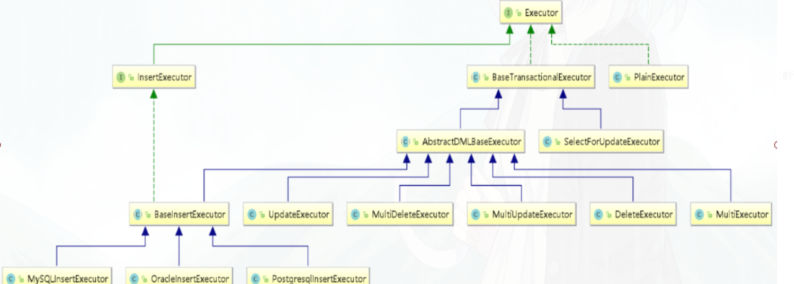

# Seata源码流程分析

## TM、RM配置解密

Seata的maven依赖

```xml
<!-- seata-->
<dependency>
    <groupId>com.alibaba.cloud</groupId>
    <artifactId>spring-cloud-starter-alibaba-seata</artifactId>
    <exclusions>
        <exclusion>
            <groupId>io.seata</groupId>
            <artifactId>seata-all</artifactId>
        </exclusion>
    </exclusions>
</dependency>
<dependency>
    <groupId>io.seata</groupId>
    <artifactId>seata-all</artifactId>
    <version>${seata.version}</version>
</dependency>
```

spring-cloud-starter-alibaba-seata的pom文件引入spring-cloud-alibaba-seata：

```xml
<dependency>
    <groupId>com.alibaba.cloud</groupId>
    <artifactId>spring-cloud-alibaba-seata</artifactId>
</dependency>
```

查看spring-cloud-alibaba-seata的spring.factories文件

```properties
org.springframework.boot.autoconfigure.EnableAutoConfiguration=\
com.alibaba.cloud.seata.rest.SeataRestTemplateAutoConfiguration,\
com.alibaba.cloud.seata.web.SeataHandlerInterceptorConfiguration,\
com.alibaba.cloud.seata.GlobalTransactionAutoConfiguration,\
com.alibaba.cloud.seata.feign.SeataFeignClientAutoConfiguration,\
com.alibaba.cloud.seata.feign.hystrix.SeataHystrixAutoConfiguration
```

GlobalTransactionAutoConfiguration: 

```java
@Configuration
@EnableConfigurationProperties({SeataProperties.class})
public class GlobalTransactionAutoConfiguration {

    @Bean
    public GlobalTransactionScanner globalTransactionScanner() {
        String applicationName = this.applicationContext.getEnvironment().getProperty("spring.application.name");
        String txServiceGroup = this.seataProperties.getTxServiceGroup();
        if (StringUtils.isEmpty(txServiceGroup)) {
            txServiceGroup = applicationName + "-seata-service-group";
            this.seataProperties.setTxServiceGroup(txServiceGroup);
        }

        return new GlobalTransactionScanner(applicationName, txServiceGroup);
    }
}
```

往容器中注入GlobalTransactionScanner组件， 用来扫描@GlobalTransaction注解；

```java
public class GlobalTransactionScanner extends AbstractAutoProxyCreator implements ConfigurationChangeListener, InitializingBean, ApplicationContextAware, DisposableBean {
```

实现InitializingBean接口， 拥有初始化能力， 初始化了TM事务管理器Netty客户端， RM资源管理器Netty客户端

```java
@Override
public void afterPropertiesSet() {
	initClient();
}
private void initClient() {
    //init TM
    TMClient.init(applicationId, txServiceGroup, accessKey, secretKey);
    //init RM
    RMClient.init(applicationId, txServiceGroup);

}
public static void init(String applicationId, String transactionServiceGroup) {
    RmNettyRemotingClient rmNettyRemotingClient = RmNettyRemotingClient.getInstance(applicationId, transactionServiceGroup);
    rmNettyRemotingClient.setResourceManager(DefaultResourceManager.get());
    rmNettyRemotingClient.setTransactionMessageHandler(DefaultRMHandler.get());
    rmNettyRemotingClient.init();
}
public static void init(String applicationId, String transactionServiceGroup, String accessKey, String secretKey) {
    TmNettyRemotingClient tmNettyRemotingClient = TmNettyRemotingClient.getInstance(applicationId, transactionServiceGroup, accessKey, secretKey);
    tmNettyRemotingClient.init();
}
```

继承了AbstractAutoProxyCreator， 拥有AOP动态代理能力；

- wrapIfNecessary
  - 若类是否包含TCC的功能，即接口上是否存在@TwoPhaseBusinessAction注解；
  - existsAnnotation(new Class[]{serviceInterface}) ： 类上或者方法上是否存在@GlobalTransaction、或者@GlobalLock注解
    - 不存在，返回bean;
    - 存在，则执行动态代理
      - 创建globalTransactionalInterceptor、实现了MethodInterceptor，方法拦截器，即通知；
      - super.wrapIfNecessary(bean, beanName, cacheKey) ：对当前类进行动态代理，创建代理对象

```java
@Override
protected Object wrapIfNecessary(Object bean, String beanName, Object cacheKey) {
    try {
        synchronized (PROXYED_SET) {
            interceptor = null;
            //check TCC proxy
            if (TCCBeanParserUtils.isTccAutoProxy(bean, beanName, applicationContext)) {
				//处理TCC..
            } else {
                Class<?> serviceInterface = SpringProxyUtils.findTargetClass(bean);
                Class<?>[] interfacesIfJdk = SpringProxyUtils.findInterfaces(bean);

                if (!existsAnnotation(new Class[]{serviceInterface})
                    && !existsAnnotation(interfacesIfJdk)) {
                    return bean;
                }

                if (interceptor == null) {
                    if (globalTransactionalInterceptor == null) {
                        globalTransactionalInterceptor = new GlobalTransactionalInterceptor(failureHandlerHook);
                    interceptor = globalTransactionalInterceptor;
                }
            }

            if (!AopUtils.isAopProxy(bean)) {
                bean = super.wrapIfNecessary(bean, beanName, cacheKey);
            } 
            //...
            return bean;
        }
    } catch (Exception exx) {
        throw new RuntimeException(exx);
    }
}

private boolean existsAnnotation(Class<?>[] classes) {
    if (CollectionUtils.isNotEmpty(classes)) {
        for (Class<?> clazz : classes) {
            GlobalTransactional trxAnno = clazz.getAnnotation(GlobalTransactional.class);
            if (trxAnno != null) {
                return true;
            }
            Method[] methods = clazz.getMethods();
            for (Method method : methods) {
                trxAnno = method.getAnnotation(GlobalTransactional.class);
                if (trxAnno != null) {
                    return true;
                }

                GlobalLock lockAnno = method.getAnnotation(GlobalLock.class);
                if (lockAnno != null) {
                    return true;
                }
            }
        }
    }
    return false;
}
```

总结：

1. 初始化阶段：会初始化生成TM的Netty客户端， RM的Netty客户端， 用于跟TC进行交互；

2. 后置处理阶段：若是类或者方法上存在@GlobalTransactional或者@GlobalLock，则创建GlobalTransactionalInterceptor拦截器，再创建AOP代理对象；


分布式事务涉及的微服务交互会将分布式事务ID放在请求头中传递；

SeataRestTemplateAutoConfiguration ： 使用restTemplate交互，给RestTemplate设置SeataRestTemplateInterceptor拦截器

SeataRestTemplateInterceptor ： 实现ClientHttpRequestInterceptor接口，负责将全局事务XID放在请求头上；


SeataFeignClientAutoConfiguration： 使用Feign/OpenFeign交互

```java
@Configuration
@ConditionalOnClass({Client.class})
@AutoConfigureBefore({FeignAutoConfiguration.class})
public class SeataFeignClientAutoConfiguration {
	//...
    @Configuration
    protected static class FeignBeanPostProcessorConfiguration {
        @Bean
        SeataBeanPostProcessor seataBeanPostProcessor(SeataFeignObjectWrapper seataFeignObjectWrapper) {
            return new SeataBeanPostProcessor(seataFeignObjectWrapper);
        }

        @Bean
        SeataFeignObjectWrapper seataFeignObjectWrapper(BeanFactory beanFactory) {
            return new SeataFeignObjectWrapper(beanFactory);
        }
    }
}
```

SeataFeignObjectWrapper : Feign组件包装器，增强feign组件能力；

SeataBeanPostProcessor ： 后置处理器、前置处理阶段使用SeataFeignObjectWrapper 对Bean进行增强

```java
final class SeataBeanPostProcessor implements BeanPostProcessor {
    private final SeataFeignObjectWrapper seataFeignObjectWrapper;

    SeataBeanPostProcessor(SeataFeignObjectWrapper seataFeignObjectWrapper) {
        this.seataFeignObjectWrapper = seataFeignObjectWrapper;
    }

    public Object postProcessBeforeInitialization(Object bean, String beanName) throws BeansException {
        return this.seataFeignObjectWrapper.wrap(bean);
    }
}
```

```java
public class SeataFeignObjectWrapper {
    private final BeanFactory beanFactory;
    private CachingSpringLoadBalancerFactory cachingSpringLoadBalancerFactory;
    private SpringClientFactory springClientFactory;

    SeataFeignObjectWrapper(BeanFactory beanFactory) {
        this.beanFactory = beanFactory;
    }

    Object wrap(Object bean) {
        if (bean instanceof Client && !(bean instanceof SeataFeignClient)) {
            if (bean instanceof LoadBalancerFeignClient) {
                LoadBalancerFeignClient client = (LoadBalancerFeignClient)bean;
                return new SeataLoadBalancerFeignClient(client.getDelegate(), this.factory(), this.clientFactory(), this.beanFactory);
            } else {
                return new SeataFeignClient(this.beanFactory, (Client)bean);
            }
        } else {
            return bean;
        }
    }
}
```

bean若是Client类型、且非SeataFeignClient类型，则对Feign的Client进行包装SeataLoadBalancerFeignClient，获取全局事务XID放在请求头，SeataFeignClient同理；

```java
public class SeataLoadBalancerFeignClient extends LoadBalancerFeignClient {
    private static final int MAP_SIZE = 16;
    private final BeanFactory beanFactory;

    private Request getModifyRequest(Request request) {
        String xid = RootContext.getXID();
        if (StringUtils.isEmpty(xid)) {
            return request;
        } else {
            Map<String, Collection<String>> headers = new HashMap(16);
            headers.putAll(request.headers());
            List<String> seataXid = new ArrayList();
            seataXid.add(xid);
            headers.put("TX_XID", seataXid);
            return Request.create(request.method(), request.url(), headers, request.body(), request.charset());
        }
    }
}
```


SeataHandlerInterceptorConfiguration :  设置Web全局事务会话拦截器

```java
@ConditionalOnWebApplication
public class SeataHandlerInterceptorConfiguration implements WebMvcConfigurer {
    public SeataHandlerInterceptorConfiguration() {
    }

    public void addInterceptors(InterceptorRegistry registry) {
        registry.addInterceptor(new SeataHandlerInterceptor()).addPathPatterns(new String[]{"/**"});
    }
}
```

往容器里添加SeataHandlerInterceptor拦截器、拦截器所有路径；

### Seata TC服务端解密

- Server#main
  - NettyRemotingServer nettyRemotingServer = new NettyRemotingServer(WORKING_THREADS)
    - 创建TC事务协调者Netty服务端
  - DefaultCoordinator coordinator = new DefaultCoordinator(nettyRemotingServer);
    - 创建协调者处理器，负责接收和处理TM，TC的请求，类似SpringMVC的Controller
  - coordinator.init();
    - 初始化协调者处理器
  - nettyRemotingServer.setHandler(coordinator);
    - 设置绑定处理器给服务器；
  - nettyRemotingServer.init();
    - 启动Netty服务器；


## 调用解密

AOP的调用过程、先调用通知增强， 再调用业务方法、因此需要先看GlobalTransactionIntercepter#invoke；

- GlobalTransactionIntercepter#invoke

  - handleGlobalLock(methodInvocation, globalLockAnnotation) ：存在@GlobalLock注解时、处理全局锁

  - handleGlobalTransaction(methodInvocation, globalTransactionalAnnotation) ： 存在@GlobalTransaction注解时调用处理全局事务；

    - transactionalTemplate.execute(TransactionalExecutor business)
      - beginTransaction(txInfo, tx): 开启全局事务
      - Object rs = business.execute() ： 执行业务处理
      - completeTransactionAfterThrowing(txInfo, tx, ex)：全局事务回滚
      - commitTransaction(tx) ：全局事务提交

    ​	

### beginTransaction

```java
private void beginTransaction(TransactionInfo txInfo, GlobalTransaction tx) throws TransactionalExecutor.ExecutionException {
    try {
        triggerBeforeBegin();
        tx.begin(txInfo.getTimeOut(), txInfo.getName());
        triggerAfterBegin();
    } catch (TransactionException txe) {
        throw new TransactionalExecutor.ExecutionException(tx, txe,
            TransactionalExecutor.Code.BeginFailure);
    }
}
```

- GlobalTransaction#begin
  - role != GlobalTransactionRole.Launcher ： 当前角色不是发起者，返回；
  - GlobalBeginRequest request = new GlobalBeginRequest()
  - xid = transactionManager.begin(null, null, name, timeout) : TransactionManager接口实现类为DefaultTransactionManager
    - DefaultTransactionManager#syncCall(request) 
      - TmNettyRemotingClient.getInstance().sendSyncRequest(request)
        - 发送开启全局事务请求给TC端；
  - status = GlobalStatus.Begin ： 更新全局事务状态为开始
  - RootContext.bind(xid) ：绑定全局事务ID到线程上下文中；


TC处理开启全局事务请求

- **DefaultCoordinator**#doGlobalBegin(GlobalBeginRequest request, GlobalBeginResponse response, RpcContext rpcContext)

  - core.begin(rpcContext.getApplicationId(), rpcContext.getTransactionServiceGroup(),  request.getTransactionName(), request.getTimeout()) ：core类型为**DefaultCore**

    - **GlobalSession** session = GlobalSession.createGlobalSession(applicationId, transactionServiceGroup, name,timeout) ： 创建全局事务

      - this.transactionId = UUIDGenerator.generateUUID() ： 生成事务ID
      - this.xid = XID.generateXID(transactionId) ：生成全局事务ID

    - session.addSessionLifecycleListener(SessionHolder.getRootSessionManager());

      - 添加监听器，类型为SessionManager

    - session.begin()

      - this.status = GlobalStatus.Begin ：修改全局事务状态

      - lifecycleListener.onBegin(this)

        - SessionManager#addGlobalSession(globalSession);

          - SessionManager#writeSession(LogOperation.**GLOBAL_ADD**, session);

            - transactionStoreManager.writeSession(logOperation, sessionStorable):  核心接口**TransactionStoreManager**

              - **DataBaseTransactionStoreManager**#writeSession(LogOperation logOperation, SessionStorable session) ：写入Mysql数据库

              - **LogStore**#insertGlobalTransactionDO(GlobalTransactionDO globalTransactionDO) : 

              - String sql = LogStoreSqlsFactory.getLogStoreSqls(dbType)

                .getInsertGlobalTransactionSQL(globalTable) : 获取插入的SQL语句， 参数值为global_table(可改)

                - ```java
                  //插入的SQL
                  public static final String INSERT_GLOBAL_TRANSACTION_MYSQL = "insert into " + GLOBAL_TABLE_PLACEHOLD
                          + "(" + ALL_GLOBAL_COLUMNS + ")"
                          + " values (?, ?, ?, ?, ?, ?, ?, ?, ?, now(), now())";
                  ```

              - ps = conn.prepareStatement(sql); ps.executeUpdate() ： JDBC操作数据库

    - return session.getXid(); : 返回全局事务的XID


### 总结

GlobalTransactionInterceptor增量逻辑中，调用TransactionTemplate#execute模版方法中，先调用开启全局事务，由TM事务管理器向TC事务协调者发送开启全局事务请求，TC协调者接收到请求后，创建全局事务会话， 并往global_table插入一条全局事务会话记录， 最终返回会话的XID;


## 全局事务执行解密

RM业务执行时、如何做到SQL的增强，JDBC中，通过PreparedStatement执行SQL语句， 通过Connection提交/回滚本地事务，可在执行SQL前后， 提交/回滚数据前后做增强；

Seata RM 业务SQL增强涉及核心类：

- DataSourceProxy ： 增强DataSource功能,  创建需要DataSource参数；
- ConnectionProxy: 增强Connection数据库连接功能；
- PreparedStatementProxy: 增强PreparedStatement预处理功能；


JDBC操作数据库步骤：

1. 获取数据源DataSource

2. 通过数据源DataSource获取数据库连接Connection、

   ```java
   Connection conn = dataSource.getConnection();
   ```

3. 通过数据库连接Connection获取 预处理对象PreparedStatement/Statement；

   ```
   //获取SQL执行对象，直接执行SQL不需要设置参数
   Statement statement = conn.createStatement();
   //获取SQL预处理执行对象、需要设置参数、防止SQL注入
   PreparedStatement pstmt = conn.prepareStatement(sql);
   ```

### 获取数据库连接解密

- DataSourceProxy#getConnection
  - Connection targetConnection = targetDataSource.getConnection(username, password)
    - 通过原生的数据源获取数据库连接
  - return new ConnectionProxy(this, targetConnection);
    - 创建连接代理对象， 包装原生数据库连接对象

### 数据库连接获取SQL执行对象解密

- ConnectionProxy#createStatement()
  - Statement targetStatement = getTargetConnection().createStatement() 
    -  通过原生数据库连接获取SQL执行对象
  - return new StatementProxy(this, targetStatement) 
    - 创建执行对象代理、包装原生执行对象
- ConnectionProxy#prepareStatement(String sql)
  - 若AT模式、SQLRecognizer sqlRecognizer = sqlRecognizers.get(0) ： 获取SQL识别器
  - TableMeta tableMeta = TableMetaCacheFactory.getTableMetaCache(dbType).getTableMeta(getTargetConnection(),
            sqlRecognizer.getTableName(), getDataSourceProxy().getResourceId());
    - 获取表的元数据
  - PreparedStatement targetPreparedStatement = getTargetConnection().prepareStatement(sql,pkNameArray) 
    - 获取SQL预处理执行对象；
  - return new PreparedStatementProxy(this, targetPreparedStatement, sql) 
    - 返回预处理代理对象、包装PreparedStatement对象

### 预处理对象执行SQL

```java
@Override
public boolean execute() throws SQLException {
    return ExecuteTemplate.execute(this, (statement, args) -> statement.execute());
}

@Override
public ResultSet executeQuery() throws SQLException {
    return ExecuteTemplate.execute(this, (statement, args) -> statement.executeQuery());
}

@Override
public int executeUpdate() throws SQLException {
    return ExecuteTemplate.execute(this, (statement, args) -> statement.executeUpdate());
}
```

通过ExecuteTemplate#execute方法实现SQL执行的增强；


总结：

RM的本地事务执行过程中，通过DataSourceProxy、ConnectionProxy, PreparedStatmentProxy， StatementProxy代理对象、执行 分布式事务相关的业务逻辑；


## 

业务代码

```java
    @GlobalTransactional(name="createOrder")
    public Order saveOrder(OrderVo orderVo) {
        log.info("=============用户下单=================");
        log.info("当前 XID: {}", RootContext.getXID());
        
        // 保存订单
        Order order = new Order();
        order.setUserId(orderVo.getUserId());
    
        Integer saveOrderRecord = orderMapper.insert(order);
        log.info("保存订单{}", saveOrderRecord > 0 ? "成功" : "失败");
    
        //扣减库存
        storageFeignService.deduct(orderVo.getCommodityCode(), orderVo.getCount());
        
        //扣减余额   服务降级  throw
        Boolean debit= accountFeignService.debit(orderVo.getUserId(), orderVo.getMoney());

//        if(!debit){
//            // 解决 feign整合sentinel降级导致SeaTa失效的处理
//            throw new RuntimeException("账户服务异常降级了");
//        }

        //更新订单
        Integer updateOrderRecord = orderMapper.updateOrderStatus(order.getId(),OrderStatus.SUCCESS.getValue());
        log.info("更新订单id:{} {}", order.getId(), updateOrderRecord > 0 ? "成功" : "失败");
        
        return order;
    }
```

## RM业务SQL执行过程解密

代理对象逻辑：

- GlobalTransactionalInterceptor#invoke
- TransactionalTemplate.execute(TransactionalExecutor business)
- Object rs = business.execute()

本地业务逻辑

- Integer saveOrderRecord = orderMapper.insert(order);

- 经过Mybatis层层调用、底层通过JDBC执行SQL, Mybatis层获取的Connection,DataSource, PreparedStatement返回的都是代理对象；

- PreparedStatement#execute() / executeQuery() / executeUpdate()

- ExecuteTemplate#execute

  - SQLRecognizer sqlRecognizer = sqlRecognizers.get(0) : SQL识别器区分SQL语句的增删查改类型；

    - 若为INSERT类型、则创建插入执行器**InsertExecutor**

    - 若为UPDATE类型、则创建更新执行器**UpdateExecutor**
    - 若为DELETE类型、则创建删除执行器**DeleteExecutor**
    - 以及其他执行器、根据SQL的类型创建不同的执行器**SelectForUpdateExecutor**；

  - rs = executor.execute(args) : 调用执行器执行SQL

  - **BaseTransactionalExecutor**#execute(Object... args) ：

    - statementProxy.getConnectionProxy().bind(xid) ： 绑定XID执行器上下文中；

    - statementProxy.getConnectionProxy().setGlobalLockRequire(RootContext.requireGlobalLock())：设置全局锁

    - **AbstractDMLBaseExecutor**#doExecute(args)

      - AbstractConnectionProxy connectionProxy = statementProxy.getConnectionProxy()

        - 获取绑定的SQL连接、判断是否自动提交；

      - executeAutoCommitTrue(args) ： 将自动提交改为false;

        - ConnectionProxy connectionProxy = statementProxy.getConnectionProxy();

        - connectionProxy.setAutoCommit(false) : 取消本地事务自动提交

        - T result = executeAutoCommitFalse(args) ：

          - TableRecords beforeImage = **beforeImage**() ： 构建SQL的前置镜像；

          - T result = statementCallback.execute(statementProxy.getTargetStatement(), args)

            执行业务的SQL语句；

          - TableRecords afterImage = **afterImage**(beforeImage) ：构建SQL的后置镜像

          - prepareUndoLog(beforeImage, afterImage) ： 将SQL前后置镜像放入上下文中；

        - connectionProxy.**commit**() ： 提交本地事务；

          - **LOCK_RETRY_POLICY**.execute(() -> {doCommit();return null;}); **重试机制**执行事务提交
          - ConnectionProxy#doCommit
            - 若存在@GlobalTransaction,则context.inGlobalTransaction()为true;
              - **processGlobalTransactionCommit**()
                - ConnectionProxy#**register**() : 提交本地事务前注册分支事务；
                - UndoLogManagerFactory.getUndoLogManager(this.getDbType()).flushUndoLogs(this) ：从上下文获取前后置镜像，插入undo_log表中；
            - 若存在@GlobalLock, 则context.isGlobalLockRequire()为true
            - 都不存在、则targetConnection.commit();

##### 前后置镜像解析

若是insert类型SQL，则前置镜像为空、SQL执行结束、会使用主键ID查询记录，得到后置镜像；

若是update类型SQL、则先根据UPDATE的where条件，作为select条件查出更新前的数据、得到前置镜像；

SQL执行结束后、使用UPDATE的where条件，作为select条件查出更新后的数据，得到后置镜像；

若是DELETE类型SQL，则先根据DELETE的where条件，作为select条件查出删除前的数据、得到前置镜像；

SQL执行结束后， 后置镜像为空；


#### 注册分支事务

RM资源管理器发起分支事务请求给TC协调者；

- ConnectionProxy#**register**()
  - Long branchId = DefaultResourceManager.get().branchRegister(BranchType.AT, getDataSourceProxy().getResourceId(),    null, context.getXid(), null, context.buildLockKeys());
    - DefaultResourceManager#branchRegister  
      - DefaultResourceManager父类为AbstractResourceManager
      - AbstractResourceManager#branchRegister
        - BranchRegisterRequest request = new BranchRegisterRequest();
        - request.setXid(xid);
        - BranchRegisterResponse response = (BranchRegisterResponse) RmNettyRemotingClient.getInstance().sendSyncRequest(request)
          - 调用RM客户端发起分支事务注册请求、返回分支事务ID；


TC协调者处理注册分支事务请求

- DefaultCoordinator#doBranchRegister

  - response.setBranchId(core.branchRegister(request.getBranchType(),request.getResourceId(),rpcContext.getClientId(),request.getXid(),  request.getApplicationData(), request.getLockKey())) ： 设置分支事务ID

    - AbstractCore#branchRegister ：AbstractCore实现类为ATCore

      - globalSessionStatusCheck(globalSession) :全局事务会话状态检查

      - globalSession.addSessionLifecycleListener(SessionHolder.getRootSessionManager()) ：设置监听器

      - BranchSession branchSession = SessionHelper.newBranchByGlobal(globalSession, branchType, resourceId, applicationData, lockKeys, clientId) ： 创建分支事务对象

      - - **检查并获取全局锁，会更新记录的主键ID加锁，global_lock表的rowKey使用唯一索引，为更新表名:主键ID为索引， 若查询global_lock表时、查出数据、则代表该数据已经被其他分布式事务锁了， 无法操作并抛出异常；**

      - **检查n.addBranch(branchSession)** ： 绑定分支事务给全局事务会话；

        - lifecycleListener.onAddBranch(this, branchSession) ：触发监听器

          - AbstractSessionManager#onAddBranch(globalSession, branchSession)

          - AbstractSessionManager#addBranchSession(globalSession, branchSession);

          - AbstractSessionManager#writeSession(**LogOperation.BRANCH_ADD**, branchSession);

          - transactionStoreManager.writeSession(logOperation, sessionStorable)

          - logStore.insertBranchTransactionDO(SessionConverter.convertBranchTransactionDO(session))

            - String sql = LogStoreSqlsFactory.getLogStoreSqls(dbType)

              .getInsertBranchTransactionSQL(branchTable) ：构造插入分支事务表的SQL

            - ps.executeUpdate() ：执行插入SQL；

        - branchSessions.add(branchSession);

          

  


### 分布式事务远程服务调用解密

上游服务开启分布式事务后、Feign/rabbon调用下游服务接口时、下游服务如何感知分布式事务信息？

Seata与SpringCloud OpenFeign / Feign 整合中， 包装原有的FeignClient为SeataLoadBalancerFeignClient，替换容器中Feign的Client, 这样调用Feign调用远程服务使用的Client为SeataLoadBalancerFeignClient， 再将XID放入请求头，发起远程服务调用； 而远程服务可通过拦截器/过滤器从请求头里获取XID，再放入上下文中；


服务调用方：

- storageFeignService.deduct(orderVo.getCommodityCode(), orderVo.getCount());
  - SynchronousMethodHandler#invoke : feign调用的代理逻辑
  - SeataLoadBalancerFeignClient#execute(Request request, Options options)
    - SeataLoadBalancerFeignClient#getModifyRequest(Request request)
      - String xid = RootContext.getXID() ：从上下文中获取全局事务XID
      - List<String> seataXid = new ArrayList();seataXid.add(xid)   
      - headers.put("TX_XID", seataXid) ： XID放入请求头
      - Request.create(request.method(), request.url(), headers, request.body(), request.charset())
        - 发起HTTP请求调用远程服务


服务提供者：

- SeataHandlerInterceptor#preHandle(HttpServletRequest request, HttpServletResponse response, Object handler) : SpringMVC的前置增强处理；
  - String xid = RootContext.getXID() : 上下文中获取XID、接收请求时为空；
  - String rpcXid = request.getHeader("TX_XID") ：从请求头获取全局事务XID；
  - RootContext.bind(rpcXid) ： 把XID放入上下文中， 本地处理分布式事务时、可通过XID获取全局事务信息；


## 分布式事务提交解密

代理对象逻辑：

- GlobalTransactionalInterceptor#invoke
- TransactionalTemplate.execute(TransactionalExecutor business)
- Object rs = business.execute() ：执行业务SQL
- this.commitTransaction(tx) : 分布式事务提交
  - triggerBeforeCommit() ： 事务提交前扩展方法
  - tx.commit() ： 全局事务提交
  - triggerAfterCommit() ： 事务提交后扩展方法


- **GlobalTransaction**#commit() : 全局事务提交， GlobalTransaction实现类为DefaultGlobalTransaction
  - role == GlobalTransactionRole.**Participant** ：事务角色分为发起者，参与者、TM代表发起者，只有发起者才有权限发起全局事务提交能力，若是参与者，则返回；
  - int retry = COMMIT_RETRY_COUNT <= 0 ? DEFAULT_TM_COMMIT_RETRY_COUNT : COMMIT_RETRY_COUNT ： 提交失败后的重试次数
  - status = transactionManager.commit(xid) ： 事务管理器TM发起全局事务提交；
    - GlobalCommitRequest globalCommit = new GlobalCommitRequest()
      - 创建全局事务提交请求
    - globalCommit.setXid(xid) ：设置全局事务XID
    - syncCall(globalCommit)
      - TmNettyRemotingClient.getInstance().sendSyncRequest(request) 
        - 调用TM的Netty客户端给TC发起全局事务提交请求


TC事务协调者处理全局事务提交请求

- DefaultCoordinator#doGlobalCommit(GlobalCommitRequest request, GlobalCommitResponse response, RpcContext rpcContext)
  - response.setGlobalStatus(core.commit(request.getXid())) 
  - core.commit(request.getXid())  ： core类型为DefaultCore
    - GlobalSession globalSession = SessionHolder.findGlobalSession(xid) :根据XID从global_table查询全局事务会话记录；
    - globalSession.addSessionLifecycleListener(SessionHolder.getRootSessionManager()):添加监听器
    - globalSession.closeAndClean() :设置active状态为false、并根据xid、branchId删除global_lock全局锁信息
    - globalSession.canBeCommittedAsync() ： Seata默认支持二阶段异步提交；
      - SessionHolder.getAsyncCommittingSessionManager().addGlobalSession(this) 
        - **DataBaseSessionManager**# addGlobalSession(GlobalSession session)
          - transactionStoreManager.writeSession(LogOperation.GLOBAL_UPDATE, session)
            - logStore.updateGlobalTransactionDO(SessionConverter.convertGlobalTransactionDO(session)) : 根据XID修改global_table全局事务表的status状态为begin;
      - this.changeStatus(GlobalStatus.AsyncCommitting) : 根据XID修改global_table全局事务表状态为AsyncCommitting；
        - this.status = status ： 更新全局事务会话的状态为AsyncCommitting
        - AbstractSessionManager#onStatusChange(GlobalSession globalSession, GlobalStatus status) : **DataBaseSessionManager**的父类为**AbstractSessionManager**；
          - updateGlobalSessionStatus(globalSession, status);
          - **writeSession(LogOperation.GLOBAL_UPDATE, session)**
            - transactionStoreManager.writeSession(logOperation, sessionStorable)
              - **logStore.updateGlobalTransactionDO(SessionConverter.convertGlobalTransactionDO(session))** ： 根据XID修改global_table全局事务表的status状态为AsyncCommitting;
    - return globalSession.getStatus() == GlobalStatus.AsyncCommitting ? GlobalStatus.Committed : globalSession.getStatus() : 支持异步提交、因此返回commited;


Seata在DefaultCoordinator创建时、创建异步提交线程池、异步回滚线程池等；

```java
public class DefaultCoordinator extends AbstractTCInboundHandler implements TransactionMessageHandler, Disposable {

    private ScheduledThreadPoolExecutor retryRollbacking = new ScheduledThreadPoolExecutor(1,
        new NamedThreadFactory("RetryRollbacking", 1));

    private ScheduledThreadPoolExecutor asyncCommitting = new ScheduledThreadPoolExecutor(1,
        new NamedThreadFactory("AsyncCommitting", 1));

    private ScheduledThreadPoolExecutor undoLogDelete = new ScheduledThreadPoolExecutor(1,
        new NamedThreadFactory("UndoLogDelete", 1));
    //...
    
    public void init() {
    retryRollbacking.scheduleAtFixedRate(() -> {
        try {
            handleRetryRollbacking();
        } catch (Exception e) {
            LOGGER.info("Exception retry rollbacking ... ", e);
        }
    }, 0, ROLLBACKING_RETRY_PERIOD, TimeUnit.MILLISECONDS);

    asyncCommitting.scheduleAtFixedRate(() -> {
        try {
            handleAsyncCommitting();
        } catch (Exception e) {
            LOGGER.info("Exception async committing ... ", e);
        }
    }, 0, ASYNC_COMMITTING_RETRY_PERIOD, TimeUnit.MILLISECONDS);
    undoLogDelete.scheduleAtFixedRate(() -> {
        try {
            undoLogDelete();
        } catch (Exception e) {
            LOGGER.info("Exception undoLog deleting ... ", e);
        }
    }, UNDO_LOG_DELAY_DELETE_PERIOD, UNDO_LOG_DELETE_PERIOD, TimeUnit.MILLISECONDS);
	}
}
```

- DefaultCoordinator#init()方法中提交了三个线程任务、全局事务失败重试异步回滚任务、全局事务异步提交任务、删除undoLog日志任务；

TC处理二阶段全局事务提交任务：

- handleAsyncCommitting#handleAsyncCommitting

  - Collection<GlobalSession> asyncCommittingSessions = SessionHolder.getAsyncCommittingSessionManager().allSessions() ：每次从global_table中获取100条事务状态为AsyncCommitting的记录；

    - DataBaseTransactionStoreManager#readSession(GlobalStatus[] statuses)
      - List<GlobalTransactionDO> globalTransactionDOs = logStore.queryGlobalTransactionDO(states, logQueryLimit) 
        - **logQueryLimit默认值为100， JDBC查询global_table带上limit参数，即分页查询**

  - asyncCommittingSession.addSessionLifecycleListener(SessionHolder.getRootSessionManager())

  - core.doGlobalCommit(asyncCommittingSession, true)

    - for (BranchSession branchSession : globalSession.getSortedBranches()) ：遍历绑定的所有分支事务

    - BranchStatus branchStatus = getCore(branchSession.getBranchType()).branchCommit(globalSession, branchSession) 

      - ATCore#branchCommit(GlobalSession globalSession, BranchSession branchSession)
        - BranchCommitRequest request = new BranchCommitRequest() : 创建分支提交请求
        - request.setXid(branchSession.getXid()); 设置全局事务会话XID
        - request.setBranchId(branchSession.getBranchId()) ：设置分支事务会话branchId;
        - branchCommitSend(request, globalSession, branchSession)
          - **remotingServer.sendSyncRequest**(
                    branchSession.getResourceId(), branchSession.getClientId(), request)
            - TC 向RM发送分支事务提交请求，RM接收到请求会清理undo_log表的数据

    - branchStatus = PhaseTwo_Committed ： 分支事务若为二阶段提交状态

      - globalSession.removeBranch(branchSession) ：TC删除分支事务会话信息

        - branchSession.unlock() ： 根据xid,branchId删除lock_table全局锁信息；
        - AbstractSessionManager#onRemoveBranch : 根据xid、branchId删除branch_table的分支事务信息；
        - remove(branchSession) ： 删除内存中全局事务和分支事务的绑定关系；

      - SessionHelper.endCommitted(globalSession) 

        - globalSession.changeStatus(GlobalStatus.Committed) : 修改全局事务状态为已提交；

        - globalSession.end();

          - clean();

            - LockerManagerFactory.getLockManager().releaseGlobalSessionLock(this);
              - 根据xid和绑定branchIds删除lock_table全局锁信息

          - AbstractSessionManager#onEnd

            - removeGlobalSession(globalSession);

            - writeSession(LogOperation.GLOBAL_REMOVE, session);

            - transactionStoreManager.writeSession(logOperation, sessionStorable)

              - logStore.deleteGlobalTransactionDO(SessionConverter.convertGlobalTransactionDO(session));

                - 根据xid删除global_table全局事务记录；

                  


RM相关接口：

ResourceManagerInbound ： RM接收TC请求、对应入站；

```java
public interface ResourceManagerInbound {

    /**
     * Commit a branch transaction.
     *
     * @param branchType      the branch type
     * @param xid             Transaction id.
     * @param branchId        Branch id.
     * @param resourceId      Resource id.
     * @param applicationData Application data bind with this branch.
     * @return Status of the branch after committing.
     * @throws TransactionException Any exception that fails this will be wrapped with TransactionException and thrown
     *                              out.
     */
    BranchStatus branchCommit(BranchType branchType, String xid, long branchId, String resourceId, String applicationData) throws TransactionException;

    /**
     * Rollback a branch transaction.
     *
     * @param branchType      the branch type
     * @param xid             Transaction id.
     * @param branchId        Branch id.
     * @param resourceId      Resource id.
     * @param applicationData Application data bind with this branch.
     * @return Status of the branch after rollbacking.
     * @throws TransactionException Any exception that fails this will be wrapped with TransactionException and thrown
     *                              out.
     */
    BranchStatus branchRollback(BranchType branchType, String xid, long branchId, String resourceId, String applicationData) throws TransactionException;
}
```

ResourceManagerOutbound： RM向TC发送请求、对应出站；

```java
public interface ResourceManagerOutbound {

    /**
     * Branch register long.
     *
     * @param branchType the branch type
     * @param resourceId the resource id
     * @param clientId   the client id
     * @param xid        the xid
     * @param applicationData the context
     * @param lockKeys   the lock keys
     * @return the long
     * @throws TransactionException the transaction exception
     */
    Long branchRegister(BranchType branchType, String resourceId, String clientId, String xid, String applicationData, String lockKeys) throws
        TransactionException;

    /**
     * Branch report.
     *
     * @param branchType      the branch type
     * @param xid             the xid
     * @param branchId        the branch id
     * @param status          the status
     * @param applicationData the application data
     * @throws TransactionException the transaction exception
     */
    void branchReport(BranchType branchType, String xid, long branchId, BranchStatus status, String applicationData) throws TransactionException;

    /**
     * Lock query boolean.
     *
     * @param branchType the branch type
     * @param resourceId the resource id
     * @param xid        the xid
     * @param lockKeys   the lock keys
     * @return the boolean
     * @throws TransactionException the transaction exception
     */
    boolean lockQuery(BranchType branchType, String resourceId, String xid, String lockKeys)
        throws TransactionException;
}
```

**ResourceManager** ： 集成了ResourceManagerInbound, ResourceManagerOutbound两个接口、拥有RM与TC交互能力、默认实现类为DefaultResourceManager

RM二阶段提交时、接收处理TC分支事务提交请求；

- **DefaultResourceManager**#branchCommit
  - getResourceManager(branchType).branchCommit(branchType, xid, branchId, resourceId, applicationData);
    - **DataSourceManager**#branchCommit
      - **AsyncWorker**#branchCommit ：异步处理、先放入queue、由线程处理
        - ASYNC_COMMIT_BUFFER.offer(new Phase2Context(branchType, xid, branchId, resourceId, applicationData))
          - **往阻塞队列ASYNC_COMMIT_BUFFER中放入二阶段提交任务；**
        - return BranchStatus.**PhaseTwo_Committed** ： 返回二阶段提交状态给TC；


- AsyncWorker#init : 初始化时、创建定时线程池、并提交 分支事务提交线程任务，每10ms执行一次，周期1s
  - ```java
    public synchronized void init() {
        LOGGER.info("Async Commit Buffer Limit: {}", ASYNC_COMMIT_BUFFER_LIMIT);
        ScheduledExecutorService timerExecutor = new ScheduledThreadPoolExecutor(1, new NamedThreadFactory("AsyncWorker", 1, true));
        timerExecutor.scheduleAtFixedRate(() -> {
            try {
    
                doBranchCommits();
    
            } catch (Throwable e) {
                LOGGER.info("Failed at async committing ... {}", e.getMessage());
    
            }
        }, 10, 1000 * 1, TimeUnit.MILLISECONDS);
    }
    ```

    

- AsyncWorker#doBranchCommits

  - ```java
    Map<String, List<Phase2Context>> mappedContexts = new HashMap<>(DEFAULT_RESOURCE_SIZE);
    while (!ASYNC_COMMIT_BUFFER.isEmpty()) {
        Phase2Context commitContext = ASYNC_COMMIT_BUFFER.poll();
        contextsGroupedByResourceId = CollectionUtils.computeIfAbsent(mappedContexts, commitContext.resourceId, key -> new ArrayList<>());
        contextsGroupedByResourceId.add(commitContext);
    }
    ```

     从队列取出所有的二阶段提交任务，并根据资源ID进行分组；

  - for (Map.Entry<String, List<Phase2Context>> entry : mappedContexts.entrySet())  ： 遍历所有任务

    - DataSourceManager resourceManager = (DataSourceManager) DefaultResourceManager.get()
          .getResourceManager(BranchType.AT) ： 获取AT模式的数据源管理器

    - dataSourceProxy = resourceManager.get(entry.getKey()) ： 获取数据源

    - conn = dataSourceProxy.getPlainConnection() ： 获取普通的JDBC连接

    - ```
      Set<String> xids = new LinkedHashSet<>(UNDOLOG_DELETE_LIMIT_SIZE);
      Set<Long> branchIds = new LinkedHashSet<>(UNDOLOG_DELETE_LIMIT_SIZE);
      for (Phase2Context commitContext : contextsGroupedByResourceId) {
          xids.add(commitContext.xid);
          branchIds.add(commitContext.branchId);
          int maxSize = Math.max(xids.size(), branchIds.size());
          if (maxSize == UNDOLOG_DELETE_LIMIT_SIZE) {   UndoLogManagerFactory.getUndoLogManager(dataSourceProxy.getDbType()).batchDeleteUndoLog( xids, branchIds, conn);  
          }
      }
      ```

      - 根据批量xid, branchId批量删除undo_log表记录、每次最多UNDOLOG_DELETE_LIMIT_SIZE条，默认为1000条；


#### 二阶段提交总结

- Seata默认支持异步提交；
- TM向TC发送全局事务提交请求；
  - TC根据XID从global_table查询全局事务记录；
  - 修改全局事务激活状态、再根据xid、branchId清除lock_table的全局锁记录；
  - 若支持异步提交、先根据xid更新global_table的事务状态为begin、再根据xid更新global_table的事务状态为AsyncCommiting异步提交状态；
  - 返回全局事务已提交；
- 异步提交线程每隔1s执行一次全局事务提交任务；
  - 查询global_table全局事务状态为AsyncCommitting的全局事务记录、每次1000条；
  - 遍历全局事务记录集合
  - 根据全局事务绑定的分支事务集合、TC向RM发送分支事务提交请求
    - RM接收处理分支事务请求、将任务放入阻塞队列中、返回二阶段提交状态；
      - RM每隔1s执行一次、从阻塞队列中取出所有分支事务提交任务， 批量根据xid、branchId删除undo_log日志
  - TC接收到RM响应的二阶段提交状态；
  - TC根据xid、branchId删除lock_table的全局锁记录；
  - TC根据xid、branchId删除branch_table的分支事务记录；
  - 删除内存中全局事务会话与分支事务会话的关联；
  - 根据xid更新global_table的全局事务状态；
  - 根据xid删除global_table的全局事务记录；


### 全局事务回滚解密

代理对象逻辑：

- GlobalTransactionalInterceptor#invoke
- TransactionalTemplate.execute(TransactionalExecutor business)
- Object rs = business.execute() ：执行业务SQL
- completeTransactionAfterThrowing(txInfo, tx, ex) : 全局事务执行出现异常、回滚；
- rollbackTransaction(tx, originalException);
  - triggerBeforeRollback() ： 全局事务回滚前置处理
  - tx.rollback() ： 全局事务回滚、tx为接口GlobalTransaction
  - triggerAfterRollback() ： 全局事务回滚后置增强；

回滚逻辑:

- GlobalTransaction#rollback() : 实现类为DefaultGlobalTransaction

- if (role == GlobalTransactionRole.Participant) : 只有全局事务发起者才可回滚、参与者则返回；
- int retry = ROLLBACK_RETRY_COUNT <= 0 ? DEFAULT_TM_ROLLBACK_RETRY_COUNT : ROLLBACK_RETRY_COUNT ： 获取回滚失败重试次数
- status = transactionManager.rollback(xid) ： 调用事务管理器TM向TC发起全局事务回滚请求
  - GlobalRollbackRequest globalRollback = new GlobalRollbackRequest()：创建全局事务回滚请求
  - globalRollback.setXid(xid) ： 设置全局事务会话xid;
  - syncCall(globalRollback) 
    - TmNettyRemotingClient.getInstance().sendSyncRequest(request) ： 
      - TM事务管理器Netty客户端向TC事务协调者服务发起全局事务回滚请求


TC事务协调者接收全局事务回滚请求， seata默认开启异步回滚

- DefaultCoordinator#doGlobalRollback
- response.setGlobalStatus(core.rollback(request.getXid())) 
  - DefaultCore#rollback(String xid) : 拿到xid进行回滚
    - GlobalSession globalSession = SessionHolder.findGlobalSession(xid) ： 根据xid从global_table获取全局事务；
    - globalSession.addSessionLifecycleListener(SessionHolder.getRootSessionManager())：添加监听器
    - globalSession.close() ：修改全局事务会话激活状态为非激活false;
    - globalSession.changeStatus(GlobalStatus.Rollbacking) : 修改内存中的全局事务会话状态为Rollbacking，根据xid修改global_table的全局事务记录状态为Rollbacking；
    - return globalSession.getStatus() : 返回全局事务会话状态Rollbacking


DefaultCoordinator#init()方法中提交了三个线程任务、全局事务失败重试异步回滚任务、全局事务异步提交任务、删除undoLog日志任务；

```java
retryRollbacking.scheduleAtFixedRate(() -> {
    try {
        handleRetryRollbacking();
    } catch (Exception e) {
        LOGGER.info("Exception retry rollbacking ... ", e);
    }
}, 0, ROLLBACKING_RETRY_PERIOD, TimeUnit.MILLISECONDS);
```

异步回滚任务、每秒执行1次；

- DefaultCoordinator#handleRetryRollbacking()

  - Collection<GlobalSession> rollbackingSessions = SessionHolder.getRetryRollbackingSessionManager().allSessions() ：根据全局事务状态GlobalStatus.Rollbacking, GlobalStatus.TimeoutRollbacking, GlobalStatus.TimeoutRollbackRetrying从global_table查询出回滚的全局事务、每次1000条

  - for (GlobalSession rollbackingSession : rollbackingSessions）：遍历查询的全局事务

    - isRetryTimeout(now, MAX_ROLLBACK_RETRY_TIMEOUT.toMillis(), rollbackingSession.getBeginTime()) ：全局事务是否过了回滚超时时间；

      - SessionHolder.getRetryRollbackingSessionManager().removeGlobalSession(rollbackingSession) ： 全局事务超过了回滚超时间、则根据xid删除global_table的全局事务记录；

    - 若全局事务没有回滚超时时间

      - rollbackingSession.addSessionLifecycleListener(SessionHolder.getRootSessionManager())：添加监听器

      - DefaultCore#doGlobalRollback(GlobalSession globalSession, boolean retrying)

        - for (BranchSession branchSession : globalSession.getReverseSortedBranches()): 遍历全局事务绑定的分支事务

          - ```java
            BranchStatus currentBranchStatus = branchSession.getStatus();
            if (currentBranchStatus == BranchStatus.PhaseOne_Failed) {
                globalSession.removeBranch(branchSession);
                continue;
            }
            ```

            - 若分支事务一阶段执行失败、则释放lock_table全局锁，删除branch_table分支事务、删除内存的全局事务包含的分支事务

          - 分支事务一阶段执行成功；

          - BranchStatus branchStatus = branchRollback(globalSession, branchSession) ：TC向RM发送分支事务回滚请求、返回分支事务状态；

          - case PhaseTwo_Rollbacked:    globalSession.removeBranch(branchSession) ： RM二阶段已经回滚、则TC根据xid，branchId删除lock_table全局锁、删除branch_table分支事务、删除内存中全局事务会话包含的分支事务

          - SessionHelper.endRollbacked(globalSession) ： 根据xid修改global_table的全局事务状态为已回滚rollbacked, 根据xid和branchId删除lock_table的全局锁、根据xid删除全局事务；


RM处理分支事务回滚请求：

- DefaultRMHandler#handle(BranchRollbackRequest request)
  - AbstractRMHandler#handle(BranchRollbackRequest request) : AbstractRMHandler实际类型为RMHandlerAT;
  - AbstractRMHandler#doBranchRollback(BranchRollbackRequest request, BranchRollbackResponse response)
    - String xid = request.getXid() : 获取全局事务ID
    - long branchId = request.getBranchId() ：获取分支事务ID
    - BranchStatus status = getResourceManager().branchRollback(request.getBranchType(), xid, branchId, resourceId,    applicationData) : 获取Mysql资源管理器、回滚分支事务；
      - DataSourceManager#branchRollback(BranchType branchType, String xid, long branchId, String resourceId,String applicationData)
        - DataSourceProxy dataSourceProxy = get(resourceId) ： 获取数据源代理；
        - UndoLogManagerFactory.getUndoLogManager(dataSourceProxy.getDbType()).undo(dataSourceProxy, xid, branchId) ： 根据xid、branchId查询undo_log表的前置镜像，解析生成回滚SQL， 执行回滚SQL回滚已提交的数据
        - return BranchStatus.PhaseTwo_Rollbacked ： 返回二阶段已提交；
    - response.setBranchStatus(status) ： 返回分支事务状态；


#### 二阶段回滚总结

- TM事务管理器向TC发送二阶段回滚请求；
- TC接收请求后、根据xid查询全局事务、若全局事务存在、则更新全局事务状态rollbacking，返回rollbacking转态；
- 重试回滚线程池每1s执行一次异步回滚任务
  - 根据rollbacking、超时重试rollbacking、超时rollbacking状态查询global_table的全局事务记录，每次最多1000条；
  - 遍历查询出来的全局事务
    - 若全局事务过了回滚超时时间、则根据xid删除global_table的全局事务记录；
    - 若全局事务还没有超时、则
      - 遍历全局事务关联的分支事务、
        - 若分支事务一阶段执行失败、则根据xid、branchId释放lock_table全局锁,删除branch_table分支事务记录;删除全局事务与分支事务的关联；
        - 若分支事务一阶段没有失败、则
          - TC事务协调者向RM资源管理器发送分支事务回滚请求；
            - RM资源管理器接收分支事务回滚请求、根据xid、branchId查询undo_log日志表的前置镜像，生成回滚SQL， 回滚已提交的数据、返回二阶段回滚状态；
          - RM返回二阶段回滚状态、TC根据xid、branchId释放lock_table全局锁、删除branch_table分支事务记录， 删除全局事务和分支事务的关联；
          - TC根据xid修改global_table的全局事务状态为已回滚rollbacked, 根据xid和branchId删除lock_table的全局锁、根据xid删除全局事务；


### 核心接口解密

#### **ResourceManager**

资源管理器、Seata核心组件、负责与TC交互、负责管理分支数据资源的任务；


AbstractResourceManager实现ResourceManager提供模板方法。DefaultResourceManager适配所有的ResourceManager，所有方法调用都委派给对应负责的ResourceManager处理。


**DataSourceManager**

AT模式核心源管理器、集成AbstractResourceManager，管理数据库Resource的注册、提交、回滚；


**AsyncWorker**

DataSourceManager事务提交委派给AsyncWorker进行提交的，因为都成功了，无需回滚成功的数据，只需要删除生成的操作日志就行，采用异步方式，提高效率。

```java
AsyncWorker#doBranchCommits
> UndoLogManagerFactory.getUndoLogManager(dataSourceProxy.getDbType())
    .batchDeleteUndoLog(xids, branchIds, conn)
```

**UndoLogManager**

回滚日志管理器、负责undo日志的管理；


**TransactionManager**


**DefaultTransactionManager**

TransactionManagerHolder为创建单例TransactionManager的工厂，可以使用EnhancedServiceLoader的spi机制加载用户自定义的类，默认为DefaultTransactionManager。


**GlobalTransaction**

GlobalTransaction接口提供给用户开启事务，提交，回滚，获取状态等方法。


**DefaultGlobalTransaction**

DefaultGlobalTransaction是GlobalTransaction接口的默认实现，它持有TransactionManager对象，默认开启事务超时时间为60秒，默认名称为default，因为调用者的业务方法可能多重嵌套创建多个GlobalTransaction对象开启事务方法，因此GlobalTransaction有GlobalTransactionRole角色属性，只有Launcher角色的才有开启、提交、回滚事务的权利。

**GlobalTransactionScanner**

GlobalTransactionScanner继承AbstractAutoProxyCreator类，即实现了SmartInstantiationAwareBeanPostProcessor接口，会在spring容器启动初始化bean的时候，对bean进行代理操作。wrapIfNecessary为继承父类代理bean的核心方法，如果用户配置了service.disableGlobalTransaction为false属性则注解不生效直接返回，否则对GlobalTransactional或GlobalLock的方法进行拦截代理。

**GlobalTransactionalInterceptor**

GlobalTransactionalInterceptor实现aop的MethodInterceptor接口，对有@GlobalTransactional或GlobalLock注解的方法进行代理。

**TransactionalTemplate**

TransactionalTemplate模板类提供了一个开启事务，执行业务，成功提交和失败回滚的模板方法execute(TransactionalExecutor business)。

​    

**Resource**

Resource能被ResourceManager管理并且能够关联GlobalTransaction。

**DataSourceProxy**

DataSourceProxy实现Resource接口，BranchType为AT自动模式。它继承AbstractDataSourceProxy代理类，所有的DataSource相关的方法调用传入的targetDataSource代理类的方法，除了创建connection方法为创建ConnectionProxy代理类。对象初始化时获取连接的jdbcUrl作为resourceId,并注册至DefaultResourceManager进行管理。同时还提供获取原始连接不被代理的getPlainConnection方法。


**ConnectionProxy**

在原有的数据库sql执行的基础上、进行了分布式事务逻辑的增强；

```java
private void doCommit() throws SQLException {
    if (context.inGlobalTransaction()) {
        processGlobalTransactionCommit();
    } else if (context.isGlobalLockRequire()) {
        processLocalCommitWithGlobalLocks();
    } else {
        targetConnection.commit();
    }
}
private void processGlobalTransactionCommit() throws SQLException {
    try {
        register();
    } catch (TransactionException e) {
        recognizeLockKeyConflictException(e, context.buildLockKeys());
    }
    try {
        UndoLogManagerFactory.getUndoLogManager(this.getDbType()).flushUndoLogs(this);
        targetConnection.commit();
    } catch (Throwable ex) {
        LOGGER.error("process connectionProxy commit error: {}", ex.getMessage(), ex);
        report(false);
        throw new SQLException(ex);
    }
    if (IS_REPORT_SUCCESS_ENABLE) {
        report(true);
    }
    context.reset();
}
```

**ExecuteTemplate**

ExecuteTemplate为具体statement的execute，executeQuery和executeUpdate执行提供模板方法

**Executor**

对于不同的SQL类型、会有不同的执行器负责执行SQL；



**SQLRecognizer**

SQLRecognizer识别sql类型，获取表名，表别名以及原生sql

**UndoExecutorFactory**

UndoExecutorFactory根据sqlType生成对应的AbstractUndoExecutor。

UndoExecutor为生成执行undoSql的核心。如果全局事务回滚，它会根据beforeImage和afterImage以及sql类型生成对应的反向sql执行回滚数据，并添加脏数据校验机制，使回滚数据更加可靠。


RM交互层次：

回滚：RMHandler=>ResourceManager=>DataSourceManager=》DataSourceProxy, UndoLogManager =>Connection =>PreparedStatement

提交：RMHandler=>ResourceManager=>DataSourceManager=>AsyncWorker=>DataSourceManager=>DataSourceProxy=>Connection=>UndoLogManager =>PreparedStatement


**DefaultCoordinator**

DefaultCoordinator即为TC，全局事务默认的事务协调器。它继承AbstractTCInboundHandler接口，为TC接收RM和TM的request请求数据，是进行相应处理的处理器。实现TransactionMessageHandler接口，去处理收到的RPC信息。实现ResourceManagerInbound接口，发送至RM的branchCommit，branchRollback请求。


**Core**

Core接口为seata处理全球事务协调器TC的核心处理器，它继承ResourceManagerOutbound接口，接受来自RM的rpc网络请求（branchRegister，branchReport，lockQuery）。同时继承TransactionManager接口，接受来自TM的rpc网络请求（begin，commit,rollback,getStatus），另外提供提供3个接口方法。


**ATCore**


**GlobalSession**

GlobalSession是seata协调器DefaultCoordinator管理维护的重要部件，当用户开启全局分布式事务，TM调用begin方法请求至TC，TC则创建GlobalSession实例对象，返回唯一的xid。它实现SessionLifecycle接口，提供begin，changeStatus，changeBranchStatus，addBranch，removeBranch等操作session和branchSession的方法。

**BranchSession**

BranchSession为分支session，管理分支数据，受globalSession统一调度管理，它的lock和unlock方法由lockManger实现。

**LockManager**

DefaultLockManager是LockManager的默认实现，它获取branchSession的lockKey，转换成List，委派Locker进行处理。


**Locker**

Locker接口提供根据行数据获取锁，释放锁，是否锁住和清除所有锁的方法。


TC接收请求执行组件过程： 

1. 异步提交DefaultCoordinator=>DefaultCore=>GlobalSession=>SessionManager=>TransactionStoreManager => LogStore => Connection => PreparedStatement

2. 处理提交

   DefaultCoordinator => DefaultCore=>ATCore(给RM发请求) => GlobalSession 

   1. LockManager => Locker => LockStore
   2. SessionManager => TransactionStoreManager  => LogStore  => Connection =>PreparedStatement