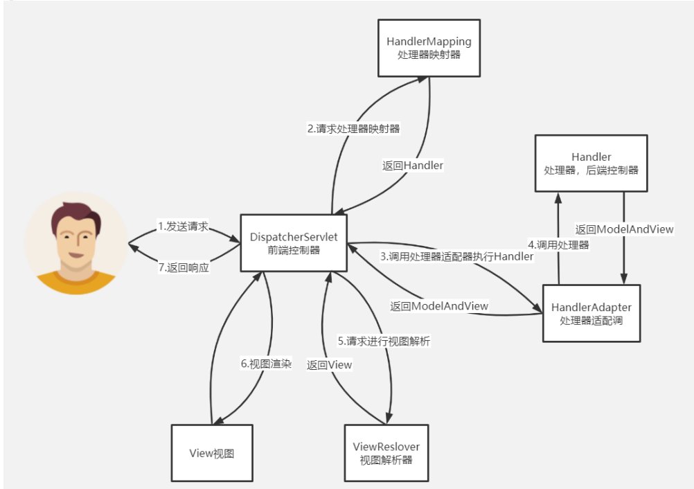
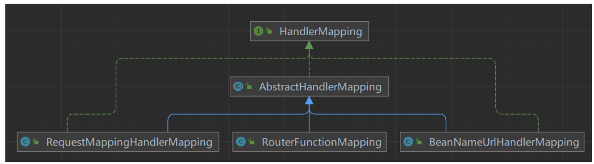

# Spring MVC启动流程与请求处理

1、Spring MVC处理请求的基本流程分析

2、Spring MVC容器启动过程

3、三种HandlerMapping的作用与源码实现

4、四种HandlerAdapter的作用与源码实现

5、方法参数解析器的作用及源码实现

6、方法返回值处理器的作用及源码实现

7、四种Handler的作用与源码实现


## Spring MVC处理请求的基本流程分析

Spring MVC 是围绕前端控制器模式设计的，其中：中央 Servlet DispatcherServlet 为 请求处理流程提供统一调度，实际工作则交给可配置组件执行。这个模型是灵活的且开 放的，我们可以通过自己去定制这些组件从而进行定制自己的工作流。



1. 用户发送请求至前端控制器DispatcherServlet 
2.  DispatcherServlet收到请求调用处理器映射器HandlerMapping。
   1. a. 处理器映射器根据请求url找到具体的处理器，生成处理器 执行链HandlerExecutionChain(包括处理器对象和处理器拦 截器)一并返回给DispatcherServlet。
3. DispatcherServlet根据处理器Handler获取处理器适配器 HandlerAdapter,执行HandlerAdapter处理一系列的操作，如：参数封 装，数据格式转换，数据验证等操作 
4.  执行处理器Handler(Controller，也叫页面控制器)。
5. Handler执行完成返回ModelAndView
6. HandlerAdapter将Handler执行结果ModelAndView返 回到DispatcherServlet
7. DispatcherServlet将ModelAndView传给ViewReslover视图解析器
8. ViewReslover解析后返回具体View
9. DispatcherServlet对View进行渲染视图（即将模型数据model填充至视 图中）
10. DispatcherServlet响应用户。

## Spring MVC容器启动过程

传统SSM项目中，web.xml中都会配置DispatcherServlet

```xml
<web-app>

    <servlet>
        <servlet-name>app</servlet-name>
        <servlet-class>org.springframework.web.servlet.DispatcherServlet</servlet-class>
        <init-param>
            <param-name>contextConfigLocation</param-name>
            <param-value>/WEB-INF/spring.xml</param-value>
        </init-param>
        <load-on-startup>1</load-on-startup>
    </servlet>

    <servlet-mapping>
        <servlet-name>app</servlet-name>
        <url-pattern>/app/*</url-pattern>
    </servlet-mapping>

</web-app>
```

在tomcat启动过程中，**加载web.xml,  创建DispatcherServlet(需要配置startUpOnload参数)， 并 调用DispatcherServlet#init方法**；


而在init()方法中，会创建一个Spring容器，并且添加一个ContextRefreshListener监听器，该监听器会监听ContextRefreshedEvent事件（Spring容器启动完成后就会发布这个事件），也就是说Spring容器启动完成后，就会执行ContextRefreshListener中的onApplicationEvent()方法，从而最终会执行DispatcherServlet中的initStrategies()，这个方法中会初始化更多内容：

```java
protected void initStrategies(ApplicationContext context) {
    initMultipartResolver(context);
    initLocaleResolver(context);
    initThemeResolver(context);

    initHandlerMappings(context);
    initHandlerAdapters(context);

    initHandlerExceptionResolvers(context);
    initRequestToViewNameTranslator(context);
    initViewResolvers(context);
    initFlashMapManager(context);
}
```

最为核心的就是**HandlerMapping**和**HandlerAdapter**。


### Handler

请求处理器， SpringMVC中存在四种Handler;

1. 实现了Controller接口的Bean对象；

2. 实现了HttpRequestHandler接口的Bean对象；

3. 被@PostMapping注解标记的方法；

4. 一个HandlerFunction对象

   ```java
   @ComponentScan("com.zhouyu")
   @Configuration
   public class AppConfig {
   
       @Bean
       public RouterFunction<ServerResponse> person() {
           return route()
                   .GET("/app/person", request -> ServerResponse.status(HttpStatus.OK).body("Hello GET"))
                   .POST("/app/person", request -> ServerResponse.status(HttpStatus.OK).body("Hello POST"))
                   .build();
       }
       
   }	
   ```

   


## HandlerMapping

HandlerMapping负责去寻找Handler，并且保存路径和Handler之间的映射关系。


因为有不同类型的Handler，所以在SpringMVC中会由不同的HandlerMapping来负责寻找Handler，比如：

1. **BeanNameUrlHandlerMapping：负责Controller接口和HttpRequestHandler接口**
2. **RequestMappingHandlerMapping：负责@RequestMapping的方法**
3. **RouterFunctionMapping：负责RouterFunction以及其中的HandlerFunction**


#### BeanNameUrlHandlerMapping扫描过程

1. 找出Spring容器中所有的beanName
2. 判断beanName是不是以“/”开头
3. 如果是，则把它当作一个Handler，并把beanName作为key，bean对象作为value存入**handlerMap**中
4. handlerMap就是一个Map

#### RequestMappingHandlerMapping扫描过程

1. **扫描所有的Bean对象；**
2. **bean的Class过滤、过滤条件为Bean Class上包含@Controller， @PostMapping注解；**
3. **遍历Bean的所有方法，找到加了@PostMapping的Method**
4. **解析@PostMapping， 封装为RequestMappingInfo;**
5. **以url为key, RequestMappingInfo为value, 放入Map属性urlLookUp;**
6. **以RequestMappingInfo为Key,  HandlerMethod为value, 放入Map属性mappingLookUp;**
7. **以RequestMappingInfo为key,  包装path, HandlerMethod的对象MappingRegistration为value, 放入Map属性registry**


#### HandlerMapping#getHandler

各种HandlerMapping 不仅要找Handler与请求的映射关系， 还要提供根据请求路径获取Handler的方法；上述HandlerMapping都有共同父类AbstractHandlerMapping



获取handler过程：

1. 该类中定义getHandler方法， 定义了抽象方法getInternalHandler， 由子类实现；
2. 调用完getInternalHandler后，AbstractHandlerMapping会获取拦截器， 将handler和拦截器包装为HandlerExecutorChain执行器链；

寻找handler并不复杂， 因为在容器启动时，就已经将url与handler的映射创建了，因此根据url获取handler即可；

细节地方：

```java
//DispatcherServlet#getHandler
@Nullable
protected HandlerExecutionChain getHandler(HttpServletRequest request) throws Exception {
   if (this.handlerMappings != null) {
      for (HandlerMapping mapping : this.handlerMappings) {
         HandlerExecutionChain handler = mapping.getHandler(request);
         if (handler != null) {
            return handler;
         }
      }
   }
   return null;
}
```

**HandlerMapping的查询handler优先级：根据DispatcherServlet.properties定义的顺序**

```properties
org.springframework.web.servlet.HandlerMapping=org.springframework.web.servlet.handler.BeanNameUrlHandlerMapping,\
   org.springframework.web.servlet.mvc.method.annotation.RequestMappingHandlerMapping,\
   org.springframework.web.servlet.function.support.RouterFunctionMapping
```

即BeanNameUrlHandlerMapping > RequestMappingHandlerMapping >RouterFunctionMapping

场景如下：

实现Controller接口的处理器请求路径为/test,  基于@PostMapping的接口请求路径为/test, 则最终执行的是 实现Controller接口的处理器；


## **HandlerAdapter**

处理器适配器，在通过getHandler拿到处理器后， 接下来就需要执行处理器， SpringMVC存在四种处理器适配器，分别处理不同种类的处理器；

1. HttpRequestHandlerAdapter ：
   - 处理实现了HttpRequestHandler接口的处理器, 调用HttpRequestHandler#handleRequest()方法
2. SimpleControllerHandlerAdapter
   - 处理实现了Controller接口的处理器， 调用Controller#handleRequest()方法
3. HandlerMappingHandlerAdapter ： 
   - 处理@PostMapping的方法处理器， 反射调用Method方法
4. HandlerFunctionAdapter ： 
   - 处理返回值为HandlerFunction的处理器；调用HandlerFunction#handle()方法


执行处理器的伪代码逻辑：

```java
Object handler = mappedHandler.getHandler();
if (handler instanceof Controller) {
    ((Controller)handler).handleRequest(request, response);
} else if (handler instanceof HttpRequestHandler) {
    ((HttpRequestHandler)handler).handleRequest(request, response);
} else if (handler instanceof HandlerMethod) {
    ((HandlerMethod)handler).getMethod().invoke(...);
} else if (handler instanceof HandlerFunction) {
    ((HandlerFunction)handler).handle(...);
}
```

这种多个if， 可以通过适配器/策略模式减少if；

但是SpringMVC并不是这么写的，还是采用的**适配模式**，把不同种类的Handler适配成一个HandlerAdapter，后续再执行HandlerAdapter的handle()方法就能执行不同种类Hanlder对应的方法。


### DispatcherServlet#getHandlerAdapter

```java
protected HandlerAdapter getHandlerAdapter(Object handler) throws ServletException {
   if (this.handlerAdapters != null) {
      for (HandlerAdapter adapter : this.handlerAdapters) {
         if (adapter.supports(handler)) {
            return adapter;
         }
      }
   }
   throw new ServletException("No adapter for handler [" + handler +
         "]: The DispatcherServlet configuration needs to include a HandlerAdapter that supports this handler");
}
```

传入Handler，判断四种HandlerAdapter哪种支持该handler;

```java
@Override
public boolean supports(Object handler) {
   return (handler instanceof HttpRequestHandler);
}

@Override
public boolean supports(Object handler) {
   return (handler instanceof Controller);
}

@Override
public final boolean supports(Object handler) {
   return (handler instanceof HandlerMethod && supportsInternal((HandlerMethod) handler));
}

@Override
public boolean supports(Object handler) {
   return handler instanceof HandlerFunction;
}
```

通过getHandlerAdapter方法获取到HandlerAdapter后，就要执行具体HandlerAdapter对象的handle()方法了

### HandlerAdapter#handle

- HttpRequestHandlerAdapter#handle

```java
@Override
@Nullable
public ModelAndView handle(HttpServletRequest request, HttpServletResponse response, Object handler)
      throws Exception {

   ((HttpRequestHandler) handler).handleRequest(request, response);
   return null;
}
```

- SimpleControllerHandlerAdapter#handle

```java
@Override
@Nullable
public ModelAndView handle(HttpServletRequest request, HttpServletResponse response, Object handler)
      throws Exception {

   return ((Controller) handler).handleRequest(request, response);
}
```

- HandlerFunctionAdapter#handle

```java
@Nullable
@Override
public ModelAndView handle(HttpServletRequest servletRequest,
      HttpServletResponse servletResponse,
      Object handler) throws Exception {

   HandlerFunction<?> handlerFunction = (HandlerFunction<?>) handler;

   ServerRequest serverRequest = getServerRequest(servletRequest);
   ServerResponse serverResponse = handlerFunction.handle(serverRequest);

   return serverResponse.writeTo(servletRequest, servletResponse,
         new ServerRequestContext(serverRequest));
}
```


- RequestMappingHandlerAdapter，它执行@RequestMapping的方法，而这种方法的写法可以是多种多样，SpringMVC需要根据方法的定义去解析Request参数，从请求中获取出对应的数据然后传递给方法，并执行。


#### **RequestMapping方法参数解析**

当SpringMVC接收到请求，并找到了对应的Method之后，就要执行该方法了，不过在执行之前需要根据方法定义的参数信息，从请求中获取出对应的数据，然后将数据传给方法并执行。

参数信息格式：

- @RequestParam

- @RequestPart

- @RequestBody

- @PathVariable

- @RequestHeader

  ....

源码中，不同类型的参数对应不同的方法参数处理器，对应为：

- RequestParamMethodArgumentResolver  ==> @RequestParam

- RequestPartMethodArgumentResovler  ==> @RequestPart

- RequestReponseBodyMethodProcessor ==> @RequestBody

- PathVariableMethodArgumentResolver ==> @PathVariable

- RequestHeaderMethodArgumentResolver ==> @RequestHeader

  ....参数处理器还有很多种，这几个是开发常见注解；


**源码中获取方法参数处理器，遍历所有的HandlerMethodArgumentResolver#supportParameter()，哪个能支持处理当前这个参数就由哪个处理**。并使用本地缓存，下次从argumentResolverCache先获取，不再需要遍历；

```java
@Nullable
private HandlerMethodArgumentResolver getArgumentResolver(MethodParameter parameter) {
   HandlerMethodArgumentResolver result = this.argumentResolverCache.get(parameter);
   if (result == null) {
      for (HandlerMethodArgumentResolver resolver : this.argumentResolvers) {
         if (resolver.supportsParameter(parameter)) {
            result = resolver;
            this.argumentResolverCache.put(parameter, result);
            break;
         }
      }
   }
   return result;
}
```


```java
@RequestMapping(method = RequestMethod.GET, path = "/test")
@ResponseBody
public String test(@RequestParam @SessionAttribute String username) {
    System.out.println(username);
    return "zhouyu";
}
```

由于RequestRaramMethodArgumentResovler比SessionAttributeMethodArgumentResolver更靠前，因此由RequestParamMethodArgumentResolver处理；


**在获取方法参数解析器后，要根据方法参数从Request中获取参数数据了， 对应MethodArgumentResolver#resolveArgument()**;

如RequestParamMethodArgumentResolver#resovleArgument()， 本质就是调用request.getParameterValues获取参数值；

```java
@Override
@Nullable
protected Object resolveName(String name, MethodParameter parameter, NativeWebRequest request) throws Exception {
   HttpServletRequest servletRequest = request.getNativeRequest(HttpServletRequest.class);

   //...省略MultipartFile的解析；
   if (arg == null) {
      String[] paramValues = request.getParameterValues(name);
      if (paramValues != null) {
         arg = (paramValues.length == 1 ? paramValues[0] : paramValues);
      }
   }
   return arg;
}
```


拿到这个值后，就可以通过Method.invoke(obj, arg)方式，执行处理器， 执行结束需要对返回值进行处理；

### @RequestMapping方法返回值解析

返回值有多种不同的情况， SpringMVC使用ReturnValueHandler返回值处理器处理返回值；

- RequestResponseBodyMethodProcessor ： 处理@ResponseBody注解；
- MapMethodProcessor ： 处理Map返回值
- ModelAndViewMethodReturnValueHandler： 处理ModelAndView返回值
- ModelMethodProcessor： 处理Model返回值
- ViewNameMethodReturnValueHandler：处理String返回值


若方法上加了@ResponseBody, 且返回值为String, 则交由RequestResponseBodyMethodProcessor 将String返回值直接返回；

若方法上没有@ResponseBody， 且返回值为String, 则交由ViewNameMethodReturnValueHandler处理， 则是设置视图名， 通过视图解析器找到视图， 再进行视图渲染，最后返回；

### HttpMessageConverter

RequestResponseBodyMethodProcessor相当于会把方法返回的对象直接响应给浏览器，如果返回的是一个字符串，那么好说，直接把字符串响应给浏览器，那如果返回的是一个Map呢？是一个User对象呢？该怎么把这些复杂对象响应给浏览器呢？

SpringMVC通过HttpMessageConverter将返回值返回给浏览器，SpringMVC默认存在四种消息转换器 ，存在多种HttpMessageConverter分别处理；

1. ByteArrayHttpMessageConverter ：处理Byte[] 写入响应流
2. StringHttpMessageConverter：处理String 写入响应流
3. SourceHttpMessageConverter ：处理XML的Source,StreamSource等写入响应流
4. AllEncompassingFormHttpMessageConverter：处理返回值为**MultiValueMap对象**的情况


StringHttpMessageConverter：将String写入响应流；

```java
@Override
protected void writeInternal(String str, HttpOutputMessage outputMessage) throws IOException {
   HttpHeaders headers = outputMessage.getHeaders();
   if (this.writeAcceptCharset && headers.get(HttpHeaders.ACCEPT_CHARSET) == null) {
      headers.setAcceptCharset(getAcceptedCharsets());
   }
   Charset charset = getContentTypeCharset(headers.getContentType());
   StreamUtils.copy(str, charset, outputMessage.getBody());
}
```

先看有没有设置Content-Type，如果没有设置则取默认的，默认为ISO-8859-1，所以默认情况下返回中文会乱码，可以通过以下来中方式来解决：

```java
@ComponentScan("com.zhouyu")
@Configuration
@EnableWebMvc
public class AppConfig implements WebMvcConfigurer {

    @Override
    public void configureMessageConverters(List<HttpMessageConverter<?>> converters) {
        StringHttpMessageConverter messageConverter = new StringHttpMessageConverter();
        messageConverter.setDefaultCharset(StandardCharsets.UTF_8);
        converters.add(messageConverter);
    }
}
```

不过以上四个Converter是不能处理Map对象或User对象的，所以如果返回的是Map或User对象，那么得单独配置一个Converter，如MappingJackson2HttpMessageConverter，这个Converter比较强大，能把String、Map、User对象等等都能转化成JSON格式。

```java
@ComponentScan("com.zhouyu")
@Configuration
@EnableWebMvc
public class AppConfig implements WebMvcConfigurer {

    @Override
    public void configureMessageConverters(List<HttpMessageConverter<?>> converters) {
        MappingJackson2HttpMessageConverter messageConverter = new MappingJackson2HttpMessageConverter();
        messageConverter.setDefaultCharset(StandardCharsets.UTF_8);
        converters.add(messageConverter);
    }
}
```

具体转化的逻辑就是Jackson2的转化逻辑。


### HttpMessageConverter与浏览器内容协商

浏览器发请求时，accept请求头申明了相应的内容格式， 因此SpringMVC需要根据服务能力返回响应的内容格式；

```java
//RequestResponseBodyMethodProcessor#handleResturnValue
@Override
public void handleReturnValue(@Nullable Object returnValue, MethodParameter returnType,
      ModelAndViewContainer mavContainer, NativeWebRequest webRequest)
      throws IOException, HttpMediaTypeNotAcceptableException, HttpMessageNotWritableException {

   mavContainer.setRequestHandled(true);
   ServletServerHttpRequest inputMessage = createInputMessage(webRequest);
   ServletServerHttpResponse outputMessage = createOutputMessage(webRequest);

   // Try even with null return value. ResponseBodyAdvice could get involved.
   writeWithMessageConverters(returnValue, returnType, inputMessage, outputMessage);
}
```

```java
protected <T> void writeWithMessageConverters(@Nullable T value, MethodParameter returnType,
      ServletServerHttpRequest inputMessage, ServletServerHttpResponse outputMessage)
      throws IOException, HttpMediaTypeNotAcceptableException, HttpMessageNotWritableException {

//...

   MediaType selectedMediaType = null;
   MediaType contentType = outputMessage.getHeaders().getContentType();
   boolean isContentTypePreset = contentType != null && contentType.isConcrete();
   if (isContentTypePreset) {
      if (logger.isDebugEnabled()) {
         logger.debug("Found 'Content-Type:" + contentType + "' in response");
      }
      selectedMediaType = contentType;
   }
   else {
      HttpServletRequest request = inputMessage.getServletRequest();
      List<MediaType> acceptableTypes = getAcceptableMediaTypes(request);
      List<MediaType> producibleTypes = getProducibleMediaTypes(request, valueType, targetType);

//...
      //执行内容协商， Accept的MediaType 与 HttpMessageConverter的MediaType进行匹配；
      List<MediaType> mediaTypesToUse = new ArrayList<>();
      for (MediaType requestedType : acceptableTypes) {
         for (MediaType producibleType : producibleTypes) {
            if (requestedType.isCompatibleWith(producibleType)) {
               mediaTypesToUse.add(getMostSpecificMediaType(requestedType, producibleType));
            }
         }
      }
//...
	  //排序
      MediaType.sortBySpecificityAndQuality(mediaTypesToUse);
	  //拿到第一个
      for (MediaType mediaType : mediaTypesToUse) {
         if (mediaType.isConcrete()) {
            selectedMediaType = mediaType;
            break;
         }
//...
      }
//...
   }
   //利用HttpMessageConverter写入响应流
   if (selectedMediaType != null) {
      selectedMediaType = selectedMediaType.removeQualityValue();
      for (HttpMessageConverter<?> converter : this.messageConverters) {
         GenericHttpMessageConverter genericConverter = (converter instanceof GenericHttpMessageConverter ?
               (GenericHttpMessageConverter<?>) converter : null);
         if (genericConverter != null ?
               ((GenericHttpMessageConverter) converter).canWrite(targetType, valueType, selectedMediaType) :
               converter.canWrite(valueType, selectedMediaType)) {
            body = getAdvice().beforeBodyWrite(body, returnType, selectedMediaType,
                  (Class<? extends HttpMessageConverter<?>>) converter.getClass(),
                  inputMessage, outputMessage);
            if (body != null) {
               Object theBody = body;
               LogFormatUtils.traceDebug(logger, traceOn ->
                     "Writing [" + LogFormatUtils.formatValue(theBody, !traceOn) + "]");
               addContentDispositionHeader(inputMessage, outputMessage);
               if (genericConverter != null) {
                  genericConverter.write(body, targetType, selectedMediaType, outputMessage);
               }
               else {
                  ((HttpMessageConverter) converter).write(body, selectedMediaType, outputMessage);
               }
            }
            return;
         }
      }
   }

//...
}
```

内容协商原理：

1. 获取客户端支持的内容格式类型；
   1. 获取请求头中的Accept字段值
   2. contentNegotiationManager：内容协商管理器， 默认使用请求头的内容协商策略；
   3. HeaderContentNegotiationStrategy：请求头内容协商策略， 调用request.getHeader("Accept")获取客户端支持的内容格式类型；
2. 获取服务端支持的内容格式类型；
   1. 遍历所有的HttpMessageConverter, 调用canWrite方法判断当前消息转换器是否支持返回值类型Class的处理；如果支持，则拿到媒体类型MediaType
3. 客户端需要application/xml，服务端有10种MediaType（4个json, 6个xml）。
4. 进行内容协商的最佳匹配媒体类型
5. 用 支持 将对象转为 最佳匹配媒体类型 的converter。调用它进行转化 ；