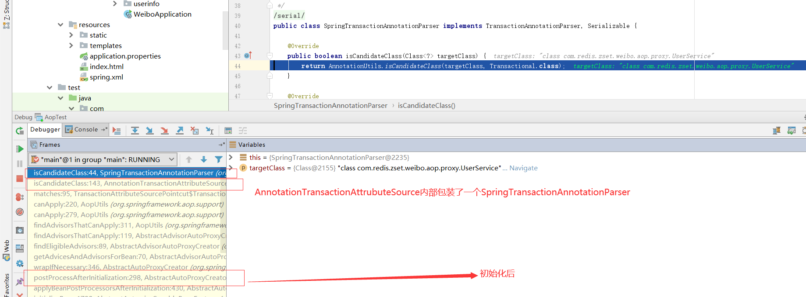
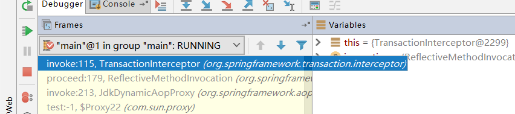

# Spring-事务源码分析

## @EnableTransactionManagement工作原理

```java
@Import(TransactionManagementConfigurationSelector.class)
public @interface EnableTransactionManagement {}

public class TransactionManagementConfigurationSelector extends AdviceModeImportSelector<EnableTransactionManagement> {

   @Override
   protected String[] selectImports(AdviceMode adviceMode) {
      switch (adviceMode) {
         case PROXY:
            return new String[] {AutoProxyRegistrar.class.getName(),
                  ProxyTransactionManagementConfiguration.class.getName()};
         case ASPECTJ:
            return new String[] {determineTransactionAspectClass()};
         default:
            return null;
      }
   }
}
```

导入了TransactionManagementConfigurationSelector类, 解析@Import注解时，TransactionManagementConfigurationSelector类型为ImportSelector， 因此会调用selectImport，导入AutoProxyRegistrar，ProxyTransactionManagementConfiguration进容器；

- AutoProxyRegistrar

实现ImportBeanDefinitionRegistrar,  会执行registerBeanDefinition方法，最终往BeanDefinitionMap放入了InfrastructureAdvisorAutoProxyCreator， 该类实现了AbstractAdvisorAutoProxyCreator， 拥有AOP的功能；

注意： 如果容器中开启了AspectJ则不会将InfrastructureAdvisorAutoProxyCreator放入BeanDefinitionMap, 因为存在集合APC_PRIORITY_LIST， AspectJAwareAdvisorAutoProxyCreator优先级高于InfrastructureAdvisorAutoProxyCreator

原因：**如果开启了AspectJ, 会从BeanDefinitionMap中获取AUTO_PROXY_CREATOR_BEAN_NAME的BeanDefinition, 获取到AspectJAwareAdvisorAutoProxyCreator后， 判断AspectJAwareAdvisorAutoProxyCreator与InfrastructureAdvisorAutoProxyCreator优先级，前者索引值为2， 后者为1， 因此前者大于后者， 最终InfrastructureAdvisorAutoProxyCreator没有放入BeanFactory**

```java
static {
   // Set up the escalation list...
   APC_PRIORITY_LIST.add(InfrastructureAdvisorAutoProxyCreator.class);
   APC_PRIORITY_LIST.add(AspectJAwareAdvisorAutoProxyCreator.class);
   APC_PRIORITY_LIST.add(AnnotationAwareAspectJAutoProxyCreator.class);
}

@Nullable
public static BeanDefinition registerAutoProxyCreatorIfNecessary(
      BeanDefinitionRegistry registry, @Nullable Object source) {
   return registerOrEscalateApcAsRequired(InfrastructureAdvisorAutoProxyCreator.class, registry, source);
}

@Nullable
private static BeanDefinition registerOrEscalateApcAsRequired(
      Class<?> cls, BeanDefinitionRegistry registry, @Nullable Object source) {

   if (registry.containsBeanDefinition(AUTO_PROXY_CREATOR_BEAN_NAME)) {
      BeanDefinition apcDefinition = registry.getBeanDefinition(AUTO_PROXY_CREATOR_BEAN_NAME);
      if (!cls.getName().equals(apcDefinition.getBeanClassName())) {
         int currentPriority = findPriorityForClass(apcDefinition.getBeanClassName());
         int requiredPriority = findPriorityForClass(cls);
         if (currentPriority < requiredPriority) {
            apcDefinition.setBeanClassName(cls.getName());
         }
      }
      return null;
   }

   RootBeanDefinition beanDefinition = new RootBeanDefinition(cls);
   beanDefinition.setSource(source);
   beanDefinition.getPropertyValues().add("order", Ordered.HIGHEST_PRECEDENCE);
   beanDefinition.setRole(BeanDefinition.ROLE_INFRASTRUCTURE);
   registry.registerBeanDefinition(AUTO_PROXY_CREATOR_BEAN_NAME, beanDefinition);
   return beanDefinition;
}

@Nullable
public static BeanDefinition registerAspectJAutoProxyCreatorIfNecessary(
      BeanDefinitionRegistry registry, @Nullable Object source) {
   return registerOrEscalateApcAsRequired(AspectJAwareAdvisorAutoProxyCreator.class, registry, source);
}
```


- ProxyTransactionManagementConfiguration

  - Advisor: BeanFactoryTransactionAttributeSourceAdvisor类型；

  - Advice： TransactionInterceptor， 事务拦截器，即封装了事务的基本逻辑；

  - 工具类：TransactionAttributeSource ， 用来解析@Transactional注解；

    - 疑问点：Advisor需要PointCut来判断是否要执行创建AOP代理对象，那么事务Advisor的PointCut如何设置？

    - ```java
      public class BeanFactoryTransactionAttributeSourceAdvisor extends AbstractBeanFactoryPointcutAdvisor {
      
         @Nullable
         private TransactionAttributeSource transactionAttributeSource;
      
         private final TransactionAttributeSourcePointcut pointcut = new TransactionAttributeSourcePointcut() {
            @Override
            @Nullable
            protected TransactionAttributeSource getTransactionAttributeSource() {
               return transactionAttributeSource;
            }
         };
      }
      ```

    - 在创建Advisor时， 会创建一个私有的属性pointcut, 类型为TransactionAttributeSourcePointcut；

  - TransactionAttributeSourcePointcut ： 切点，用来判断是否要执行事务增强操作；

    - 创建对象时， 会往classFilter中放入TransactionAttributeSourceClassFilter对象

    - TransactionAttributeSourceClassFilter ：会利用TransactionAttributeSource 判断@Transational是否存在；

      ```java
      @Override
      public boolean isCandidateClass(Class<?> targetClass) {
         return AnnotationUtils.isCandidateClass(targetClass, Transactional.class);
      }
      ```

    

	## 事务代理对象创建



若类或者方法存在@Transaction， 就会创建AOP代理对象；


## 事务执行流程

Advisor中，advice定义增强逻辑， TransactionInterceptor封装了事务执行源码；

1. 获取事务注解信息
2. 获取事务管理器
4. 创建或获取事务
5. 执行目标的SQL， 若该目标也是动态对象，则会执行其他的代理逻辑；
6. 出现异常，则回滚、否则提交



```java
@Override
@Nullable
public Object invoke(MethodInvocation invocation) throws Throwable {
   Class<?> targetClass = (invocation.getThis() != null ? AopUtils.getTargetClass(invocation.getThis()) : null);

   // Adapt to TransactionAspectSupport's invokeWithinTransaction...
   return invokeWithinTransaction(invocation.getMethod(), targetClass, invocation::proceed);
}
```

```java
@Nullable
protected Object invokeWithinTransaction(Method method, @Nullable Class<?> targetClass,
      final InvocationCallback invocation) throws Throwable {
	//拿到@Transaction注解信息
   TransactionAttributeSource tas = getTransactionAttributeSource();
   final TransactionAttribute txAttr = (tas != null ? tas.getTransactionAttribute(method, targetClass) : null);
    //拿到事务管理器
   final TransactionManager tm = determineTransactionManager(txAttr);

	//省略kotlin代码
   PlatformTransactionManager ptm = asPlatformTransactionManager(tm);
   
    //拿到方法名称
   final String joinpointIdentification = methodIdentification(method, targetClass, txAttr);

   if (txAttr == null || !(ptm instanceof CallbackPreferringPlatformTransactionManager)) {
      // 创建事务
      TransactionInfo txInfo = createTransactionIfNecessary(ptm, txAttr, joinpointIdentification);

      Object retVal;
      try {
          //执行下一个代理逻辑，若无代理，则是执行目标SQL
         retVal = invocation.proceedWithInvocation();
      }
      catch (Throwable ex) {
         //方法执行异常，抛出异常
         completeTransactionAfterThrowing(txInfo, ex);
         throw ex;
      }
      finally {
          //清空事务信息
         cleanupTransactionInfo(txInfo);
      }

      if (retVal != null && vavrPresent && VavrDelegate.isVavrTry(retVal)) {
         // Set rollback-only in case of Vavr failure matching our rollback rules...
         TransactionStatus status = txInfo.getTransactionStatus();
         if (status != null && txAttr != null) {
            retVal = VavrDelegate.evaluateTryFailure(retVal, txAttr, status);
         }
      }
	 //提交事务、回滚事务
      commitTransactionAfterReturning(txInfo);
      return retVal;
   }

   else {
  	//...省略部分代码 
   }
}
```

```java
protected TransactionInfo createTransactionIfNecessary(@Nullable PlatformTransactionManager tm,
      @Nullable TransactionAttribute txAttr, final String joinpointIdentification) {

   TransactionStatus status = null;
   if (txAttr != null) {
      if (tm != null) {
         status = tm.getTransaction(txAttr);
      }
      }
   }
   return prepareTransactionInfo(tm, txAttr, joinpointIdentification, status);
}
```

创建或获取事务

1. 获取事务对象；

   - 创建事务对象；

   - 从事务同步管理器TransactionSynchronizationManager获取数据库连接对象ConnectionHolder；
   - 设置ConnectionHolder给事务对象；

2. 若存在事务，则存在数据库连接

   - 若事务传播行为是PROPAGATION_NEVER， 则抛出异常；
   - 若事务传播行为是PROPAGATION_NOT_SUPPORTED， 则将当前事务挂起，使用JDBC连接， 返回；
   - 若事务传播行为是PROPAGATION_REQUIRES_NEW， 则将当前事务挂起， 新创建事务，返回；
   - 若事务传播行为是PROPAGATION_NESTED， 则创建保存点，返回；

3. 若不存在事务，则

   - 若事务传播行为是PROPAGATION_MANDATORY， 则抛出异常；

   - 若事务传播行为是TransactionDefinition.PROPAGATION_REQUIRED，或者TransactionDefinition.PROPAGATION_REQUIRES_NEW ，或者TransactionDefinition.PROPAGATION_NESTED；

     - 挂起null的事务;
   - 开始事务
     
     - 创建数据库连接doBegin()
         - 从事务对象DataSourceTransactionObject中获取数据库连接；
         - 若是数据库连接conn不存在，则通过数据源获取一条数据库连接conn, 并重新设置事务对象的数据库连接对象；
         - 取消事务自动提交；
         - 以数据源dateSource为key, 数据库连接为value, 放入ThreadLocal对象resources;
       - 根据初始化事务同步
         - 往ThreadLocal对象actualTransactionActive设值， 代表事务是否激活；
         - 往ThreadLocal对象currentTransactionIsolationLevel设置， 表示当前事务的隔离级别；
         - 往ThreadLocal对象currentTransactionReadOnly设值， 表示事务是否为只读；
         - 往ThreadLcoal对象currentTransactionName设值，表示当前事务名称；
         - 往ThreadLocal对象synchronizations设置同步器，可用于回调；
     


```java
@Override
public final TransactionStatus getTransaction(@Nullable TransactionDefinition definition)
      throws TransactionException {

   // Use defaults if no transaction definition given.
   TransactionDefinition def = (definition != null ? definition : TransactionDefinition.withDefaults());

   Object transaction = doGetTransaction();
   boolean debugEnabled = logger.isDebugEnabled();

   if (isExistingTransaction(transaction)) {
      // Existing transaction found -> check propagation behavior to find out how to behave.
      return handleExistingTransaction(def, transaction, debugEnabled);
   }

   // Check definition settings for new transaction.
   if (def.getTimeout() < TransactionDefinition.TIMEOUT_DEFAULT) {
      throw new InvalidTimeoutException("Invalid transaction timeout", def.getTimeout());
   }

   // No existing transaction found -> check propagation behavior to find out how to proceed.
   if (def.getPropagationBehavior() == TransactionDefinition.PROPAGATION_MANDATORY) {
      throw new IllegalTransactionStateException(
            "No existing transaction found for transaction marked with propagation 'mandatory'");
   }
   else if (def.getPropagationBehavior() == TransactionDefinition.PROPAGATION_REQUIRED ||
         def.getPropagationBehavior() == TransactionDefinition.PROPAGATION_REQUIRES_NEW ||
         def.getPropagationBehavior() == TransactionDefinition.PROPAGATION_NESTED) {
      SuspendedResourcesHolder suspendedResources = suspend(null);
      if (debugEnabled) {
         logger.debug("Creating new transaction with name [" + def.getName() + "]: " + def);
      }
      try {
         return startTransaction(def, transaction, debugEnabled, suspendedResources);
      }
      catch (RuntimeException | Error ex) {
         resume(null, suspendedResources);
         throw ex;
      }
   }
   else {
      boolean newSynchronization = (getTransactionSynchronization() == SYNCHRONIZATION_ALWAYS);
      return prepareTransactionStatus(def, null, true, newSynchronization, debugEnabled, null);
   }
}

@Override
protected Object doGetTransaction() {
   DataSourceTransactionObject txObject = new DataSourceTransactionObject();
   txObject.setSavepointAllowed(isNestedTransactionAllowed());
   ConnectionHolder conHolder =
         (ConnectionHolder) TransactionSynchronizationManager.getResource(obtainDataSource());
   txObject.setConnectionHolder(conHolder, false);
   return txObject;
}
```

```java
private TransactionStatus startTransaction(TransactionDefinition definition, Object transaction,
      boolean debugEnabled, @Nullable SuspendedResourcesHolder suspendedResources) {

   boolean newSynchronization = (getTransactionSynchronization() != SYNCHRONIZATION_NEVER);
   DefaultTransactionStatus status = newTransactionStatus(
         definition, transaction, true, newSynchronization, debugEnabled, suspendedResources);
   doBegin(transaction, definition);
   prepareSynchronization(status, definition);
   return status;
}
```

```java
protected void doBegin(Object transaction, TransactionDefinition definition) {
    DataSourceTransactionManager.DataSourceTransactionObject txObject = (DataSourceTransactionManager.DataSourceTransactionObject)transaction;
    Connection con = null;

    try {
        if (!txObject.hasConnectionHolder() || txObject.getConnectionHolder().isSynchronizedWithTransaction()) {
            Connection newCon = this.obtainDataSource().getConnection();
            if (this.logger.isDebugEnabled()) {
                this.logger.debug("Acquired Connection [" + newCon + "] for JDBC transaction");
            }

            txObject.setConnectionHolder(new ConnectionHolder(newCon), true);
        }

        txObject.getConnectionHolder().setSynchronizedWithTransaction(true);
        con = txObject.getConnectionHolder().getConnection();
        Integer previousIsolationLevel = DataSourceUtils.prepareConnectionForTransaction(con, definition);
        txObject.setPreviousIsolationLevel(previousIsolationLevel);
        txObject.setReadOnly(definition.isReadOnly());
        if (con.getAutoCommit()) {
            txObject.setMustRestoreAutoCommit(true);
            if (this.logger.isDebugEnabled()) {
                this.logger.debug("Switching JDBC Connection [" + con + "] to manual commit");
            }

            con.setAutoCommit(false);
        }

        this.prepareTransactionalConnection(con, definition);
        txObject.getConnectionHolder().setTransactionActive(true);
        int timeout = this.determineTimeout(definition);
        if (timeout != -1) {
            txObject.getConnectionHolder().setTimeoutInSeconds(timeout);
        }

        if (txObject.isNewConnectionHolder()) {
            TransactionSynchronizationManager.bindResource(this.obtainDataSource(), txObject.getConnectionHolder());
        }

    } catch (Throwable var7) {
    }
}
```

```java
	private static final ThreadLocal<Map<Object, Object>> resources =
			new NamedThreadLocal<>("Transactional resources");
/**
 * Bind the given resource for the given key to the current thread.
 * @param key the key to bind the value to (usually the resource factory)
 * @param value the value to bind (usually the active resource object)
 * @throws IllegalStateException if there is already a value bound to the thread
 * @see ResourceTransactionManager#getResourceFactory()
 */
public static void bindResource(Object key, Object value) throws IllegalStateException {
   Object actualKey = TransactionSynchronizationUtils.unwrapResourceIfNecessary(key);
   Assert.notNull(value, "Value must not be null");
   Map<Object, Object> map = resources.get();
   // set ThreadLocal Map if none found
   if (map == null) {
      map = new HashMap<>();
      resources.set(map);
   }
   Object oldValue = map.put(actualKey, value);
   // Transparently suppress a ResourceHolder that was marked as void...
   if (oldValue instanceof ResourceHolder && ((ResourceHolder) oldValue).isVoid()) {
      oldValue = null;
   }
   if (oldValue != null) {
      throw new IllegalStateException("Already value [" + oldValue + "] for key [" +
            actualKey + "] bound to thread [" + Thread.currentThread().getName() + "]");
   }
   if (logger.isTraceEnabled()) {
      logger.trace("Bound value [" + value + "] for key [" + actualKey + "] to thread [" +
            Thread.currentThread().getName() + "]");
   }
}
```

```java
protected void prepareSynchronization(DefaultTransactionStatus status, TransactionDefinition definition) {
   if (status.isNewSynchronization()) {
      TransactionSynchronizationManager.setActualTransactionActive(status.hasTransaction());
      TransactionSynchronizationManager.setCurrentTransactionIsolationLevel(
            definition.getIsolationLevel() != TransactionDefinition.ISOLATION_DEFAULT ?
                  definition.getIsolationLevel() : null);
      TransactionSynchronizationManager.setCurrentTransactionReadOnly(definition.isReadOnly());
      TransactionSynchronizationManager.setCurrentTransactionName(definition.getName());
      TransactionSynchronizationManager.initSynchronization();
   }
}
```

```java
/**
 * Create a TransactionStatus for an existing transaction.
 */
private TransactionStatus handleExistingTransaction(
      TransactionDefinition definition, Object transaction, boolean debugEnabled)
      throws TransactionException {

   if (definition.getPropagationBehavior() == TransactionDefinition.PROPAGATION_NEVER) {
      throw new IllegalTransactionStateException(
            "Existing transaction found for transaction marked with propagation 'never'");
   }

   if (definition.getPropagationBehavior() == TransactionDefinition.PROPAGATION_NOT_SUPPORTED) {
      if (debugEnabled) {
         logger.debug("Suspending current transaction");
      }
      Object suspendedResources = suspend(transaction);
      boolean newSynchronization = (getTransactionSynchronization() == SYNCHRONIZATION_ALWAYS);
      return prepareTransactionStatus(
            definition, null, false, newSynchronization, debugEnabled, suspendedResources);
   }

   if (definition.getPropagationBehavior() == TransactionDefinition.PROPAGATION_REQUIRES_NEW) {
      if (debugEnabled) {
         logger.debug("Suspending current transaction, creating new transaction with name [" +
               definition.getName() + "]");
      }
      SuspendedResourcesHolder suspendedResources = suspend(transaction);
      try {
         return startTransaction(definition, transaction, debugEnabled, suspendedResources);
      }
      catch (RuntimeException | Error beginEx) {
         resumeAfterBeginException(transaction, suspendedResources, beginEx);
         throw beginEx;
      }
   }

   if (definition.getPropagationBehavior() == TransactionDefinition.PROPAGATION_NESTED) {
      if (!isNestedTransactionAllowed()) {
         throw new NestedTransactionNotSupportedException(
               "Transaction manager does not allow nested transactions by default - " +
               "specify 'nestedTransactionAllowed' property with value 'true'");
      }
      if (debugEnabled) {
         logger.debug("Creating nested transaction with name [" + definition.getName() + "]");
      }
      if (useSavepointForNestedTransaction()) {
         // Create savepoint within existing Spring-managed transaction,
         // through the SavepointManager API implemented by TransactionStatus.
         // Usually uses JDBC 3.0 savepoints. Never activates Spring synchronization.
         DefaultTransactionStatus status =
               prepareTransactionStatus(definition, transaction, false, false, debugEnabled, null);
         status.createAndHoldSavepoint();
         return status;
      }
      else {
         // Nested transaction through nested begin and commit/rollback calls.
         // Usually only for JTA: Spring synchronization might get activated here
         // in case of a pre-existing JTA transaction.
         return startTransaction(definition, transaction, debugEnabled, null);
      }
   }

   // Assumably PROPAGATION_SUPPORTS or PROPAGATION_REQUIRED.
   if (debugEnabled) {
      logger.debug("Participating in existing transaction");
   }
   if (isValidateExistingTransaction()) {
      if (definition.getIsolationLevel() != TransactionDefinition.ISOLATION_DEFAULT) {
         Integer currentIsolationLevel = TransactionSynchronizationManager.getCurrentTransactionIsolationLevel();
         if (currentIsolationLevel == null || currentIsolationLevel != definition.getIsolationLevel()) {
            Constants isoConstants = DefaultTransactionDefinition.constants;
            throw new IllegalTransactionStateException("Participating transaction with definition [" +
                  definition + "] specifies isolation level which is incompatible with existing transaction: " +
                  (currentIsolationLevel != null ?
                        isoConstants.toCode(currentIsolationLevel, DefaultTransactionDefinition.PREFIX_ISOLATION) :
                        "(unknown)"));
         }
      }
      if (!definition.isReadOnly()) {
         if (TransactionSynchronizationManager.isCurrentTransactionReadOnly()) {
            throw new IllegalTransactionStateException("Participating transaction with definition [" +
                  definition + "] is not marked as read-only but existing transaction is");
         }
      }
   }
   boolean newSynchronization = (getTransactionSynchronization() != SYNCHRONIZATION_NEVER);
   return prepareTransactionStatus(definition, transaction, false, newSynchronization, debugEnabled, null);
}
```


### 事务传播行为

若方法A存在事务， 方法B也存在事务， A调用B时，就存在事务传播行为；

- B的事务传播行为是TransactionDefinition.REQUIRED, 则使用A的事务；

  - A、B事务执行异常，都回滚；同时提交，同时回滚

- B的事务传播行为是TransactionDefinition.REQUIRED_NEW， 挂起A的事务， B创建新的事务；

  - A事务异常，A回滚， B异常， B回滚；

- B的事务传播行为是TransactionDefinition.NEST, 在A事务中创建保存点， B的业务在保存点中执行；

- B的事务传播行为是TransactionDefinition.NEVER, 若A存在事务， 则抛出异常；

- B的事务传播行为是TransactionDefinition.MANDATORY, 若A不存在事务，要求A存在事务，否则抛出异常；

- B的事务传播行为是TransactionDefinition.NOT_SUPPORT, 若A存在事务， 则挂起A事务， 无事务执行B；

  

### 事务回滚

最终调用数据库连接的conn#rollback, 回滚操作；

### 事务提交

commitTransactionAfterReturning(txInfo)：

1. 触发同步器回调
2. 若是事务传播行为是NEST， 则释放保存点；
3. 若是新建的事务，执行提交commit操作，最终调用数据库连接conn#commit方法，提交事务；
4. 触发事务提交后回调；
5. 触发事务完成回调
6. 清理上下文的事务信息
   - 清除ThreadLocal对象synchronizations中的同步回调器；
   - 清除ThreadLocal独享currentTransactionName中的当前事务名称信息；
   - 清除ThreadLocal对象currentTransactionReadOnly的当前事务只读信息；
   - 清除ThreadLocal对象currentTransactionIsolationLevel的当前事务的隔离级别；
   - 清除ThreadLocal对象actualTransactionActive的当前事务激活状态信息
7. 若是存在挂起资源，即其他事务可能被挂起；
   - 重新将挂起事务与当前线程的ThreadLocal对象resouces时绑定
   - 重新设置ThreadLocal独享currentTransactionName中的事务名称为挂起事务名称
   - 重新设置ThreadLocal对象currentTransactionReadOnly的事务只读信息为挂起事务只读信息
   - 重新设置ThreadLocal对象currentTransactionIsolationLevel的事务的隔离级别为挂起事务的隔离级别
   - 重新设置除ThreadLocal对象actualTransactionActive的当前事务激活状态信息为挂起事务的激活状态

```java
protected void commitTransactionAfterReturning(@Nullable TransactionInfo txInfo) {
   if (txInfo != null && txInfo.getTransactionStatus() != null) {
      txInfo.getTransactionManager().commit(txInfo.getTransactionStatus());
   }
}
```

```java
@Override
public final void commit(TransactionStatus status) throws TransactionException {
   if (status.isCompleted()) {
      throw new IllegalTransactionStateException(
            "Transaction is already completed - do not call commit or rollback more than once per transaction");
   }

   DefaultTransactionStatus defStatus = (DefaultTransactionStatus) status;
   if (defStatus.isLocalRollbackOnly()) {
      processRollback(defStatus, false);
      return;
   }

   if (!shouldCommitOnGlobalRollbackOnly() && defStatus.isGlobalRollbackOnly()) {
      processRollback(defStatus, true);
      return;
   }

   processCommit(defStatus);
}
```

```java
private void processCommit(DefaultTransactionStatus status) throws TransactionException {
   try {
      boolean beforeCompletionInvoked = false;

      try {
         boolean unexpectedRollback = false;
         prepareForCommit(status);
          //触发回调
         triggerBeforeCommit(status);
         triggerBeforeCompletion(status);
         beforeCompletionInvoked = true;
		
          //释放nest的保存点；
         if (status.hasSavepoint()) {
            unexpectedRollback = status.isGlobalRollbackOnly();
            status.releaseHeldSavepoint();
         }
         else if (status.isNewTransaction()) {
            unexpectedRollback = status.isGlobalRollbackOnly();
            doCommit(status);
         }
         else if (isFailEarlyOnGlobalRollbackOnly()) {
            unexpectedRollback = status.isGlobalRollbackOnly();
         }
         if (unexpectedRollback) {
            throw new UnexpectedRollbackException(
                  "Transaction silently rolled back because it has been marked as rollback-only");
         }
      }
      catch (UnexpectedRollbackException ex) {
         // can only be caused by doCommit
         triggerAfterCompletion(status, TransactionSynchronization.STATUS_ROLLED_BACK);
         throw ex;
      }
      catch (TransactionException ex) {
         // can only be caused by doCommit
         if (isRollbackOnCommitFailure()) {
            doRollbackOnCommitException(status, ex);
         }
         else {
            triggerAfterCompletion(status, TransactionSynchronization.STATUS_UNKNOWN);
         }
         throw ex;
      }
      catch (RuntimeException | Error ex) {
         if (!beforeCompletionInvoked) {
            triggerBeforeCompletion(status);
         }
         doRollbackOnCommitException(status, ex);
         throw ex;
      }

      // Trigger afterCommit callbacks, with an exception thrown there
      // propagated to callers but the transaction still considered as committed.
      try {
         triggerAfterCommit(status);
      }
      finally {
         triggerAfterCompletion(status, TransactionSynchronization.STATUS_COMMITTED);
      }

   }
   finally {
      cleanupAfterCompletion(status);
   }
}
```

```java
@Override
protected void doCommit(DefaultTransactionStatus status) {
   DataSourceTransactionObject txObject = (DataSourceTransactionObject) status.getTransaction();
   Connection con = txObject.getConnectionHolder().getConnection();
   if (status.isDebug()) {
      logger.debug("Committing JDBC transaction on Connection [" + con + "]");
   }
   try {
      con.commit();
   }
   catch (SQLException ex) {
      throw new TransactionSystemException("Could not commit JDBC transaction", ex);
   }
}
```


