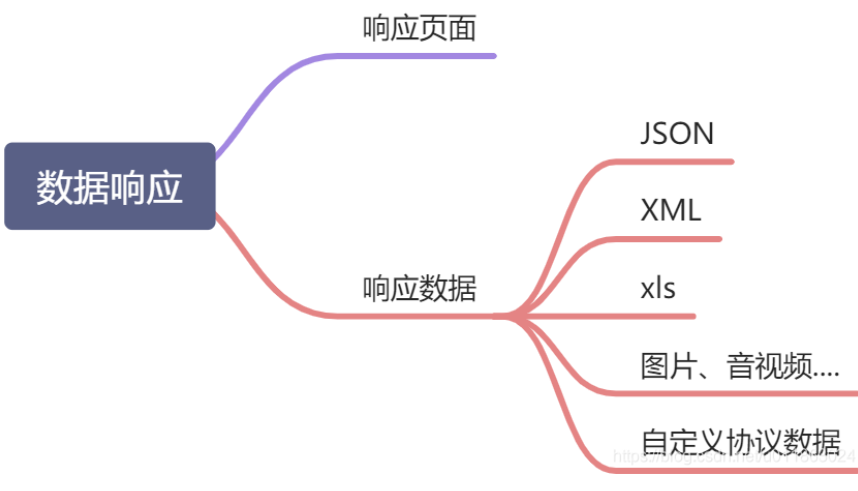
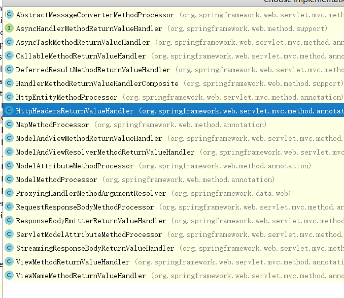
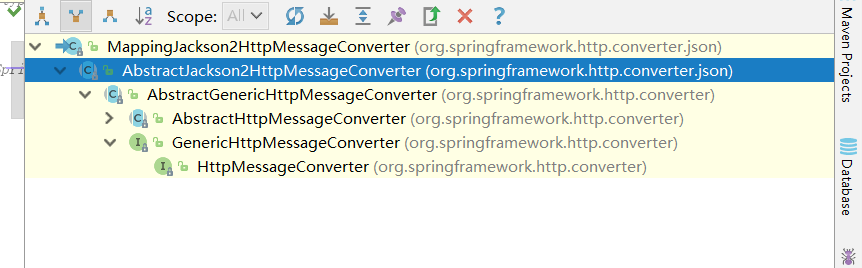
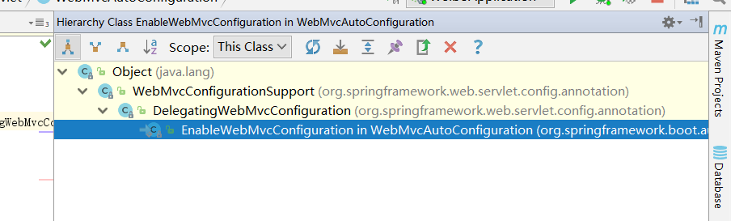
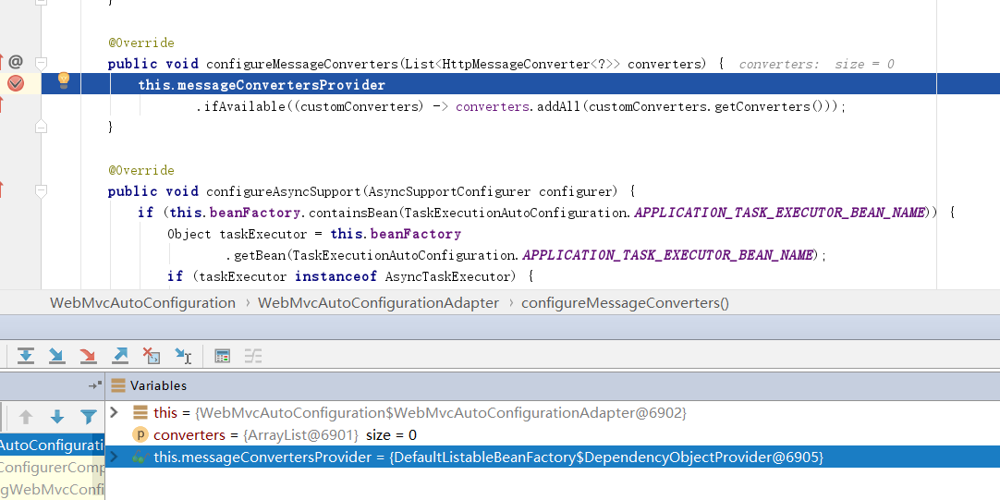
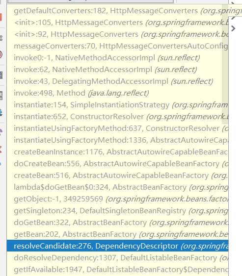
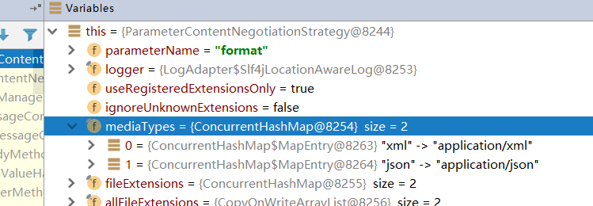

# SpringBoot(三)

## 响应处理-【源码分析】-ReturnValueHandler 



**HandlerMethodReturnValueHandler**： 接口， 每个请求处理都会有各种各样的返回值， 而SpringMvc中，存在多个返回值处理器来处理这些返回值；

```java
public interface HandlerMethodReturnValueHandler {
    boolean supportsReturnType(MethodParameter var1);

    void handleReturnValue(@Nullable Object var1, MethodParameter var2, ModelAndViewContainer var3, NativeWebRequest var4) throws Exception;
}
```

- supportReturnType :  是否支持某个返回值类型；
- handleReturnValue :  处理请求的返回值；



### 1.1、应用：JSON返回值

restful风格下，请求为JSON格式， 返回值为JSON格式，自动返回前端json数据

```java
<dependency>
    <groupId>org.springframework.boot</groupId>
    <artifactId>spring-boot-starter-web</artifactId>
</dependency>

<!-- web场景自动引入了json场景 -->
<dependency>
    <groupId>org.springframework.boot</groupId>
    <artifactId>spring-boot-starter-json</artifactId>
    <version>2.3.4.RELEASE</version>
    <scope>compile</scope>
</dependency>
```

SpringBoot父依赖定义了starter-web的版本， 再引入starter-json依赖， 再给方法添加@ResponseBody

```java
@Controller
public class ResponseBodyController {
    @ResponseBody
    @PostMapping("/responseBody")
    public Person getPerson() {
        Person person = new Person();
        return person;
    }
}
```

- @RestController  = 所有的方法 加 @ResponseBody  + @Controller

### 1.2、 源码流程

正常来说， 既然是返回值处理， 那必然是在处理结束后， 那必然在HanderAdpater#handle中；

在请求处理前，往invocableMethod中添加方法参数处理器 以返回值处理器；

```java
public class RequestMappingHandlerAdapter extends AbstractHandlerMethodAdapter
		implements BeanFactoryAware, InitializingBean {
@Nullable
protected ModelAndView invokeHandlerMethod(HttpServletRequest request,
		HttpServletResponse response, HandlerMethod handlerMethod) throws Exception {

	ServletWebRequest webRequest = new ServletWebRequest(request, response);
	try {
		
        ...
        
        ServletInvocableHandlerMethod invocableMethod = createInvocableHandlerMethod(handlerMethod);
            
		if (this.argumentResolvers != null) {
			invocableMethod.setHandlerMethodArgumentResolvers(this.argumentResolvers);
		}
		if (this.returnValueHandlers != null) {//<----关注点
			invocableMethod.setHandlerMethodReturnValueHandlers(this.returnValueHandlers);
		}

        ...

		invocableMethod.invokeAndHandle(webRequest, mavContainer);//看下块代码
		if (asyncManager.isConcurrentHandlingStarted()) {
			return null;
		}

		return getModelAndView(mavContainer, modelFactory, webRequest);
	}
	finally {
		webRequest.requestCompleted();
	}
}	
```


```java
public class ServletInvocableHandlerMethod extends InvocableHandlerMethod {
public void invokeAndHandle(ServletWebRequest webRequest, ModelAndViewContainer mavContainer,
		Object... providedArgs) throws Exception {

	Object returnValue = invokeForRequest(webRequest, mavContainer, providedArgs);
	
    ...
    
	try {
        //看下块代码
		this.returnValueHandlers.handleReturnValue(
				returnValue, getReturnValueType(returnValue), mavContainer, webRequest);
	}
	catch (Exception ex) {
		...
	}
}
```
invokeForRequest反射调用method处理并得到返回returnValue;

```java
public class HandlerMethodReturnValueHandlerComposite implements HandlerMethodReturnValueHandler {
    
    ...
    
	@Override
	public void handleReturnValue(@Nullable Object returnValue, MethodParameter returnType,
			ModelAndViewContainer mavContainer, NativeWebRequest webRequest) throws Exception {

        //selectHandler()实现在下面
		HandlerMethodReturnValueHandler handler = selectHandler(returnValue, returnType);
		if (handler == null) {
			throw new IllegalArgumentException("Unknown return value type: " + returnType.getParameterType().getName());
		}
        //开始处理
		handler.handleReturnValue(returnValue, returnType, mavContainer, webRequest);
	}
    
@Nullable
private HandlerMethodReturnValueHandler selectHandler(@Nullable Object value, MethodParameter returnType) {
        boolean isAsyncValue = this.isAsyncReturnValue(value, returnType);
        Iterator var4 = this.returnValueHandlers.iterator();

        HandlerMethodReturnValueHandler handler;
        do {
            do {
                if (!var4.hasNext()) {
                    return null;
                }

                handler = (HandlerMethodReturnValueHandler)var4.next();
            } while(isAsyncValue && !(handler instanceof AsyncHandlerMethodReturnValueHandler));
        } while(!handler.supportsReturnType(returnType));

        return handler;
}

```

1. 调用selectHandler获取合适的返回值处理器；
   - 遍历所有的返回值处理器， 调用returnValueHandler#supportReturnValue方法判断是否支持处理器该返回值；
2. 调用returnValueHandler#handleReturnValue处理返回值；


### 1.3 SpringMvc支持的返回值类型

- 字符串String   ==> ViewNameMethodReturnValueHandler

- View.class      ==> ViewMethodReturnValueHandler
- StreamingResponseBody.class ==> StreamResponseBodyReturnValueHandler
- ResponseBodyEmitter.class ==> ResponseBodyEmitterReturnValueHandler
- @ResponseBody  ==> RequestResponseBodyMethodProcessor
- Model.class    ==> ModelMethodProcessor
- @ModelAttribute  ==> ModelAttributeMethodProcessor
- ModelAndView.class  ==> ModelAndViewMethodReturnValueHandler
- Map.calss       ==> MapMethodProcessor
- HttpEntity.class    ==> HttpEntityMethodReturnValueHandler
- HttpHeaders.class   ==> HttpHeadersReturnValueHandler

- DeferredResult.class   ==> DeferredResultMethodReturnValueHandler
- Callable.class  ==> CallableMethodReturnValueHandler
- AsyncTask.class    ==> AsyncTaskMethodReturnValueHandler

### 1.4 @ResponseBody处理

```java
public class RequestResponseBodyMethodProcessor extends AbstractMessageConverterMethodProcessor {

    ...
    
	@Override
	public void handleReturnValue(@Nullable Object returnValue, MethodParameter returnType,
			ModelAndViewContainer mavContainer, NativeWebRequest webRequest)
			throws IOException, HttpMediaTypeNotAcceptableException, HttpMessageNotWritableException {

		mavContainer.setRequestHandled(true);
		ServletServerHttpRequest inputMessage = createInputMessage(webRequest);
		ServletServerHttpResponse outputMessage = createOutputMessage(webRequest);

        // 使用消息转换器进行写出操作，本方法下一章节介绍：
		// Try even with null return value. ResponseBodyAdvice could get involved.
		writeWithMessageConverters(returnValue, returnType, inputMessage, outputMessage);
	}
}
```

### 1.5 响应处理 - HttpMessageConverter

1. 遍历所有ReturnValueHandler响应处理器supportReturnType判断是否支持返回值类型

2. 返回值处理器调用handleReturnValue处理返回值

3. RequestResponseBodyReturnValueHandler可以处理@ResponseBody的返回值

   1. 内容协商； 获取浏览器支持的内容相应类型

      

   2. 获取服务器能返回什么类型的相应数据 (HttpMessageConverter)

   3. 浏览器类型 与 服务器类型进行匹配， 确定最优的类型；

   4. 遍历所有的HttpMessageConverter，调用canWrite判断是否支持写该类型的数据；

      1. MappingJackson2HttpMessageConverter可处理该类型，将数据转换为JSON
      2. 调用MappingJackson2HttpMessageConverter将数据转换为JSON写入响应中；
      
         2.1. 底层利用了ObjectWrapper组件，使用反射技术；


```java

//RequestResponseBodyMethodProcessor继承这类
public abstract class AbstractMessageConverterMethodProcessor extends AbstractMessageConverterMethodArgumentResolver
		implements HandlerMethodReturnValueHandler {

    ...
    
    //承接上一节内容
    protected <T> void writeWithMessageConverters(@Nullable T value, MethodParameter returnType,
                ServletServerHttpRequest inputMessage, ServletServerHttpResponse outputMessage)
                throws IOException, HttpMediaTypeNotAcceptableException, HttpMessageNotWritableException {
			
        	//拿到值的类型 ，方法返回类型
            Object body;
            Class<?> valueType;
            Type targetType;

            if (value instanceof CharSequence) {
                body = value.toString();
                valueType = String.class;
                targetType = String.class;
            }
            else {
                body = value;
                valueType = getReturnValueType(body, returnType);
                targetType = GenericTypeResolver.resolveType(getGenericType(returnType), returnType.getContainingClass());
            }

			...
                
            MediaType selectedMediaType = null;
            MediaType contentType = outputMessage.getHeaders().getContentType();
            boolean isContentTypePreset = contentType != null && contentType.isConcrete();
            if (isContentTypePreset) {
                if (logger.isDebugEnabled()) {
                    logger.debug("Found 'Content-Type:" + contentType + "' in response");
                }
                selectedMediaType = contentType;
            }
            else {
                HttpServletRequest request = inputMessage.getServletRequest();
                
                //内容协商（浏览器默认会以请求头(参数Accept)的方式告诉服务器他能接受什么样的内容类型）
                List<MediaType> acceptableTypes = getAcceptableMediaTypes(request);
                //服务器最终根据自己自身的能力，决定服务器能生产出什么样内容类型的数据
                List<MediaType> producibleTypes = getProducibleMediaTypes(request, valueType, targetType);

                if (body != null && producibleTypes.isEmpty()) {
                    throw new HttpMessageNotWritableException(
                            "No converter found for return value of type: " + valueType);
                }
                List<MediaType> mediaTypesToUse = new ArrayList<>();
                for (MediaType requestedType : acceptableTypes) {
                    for (MediaType producibleType : producibleTypes) {
                        if (requestedType.isCompatibleWith(producibleType)) {
                            mediaTypesToUse.add(getMostSpecificMediaType(requestedType, producibleType));
                        }
                    }
                }
                if (mediaTypesToUse.isEmpty()) {
                    if (body != null) {
                        throw new HttpMediaTypeNotAcceptableException(producibleTypes);
                    }
                    if (logger.isDebugEnabled()) {
                        logger.debug("No match for " + acceptableTypes + ", supported: " + producibleTypes);
                    }
                    return;
                }
				
                //根据权重排序
                MediaType.sortBySpecificityAndQuality(mediaTypesToUse);

                //拿到第一个mediaType, 
                for (MediaType mediaType : mediaTypesToUse) {
                    if (mediaType.isConcrete()) {
                        selectedMediaType = mediaType;
                        break;
                    }
                    else if (mediaType.isPresentIn(ALL_APPLICATION_MEDIA_TYPES)) {
                        selectedMediaType = MediaType.APPLICATION_OCTET_STREAM;
                        break;
                    }
                }

                if (logger.isDebugEnabled()) {
                    logger.debug("Using '" + selectedMediaType + "', given " +
                            acceptableTypes + " and supported " + producibleTypes);
                }
            }

        	
            if (selectedMediaType != null) {
                selectedMediaType = selectedMediaType.removeQualityValue();
                //本节主角：HttpMessageConverter
                //遍历所有的HttpMessageConverter
                for (HttpMessageConverter<?> converter : this.messageConverters) {
                    GenericHttpMessageConverter genericConverter = (converter instanceof GenericHttpMessageConverter ?
                            (GenericHttpMessageConverter<?>) converter : null);
                    
                    //判断是否可写 canWrite
                    if (genericConverter != null ?
                            ((GenericHttpMessageConverter) converter).canWrite(targetType, valueType, selectedMediaType) :
                            converter.canWrite(valueType, selectedMediaType)) {
                        body = getAdvice().beforeBodyWrite(body, returnType, selectedMediaType,
                                (Class<? extends HttpMessageConverter<?>>) converter.getClass(),
                                inputMessage, outputMessage);
                        if (body != null) {
                            Object theBody = body;
                            LogFormatUtils.traceDebug(logger, traceOn ->
                                    "Writing [" + LogFormatUtils.formatValue(theBody, !traceOn) + "]");
                            addContentDispositionHeader(inputMessage, outputMessage);
							//将数据转换为JSON，并写入响应中；
                            if (genericConverter != null) {
                                genericConverter.write(body, targetType, selectedMediaType, outputMessage);
                            }
                            else {
                                ((HttpMessageConverter) converter).write(body, selectedMediaType, outputMessage);
                            }
                        }
                        return;
                    }
                }
            }
			...
        }
```


### 1.6 消息转换器 - HttpMessageConverter 

#### 1.6.1 消息转换器介绍

作用： 将Class类型的数据(泛型T实际类型)转换为MediaType类型数据， 最常见的就是将对象转换JSON-使用的是MappingJackson2HttpMessageConverter

```java
/**
 * 策略模式的接口-对请求和响应的数据进行转换
 * Strategy interface for converting from and to HTTP requests and responses.
 */
public interface HttpMessageConverter<T> {

   /**
    * 类是否可以被转换器进行读取；
    * Indicates whether the given class can be read by this converter.
    */
   boolean canRead(Class<?> clazz, @Nullable MediaType mediaType);

   /**
    * 判断给定的类是否可以被转换器进行写；
    * Indicates whether the given class can be written by this converter.
    */
   boolean canWrite(Class<?> clazz, @Nullable MediaType mediaType);

   /**
    * 返回转换器可以支持的类型
    * Return the list of {@link MediaType} objects supported by this converter.
    */
   List<MediaType> getSupportedMediaTypes();

   /**
    * 从给定的输入消息中读取一个给定类型的对象实例，并返回；
    * Read an object of the given type from the given input message, and returns it.
    */
   T read(Class<? extends T> clazz, HttpInputMessage inputMessage)
         throws IOException, HttpMessageNotReadableException;

   /**
    * 将给定的对象实例写入到输出消息中；
    * Write an given object to the given output message.
    */
   void write(T t, @Nullable MediaType contentType, HttpOutputMessage outputMessage)
         throws IOException, HttpMessageNotWritableException;

}
```




#### 1.6.2 消息转换器初始化



1. 在容器启动时，会加载WebMvcAutoConfiguration的静态内部类EnableWebMvcConfiguration，此类**继承WebMvcConfigurationSupport类；**
2.  通过@Bean的方式注入了RequestMappingHandlerAdapter， 调用父类的requestMappingHandlerAdapter方法，**创建RequestMappingHandlerAdapter实例，并设置内容协商管理器， 消息转换器， 数据绑定初始器，请求参数处理器， 返回值处理器；** 
3. 怎么被加载？ WebMvcAutoConfigurationAdapter上加@Import(EnableWebMvcConfiguration.class)

```java
@Configuration(proxyBeanMethods = false)
public static class EnableWebMvcConfiguration extends DelegatingWebMvcConfiguration implements ResourceLoaderAware {

   @Bean
   @Override
   public RequestMappingHandlerAdapter requestMappingHandlerAdapter(
         @Qualifier("mvcContentNegotiationManager") ContentNegotiationManager contentNegotiationManager,
         @Qualifier("mvcConversionService") FormattingConversionService conversionService,
         @Qualifier("mvcValidator") Validator validator) {
      RequestMappingHandlerAdapter adapter = super.requestMappingHandlerAdapter(contentNegotiationManager,
            conversionService, validator);
      adapter.setIgnoreDefaultModelOnRedirect(
            this.mvcProperties == null || this.mvcProperties.isIgnoreDefaultModelOnRedirect());
      return adapter;
   }
//...
}

public class WebMvcConfigurationSupport implements ApplicationContextAware, ServletContextAware {
	@Bean
	public RequestMappingHandlerAdapter requestMappingHandlerAdapter(
			@Qualifier("mvcContentNegotiationManager") ContentNegotiationManager contentNegotiationManager,
			@Qualifier("mvcConversionService") FormattingConversionService conversionService,
			@Qualifier("mvcValidator") Validator validator) {

		RequestMappingHandlerAdapter adapter = createRequestMappingHandlerAdapter();
		adapter.setContentNegotiationManager(contentNegotiationManager);
		adapter.setMessageConverters(getMessageConverters());
		adapter.setWebBindingInitializer(getConfigurableWebBindingInitializer(conversionService, validator));
		adapter.setCustomArgumentResolvers(getArgumentResolvers());
		adapter.setCustomReturnValueHandlers(getReturnValueHandlers());
		return adapter;
	}
    //...
    
    protected final List<HttpMessageConverter<?>> getMessageConverters() {
       if (this.messageConverters == null) {
          this.messageConverters = new ArrayList<>();
          configureMessageConverters(this.messageConverters);
          if (this.messageConverters.isEmpty()) {
             addDefaultHttpMessageConverters(this.messageConverters);
          }
          extendMessageConverters(this.messageConverters);
       }
       return this.messageConverters;
    }
}
public class DelegatingWebMvcConfiguration extends WebMvcConfigurationSupport {
	@Override
	protected void configureMessageConverters(List<HttpMessageConverter<?>> converters) {
		this.configurers.configureMessageConverters(converters);
	}
    
    @Override
	public void configureMessageConverters(List<HttpMessageConverter<?>> converters) {
		for (WebMvcConfigurer delegate : this.delegates) {
			delegate.configureMessageConverters(converters);
		}
	}
}
```

WebMvcConfigurer ： 接口实现类主要是 WebMvcAutoConfiguration$WebMvcAutoConfigurationAdapter；

```java
public static class WebMvcAutoConfigurationAdapter implements WebMvcConfigurer {
	private final ObjectProvider<HttpMessageConverters> messageConvertersProvider;

    @Override
	public void configureMessageConverters(List<HttpMessageConverter<?>> converters) 		{
		this.messageConvertersProvider
				.ifAvailable((customConverters) -> converters.addAll(customConverters.getConverters()));
	}
}
```


1. ObjectProvider函数接口，实现类为DefaultListableBeanFactory内部类DependencyObjectProvider；此处泛型类型为HttpMessageConverters；

2. 调用ifAvaiable方法，判断该bean是否存在，不存在则通过Bean工厂实例化， 然后调用HttpMessageConverters.getConverters方法；




调用链路很深，为了解决依赖， 先进行Bean的实例化；

1. 调用HttpMessageConvertersAutoConfiguration#messageConverters方法进行实例化；
2.  导入了JacksonHttpMessageConvertersConfiguration， GsonHttpMessageConvertersConfiguration，JsonbHttpMessageConvertersConfiguration几种类型消息转换器配置类；

```java
@Configuration(proxyBeanMethods = false)
@ConditionalOnClass(HttpMessageConverter.class)
@Conditional(NotReactiveWebApplicationCondition.class)
@AutoConfigureAfter({ GsonAutoConfiguration.class, JacksonAutoConfiguration.class, JsonbAutoConfiguration.class })
@Import({ JacksonHttpMessageConvertersConfiguration.class, GsonHttpMessageConvertersConfiguration.class,
      JsonbHttpMessageConvertersConfiguration.class })
public class HttpMessageConvertersAutoConfiguration {

   @Bean
   @ConditionalOnMissingBean
   public HttpMessageConverters messageConverters(ObjectProvider<HttpMessageConverter<?>> converters) {
      return new HttpMessageConverters(converters.orderedStream().collect(Collectors.toList()));
   }    
}

public class HttpMessageConverters implements Iterable<HttpMessageConverter<?>> {
	public HttpMessageConverters(boolean addDefaultConverters, Collection<HttpMessageConverter<?>> converters) {
		List<HttpMessageConverter<?>> combined = getCombinedConverters(converters,
				addDefaultConverters ? getDefaultConverters() : Collections.emptyList());
		combined = postProcessConverters(combined);
		this.converters = Collections.unmodifiableList(combined);
	}
    
    
	private List<HttpMessageConverter<?>> getDefaultConverters() {
		List<HttpMessageConverter<?>> converters = new ArrayList<>();
		if (ClassUtils.isPresent("org.springframework.web.servlet.config.annotation.WebMvcConfigurationSupport",
				null)) {
			converters.addAll(new WebMvcConfigurationSupport() {

				public List<HttpMessageConverter<?>> defaultMessageConverters() {
					return super.getMessageConverters();
				}

			}.defaultMessageConverters());
		}
		else {
			converters.addAll(new RestTemplate().getMessageConverters());
		}
		reorderXmlConvertersToEnd(converters);
		return converters;
	}
    
}    
```

通过new HttpMessageConverters， 最终会创建匿名WebMvcConfigurationSupport类实例，重写了defaultMessageConverters方法，在该方法中调用getMessageConverters；

```java
protected final List<HttpMessageConverter<?>> getMessageConverters() {
   if (this.messageConverters == null) {
      this.messageConverters = new ArrayList<>();
      configureMessageConverters(this.messageConverters);
      if (this.messageConverters.isEmpty()) {
         addDefaultHttpMessageConverters(this.messageConverters);
      }
      extendMessageConverters(this.messageConverters);
   }
   return this.messageConverters;
}


```

1. 由于是new出来WebMvcConfigurationSupport实例， 该类的configureMessageConverters为空方法；因此messageConverters为空
2. 调用addDefaultHttpMessageConverters往messageConverters集合添加HttpMessageConverter;

```java
public class WebMvcConfigurationSupport implements ApplicationContextAware, ServletContextAware {

	private static final boolean romePresent;

	private static final boolean jaxb2Present;

	private static final boolean jackson2Present;

	private static final boolean jackson2XmlPresent;

	private static final boolean jackson2SmilePresent;

	private static final boolean jackson2CborPresent;

	private static final boolean gsonPresent;

	private static final boolean jsonbPresent;

	static {
		ClassLoader classLoader = WebMvcConfigurationSupport.class.getClassLoader();
		romePresent = ClassUtils.isPresent("com.rometools.rome.feed.WireFeed", classLoader);
		jaxb2Present = ClassUtils.isPresent("javax.xml.bind.Binder", classLoader);
		jackson2Present = ClassUtils.isPresent("com.fasterxml.jackson.databind.ObjectMapper", classLoader) &&
				ClassUtils.isPresent("com.fasterxml.jackson.core.JsonGenerator", classLoader);
		jackson2XmlPresent = ClassUtils.isPresent("com.fasterxml.jackson.dataformat.xml.XmlMapper", classLoader);
		jackson2SmilePresent = ClassUtils.isPresent("com.fasterxml.jackson.dataformat.smile.SmileFactory", classLoader);
		jackson2CborPresent = ClassUtils.isPresent("com.fasterxml.jackson.dataformat.cbor.CBORFactory", classLoader);
		gsonPresent = ClassUtils.isPresent("com.google.gson.Gson", classLoader);
		jsonbPresent = ClassUtils.isPresent("javax.json.bind.Jsonb", classLoader);
	}

    protected final void addDefaultHttpMessageConverters(List<HttpMessageConverter<?>> messageConverters) {
       messageConverters.add(new ByteArrayHttpMessageConverter());
       messageConverters.add(new StringHttpMessageConverter());
       messageConverters.add(new ResourceHttpMessageConverter());
       messageConverters.add(new ResourceRegionHttpMessageConverter());
       try {
          messageConverters.add(new SourceHttpMessageConverter<>());
       }
       catch (Throwable ex) {
          // Ignore when no TransformerFactory implementation is available...
       }
       messageConverters.add(new AllEncompassingFormHttpMessageConverter());

       if (romePresent) {
          messageConverters.add(new AtomFeedHttpMessageConverter());
          messageConverters.add(new RssChannelHttpMessageConverter());
       }

       if (jackson2XmlPresent) {
          Jackson2ObjectMapperBuilder builder = Jackson2ObjectMapperBuilder.xml();
          if (this.applicationContext != null) {
             builder.applicationContext(this.applicationContext);
          }
          messageConverters.add(new MappingJackson2XmlHttpMessageConverter(builder.build()));
       }
       else if (jaxb2Present) {
          messageConverters.add(new Jaxb2RootElementHttpMessageConverter());
       }

       if (jackson2Present) {
          Jackson2ObjectMapperBuilder builder = Jackson2ObjectMapperBuilder.json();
          if (this.applicationContext != null) {
             builder.applicationContext(this.applicationContext);
          }
          messageConverters.add(new MappingJackson2HttpMessageConverter(builder.build()));
       }
       else if (gsonPresent) {
          messageConverters.add(new GsonHttpMessageConverter());
       }
       else if (jsonbPresent) {
          messageConverters.add(new JsonbHttpMessageConverter());
       }

       if (jackson2SmilePresent) {
          Jackson2ObjectMapperBuilder builder = Jackson2ObjectMapperBuilder.smile();
          if (this.applicationContext != null) {
             builder.applicationContext(this.applicationContext);
          }
          messageConverters.add(new MappingJackson2SmileHttpMessageConverter(builder.build()));
       }
       if (jackson2CborPresent) {
          Jackson2ObjectMapperBuilder builder = Jackson2ObjectMapperBuilder.cbor();
          if (this.applicationContext != null) {
             builder.applicationContext(this.applicationContext);
          }
          messageConverters.add(new MappingJackson2CborHttpMessageConverter(builder.build()));
       }
    }
    
}
```

- ByteArrayHttpMessageConverter ：

  - 字节数组消息转换器；支持-将对象内容转换为byte数组，或者byte[]转为对象内容；当@ResponseBody标注的方法返回值为byte[]，则使用此处理返回值；

    

- StringHttpMessageConverter 

  -  字符串消息转换器；支持=>内容转换为String字符串， 或者字符串数组转换为消息；当@ResponseBody标注的方法返回值为String，则使用此处理返回值；

- ResourceHttpMessageConverter 

  -  资源文件消息转换器；支持消息与Resource资源的转换；负责读取资源文件和写出资源文件数据; 当@ResponseBody标注的方法返回值为Resource，则使用此处理返回值；

- ResourceRegionHttpMessageConverter 

  -  消息与ResourceRegion的转换

- SourceHttpMessageConverter

  - Source与消息的转换

- AllEncompassingFormHttpMessageConverter

  - 负责读、写Form表单数据

- MappingJackson2HttpMessageConverter

  - JSON格式消息转换器； 支持消息与JSON的内容格式转换；
  - 生效条件：存在类com.fasterxml.jackson.databind.ObjectMapper 与 类com.fasterxml.jackson.core.JsonGenerator （Spring默认支持使用jackson）

- MappingJackson2XmlHttpMessageConverter

  - XML格式消息转换器； 支持消息与XML的内容格式转换
  - 生效条件：存在类com.fasterxml.jackson.dataformat.xml.XmlMapper


HttpMessageConverter的初始化流程：

1. 通过**@Import(EnableWebMvcConfiguration.class)加载该类， 该类为@Configuration注解，并定义了多个@Bean方法**，在启动过程中，会被扫描；

2. **扫描到@Bean修饰的requestMappingHandlerAdapter方法时， 会创建RequestMappingHandlerAdapter实例；**

3. 创建实例过程中，会调用getMessageConverter方法获取HttpMessageConverter实例；

4. getMessageConverter方法，遍历WebMvcConfigurers集合，调用WebMvcAutoConfigurationAdapter类的configureMessageConverters方法；

5. configureMessageConverters判断是否存在**HttpMessageConverters类型的实例、**

   1. 存在则调用其getConverters获取HttpMessageConverters;
   2. 不存在，则进行Bean的实例化，最终调用HttpMessageConvertersAutoConfiguration#messageConverters方法，**调用HttpMessageConverters构造方法**
      1. **构造方法中创建WebMvcConfigurationSupport匿名实例，重写该类的defaultMessageConverters方法，并调用重写方法defaultMessageConverters, 重写方法中调用getMessageConverters方法**
      2. **getMessageConverters调用addDefaultMessageConverter,默认实例化了8个HttpMessageConverter放入属性messageConverters;**
      3. 调用HttpMessageConverters实例的getConverters方法获取到8个HttpMessageConverters消息转换器返回；

6. 最终将返回的消息转换器实例存放在RequestMappingHandlerAdapter属性messageConveters集合中；

   

### 响应处理-【源码分析】-内容协商原理

```java
 <dependency>
     <groupId>com.fasterxml.jackson.dataformat</groupId>
     <artifactId>jackson-dataformat-xml</artifactId>
</dependency>
```

加入此依赖，则支持的响应内容类型多了几种XML的内容格式；


根据客户端接收能力不同，返回不同媒体类型的数据

**内容协商原理**

1. 获取客户端支持的内容格式类型；
   1. 获取请求头中的Accept字段值
   2. contentNegotiationManager：内容协商管理器， 默认使用请求头的内容协商策略；
   3. HeaderContentNegotiationStrategy：请求头内容协商策略， 调用request.getHeader("Accept")获取客户端支持的内容格式类型；
2. 获取服务端支持的内容格式类型；
   1. 遍历所有的HttpMessageConverter, 调用canWrite方法判断当前消息转换器是否支持返回值类型Class的处理；如果支持，则拿到媒体类型MediaType
3. 客户端需要application/xml，服务端有10种MediaType（4个json, 6个xml）。
4. 进行内容协商的最佳匹配媒体类型
5. 用 支持 将对象转为 最佳匹配媒体类型 的converter。调用它进行转化 ；

代码如下：

```java
//RequestResponseBodyHttpMessageConverter继承此类：
public abstract class AbstractMessageConverterMethodProcessor extends AbstractMessageConverterMethodArgumentResolver
		implements HandlerMethodReturnValueHandler {

protected <T> void writeWithMessageConverters(@Nullable T value, MethodParameter returnType,
      ServletServerHttpRequest inputMessage, ServletServerHttpResponse outputMessage)
      throws IOException, HttpMediaTypeNotAcceptableException, HttpMessageNotWritableException {

   Object body;
   Class<?> valueType;
   Type targetType;
	//1. 拿到返回值与返回值类型
   if (value instanceof CharSequence) {
      body = value.toString();
      valueType = String.class;
      targetType = String.class;
   }
   else {
      body = value;
      valueType = getReturnValueType(body, returnType);
      targetType = GenericTypeResolver.resolveType(getGenericType(returnType), returnType.getContainingClass());
   }

	//...省略部分代码
   MediaType selectedMediaType = null;
   
   MediaType contentType = outputMessage.getHeaders().getContentType();
   boolean isContentTypePreset = contentType != null && contentType.isConcrete();
   if (isContentTypePreset) {
      if (logger.isDebugEnabled()) {
         logger.debug("Found 'Content-Type:" + contentType + "' in response");
      }
      selectedMediaType = contentType;
   }
   else {
     
      HttpServletRequest request = inputMessage.getServletRequest();
       //2、 利用内容协商管理器获取客户端支持的内容格式类型
      List<MediaType> acceptableTypes = getAcceptableMediaTypes(request);
       //3. 利用HttpMessageConverter获取服务端支持的相应内容类型
      List<MediaType> producibleTypes = getProducibleMediaTypes(request, valueType, targetType);

      if (body != null && producibleTypes.isEmpty()) {
         throw new HttpMessageNotWritableException(
               "No converter found for return value of type: " + valueType);
      }
      List<MediaType> mediaTypesToUse = new ArrayList<>();
       
      //4. 客户端与服务端的类型进行协商匹配；
      for (MediaType requestedType : acceptableTypes) {
         for (MediaType producibleType : producibleTypes) {
            if (requestedType.isCompatibleWith(producibleType)) {
               mediaTypesToUse.add(getMostSpecificMediaType(requestedType, producibleType));
            }
         }
      }
      
       //5. 没有匹配的类型
      if (mediaTypesToUse.isEmpty()) {
         //5.1 没有匹配的媒体类型，内容又不为空，则抛出异常
          if (body != null) {
            throw new HttpMediaTypeNotAcceptableException(producibleTypes);
         }
         if (logger.isDebugEnabled()) {
            logger.debug("No match for " + acceptableTypes + ", supported: " + producibleTypes);
         }
         return;
      }
	
      //6. 类型进行排序 
      MediaType.sortBySpecificityAndQuality(mediaTypesToUse);

      //7. 拿出优先级最高的 
      for (MediaType mediaType : mediaTypesToUse) {
         if (mediaType.isConcrete()) {
            selectedMediaType = mediaType;
            break;
         }
         else if (mediaType.isPresentIn(ALL_APPLICATION_MEDIA_TYPES)) {
            selectedMediaType = MediaType.APPLICATION_OCTET_STREAM;
            break;
         }
      }

      if (logger.isDebugEnabled()) {
         logger.debug("Using '" + selectedMediaType + "', given " +
               acceptableTypes + " and supported " + producibleTypes);
      }
   }
	
    
   if (selectedMediaType != null) {
      selectedMediaType = selectedMediaType.removeQualityValue();
      for (HttpMessageConverter<?> converter : this.messageConverters) {
         GenericHttpMessageConverter genericConverter = (converter instanceof GenericHttpMessageConverter ?
               (GenericHttpMessageConverter<?>) converter : null);
          //8.遍历HttpMessageConverter，判断是否只会该媒体类型的读写；
         if (genericConverter != null ?
               ((GenericHttpMessageConverter) converter).canWrite(targetType, valueType, selectedMediaType) :
               converter.canWrite(valueType, selectedMediaType)) {
            body = getAdvice().beforeBodyWrite(body, returnType, selectedMediaType,
                  (Class<? extends HttpMessageConverter<?>>) converter.getClass(),
                  inputMessage, outputMessage);
            if (body != null) {
               Object theBody = body;
               LogFormatUtils.traceDebug(logger, traceOn ->
                     "Writing [" + LogFormatUtils.formatValue(theBody, !traceOn) + "]");
               addContentDispositionHeader(inputMessage, outputMessage);
               if (genericConverter != null) {
                   //9.写入返回值resposne中；
                  genericConverter.write(body, targetType, selectedMediaType, outputMessage);
               }
               else {
                  ((HttpMessageConverter) converter).write(body, selectedMediaType, outputMessage);
               }
            }
            else {
               if (logger.isDebugEnabled()) {
                  logger.debug("Nothing to write: null body");
               }
            }
            return;
         }
      }
   }

   if (body != null) {
      Set<MediaType> producibleMediaTypes =
            (Set<MediaType>) inputMessage.getServletRequest()
                  .getAttribute(HandlerMapping.PRODUCIBLE_MEDIA_TYPES_ATTRIBUTE);

      if (isContentTypePreset || !CollectionUtils.isEmpty(producibleMediaTypes)) {
         throw new HttpMessageNotWritableException(
               "No converter for [" + valueType + "] with preset Content-Type '" + contentType + "'");
      }
      throw new HttpMediaTypeNotAcceptableException(this.allSupportedMediaTypes);
   }
}
    
}    
```

### 2、响应处理-【源码分析】-基于请求头参数的内容协商原理

获取客户端（PostMan、浏览器）支持接收的内容类型。（获取客户端Accept请求头字段application/xml）

- ContentNegotiationManager : 内容协商管理器、负责获取客户端支持的响应内容类型
- ContentNegotaitionStrategy : 内容协商策略, 接口
  - HeaderContentNegotiationStrategy: 基于请求头的内容协商策略， 即客户端支持的媒体类型通过请求头告诉服务端；
  - ParameterContentNegotiationStrategy: 基于请求参数的内容协商策略，即客户端通过请求参数的方式告诉服务端；

```java
//RequestResponseBodyMethodProcessor继承这类
public abstract class AbstractMessageConverterMethodProcessor extends AbstractMessageConverterMethodArgumentResolver
		implements HandlerMethodReturnValueHandler {
    ...
    
    //跟上一节的代码一致
    protected <T> void writeWithMessageConverters(@Nullable T value, MethodParameter returnType,
                ServletServerHttpRequest inputMessage, ServletServerHttpResponse outputMessage)
                throws IOException, HttpMediaTypeNotAcceptableException, HttpMessageNotWritableException {

            Object body;
            Class<?> valueType;
            Type targetType;
        
        	...
            //本节重点
            //内容协商（浏览器默认会以请求头(参数Accept)的方式告诉服务器他能接受什么样的内容类型）
            MediaType selectedMediaType = null;
            MediaType contentType = outputMessage.getHeaders().getContentType();
            boolean isContentTypePreset = contentType != null && contentType.isConcrete();
            if (isContentTypePreset) {
			//....
            }
            else {
                HttpServletRequest request = inputMessage.getServletRequest();
                List<MediaType> acceptableTypes = getAcceptableMediaTypes(request);
                //服务器最终根据自己自身的能力，决定服务器能生产出什么样内容类型的数据
                List<MediaType> producibleTypes = getProducibleMediaTypes(request, valueType, targetType);
            ...
            
	}
    
    //在AbstractMessageConverterMethodArgumentResolver类内
   	private List<MediaType> getAcceptableMediaTypes(HttpServletRequest request)
			throws HttpMediaTypeNotAcceptableException {

        //内容协商管理器 默认使用基于请求头的策略
		return this.contentNegotiationManager.resolveMediaTypes(new ServletWebRequest(request));
	}
        
}
 
    //-------------ContentNegotaitionManeger------------------
    //遍历内容协商策略，拿到MediaType结果集；
@Override
public List<MediaType> resolveMediaTypes(NativeWebRequest request) throws HttpMediaTypeNotAcceptableException {
		for (ContentNegotiationStrategy strategy : this.strategies) {
			List<MediaType> mediaTypes = strategy.resolveMediaTypes(request);
			if (mediaTypes.equals(MEDIA_TYPE_ALL_LIST)) {
				continue;
			}
			return mediaTypes;
		}
		return MEDIA_TYPE_ALL_LIST;
}
    
```

默认情况下、只有一个内容协商策略，为HeaderContentNegotiationStrategy;

拿到请求头的ACCEPT的结果，包装为MediaType返回；

```java
public class HeaderContentNegotiationStrategy implements ContentNegotiationStrategy {
   @Override
   public List<MediaType> resolveMediaTypes(NativeWebRequest request)
         throws HttpMediaTypeNotAcceptableException {
	
      //会获取请求头里的ACCEPT字段的结果集；
      String[] headerValueArray = request.getHeaderValues(HttpHeaders.ACCEPT);
      if (headerValueArray == null) {
         return MEDIA_TYPE_ALL_LIST;
      }

      List<String> headerValues = Arrays.asList(headerValueArray);
      try {
         //将ACCEPT的结果转换为MediaType返回；
         List<MediaType> mediaTypes = MediaType.parseMediaTypes(headerValues);
         MediaType.sortBySpecificityAndQuality(mediaTypes);
         return !CollectionUtils.isEmpty(mediaTypes) ? mediaTypes : MEDIA_TYPE_ALL_LIST;
      }
      catch (InvalidMediaTypeException ex) {
      }
   }

}
```

### 开启浏览器参数方式内容协商功能

SpringBoot支持基于请求参数的内容协商功能；

开启配置：

```properties
spring.mvc.contentnegotiation.favor-parameter=true
```

传参方式： 值只有xml与json；

1. 在URL后附加format参数；
2. 在form表单中附加format参数；
3. 同时在URL与form表单带上参数， 最终获取到的值为form表单传递的值；

代码分析：

此时内容协商策略为2个、增加了ParameterContentNegotiationStrategy类型

```java
//ContentNegotiationManager
@Override
public List<MediaType> resolveMediaTypes(NativeWebRequest request) throws HttpMediaTypeNotAcceptableException {
   for (ContentNegotiationStrategy strategy : this.strategies) {
      List<MediaType> mediaTypes = strategy.resolveMediaTypes(request);
      if (mediaTypes.equals(MEDIA_TYPE_ALL_LIST)) {
         continue;
      }
      return mediaTypes;
   }
   return MEDIA_TYPE_ALL_LIST;
}
```


- 调用getMediaType获取客户端支持的媒体类型、**通过request#getParameter方式获取format参数的值；**
- 调用resolveMediaTypeKey**拿format的值，作为key查询mediaTypes的value**， 作为客户端支持的媒体类型

```java
public abstract class AbstractMappingContentNegotiationStrategy extends MappingMediaTypeFileExtensionResolver
      implements ContentNegotiationStrategy {
      
 	@Override
	public List<MediaType> resolveMediaTypes(NativeWebRequest webRequest)
			throws HttpMediaTypeNotAcceptableException {

		return resolveMediaTypeKey(webRequest, getMediaTypeKey(webRequest));
	}
 
 	@Override
	@Nullable
	protected String getMediaTypeKey(NativeWebRequest request) {
		return request.getParameter(getParameterName());
	}
}      
```



## 

### 响应处理-【源码分析】-自定义MessageConverter

**实现多协议数据兼容。json、xml、x-guigu**（这个是自创的）

1. @ResponseBody 响应数据出去 调用 RequestResponseBodyMethodProcessor 处理

2. Processor 处理方法返回值。通过 MessageConverter处理

3. 所有 MessageConverter 合起来可以支持各种媒体类型数据的操作（读、写）

4. 内容协商找到最终的 messageConverter


WebMvcConfigurer：提供基于Java Configuration方式去自定义容器的方式；

#### 自定义基于请求头ACCEPT的内容协商

```java
@Configuration(proxyBeanMethods = false)
public class MessageConverterConfigurer {

    @Bean
    public WebMvcConfigurer converterWebMvcConfigurer() {
        ConverterConfigurer converterConfigurer = new ConverterConfigurer();
        return converterConfigurer;
    }

    public static class ConverterConfigurer implements WebMvcConfigurer {
        @Override
        public void configureMessageConverters(List<HttpMessageConverter<?>> converters) {
            converters.add(new PetHttpMessageConverter());
        }
    }
    public static class PetHttpMessageConverter implements HttpMessageConverter<Pet>{
        private List<MediaType> customType;

        public PetHttpMessageConverter() {
            System.out.println("Pet Converter实例化...");
            List<MediaType> typeList = MediaType.parseMediaTypes("application/x-guigu");
            this.customType = typeList;
        }

        @Override
        public boolean canRead(Class<?> clazz, MediaType mediaType) {
            return false;
        }

        @Override
        public boolean canWrite(Class<?> clazz, MediaType mediaType) {
            return clazz.isAssignableFrom(Pet.class);
        }

        @Override
        public List<MediaType> getSupportedMediaTypes() {
//            MediaType mediaType = new MediaType("x-guigu", "application/guigu");
            return customType;
    }

        @Override
        public Pet read(Class<? extends Pet> clazz, HttpInputMessage inputMessage) throws IOException, HttpMessageNotReadableException {
            return null;
        }

        @Override
        public void write(Pet pet, MediaType contentType, HttpOutputMessage outputMessage) throws IOException, HttpMessageNotWritableException {
            String content = pet.toString();
            content = "<<<<"+ content + ">>>>";
            outputMessage.getBody().write(content.getBytes());
        }
    }
}
```

发送请求：

请求头中带上Accept, 结果为application/x-guigu 会数据按自定义协议的写出。

#### 自定义基于请求参数的内容协商

- ParameterContentNegotiationStrategy ：存在一个媒体映射Map,只需要在该Map中添加映射媒体类型，即可实现，但是ParameterContentNegotiationStrategy并没有提供此API,  因此，可以重新定义ParameterContentNegotiationStrategy实例，放入容器中；
- ContentNegotiationConfigurer ： 内容协商配置器；可以替换协商策略（全量替换），原有的不生效；

```java
public static class ConverterConfigurer implements WebMvcConfigurer {
    @Override
    public void configureMessageConverters(List<HttpMessageConverter<?>> converters) {
        converters.add(new PetHttpMessageConverter());
    }

    @Override
    public void configureContentNegotiation(ContentNegotiationConfigurer configurer) {
        HashMap<String, MediaType> mediaTypeHashMap = new HashMap<>();
        mediaTypeHashMap.put("guigu", MediaType.parseMediaType("application/x-guigu"));
        mediaTypeHashMap.put("xml", MediaType.parseMediaType("application/xml"));
        mediaTypeHashMap.put("json", MediaType.parseMediaType("application/json"));
        ParameterContentNegotiationStrategy parameterContentNegotiationStrategy = new ParameterContentNegotiationStrategy(mediaTypeHashMap);

        HeaderContentNegotiationStrategy headerContentNegotiationStrategy = new HeaderContentNegotiationStrategy();
        configurer.strategies(Lists.newArrayList(parameterContentNegotiationStrategy, headerContentNegotiationStrategy));
    }
}
```

只需要在表单或者URL上拼接format=guigu即可；

**有可能我们添加的自定义的功能会覆盖默认很多功能，导致一些默认的功能失效**


