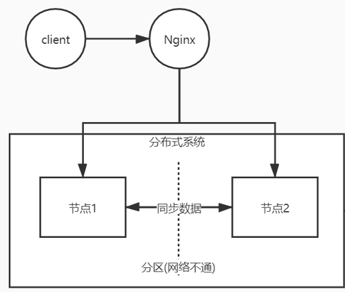

# Nacos 服务注册

Nacos-Discovery依赖的spring.factories自动装配：

```properties
org.springframework.boot.autoconfigure.EnableAutoConfiguration=\
  com.alibaba.cloud.nacos.discovery.NacosDiscoveryAutoConfiguration,\
  com.alibaba.cloud.nacos.ribbon.RibbonNacosAutoConfiguration,\
  com.alibaba.cloud.nacos.endpoint.NacosDiscoveryEndpointAutoConfiguration,\
  com.alibaba.cloud.nacos.registry.NacosServiceRegistryAutoConfiguration,\
  com.alibaba.cloud.nacos.discovery.NacosDiscoveryClientConfiguration,\
  com.alibaba.cloud.nacos.discovery.reactive.NacosReactiveDiscoveryClientConfiguration,\
  com.alibaba.cloud.nacos.discovery.configclient.NacosConfigServerAutoConfiguration,\
  com.alibaba.cloud.nacos.NacosServiceAutoConfiguration
```

NacosServiceAutoConfiguration : 定义了NacosServiceManager

NacosDiscoveryAutoConfiguration：定义了NacosServiceDiscovery， 该bean依赖NacosServiceManager

NacosDiscoveryClientConfiguration： 定义了NacosDiscoveryClient， 该Bean依赖NacosServiceDiscovery；

NacosServiceRegistryAutoConfiguration：

- 定义了NacosServiceRegistry， 该Bean依赖NacosServiceManager
- 定义了NacosRegistration
- 定义了NacosAutoServiceRegistration， 该bean依赖NacosServiceRegistry，NacosRegistration，实现了ApplicationListener监听器接口, **监听WebServerInitializedEvent事件**；
  - InstancePreRegisteredEvent 
  - **register** ->看下面流程
  - InstanceRegisteredEvent


register:

- nacosServiceManager: 获取NamingService，类型为NacosNamingService;
  - NacosNamingService#register
    - NamingClientProxy#registerService
      - NamingClientProxyDelegate#registerService
        - NamingHttpClientProxy#registerService
          - tthis.beatReactor.addBeatInfo(groupedServiceName, beatInfo) :心跳相关
          - this.reqApi(UtilAndComs.nacosUrlInstance, params, "POST");
          - this.nacosRestTemplate.exchangeForm(url, header, Query.newInstance().initParams(params), body, method, String.class)
            
            - 发送HTTP协议与NACOS交互, 使用HttpOkConnection, HttpClient发送请求；
            
            - 默认使用HttpURLConnection 发起请求；
            
              ```java
              public HttpClientResponse execute(URI uri, String httpMethod, RequestHttpEntity requestHttpEntity) throws Exception {
                  Object body = requestHttpEntity.getBody();
                  Header headers = requestHttpEntity.getHeaders();
                  HttpURLConnection conn = (HttpURLConnection)uri.toURL().openConnection();
              	//省略设置请求头、请求参数、请求超时时间。。；
                  conn.connect();
                  //通过connect方法发起请求、并获取返回值；
                  return new JdkHttpClientResponse(conn);
              }
              ```
        - NamingGrpcClientProxy#registerService
          - NamingGrpcClientProxy#requestToServer
            - RpcClient#request
            - Connection#request
            - RequestFutureStub#request  采用GRPC与NACOS交互
- Instance : 服务的注册信息、ip,port等；

```java
public class Instance implements Serializable {
    private String instanceId;
    private String ip;
    private int port;
    private double weight = 1.0D;
    private boolean healthy = true;
    private boolean enabled = true;
    private boolean ephemeral = true;
    private String clusterName;
    private String serviceName;
    private Map<String, String> metadata = new HashMap<String, String>();
}
```

### Nacos处理注册实例请求

- InstanceController#registerInstance

  - createEmptyService

    - **createServiceIfAbsent** : 若服务第一次创建、则创建Service
      - getService :  从serviceMap中根据namespaceId、groupName获取Service
      - new Service() : 创建Service对象
      - putServiceAndInit  ：将Service放入serviceMap, 开启心跳健康检查任务
        - putService :Service放入serviceMap
        - **service.init()** ：**开启心跳健康检查任务**
          - **HealthCheckReactor.scheduleCheck(clientBeatCheckTask);**

  - addInstance ： 将Instance放入内存临时表中

    - KeyBuilder.buildInstanceListKey ： 获取实例的Key

    - addIpAddresses :   合并新旧的Instance信息、将旧InstanceId设置给新Instance

    - consistencyService.put(key, instances)  ： 默认临时实例、使用AP架构， 类型为DistroConsistencyServiceImpl

      - onPut(key, value) ： 放入内存临时表；

        - dataStore.put(key, datum) ：临时存储实例信息；

        - notifier.addTask(key, DataOperation.CHANGE);

          ```java
          public void addTask(String datumKey, DataOperation action) {
              
              if (services.containsKey(datumKey) && action == DataOperation.CHANGE) {
                  return;
              }
              if (action == DataOperation.CHANGE) {
                  services.put(datumKey, StringUtils.EMPTY);
              }
              tasks.offer(Pair.with(datumKey, action));
          }
          ```

          - tasks.offer(Pair.with(datumKey, action))：
            - 最终Instance的Key放入阻塞队列tasks#offer， Notifier的run方法中会调用tasks#take方法，从阻塞队列中获取数据；
            - run方法意味着、Notifier是线程异步执行的；而通过查看Notifier类、发现DistroConsistencyServiceImpl的Bean创建后、属性notifier也会new Notifier对象, @PostConstruct的init方法中、线程池提交了notifier执行；

        - 异步执行run、调用handle方法

          - dataStore.get(datumKey) ： 拿到Instance对象数据；

          - listener.onChange(datumKey, datum.value) ：listener实现类为Service

            - Service#updateIPs(Collection<Instance> instances, boolean ephemeral)

              - Cluster#updateIps(List<Instance> ips, boolean ephemeral)

                - ephemeralInstances = toUpdateInstances;

                - 临时服务数据是放下Cluster下的ephemeralInstances 属性中；

      - distroProtocol.sync ： 同步到Nacos其他节点


**问题一 ： 为什么通过线程异步执行？**

**Nacos要保证高并发、高可用、高可扩展， 若以同步方式执行，由于Instance执行放入内存临时表的流程比较复杂，大量请求会导致卡顿；通过线程方式异步执行；而阻塞队列tasks的容量为1024 * 1024，代表同时可1024*1024个请求， 满足高可用， 以内存换时间方式提高QPS；** 

**问题二：  线程不会停止？**

**Notifier的run方法中、以死循环 + trycatch捕捉所有异常的方式、保证Notifier的线程可一直运行；**

**问题三：更新内存临时表时、如何保证读写线程安全，写写线程安全？**

1. **Nacos使用写时复制技术、将服务的临时表数据复制一份新表，更新完新表后、用新表替换旧临时表；由于**

   **Nacos对服务读取的强实时性要求会低一点， 写时复制对于读操作可能会读取到旧数据、符合Nacos的场景；**

2. **由于Notifier是单线程运行的，因此写写操作是串行操作的，通过单线程方式保证线程安全；**

**问题四：处理读写线程安全的方式有几种？**

1. **排他锁，使读写串行执行、性能会降低；**
2. **写时复制、使读写并发执行、性能高、对内存有要求高、对实时性不高、适用于写少读多场景；**
3. **MVCC、多版本并发控制链；**
4. **单线程执行；**
5. **CAS自旋锁**


```java
@Override
public void run() {
    Loggers.DISTRO.info("distro notifier started");
    
    for (; ; ) {
        try {
            Pair<String, DataOperation> pair = tasks.take();
            handle(pair);
        } catch (Throwable e) {
            Loggers.DISTRO.error("[NACOS-DISTRO] Error while handling notifying task", e);
        }
    }
}
```

```java
@DependsOn("ProtocolManager")
@org.springframework.stereotype.Service("distroConsistencyService")
public class DistroConsistencyServiceImpl implements EphemeralConsistencyService, DistroDataProcessor {
	//创建对象    
    private volatile Notifier notifier = new Notifier();

    //Bean初始化阶段会执行notifier线程；
    @PostConstruct
    public void init() {
        GlobalExecutor.submitDistroNotifyTask(notifier);
    }
}

public class Notifier implements Runnable {
    private ConcurrentHashMap<String, String> services = new ConcurrentHashMap<>(10 * 1024);
    private BlockingQueue<Pair<String, DataOperation>> tasks = new ArrayBlockingQueue<>(1024 * 1024);
    @Override
    public void run() {
        for (; ; ) {
            try {
                Pair<String, DataOperation> pair = tasks.take();
                handle(pair);
            } catch (Throwable e) {}
        }
    }
    
    private void handle(Pair<String, DataOperation> pair) {
        try {
            String datumKey = pair.getValue0();
            DataOperation action = pair.getValue1();
            ConcurrentLinkedQueue<RecordListener> recordListeners = listeners.get(datumKey);
            for (RecordListener listener : recordListeners) {
                try {
                    if (action == DataOperation.CHANGE) {
                        Datum datum = dataStore.get(datumKey);
                        if (datum != null) {
                            listener.onChange(datumKey, datum.value);
                        } 
                        continue;
                    }
                } catch (Throwable e) {}}
        } catch (Throwable e) {}
    }
}
```

```java
public void updateIps(List<Instance> ips, boolean ephemeral) {
    
    Set<Instance> toUpdateInstances = ephemeral ? ephemeralInstances : persistentInstances;
    
    HashMap<String, Instance> oldIpMap = new HashMap<>(toUpdateInstances.size());
    
    for (Instance ip : toUpdateInstances) {
        oldIpMap.put(ip.getDatumKey(), ip);
    }
    
    List<Instance> updatedIPs = updatedIps(ips, oldIpMap.values());
    if (updatedIPs.size() > 0) {
        for (Instance ip : updatedIPs) {
            Instance oldIP = oldIpMap.get(ip.getDatumKey());
            if (!ip.isMarked()) {
                ip.setHealthy(oldIP.isHealthy());
            }
        }
    }
    
    List<Instance> newIPs = subtract(ips, oldIpMap.values());
    if (newIPs.size() > 0) {
        for (Instance ip : newIPs) {
            HealthCheckStatus.reset(ip);
        }
    }
    
    List<Instance> deadIPs = subtract(oldIpMap.values(), ips);
    
    if (deadIPs.size() > 0) {
        for (Instance ip : deadIPs) {
            HealthCheckStatus.remv(ip);
        }
    }
    
    toUpdateInstances = new HashSet<>(ips);
    
    if (ephemeral) {
        ephemeralInstances = toUpdateInstances;
    } else {
        persistentInstances = toUpdateInstances;
    }
}
```

### AP集群下，注册服务时同步到其他结点的过程

```
DistroConsistencyServiceImpl#put
@Override
public void put(String key, Record value) throws NacosException {
    onPut(key, value);
    distroProtocol.sync(new DistroKey(key, KeyBuilder.INSTANCE_LIST_KEY_PREFIX), DataOperation.CHANGE,
            globalConfig.getTaskDispatchPeriod() / 2);
}
```

onput方法往内存临时表中添加新服务结点实例Instance后， 会调用distroProtocol.sync同步服务实例到其他的Nacos结点；

- DataOperation.CHANGE ： 数据操作类型为 更新；
- globalConfig.getTaskDispatchPeriod() / 2 ：period默认2s,   结果1s;

流程如下：

- DistroProtocol#sync(DistroKey distroKey, DataOperation action, long delay)
  - memberManager.allMembersWithoutSelf() 
    - 获取所有的Nacos结点，剔除自己， 得到要同步的结点，遍历同步；
  - distroTaskEngineHolder.getDelayTaskExecuteEngine().addTask(distroKeyWithTarget, distroDelayTask);
    - NacosDelayTaskExecuteEngine#addTask
    - tasks.put(key, newTask) 
      - tasks是Map， 类似队列功能，为了避免重复的同步，使用map去重，而不用Queue结构

即调用sync后，结果往map中放入任务task、类似注册onput方法，最终任务放入队列tasks，由异步线程池执行。

- NacosDelayTaskExecuteEngine#<init>
  - processingExecutor
            .scheduleWithFixedDelay(new ProcessRunnable(), processInterval, processInterval, TimeUnit.MILLISECONDS);
    - 创建对象时，提交ProcessRunnable线程执行，线程运行过程中，取出tasks容器中的任务执行；


ProcessRunnable为NacosDelayTaskExecuteEngine内部类。

- ProcessRunnable#run
  - processTasks()
    - NacosDelayTaskExecuteEngine#processTasks
      - AbstractDelayTask task = removeTask(taskKey) ： 获取任务
      - NacosTaskProcessor processor = getProcessor(taskKey) ： 获取任务处理器，默认是DistroDelayTaskProcessor实现类
      - processor#process ：调用DistroDelayTaskProcessor#process
        - distroTaskEngineHolder.getExecuteWorkersManager().addTask(distroKey, syncChangeTask)
          - worker.process(task)  ： worker类为TaskExecuteWorker
          - putTask((Runnable) task)
          - queue.put(task)
            - 任务放入阻塞队列queue后结束

熟悉的流程，在TaskExecuteWorker对象创建时，创建InnerWorker对象并启动；

```java
public TaskExecuteWorker(final String name, final int mod, final int total, final Logger logger) {//....
    new InnerWorker(name).start();
}
```

InnerWorker为TaskExecuteWorker内部类，继承了Thread， 即线程类；

且该线程启动后一直循环运行，出现异常会捕捉， 因此该线程不会停止运行；

```
private class InnerWorker extends Thread {
    @Override
    public void run() {
        while (!closed.get()) {
            try {
                Runnable task = queue.take();
                task.run();
            } catch (Throwable e) {
            }
        }
    }
}
```

- InnerWorker(name).start()
  - Runnable task = queue.take() ： 从阻塞队列中拿出任务
    - task.run() ： task的类型为DistroSyncChangeTask
      - distroComponentHolder.findTransportAgent(type).syncData(distroData, getDistroKey().getTargetServer())
        - NamingProxy.syncData(dataContent, data.getDistroKey().getTargetServer()) 
          - RestResult<String> result = HttpClient.httpPutLarge(
                    "http://" + curServer + EnvUtil.getContextPath() + UtilsAndCommons.NACOS_NAMING_CONTEXT+DATA_ON_SYNC_URL, headers, data);
            - 调用其他Nacos结点/v1/ns/distro/datum，
        - handleFailedTask() ：若同步失败，则将task放入map, 再次执行同步流程； 


### Nacos同步服务节点

- DistroController#datum
  - distroProtocol.onReceive(distroHttpData)
    - dataProcessor.processData(distroData) ： 实现类为DistroConsistencyServiceImpl
      - onPut(datum.key, datum.value)
        - 与注册服务调用的onput方法一致，只将任务放入tasks阻塞队列中


### 心跳机制

**心跳机制：服务提供者启动后，需要定时给注册中心发送心跳，注册中心会记录服务提供者最后发送的心跳、然后定时检查、若最后记录的心跳时间 与 当前时间超过  心跳超时时间、 则证明服务提供者挂了，注册中心需要将服务提供者下线/删除、避免向服务提供者发起请求调用；**


nacos-client: 发起服务注册时、也需要开启心跳保活机制，即定时发送心跳告诉nacos服务没挂；

- NacosNamingService#registerInstance :
  - beatReactor.buildBeatInfo(groupedServiceName, instance)
    - beatInfo.setPeriod(instance.getInstanceHeartBeatInterval())
      - **Constants: DEFAULT_HEART_BEAT_INTERVAL = TimeUnit.SECONDS.toMillis(5L);**
      - 说明：**心跳的默认间隔时间为5s;**
  - beatReactor.addBeatInfo(groupedServiceName, beatInfo) : 发起心跳切入点方法
    -  this.executorService.schedule(new BeatReactor.BeatTask(beatInfo), beatInfo.getPeriod(), TimeUnit.MILLISECONDS)；
      - beatInfo的period默认为5s, **即定时线程池执行发送心跳任务的间隔时间为5s**
      - BeanTask#run  
        - serverProxy.sendBeat(this.beatInfo, BeatReactor.this.lightBeatEnabled)
          -  **this.reqApi(UtilAndComs.nacosUrlBase + "/instance/beat", params, bodyMap, "PUT");**
          -  调用nacos服务端的 /instance/beat方法，类型为PUT
        - this.executorService.schedule(new BeatTask(this.beatInfo), nextTime, TimeUnit.MILLISECONDS)
          - **传入beatInfo, 再次创建BeatTask,嵌套调用，再次创建心跳任务；nextTime值为period值，默认为5s;**

naocs-server:  查找 /instance/beat， 找到InstanceController

- InstanceController#beat
  - serviceManager.getInstance(namespaceId, serviceName, clusterName, ip, port) : 获取服务实例
  - instance == nul  => serviceManager.registerInstance(namespaceId, serviceName, instance)
    - **由于beat接口异步调用的，可能比调用服务注册接口先调用，因此若服务实例为空、则调用服务注册**
  - service.processClientBeat(clientBeat) ： 处理客户端心跳
    - ClientBeatProcessor clientBeatProcessor = new ClientBeatProcessor();
    - HealthCheckReactor.scheduleNow(clientBeatProcessor);
      - GlobalExecutor.scheduleNamingHealth(task, 0, TimeUnit.MILLISECONDS);
        - delay为0， 即立即执行任务；
      - clientBeatProcessor#run
        - Cluster cluster = service.getClusterMap().get(clusterName);  拿到服务集群
        - List<Instance> instances = cluster.allIPs(true); 拿到实例集合
        - **instance.setLastBeat(System.currentTimeMillis()) ： 设置最后一次心跳为当前事件**
        - !instance.isHealthy() => instance.setHealthy(true);  
          - 若服务之前的健康状态为false,更新服务健康状态为true;
        - getPushService().serviceChanged(service);
          - **事件发布机制，实例健康状态变更后、要推送给客户端；**

### 心跳检查机制

客户端每隔5s发送一次心跳给服务端；

服务端如何检测客户端上下线？ 肯定不可能实时检查，实时检查消耗CPU，可通过定时检查服务实例状态；

在服务注册时、会注册一个服务心跳检查的定时任务， 检查某个Service下的某个Cluster下的所有Instance的健康状态； 

方法调用栈：

```java
InstanceController#register

serviceManager.registerInstance(namespaceId, serviceName, instance)

createEmptyService(namespaceId, serviceName, instance.isEphemeral());

createServiceIfAbsent(namespaceId, serviceName, local, null);

putServiceAndInit(service);

service.init();

private ClientBeatCheckTask clientBeatCheckTask = new ClientBeatCheckTask(this);

HealthCheckReactor.scheduleCheck(clientBeatCheckTask);

GlobalExecutor.scheduleNamingHealth(task, 5000, 5000, TimeUnit.MILLISECONDS)
```


服务健康检查任务每个5s检查一次；

- ClientBeatCheckTask#run : 心跳检查逻辑
  - **!getDistroMapper().responsible(service.getName())  ：集群模式下，只有一台机器可处理心跳任务**
  - service.allIPs(true) ： 拿到Service 服务的所有临时实例；
  - System.currentTimeMillis() - instance.getLastBeat() > instance.getInstanceHeartBeatTimeOut() 
    - instance.isHealthy()  => instance.setHealthy(false); 
      - 若超过15s没收到心跳包，则认为已经超时、健康状态改为false;
    - getPushService().serviceChanged(service) : 通知客户端实例状态发生改变；
    - lastBeat ： 每次客户端发送心跳、lastBeat记录发送心跳的事件；
    - instanceHeartBeatTimeOut :  实例心跳超时时间，默认为15s;
      - long DEFAULT_HEART_BEAT_TIMEOUT = TimeUnit.SECONDS.toMillis(15);
  - System.currentTimeMillis() - instance.getLastBeat() > instance.getIpDeleteTimeout()
    - String url = "http://" + IPUtil.localHostIP() + ":" + EnvUtil.getPort() + EnvUtil.getContextPath() + UtilsAndCommons.NACOS_NAMING_CONTEXT + "/instance?" + request.toUrl();
    - HttpClient.asyncHttpDelete(url, null, null, new Callback<String>() {}
      - 构建请求URL，发起本地HTTP调用，方式为DELETE, 删除实例

### AP架构下的心跳同步机制

Nacos的AP架构下， Service服务的心跳检查是固定的Nacos结点检查

- !getDistroMapper().responsible(service.getName()) 
  - distroHash(serviceName)  ： 对Service名称进行哈希运算；
  - servers.size() ： 获取Nacos结点总数
    - distroHash(serviceName) % servers.size() 
      - 哈希后，对结点数进行取余计算，即Service执行心跳检查的Nacos结点索引
      - 若当前Nacos结点的索引index与target相等，则由当前结点进行心跳检查，否则外层if就return;

```
public boolean responsible(String serviceName) {
    final List<String> servers = healthyList;
    int index = servers.indexOf(localAddress);
    int lastIndex = servers.lastIndexOf(localAddress);
    int target = distroHash(serviceName) % servers.size();
    return target >= index && target <= lastIndex;
}
```


哈希取余得出心跳检查的结点索引， 若是Nacos结点正常，正常不变；若3台机器，挂机1台，剩下2台Nacos结点，这两台Nacos结点必须知道另一台挂了，将servers.size()由3变为2，否则servers.size()值为3，target=3对应的service无法执行心跳检查。 因此Nacos结点间需要状态同步；


### Nacos推送机制

-  NacosWatch服务订阅、取消订阅操作、实现Spring扩展点SmartLifeCycle，在容器启动完成后、回调 SmartLifeCycle#start、发起订阅， 往客户端的监听器Map添加监听器，调用Nacos接口获取与客户端同名的服务提供者
- Nacos接收客户端查询请求后、将客户端的信息放入客户端ClientMap中, 再从ServiceMap中获取服务Service信息相应给客户端
- 客户端接收相应后、更新内存中的服务缓存信息，并写入磁盘
- 当有相同的服务提供者注册时、会从ClientMap中根据namespaceId、服务名ServiceName获取客户端列表、并发送UDP包；
- 客户端PushReceiver接收UDP包，更新内存中的服务缓存信息，并写入磁盘

#### 一、客户端发起订阅

- **NacosWatch#start()**
  - namingService.subscribe(this.properties.getService(), this.properties.getGroup(), Arrays.asList(this.properties.getClusterName()), eventListener)
    - notifier.registerListener(serviceName, clusters, eventListener) : 注册监听器
      - eventListeners.add(listener);
    - getServiceInfo(serviceName, clusters) ：获取服务信息
      - updateServiceNow(serviceName, clusters);
      - String result = serverProxy.queryList(serviceName, clusters, pushReceiver.getUdpPort(), false) ： 向Nacos发送Http请求、根据ServiceName, Clusters查询服务实例， 并带上UDP端口；
        - **reqApi(UtilAndComs.nacosUrlBase + "/instance/list", params, HttpMethod.GET)**
      - processServiceJson(result) ： 解析Nacos相应内容、将服务信息缓存起来，并写入磁盘；
        - **serviceInfoMap.put(serviceInfo.getKey(), serviceInfo);**
        - **DiskCache.write(serviceInfo, cacheDir);**

写入磁盘的目的： 当服务重启时、先从磁盘读取服务信息到内存中、若此时Nacos断网，依旧可以往其他服务发起调用；

#### 二、服务端接收查询请求、缓存客户端信息

- InstanceController#list
  - doSrvIpxt(namespaceId, serviceName, agent, clusters, clientIP, udpPort, env, isCheck, app, tenant,
            healthyOnly);
    - **pushService.addClient(namespaceId, serviceName, clusters, agent, new InetSocketAddress(clientIP, udpPort),pushDataSource, tid, app) : 缓存客户端信息**
      - PushClient client = new PushClient(namespaceId, serviceName, clusters, agent, socketAddr, dataSource, tenant, app);
      - **PushClient res = clients.putIfAbsent(client.toString(), client) ：放入Clients缓存；**
    - srvedIPs = service.srvIPs(Arrays.asList(StringUtils.split(clusters, ","))) ：获取所有服务实例Instance；
    - ArrayNode hosts = JacksonUtils.createEmptyArrayNode() ： 将服务实例转换为ObjectNode放入hosts,返回给客户端

#### 三、 服务提供者发生变更、Nacos推送变更

- InstanceController#register

  - serviceManager.registerInstance(namespaceId, serviceName, instance);
    - addInstance(namespaceId, serviceName, instance.isEphemeral(), instance);
      -  consistencyService.put(key, instances);
        - DistroConsistencyServiceImpl#onput
          - notifier.addTask(key, DataOperation.CHANGE) : 添加任务队列异步处理

- Notifier#run ：更新服务实例内存、**发布服务变更事件**

  - Pair<String, DataOperation> pair = tasks.take();
    - listener.onChange(datumKey, datum.value);
      - Service#onChange
        - Service#updateIPs
          - getPushService().serviceChanged(this);
            - this.applicationContext.publishEvent(new ServiceChangeEvent(this, service));

- PushService#onApplicationEvent

  - ConcurrentMap<String, PushClient> clients = **clientMap**
            .get(UtilsAndCommons.assembleFullServiceName(namespaceId, serviceName)) ： 根据namespaceId、服务名获取客户端集群

  - for (PushClient client : clients.values())  ： 遍历客户端集群，给客户端发送UDP信息

  - prepareAckEntry(client, prepareHostsData(client), lastRefTime) ：构造UDP消息内容

  - udpPush(ackEntry);

    - udpSocket.send(ackEntry.origin) ：发送UDP数据包

      

为什么服务端推送使用UDP，而不是TCP？

- 若是使用TCP，则每次上下线都要发起HTTP请求，服务集群节点一多，就容器占用服务器资源；
- 另外，客户端每隔一段时间都会从服务端拉取到最新数据，
- UDP推送失败影响不大，短时间内数据不一致、最终同步一致；
- UDP推送速度较快，轻量级，效率高；

#### 四、客户端接收通知

PushReceiver实现了Runnable接口，在HostReactor对象构造方法中，创建PushReceiver对象；

PushReceiver构造方法、

1. 创建了DatagramSocket对象、即UDP连接对象；

   this.udpSocket = new DatagramSocket(new InetSocketAddress(Integer.parseInt(udpPort)));

2. 创建单核守护线程池

   ```
   this.executorService = new ScheduledThreadPoolExecutor(1, new ThreadFactory() {
       @Override
       public Thread newThread(Runnable r) {
           Thread thread = new Thread(r);
           thread.setDaemon(true);
           thread.setName("com.alibaba.nacos.naming.push.receiver");
           return thread;
       }
   });
   ```

3. 提交线程任务；

   this.executorService.execute(this) 

PushReceiver的run方法为一个死循环、udpSocket.receive(packet) 当线程执行该方法时、会阻塞等待Nacos服务端推送UDP数据包后，才会解除阻塞；


当Nacos服务端推送UDP包给客户端后、

- PushReceiver#run
  - DatagramPacket packet = new DatagramPacket(buffer, buffer.length);
  - udpSocket.receive(packet) ： 接收Nacos推送的服务变更数据包、接收不到则阻塞
  - String json = new String(IoUtils.tryDecompress(packet.getData()), UTF_8).trim() ： 转换为JSON字符串
  - PushPacket pushPacket = JacksonUtils.toObj(json, PushPacket.class) 
  - **hostReactor.processServiceJson(pushPacket.data)** ： 解析Nacos推送的数据
    - ServiceInfo serviceInfo = JacksonUtils.toObj(json, ServiceInfo.class) ： 转换为ServiceInfo对象
    - serviceInfoMap.put(serviceInfo.getKey(), serviceInfo) ：更新缓存的服务信息；
    - DiskCache.write(serviceInfo, cacheDir) ： 写入磁盘


### AP架构下Nacos结点状态同步

#### 状态同步 发起请求流程

```
GlobalExecutor.registerServerStatusReporter(new ServerStatusReporter(), 2000);
```

ServerListManager的bean初始化时、调用init方法，提交了ServerStatusReporter对象，该对象实现Runnable接口，每个2s执行一次；

- ServerStatusReporter#run
  - List<Member> allServers = getServers() : 获取全部Nacos节点
  - synchronizer.send(server.getAddress(), msg)
    - String url = "http://" + serverIP + ":" + EnvUtil.getPort() + EnvUtil.getContextPath()
              + UtilsAndCommons.NACOS_NAMING_CONTEXT + "/operator/server/status";


#### 状态同步请求 处理流程

- OperatorController#serverStatus

  - ServerListManager#onReceiveServerStatus

    - ServerMemberManager#update

      - NodeState.DOWN.equals(newMember.getState()) 

        - memberAddressInfos.remove(newMember.getAddress());
          - 宕机状态就删除
        - MemberUtil.copy(newMember, member) 
          - 更新旧结点的状态

        ​	

```java
public boolean update(Member newMember) {
    String address = newMember.getAddress();
    serverList.computeIfPresent(address, (s, member) -> {
        if (NodeState.DOWN.equals(newMember.getState())) {
            memberAddressInfos.remove(newMember.getAddress());
        }
        newMember.setExtendVal(MemberMetaDataConstants.LAST_REFRESH_TIME, System.currentTimeMillis());
        MemberUtil.copy(newMember, member);
        return member;
    });
    
    return true;
}

public static void copy(Member newMember, Member oldMember) {
    oldMember.setIp(newMember.getIp());
    oldMember.setPort(newMember.getPort());
    oldMember.setState(newMember.getState());
    oldMember.setExtendInfo(newMember.getExtendInfo());
    oldMember.setAddress(newMember.getAddress());
}
```


### Nacos架构下结点健康检查

服务注册后、存在心跳检查机制、检查服务提供者是否在线；

AP架构下、Nacos结点如何知道其他Nacos结点是否在线？

答案：

**启动定时任务、获取所有的Nacos结点、遍历Nacos结点、给每个Nacos结点发送Http请求、若网络不同或者请求错误、则更新结点信息、 更新健康结点列表；**


ServerMemberManager对象创建时、类型为MemberInfoReportTask的属性infoReportTask被创建，为结点健康检查任务；


ServerMemberManager实现ApplicationListener监听器接口、监听WebServerInitializedEvent，当SpringBoot应用Tomcat容器启动完成后、会发布WebServerInitializedEvent事件，触发ServerMemberManager回调；


- ServerMemberManager#onApplicationEvent
  - getSelf().setState(NodeState.UP) : 更新自身状态为健康；
  - GlobalExecutor.scheduleByCommon(this.infoReportTask, 5_000L)： 提交结点健康检查任务、延迟5s执行；
- MemberInfoReportTask#run、继承Task类，实现run方法
  - executeBody() 
    - List<Member> members = ServerMemberManager.this.allMembersWithoutSelf() ： 获取除自己外的Nacos结点列表；
    - this.cursor = (this.cursor + 1) % members.size() ： 游标自增取余；
    - Member target = members.get(cursor) ： 根据游标获取第N个Nacos结点；
    - final String url = HttpUtils.buildUrl(false, target.getAddress(), EnvUtil.getContextPath(), Commons.NACOS_CORE_CONTEXT,"/cluster/report") ：构建请求URL
    - asyncRestTemplate.post(url, header,Query.EMPTY, getSelf(), reference.getType(), new Callback<String>(){}) ：发起Http请求给target目标nacos结点、请求结束触发回调
      - Method : POST 、URL： /v1/core//cluster/report
      - Callback#onReceive
        - MemberUtil.onSuccess(ServerMemberManager.this, target) ：响应码为200，更新 target目标Nacos结点状态为UP；
        - MemberUtil.onFail(ServerMemberManager.this, target) ： 响应码非200， 处理失败；
      - Callback#onError
        - MemberUtil.onFail(ServerMemberManager.this, target, throwable) :请求失败、处理异常
  - after()  ：重新提交任务、延迟2s执行
    - GlobalExecutor.scheduleByCommon(this, 2_000L) ： 重新提交Nacos结点健康检查任务，延迟2s执行；


- MemberUtil#onFail ： 处理请求失败、响应码非200的情况
  - member.setState(NodeState.SUSPICIOUS) ： 目标结点状态设置为可疑状态；
  - member.setFailAccessCnt(member.getFailAccessCnt() + 1) ： 访问失败次数+1；
  - if (member.getFailAccessCnt() > maxFailAccessCnt || StringUtils
            .containsIgnoreCase(ex.getMessage(), TARGET_MEMBER_CONNECT_REFUSE_ERRMSG))
    - member.setState(NodeState.**DOWN**);
    - 访问失败次数 大于 最大失败访问次数  或者  网络不通异常内容包括Connection refused、 则设置为Down状态
  - if (!Objects.equals(old, member.getState()))  => manager.notifyMemberChange() :  目标结点新旧状态不一致、例如上线变为下线， 则发布结点状态改变MembersChangeEvent事件；
    - NotifyCenter.publishEvent(**MembersChangeEvent**.builder().members(allMembers()).build());


DistroMapper实现了MemberChangeListener监听器接口、 监听MembersChangeEvent事件

- DistroMapper#onEvent(MembersChangeEvent event)
  - List<String> list = MemberUtil.simpleMembers(MemberUtil.selectTargetMembers(event.getMembers(),
            member -> NodeState.UP.equals(member.getState()) || NodeState.SUSPICIOUS.equals(member.getState())));
    - 只有健康状态、可疑状态的结点不会被过滤、 Down宕机状态结点被过滤；
  - healthyList = Collections.unmodifiableList(list) ： 赋值给Nacos健康结点列表healthyList 


Nacos健康列表与心跳检查有关：

- ClientBeatCheckTask#run
  - getDistroMapper().responsible(service.getName()) ,其实就是调用DistroMapper#responsible(String serviceName)方法
    - List<String> servers = healthyList ： 获取Nacos结点列表
    - int target = distroHash(serviceName) % servers.size() ： 根据服务名进行哈希运算、再根据取余


**根据服务名进行哈希运算、再根据结点数量取余；即每个Nacos结点负责一部分的服务心跳检查；**

**如果某个结点宕机或者网络不同时、Nacos健康状态检查定时任务给该结点发送请求，请求失败、就会发布Nacos结点状态变更事件、DistroMapper监听该事件后、会过滤掉宕机的Nacos结点，更新Nacos健康结点列表；**

**服务心跳检查获取的健康列表时、宕机或网络不通的Nacos结点已经被剔除了，将其负责检查的服务分摊给其他的Nacos结点，保证了服务心跳检查流程正常；**


### Nacos删除实例

- InstanceController#deregister 
  - serviceManager.removeInstance(namespaceId, serviceName, instance.isEphemeral(), instance)
    - removeInstance(namespaceId, serviceName, ephemeral, service, ips)
      - substractIpAddresses(service, ephemeral, ips) ： 将ips实例从临时表中剔除
        - updateIpAddresses(service, **UtilsAndCommons.UPDATE_INSTANCE_ACTION_REMOVE**, ephemeral, ips)
          - i**nstanceMap.remove(instance.getDatumKey());**
            - 根据datumKey删除临时表中的临时实例；
          - new CopyOnWriteArrayList<>(instanceMap.values()) :返回更新后的实例表
      - consistencyService.put(key, instances);
        - **与服务注册实例一样，最终将Instances和key放入tasks队列，由线程池异步执行；**


### AP架构Nacos服务同步

#### 客户端发起全量服务注册数据同步

在集群模式下，注册服务时，会将服务实例同步到其他结点，为增量同步；如果增量同步失败，则会出现Nacos结点间注册服务数据不一致，因此Nacos节点之间需要全量同步注册服务数据的。

在ServiceManager的初始化结点，调用init方法，提交定时任务给线程池执行；

- ServiceManager#init
  - GlobalExecutor.scheduleServiceReporter(new ServiceReporter(), 60000, TimeUnit.MILLISECONDS);
    - 该任务一分钟执行一次


- ServiceReporter#run

  - Map<String, Set<String>> allServiceNames = getAllServiceNames();

    - key为namespaceId, Set为每个环境下的所有实例；

  - String namespaceId : allServiceNames.keySet()

  - String serviceName : allServiceNames.get(namespaceId)

    - !distroMapper.responsible(serviceName)  

      - 与心跳检查机制一样，会对ServiceName进行哈希取余，每个Service的同步都会有固定的Nacos结点执行；

    - checksum.addItem(serviceName, service.getChecksum());

      - 将负责的服务名全部存起来，一次性同步到其他结点；

      

  - memberManager.allMembers()

  - synchronizer.send(server.getAddress(), msg)

    - String url = "http://" + serverIP + ":" + EnvUtil.getPort() + EnvUtil.getContextPath()，UtilsAndCommons.NACOS_NAMING_CONTEXT + "/service/status";
         + HttpClient.asyncHttpPostLarge(url, null, JacksonUtils.toJson(params), new Callback<String>() {}
              + 调用其他Nacos结点的/service/status进行同步；

思考：为什么要每个Service的同步要对应固定Nacos机器？

尽量避免所有的检查和同步都落到同一台机器上，不然任务执行时间太长，会占用机器资源，这些一定程度上分摊机器压力；


#### 服务端处理全量服务注册数据同步

- ServiceController# serviceStatus
  - Map.Entry<String, String> entry : checksums.serviceName2Checksum.entrySet()
    - serviceManager.addUpdatedServiceToQueue(checksums.namespaceId, serviceName, serverIp, checksum)
      - toBeUpdatedServicesQueue.offer(new ServiceKey(namespaceId, serviceName, serverIP, checksum), 5, TimeUnit.MILLISECONDS);
        - 遍历收到的服务名，封装ServiceName, 将每个ServiceName都放入阻塞队列中；

熟悉的流程、会有一个初始任务从queue中获取任务并执行；

- ServiceManager#init
  - GlobalExecutor.submitServiceUpdateManager(new UpdatedServiceProcessor())
    - SERVICE_UPDATE_MANAGER_EXECUTOR.submit(runnable);
    - 新建UpdatedServiceProcessor任务， 立即执行，处于一直执行状态
- UpdatedServiceProcessor#run
  - serviceKey = toBeUpdatedServicesQueue.take() : 从阻塞队列Queue中取出任务
    - GlobalExecutor.submitServiceUpdate(new ServiceUpdater(serviceKey));
      - 由线程池异步执行
    - ServiceUpdater#run
      - updatedHealthStatus(namespaceId, serviceName, serverIP)
        - synchronizer.get(serverIP, UtilsAndCommons.assembleFullServiceName(namespaceId, serviceName))
          - NamingProxy.reqApi(EnvUtil.getContextPath() + UtilsAndCommons.NACOS_NAMING_CONTEXT + "/instance/"+"statuses", params, serverIP);
          - 从**发起IP处根据namespaceId,serviceName查询实例健康状态；**
        - List<Instance> instances = service.allIPs(); 
          - 获取Service的所有实例
        -  **valid != instance.isHealthy() => instance.setHealthy(valid)**   => changed=true
          -  **远程实例健康状态与本地健康实例不一致，则更新本地实例健康状态**
        - changed = true ? pushService.serviceChanged(service)
          - *发布该服务提供者实例变更事件、通过UDP推送给其他服务服务提供者通知；*


思考：为什么同步时，不把实例健康状态一起传给其他Nacos结点？而是要Nacos结点接收到同步请求后，反查服务实例的健康状态？

见解：保证实时性， Nacos发起同步请求到其他Nacos结点接收同步请求 之前的过程，服务可能就挂了。因此每次查可以保证实时性；

#### 查询服务健康状态

根据namespaceId和serviceName查出所有服务实例，拿出服务实例的健康状态，返回；

- InstanceController#listWithHealthStatus

  - Service service = serviceManager.getService(namespaceId, serviceName);
  - List<Instance> ips = service.allIPs();

  - ipArray.add(ip.toIpAddr() + "_" + **ip.isHealthy()**);


### 集群结点启动后，如何拉取注册服务的数据？

上述过程都是将服务运行时同步数据，而若是集群运行时，启动新Nacos结点，是需要从其他服务拉取服务数据的。

- DistroProtocol#<init>

  - startDistroTask()

    - GlobalExecutor.submitLoadDataTask( new DistroLoadDataTask(memberManager, 

      distroComponentHolder, distroConfig, loadCallback));

      - 提交加载数据任务, 立即执行

- DistroLoadDataTask#run

  - load()
    - memberManager.allMembersWithoutSelf().isEmpty() ：集群中只有自身单个节点
      - TimeUnit.SECONDS.sleep(1) ：循环等待1s, 直到其他Nacos结点；
    - loadAllDataSnapshotFromRemote(String resourceType)
      - Member each : memberManager.allMembersWithoutSelf() ：获取其他Nacos结点信息
      - DistroData distroData = transportAgent.getDatumSnapshot(each.getAddress());
        - NamingProxy.getAllData(targetServer);
          - RestResult<String> result = HttpClient.httpGet( "http://" + server + EnvUtil.getContextPath() + UtilsAndCommons.NACOS_NAMING_CONTEXT + ALL_DATA_GET_URL, new ArrayList<>(), params);
            - 发送Http请求，调用其他Nacos结点的/distro/datums接口，获取快照数据；
      - dataProcessor.processSnapshot(distroData)
        - 解析查询的数据，更新内存临时表；
  - 失败重试：GlobalExecutor.submitLoadDataTask(this, distroConfig.getLoadDataRetryDelayMillis());


### Feign远程调用

### Feign调用链路流程

- 获取锁

  - JDK动态代理对象Proxy => FeignInvocationHandler#invoke ==> MethodHandler#invoke, 

    - 默认情况下、MethodHandler实现类为SynchronousMethodHandler

      

  - SynchronousMethodHandler#executeAndDecode

    - SynchronousMethodHandler#targetRequest
      -  **遍历请求拦截器RequestInterceptor、调用RequestInterceptor#apply方法**
      - 调用RequestTemplate拼接请求Url、格式："http://feign-provider/provider"
- 调用Client#execute, 默认使用LoadBalancerFeignClient类；
      - **getClientConfig(options, clientName);**
        - **获取Feign调用客户端配置，会创建IOC容器，专门用来存储Feign客户端配置，容器创建过程中，会创建ZoneAwareLoadBalancer负载均衡器；**
          - 创建FeignLoadBalancer#execute
          - LoadBalanceContext#getServerFromLoadBalancer
          - 获取host, port端口号；
          - ILoadBalancer lb = getLoadBalancer();**获取负载均衡器**ZoneAwareLoadBalancer
          - **ILoadBalancer#chooseServer**
        - **从多台服务中选择一台服务调用默认是基于区域可用性的负载均衡策略；**
          - 调用Client#execute发送请求
        - 最终**HttpClient发起Http调用**


### 客户端获取服务列表

获取Feign调用客户端配置，会创建IOC容器，专门用来存储Feign客户端配置，容器创建过程中，会创建ZoneAwareLoadBalancer负载均衡器， 在ZoneAwareLoadBalancer创建过程中，会从Nacos根据服务名获取服务列表；

- DynamicServerListLoadBalancer#<init>
  - restOfInit(clientConfig)
    - updateListOfServers();
      - serverListImpl.getUpdatedListOfServers() : 实现类为NacosServerList
        - namingServiceInstance().selectInstances(this.serviceId, group, true)
          - NacosNameingService#selectInstances
            -  **HostReactor#getServiceInfo(String serviceName, String clusters)**
              - HostReactor#getServiceInfo0(serviceName, clusters)
                - serviceInfoMap.get(key)
              - HostReactor.updateServiceNow(serviceName, clusters);
                - HostReactor#updateService
                - serverProxy.queryList(serviceName, clusters, this.pushReceiver.getUdpPort(), false)
                - **this.reqApi(UtilAndComs.nacosUrlBase + "/instance/list", params, "GET")**
                  - **调用/instance/list，方式为Get, 从Nacos根据serviceName拉取实例**；


### 服务端获取服务列表接口

InstanceController#list， 方式为Get

- InstanceController#list
  - InstanceController#doSrvIpxt
    - Service#srvIPs
      - Service#allIPs
        - Cluster clusterObj = clusterMap.get(cluster);
        - clusterObj.allIPs()
          - allInstances.addAll(persistentInstances);
          - allInstances.addAll(ephemeralInstances);
            - **根据ServiceName从ServiceMap中拿到Service，再从Service的ClusterMap中根据ClusterName获取Cluster， 再拿到Cluster中的所有临时实例和持久化实例返回；**


### CP架构的Nacos服务实例更新同步

- InstanceController#registerInstance

  - ServiceManager#addInstance

    - consistencyService.put(key, instances) : 实现类是RaftConsistencyServiceImpl

      - raftCore.signalPublish(key, value)

        - **raftProxy.proxyPostLarge(leader.ip, API_PUB, params.toString(), parameters);**
          
          - 若当前结点不是主节点，则转发请求给主节点处理；
        - **onPublish(datum, peers.local())  ： 先写磁盘文件，再同步内存持久化实例表**
          - raftStore.write(datum) ： 根据namespaceid, serivceName写磁盘文件
          - datums.put(datum.key, datum) 
          - NotifyCenter.publishEvent(ValueChangeEvent.builder().key(datum.key).action(DataOperation.CHANGE).build())
            - 事件发布机制， 先写入阻塞队列任务，由线程中队列中获取任务，更新内存实例表
        - **CountDownLatch latch = new CountDownLatch(peers.majorityCount());**
          - peers.majorityCount() ：（集群结点数量 / 2） + 1
    - 主节点更新完后，同步从节点， 超过大多数同步成功，则新增成功；
      
        - ```java
          HttpClient.asyncHttpPostLarge(url, Arrays.asList("key", key), content, new Callback<String>() {
              @Override
              public void onReceive(RestResult<String> result) {
                  latch.countDown();
              }
          });
          ```
  ```
        
  - 调用从节点/raft/datum/commit节点同步实例数据；
  ```
  
- **latch.await(UtilsAndCommons.RAFT_PUBLISH_TIMEOUT, TimeUnit.MILLISECONDS)**
  
      - 同步等待，若有(n / 2 ) + 1 个从节点同步响应成功，则代表结点新增成功了；

 

Nacos从节点接收请求，同步实例数据；

- RaftController#onPublish
  - raftConsistencyService.onPut(datum, source) 
    - raftCore.onPublish(datum, source)
      - 同样，先写磁盘文件，再写入内存实例表；


### CP架构Nacos应用初始化任务

在Nacos应用启动时，会调用RaftCore#init方法中，加载本地磁盘数据，执行主节点选举，心跳机制；

- RaftCore#init 
  - **raftStore.loadDatums(notifier, datums) ： 加载本地磁盘数据**
  - setTerm(NumberUtils.toLong(raftStore.loadMeta().getProperty("term"), 0L) : 设置周期
  - **GlobalExecutor.registerMasterElection(new MasterElection()) ： 执行主节点选举任务**
    - NAMING_TIMER_EXECUTOR.scheduleAtFixedRate(runnable, 0, TICK_PERIOD_MS, TimeUnit.MILLISECONDS) 
      - 立即执行，每500毫秒执行1次
  - **GlobalExecutor.registerHeartbeat(new HeartBeat()) ： 执行心跳任务**
    - NAMING_TIMER_EXECUTOR.scheduleWithFixedDelay(runnable, 0, TICK_PERIOD_MS, TimeUnit.MILLISECONDS)
      - 立即执行，每500毫秒执行一次


#### 选举机制

- MasterElection#run

  - local.leaderDueMs -= GlobalExecutor.TICK_PERIOD_MS

    - leaderDueMs:  0 ~ 15秒区间的随机值；
    - GlobalExecutor.TICK_PERIOD_MS ： 定时任务间隔时间，500毫秒；

  - if (local.leaderDueMs > 0) {return;}

    - **只有leaderDueMs减到小于等于0，才会执行选举任务；**
      - Raft选举理论初始随机选举睡眠时间

  - local.resetLeaderDue() ：重置选举时间

    - GlobalExecutor.LEADER_TIMEOUT_MS + RandomUtils.nextLong(0, GlobalExecutor.RANDOM_MS) 
      - 15s，再加 0 ~ 5s的随机时间 
      - Raft选举理论的重置选举睡眠时间

  - local.resetHeartbeatDue() ： 重置心跳时间

  - sendVote() ： 发送选票

    - ```java
      peers.reset(); //重置选票
      local.term.incrementAndGet(); //选举周期+1 
      local.voteFor = local.ip; //投本地结点
      local.state = RaftPeer.State.CANDIDATE; //结点状态变为候选者
      ```

    - for (final String server : peers.allServersWithoutMySelf())

      - 获取Nacos集群结点，排除本地结点，遍历调用Http接口；

    - HttpClient.asyncHttpPost(url, null, params, new Callback<String>()）

      - url : /raft/vote
      - method: POST 

    - peers.decideLeader(peer)

      - peers.put(candidate.ip, candidate) ：每个响应的结点，都会放入peers中；
      - ips.add(peer.voteFor) 
        -  将目标结点放入ips, 用来统计票数， key为ip, value为票数，add方法value默认+1；
      - maxApproveCount = ips.getCount(peer.voteFor)；maxApprovePeer = peer.voteFor;
        - 获取得到选票数最多的结点；
      - maxApproveCount >= majorityCount() 
        - RaftPeer peer = peers.get(maxApprovePeer);peer.state = RaftPeer.State.LEADER;
        - 最大选票数结点的选票数量 大于 n/2 + 1，则该节点成为主节点；


Nacos结点接收选票接口

- RaftController#vote

  - raftCore.receivedVote(JacksonUtils.toObj(WebUtils.required(request, "vote"), RaftPeer.class))

    - remote.term.get() <= local.term.get() 

      - local.voteFor = local.ip 
      - 投票周期比较， 若选票发起人的投票周期 小于 自身结点， 则将目标投票人变为自己， return；

    - local.resetLeaderDue() :重置选举时间；

    - ```java
      local.state = RaftPeer.State.FOLLOWER;
      local.voteFor = remote.ip;
      local.term.set(remote.term.get());
      return local;
      ```

      - 本地结点变为从节点，选票投给 选票发起人， 设置相同选票周期；


#### Raft心跳机制

- **HeartBeat**#run

  - local.heartbeatDueMs -= GlobalExecutor.TICK_PERIOD_MS 

    - heartbeatDueMs默认为0~5s， 

  - local.resetHeartbeatDue() : 重置心跳睡眠时间

  - sendBeat()

    - EnvUtil.getStandaloneMode() || local.state != RaftPeer.State.LEADER ：集群主节点才可发心跳

    - **element.put("key", KeyBuilder.briefServiceMetaKey(datum.key)) ： 心跳带上同步实例key;**

      - **每次发送心跳，具有服务数据同步功能；**

    - final String server : peers.allServersWithoutMySelf() ： 获取Nacos集群不包含本地结点，遍历

    - HttpClient.asyncHttpPostLarge(url, null, compressedBytes, new Callback<String>()）
    
      - Method : POST ;  URL : /raft/beat
      - CallBack: peers.update(JacksonUtils.toObj(result.getData(), RaftPeer.class));
      - 调用Nacos从节点的心跳接口， 响应后更新结点信息；
    
      

处理心跳请求：

- **RaftController#beat**

  - raftCore.receivedBeat(JacksonUtils.toObj(json.get("beat").asText()))

  - remote.state != RaftPeer.State.LEADER : 发送心跳的结点必须是主节点

  - local.term.get() > remote.term.get() ： 心跳包周期落后本地周期，网络滞留，过时

  - local.state != RaftPeer.State.FOLLOWER ： 设置当前节点为从节点

    - local.state = RaftPeer.State.FOLLOWER;

  - **peers.makeLeader(remote) ： 更新结点的角色**

    - !Objects.equals(leader, candidate) => leader = candidate : 主节点不一致，更新主节点；
    - final RaftPeer peer : peers.values() ： 获取所有Nacos结点遍历
      - !Objects.equals(peer, candidate) && peer.state == RaftPeer.State.LEADER
        - HttpClient.asyncHttpGet(url, null, params, new Callback<String>())
        - method : GET,  url: /raft/peer
        - Callback: update(JacksonUtils.toObj(result.getData(), RaftPeer.class));
          - 除主节点外，若存在其他结点角色为主节点， 则更新该结点为从角色；

  - 本地结点的实例放入Map,value为0；

    - for (Map.Entry<String, Datum> entry : datums.entrySet()) {
      receivedKeysMap.put(entry.getKey(), 0);
      }

  - 遍历心跳携带数据beatDatums；

    - receivedKeysMap.put(datumKey, 1) ： 放入Map, value为1

    - 本地结点实例Key 刷新时间比主节点的key刷新时间更晚，则跳过该key；

      - ```java
        datums.containsKey(datumKey) && datums.get(datumKey).timestamp.get() >= timestamp && processedCount < beatDatums.size()
        ```

    - 本地结点不存在实例key, 或者 本地结点实例key的刷新时间比主节点更早，则加入更新集合；

      - ```java
        if (!(datums.containsKey(datumKey) && datums.get(datumKey).timestamp.get() >= timestamp)) {batch.add(datumKey);}
        ```

    - 每次往主节点同步50个key， 若batch集合不足50，则继续往集合添加数据；

      - ```
        if (batch.size() < 50 && processedCount < beatDatums.size()) {
            continue;
        }
        ```

    - String keys = StringUtils.join(batch, ",") : 转成字符串，以“,”分割；

    - HttpClient.asyncHttpGet(url, null, queryParam, new Callback<String>())

      - URL : /raft/datum ; GET方式
      - CallBack : 获取查询返回数据，写入磁盘，再更新内存实例表；
        - raftStore.write(newDatum);
        - datums.put(newDatum.key, newDatum);
        - notifier.notify(newDatum.key, DataOperation.CHANGE, newDatum.value);

    - 遍历receivedKeysMap的value，若为0，则删除；

      - ```java
        for (Map.Entry<String, Integer> entry : receivedKeysMap.entrySet()) {
            if (entry.getValue() == 0) {
                deadKeys.add(entry.getKey());
            }
        }
        for (String deadKey : deadKeys) {
            deleteDatum(deadKey);
        }
        ```


批量key获取实例数据

- RaftController#get
  - String[] keys = keysString.split(",") : 根据","分割字符串；
  - Datum datum = raftCore.getDatum(key) 
  - 返回；


### Nacos服务结构

serviceMap: 按照namespaceId命名空间、再按服务名称分组

Map<NameSpaceId, Map<GroupName+ServiceName, Service>> serviceMap;

ClusterMap ： Service服务按集群分组

Map<ClusterName, Cluster> clusterMap;

Cluster:分为临时实例、持久化实例：

```java
@JsonIgnore
private Set<Instance> persistentInstances = new HashSet<>();

@JsonIgnore
private Set<Instance> ephemeralInstances = new HashSet<>();
```


即三层结构、三个维度：

Map<namespaceid, Map<GroupName+ServiceName, Map<clusterName,  persistentInstances + ephemeralInstances>>>


###  HttpClientRequest

Nacos 客户端与服务端交互所使用的请求接口类

提供了两个实现类、JdkHttpClientRequest、DefaultHttpClientRequest

JdkHttpClientRequest ：使用JDK的HttpOkConnection;

DefaultHttpClientRequest: 使用Apache的HttpClient;


### RequestInterceptor

拦截器、远程服务调用时、若是需要执行一些公共操作、像设置请求头、添加公共请求参数，可通过RequestInterceptor完成；

### ILoadBalancer 

代表负载均衡策略、 

### Server

代表远程服务的信息、例如远程调用服务器的IP，端口号；

### BeatInfo

抽象出来的心跳参数对象、

```java
public class BeatInfo {
    private int port;
    private String ip;
    private double weight;
    private String serviceName;
    private String cluster;
    private Map<String, String> metadata;
    private volatile boolean scheduled;
    private volatile long period;
    private volatile boolean stopped;
}
```

### ZoneAwareLoadBalancer

继承了DynamicServerListLoadBalancer，构造方法中调用restOfInit， 会从Nacos根据ServiceName从Nacos获取服务列表；


### CAP

C为一致性，A为可用性，P为分区容错性，在分布式环境下，CAP最多符合其中两个；

分布式系统中，必须保证分区容错性，分区指网络分区(由于网络原因，结点之间断联)， 容错指出现分区了还可对外提供服务，不能因分区导致整个系统不能提供服务了；



满足P前提下， client发送数据到节点1， 由于网络不通，无法同步到节点2， 若保证数据一致性，则必须等结点2同步数据后，在响应client,  这个等待的过程中， 该数据不可提供给client使用；即牺牲可用性； 若保证可用性， 则数据写入节点1后，就返回给client， client下次请求到节点2访问相同数据，数据不存在，因此一致性无法保证；


### Raft理论

保证CP， 保证数据一致性的理论算法；

Raft理论拆分为选举机制，日志复制、**Safety**


### Nacos常见接口与类

- **NamingService** : Nacos服务注册与发现核心接口、 主要方法有：registerInstance， deregisterInstance， getAllInstances，selectInstances，subscribe；
- NacosNamingService :  NamingService接口实现类、通过属性NamingProxy、BeatReactor、HostReactor完成服务注册与发现的业务逻辑； 应用层；
  - NamingProxy : 网络层、通过RestTempldate发送服务注册、下线、心跳、查询服务列表等请求给Nacos;
  - BeatReactor ：通过属性NamingProxy发送心跳给Nacos服务端、除此之外、设置了心跳定时任务的执
  - HostReactor： 底层属性NamingProxy发送查询服务列表数据后、写入客户端服务缓存与本地磁盘；
- **PushReceiver** ： Nacos推送数据接收器、 启动UDP连接，接收服务端UDP推送数据；
- **serviceInfoMap** ： 客户端的服务缓存
- BeatInfo ： 客户端心跳包、存放客户端IP、端口号、服务名等；
- InstanceController ：Nacos服务实例注册与下线的入口；
- **ServiceManager** ：服务注册与发现的业务处理；
  - **serviceMap** ： 存放所有的服务信息容器；
  - Service ： 代表一个服务集群
  - Instance ： 单个服务实例；
- **PushService** ： Nacos服务端的UDP数据推送器、监听ServiceChangeEvent事件
  
  - **ServiceChangeEvent** ： 当服务更新、删除时、会发布该事件；
- **HealthCheckReactor** ： Nacos服务端心跳检查器、检查服务是否在线；
  
- ClientBeatCheckTask ： 服务心跳检查任务
  
- **ConsistencyService** ：分布式一致性服务接口， 对于AP架构、实现类为DistroConsistencyServiceImpl、对于CP架构、实现类为RaftConsistencyServiceImpl、即是否支持强一致性；
- **DistroConsistencyServiceImpl** ： AP架构下的服务操作；
  
  - **Notifier** ：服务更新的更新、删除操作、将数据放入任务队列、由线程异步取出任务执行；
- **DistroProtocol** ：AP架构下的分布式一致性协议、即如何将更新或者删除数据 同步给其他Nacos结点；

- **ServerMemberManager** ： Nacos集群管理器、管理Nacos结点；

  - serverList ： Nacos集群结点容器；
  - **MemberInfoReportTask** ： **Nacos结点健康检查任务**、给serverList的每个Nacos结点发送请求、若网络不同、或者请求失败、则会更新Nacos结点状态，再发布MembersChangeEvent事件、更新健康结点列表**healthyList**；

  

  

  

  

