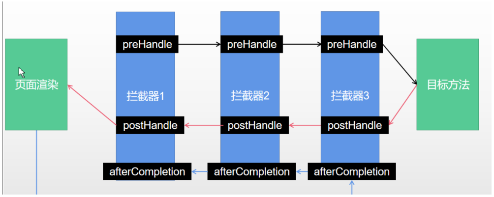
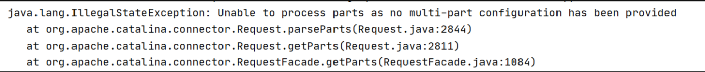
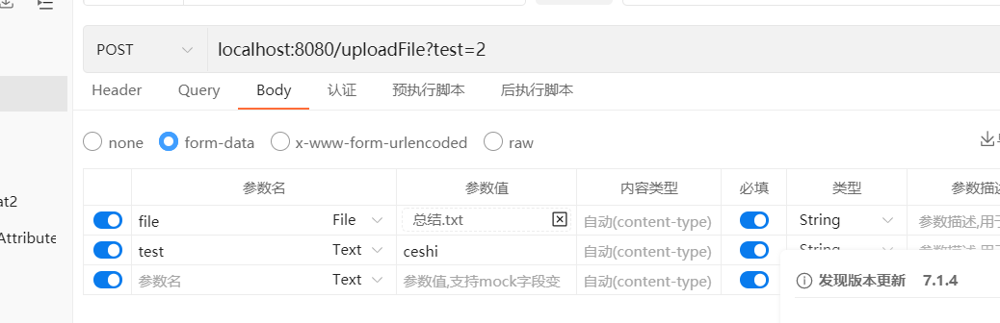

# SpringMVC重点功能源码

## SpringMVC父子容器

通常传统SSM项目中都会有一个web.xml文件

```xml
<?xml version="1.0" encoding="UTF-8"?>
<web-app xmlns:xsi="http://www.w3.org/2001/XMLSchema-instance"
	xmlns="http://java.sun.com/xml/ns/javaee"
	xsi:schemaLocation="http://java.sun.com/xml/ns/javaee http://java.sun.com/xml/ns/javaee/web-app_3_0.xsd"
	id="WebApp_ID" version="3.0">
	<!-- Spring Framework -->
    <listener>
        <listener-class>org.springframework.web.context.ContextLoaderListener</listener-class>
    </listener>

    <context-param>
        <param-name>contextConfigLocation</param-name>
        <param-value>/WEB-INF/spring-mvc.xml</param-value>
    </context-param>

    <servlet>
        <servlet-name>app</servlet-name>
        <servlet-class>org.springframework.web.servlet.DispatcherServlet</servlet-class>
        <init-param>
            <param-name>contextConfigLocation</param-name>
            <param-value></param-value>
        </init-param>
        <load-on-startup>1</load-on-startup>
    </servlet>
    <servlet-mapping>
        <servlet-name>app</servlet-name>
        <url-pattern> /*</url-pattern>
    </servlet-mapping>
    	
</web-app>
```

定义了一个Listener和Servlet, 

1. 在tomcat启动时，解析web.xml， tomcat先扫描<listener>并创建ContextLoaderListener对象， 并调用contextInitialized执行初始化；
2. 扫描<servlet>时， 默认不会创建Servlet对象， 由于DispatcherServlet设置loadOnStartUp属性为1， 表示在tomcat启动时，需要创建Servlet； 在tomcat执行完listener操作后，会创建DispatcherServlet, 再调用DispatcherServlet#init执行初始化；

### 父容器创建与加载

1. 类加载时，会执行静态代码块， 加载ContextLoader.properties文件， 设置默认容器类型为XmlWebApplicationContext
2. 创建监听器后，会调用初始化contextInitialized方法，该方法创建并加载父容器
   - 调用createWebApplicationContext创建父容器对象XmlWebApplicationContext
     - 若<context-param>定义了contextClass属性，则使用配置文件中的contextClass作为容器类型;
     - 若未定义contextClass属性， 则使用类加载时从ContextLoader.properties获得的容器类型XmlWebApplicationContext;
   - 获取配置文件位置；
     - 从ServletContext中获取contextConfigLocation参数值， 作为配置文件；
   - 刷新容器
     - 调用XmlWebApplicationContext#refresh刷新容器，解析配置文件, 创建Bean等
   - 至此，父容器创建并加载完毕， 会将父容器设置给ServletContext,key为ROOT_WEB_APPLICATION_CONTEXT_ATTRIBUTE
     - 设置到ServletContext中，子容器可通过ServletContext获取到父容器；


```java
public class ContextLoaderListener extends ContextLoader implements ServletContextListener {
    public ContextLoaderListener() {
    }
    public void contextInitialized(ServletContextEvent event) {
        this.initWebApplicationContext(event.getServletContext());
    }
}

public WebApplicationContext initWebApplicationContext(ServletContext servletContext) {
//...

   try {
      if (this.context == null) {
         this.context = createWebApplicationContext(servletContext);
      }
      if (this.context instanceof ConfigurableWebApplicationContext) {
         ConfigurableWebApplicationContext cwac = (ConfigurableWebApplicationContext) this.context;
         if (!cwac.isActive()) {
			//...
            configureAndRefreshWebApplicationContext(cwac, servletContext);
         }
      }
      servletContext.setAttribute(WebApplicationContext.ROOT_WEB_APPLICATION_CONTEXT_ATTRIBUTE, this.context);
	//...
      return this.context;
   }
   catch (RuntimeException | Error ex) {
      throw ex;
   }
}
```

```java
protected void configureAndRefreshWebApplicationContext(ConfigurableWebApplicationContext wac, ServletContext sc) {
	//...
   //设置配置文件路径
   String configLocationParam = sc.getInitParameter(CONFIG_LOCATION_PARAM);
   if (configLocationParam != null) {
      wac.setConfigLocation(configLocationParam);
   }
	//刷新容器
   wac.refresh();
}
```


```java
//ContextLoader
private static final String DEFAULT_STRATEGIES_PATH = "ContextLoader.properties";

private static final Properties defaultStrategies;

static {
   try {
      ClassPathResource resource = new ClassPathResource(DEFAULT_STRATEGIES_PATH, ContextLoader.class);
      defaultStrategies = PropertiesLoaderUtils.loadProperties(resource);
   }
   catch (IOException ex) {
   }
}
```

```properties
org.springframework.web.context.WebApplicationContext=org.springframework.web.context.support.XmlWebApplicationContext
```

### 子容器的创建与加载

创建DispatcherServlet并调用init方法执行初始化；

DispatcherServlet属性DEFAULT_CONTEXT_CLASS指定了容器为XmlWebApplicationContext;


过程：

1. DispatcherServlet类加载时，调用静态代码块，加载DispatcherServlet.properties配置文件，配置SpringMVC的核心运行组件；
2. 创建DispatcherServlet对象
3. 执行初始化init； init() =>initServletBean()=>initWebApplicationContext()
   - 获取父容器rootApplicationContext
     - 从ServletContext获取父容器，key为ROOT_WEB_APPLICATION_CONTEXT_ATTRIBUTE
   - 创建并刷新Web子容器
     - 创建Web子容器； 类型为WebXMLApplicationContext对象；
     - 设置父容器属性parent为rootApplicationContext;
     - 容器设置配置文件路径contextConfigLocation，即web的配置文件
     - 容器注册ContextRefreshListener监听，监听ContextRefreshedEvent事件；
     - 调用容器refresh方法；
       - 刷新结束后，会发布ContextRefreshEvent事件， ContextRefreshListener监听执行SpringMVC组件的初始化；
         - 调用DispatcherServlet#onRefresh方法，最终调用initStrategies方法
4. 执行SpringMVC核心组件初始化
   - 初始化MultipartResolver
   - 初始化HandlerMapping
   - 初始化HandlerAdapter
   - 初始化HandlerExceptionResolver
   - 初始化ViewResolver
   - ...等

若是容器刷新后，容器中没有SpringMVC的核心组件， SpringMVC组件初始化会从DispatcherServlet.properties获取到基础组件类， 再进行初始化；

```properties
org.springframework.web.servlet.LocaleResolver=org.springframework.web.servlet.i18n.AcceptHeaderLocaleResolver

org.springframework.web.servlet.ThemeResolver=org.springframework.web.servlet.theme.FixedThemeResolver

org.springframework.web.servlet.HandlerMapping=org.springframework.web.servlet.handler.BeanNameUrlHandlerMapping,\
   org.springframework.web.servlet.mvc.method.annotation.RequestMappingHandlerMapping,\
   org.springframework.web.servlet.function.support.RouterFunctionMapping

org.springframework.web.servlet.HandlerAdapter=org.springframework.web.servlet.mvc.HttpRequestHandlerAdapter,\
   org.springframework.web.servlet.mvc.SimpleControllerHandlerAdapter,\
   org.springframework.web.servlet.mvc.method.annotation.RequestMappingHandlerAdapter,\
   org.springframework.web.servlet.function.support.HandlerFunctionAdapter


org.springframework.web.servlet.HandlerExceptionResolver=org.springframework.web.servlet.mvc.method.annotation.ExceptionHandlerExceptionResolver,\
   org.springframework.web.servlet.mvc.annotation.ResponseStatusExceptionResolver,\
   org.springframework.web.servlet.mvc.support.DefaultHandlerExceptionResolver

org.springframework.web.servlet.RequestToViewNameTranslator=org.springframework.web.servlet.view.DefaultRequestToViewNameTranslator

org.springframework.web.servlet.ViewResolver=org.springframework.web.servlet.view.InternalResourceViewResolver

org.springframework.web.servlet.FlashMapManager=org.springframework.web.servlet.support.SessionFlashMapManager
```

默认提供了3个HandlerMapping，4个HandlerAdapter，这些概念在后续DispatcherServlet处理请求时都是会用到的。


#### HandlerMapping初始化

1. 会先从Spring容器中获取HandlerMapping类型的Bean对象，如果不为空，那么就获取出来的Bean对象赋值给DispatcherServlet的handlerMappings属性
2. 如果没有获取到，则会从DispatcherServlet.properties文件中读取配置，从而得到SpringMVC默认给我们配置的HandlerMapping

```java
private void initHandlerMappings(ApplicationContext context) {
   this.handlerMappings = null;
   if (this.detectAllHandlerMappings) {
      Map<String, HandlerMapping> matchingBeans =
            BeanFactoryUtils.beansOfTypeIncludingAncestors(context, HandlerMapping.class, true, false);
      if (!matchingBeans.isEmpty()) {
         this.handlerMappings = new ArrayList<>(matchingBeans.values());
         AnnotationAwareOrderComparator.sort(this.handlerMappings);
      }
   }
   if (this.handlerMappings == null) {
      this.handlerMappings = getDefaultStrategies(context, HandlerMapping.class);

   }
}
```

##### RequestMappingHandlerMapping创建与初始化

RequestMappingHandlerMapping负责解析@PostMapping方式的处理器， HandlerMapping通过BeanFactory#getBean进行实例化；

1. 创建RequestMappingHandlerMapping对象
2. 执行RequestMappingHandlerMapping初始化
   - 实现了InitializingBean， Bean的生命周期中，初始化会调用afterPropertiesSet方法；
     - 获取所有bean的beanName， 遍历所有beanName;
     - 获取beanName的类beanType， 类上不存在@Controller或者@PostMapping注解，则返回；否则是一个Handler;
     - 获取beanType所有方法并遍历， 找出@PostMapping的方法， 解析方法上的@PostMapping信息，创建PostMappingInfo对象info， 解析类上的@PostMapping信息， 创建RequestMappingInfo对象handlerInfo,  结合类上@PostMapping路径， 以及方法@PostMapping的路径得到handler的请求路径并设置给方法PostMapping对应的RequestMappingInfo对象info；
     - beanType中的所有RequestMappingInfo都找到后，遍历存到MappingRegistry对象中, 
       - 创建HandlerMethod, 包装当前handler, method;
       - 以RequestMappingInfo为key, handlerMethod为value, 放入Map属性mappingLookup中；
       - 获取RequestMappingInfo的请求url,  遍历url, 以url为key, requestMappingInfo为value放入Map属性urlLookup中；
         - 细节：一个PostMapping是可以处理多个请求路径的
       - 创建MappingRegistration对象，包装requestMappingInfo, handlerMethod,所有url; 以RequestMappingInfo为key， MappingRegistration对象为value放入Map属性registry中；
3. 请求获取handler的过程
   - 根据请求路径从urlLookUp中获取RequestMappingInfo;
   - 再根据RequestMappingInfo从mappingLookUp中获取HandlerMethod,  将每个匹配的HandlerMethod与RequestMapping包装为Match对象；
   - 获取最合适的HandlerMethod返回；


```java
class MappingRegistry {

   private final Map<T, MappingRegistration<T>> registry = new HashMap<>();

   private final Map<T, HandlerMethod> mappingLookup = new LinkedHashMap<>();

   private final MultiValueMap<String, T> urlLookup = new LinkedMultiValueMap<>();

   private final Map<String, List<HandlerMethod>> nameLookup = new ConcurrentHashMap<>();

   private final Map<HandlerMethod, CorsConfiguration> corsLookup = new ConcurrentHashMap<>();

   private final ReentrantReadWriteLock readWriteLock = new ReentrantReadWriteLock();
}
```


#### HandlerAdapter初始化

1. 会先从Spring容器中获取HandlerAdapter类型的Bean对象，如果不为空，那么就获取出来的Bean对象赋值给DispatcherServlet的handlerAdapters属性
2. 如果没有获取到，则会从DispatcherServlet.properties文件中读取配置，从而得到SpringMVC默认给我们配置的handlerAdapters

##### RequestMappingHandlerAdapter创建与初始化

1. 创建RequestMappingHandlerAdapter对象； 
   - 构造方法中创建四个消息转换器HttpMessageConverter对象
     - ByteArrayHttpMessageConverter
     - StringHttpMessageConverter
     - SourceHttpMessageConverter
     - AllEncompassingFormHttpMessageConverter
2. RequestMappingHandlerAdapter初始化
   - - 从Spring容器中找到加了@ControllerAdvice的Bean对象
       - 找出所有@ModelAttribute修饰的方法Method，放入modelAttributeAdviceCache；
       - 找出所有@InitBinder修饰的方法Method, 放入initBinderAdviceCache；
       - 如果Bean对象实现了RequestBodyAdvice接口或者ResponseBodyAdvice接口，那么就把这个Bean对象记录在requestResponseBodyAdvice集合中
     - 获取用户定制的参数解析器， 并创建SpringMVC内置的方法参数解析器，放入argumentResolvers集合，HandlerMethodArgumentResolver用来解析方法参数
     - 获取用户定制的方法返回值处理器， 并创建SpringMVC内置的方法返回值处理器， 放入returnValueHandlers，ReturnValueHandler用来处理 方法返回值；


### 拦截器原理分析

1. getHandler方法返回的对象为HandlerExecutionChain、包含处理器Handler、还包含拦截器Interceptors
2. 调用处理器执行链applyPreHandle方法
   - 正向遍历执行拦截器的preHandle方法，如果拦截器返回为true、则执行下一个拦截器的preHandle方法；当所有的拦截器都返回true、才会执行目标方法；
   - 其中第index个拦截器若返回false、则从第index个拦截器开始，从后往前、倒序执行拦截器的triggerAfterCompletion方法、只要有一个拦截器返回false、就不会执行目标方法；
3. 执行目标方法Handler;
4. 调用处理器执行链的applyPostHandle方法
   - 倒序、从后往前调用拦截器的postHandle方法
5. 调用DispatcherServlet#render渲染试图；
6. 调用处理器执行链的triggerAfterCompletion方法
   - 从后往前、依次执行拦截器的triggerAfterCompletion方法；

7. 1~6步骤被trycatchfinally包住、若发生异常、则调用处理器的执行链的triggerAfterCompletion方法；



```java
protected void doDispatch(HttpServletRequest request, HttpServletResponse response) throws Exception {
	//声明处理器执行链
   HandlerExecutionChain mappedHandler = null;
   try {
      try {
         // 1. 拿到处理器执行链；
         mappedHandler = getHandler(processedRequest);


         // 拿到处理器适配器
         HandlerAdapter ha = getHandlerAdapter(mappedHandler.getHandler());

		 //2. 调用拦截器的preHandle方法
         if (!mappedHandler.applyPreHandle(processedRequest, response)) {
            return;
         }

         // 3. 执行目标方法
         mv = ha.handle(processedRequest, response, mappedHandler.getHandler());
		 
         // 4. 执行拦截器的postHandle
         mappedHandler.applyPostHandle(processedRequest, response, mv);
      }
      catch (Exception ex) {
         dispatchException = ex;
      }
      catch (Throwable err) {
         dispatchException = new NestedServletException("Handler dispatch failed", err);
      }
      processDispatchResult(processedRequest, response, mappedHandler, mv, dispatchException);
   }
   catch (Exception ex) {
       //7. 服务发生异常、从后往前调用拦截器的triggerAfterCompletion;
      triggerAfterCompletion(processedRequest, response, mappedHandler, ex);
   }
   catch (Throwable err) {
      triggerAfterCompletion(processedRequest, response, mappedHandler,
            new NestedServletException("Handler processing failed", err));
   }
   finally {

   }
}
private void processDispatchResult(HttpServletRequest request, HttpServletResponse response,
      @Nullable HandlerExecutionChain mappedHandler, @Nullable ModelAndView mv,
      @Nullable Exception exception) throws Exception {


   //  5. 视图渲染
   if (mv != null && !mv.wasCleared()) {
      render(mv, request, response);
      if (errorView) {
         WebUtils.clearErrorRequestAttributes(request);
      }
   }

	//6. 正常执行完成、调用拦截器的triggerAfterCompletion方法；
   if (mappedHandler != null) {
      // Exception (if any) is already handled..
      mappedHandler.triggerAfterCompletion(request, response, null);
   }
}

```


### MultipartFile与文件上传

#### 传统Servlet实现文件上传

传统Servlet的文件上传， 通过reques.getParts获取请求体的所有段内容；

```java
public class UploadServlet extends HttpServlet {
    @Override
    protected void doPost(HttpServletRequest request, HttpServletResponse response) throws IOException, ServletException {
        Collection<Part> partCollection = request.getParts();
        partCollection.forEach(part -> {
            String header = part.getHeader("content-disposition");
            String fileName = getFileName(header);
            try {
                if (fileName != null) {
                    part.write("C:\\ProgramData\\ASUS\\ASUS Live Update\\Temp\\" + fileName);
                }
            } catch (IOException e) {
                e.printStackTrace();
            }
        });
        response.setCharacterEncoding("utf-8");
        response.setContentType("text/html;charset=utf-8");
        PrintWriter out = response.getWriter();
        out.println("上传成功");
        out.flush();
        out.close();
    }

    public String getFileName(String header) {
        String[] arr = header.split(";");
        if (arr.length < 3) return null;
        String[] arr2 = arr[2].split("=");
        String fileName = arr2[1].substring(arr2[1].lastIndexOf("\\") + 1).replaceAll("\"", "");
        return fileName;
    }
	//...
}
```

通过postman测试时， 报错



若是传统JavaWeb项目， 则xml中需要配置：

```xml
	<servlet>
		<servlet-name>AfGenericService</servlet-name>
		<servlet-class>af.web.service.AfGenericService</servlet-class>
		<multipart-config></multipart-config>
	</servlet>
```

若是SpringBoot，则注册Servlet时需要设置：

```java
@Configuration
public class UploadConfig {

    @Bean
    public ServletRegistrationBean myServlet(){

        ServletRegistrationBean servletRegistrationBean = new ServletRegistrationBean(new UploadServlet(),"/uploadServlet");
        servletRegistrationBean.setMultipartConfig(new MultipartConfigElement(""));
        return servletRegistrationBean;
    }
}
```

Servlet3.0之后，调用Request#getParts需要加上该配置；

#### SpringMVC实现文件上传

```java
@Controller
public class UploadController {

    @PostMapping("/uploadFile")
    @ResponseBody
    public void upload(MultipartFile file) {
        System.out.println(file.getOriginalFilename());
        System.out.println(file.getName());
    }
}
```

```java
@Controller
public class UploadController {

    @PostMapping("/uploadFile")
    @ResponseBody
    public void upload(MultipartFile file, String test) {
        System.out.println(file.getOriginalFilename());
        System.out.println(file.getName());
        System.out.println(test);
    }
}
//test打印的结果是：ceshi,2
//会将请求URL参数和表单参数一起拿到；
```



如果单纯只想到表单里的test字段，则可使用@RequestPart；

```java
@Controller
public class UploadController {

    @PostMapping("/uploadFile")
    @ResponseBody
    public void upload(MultipartFile file, @RequestPart("test") String test) {
        System.out.println(file.getOriginalFilename());
        System.out.println(file.getName());
        System.out.println(test);
    }
}
//test打印结果：ceshi

@Controller
public class UploadController {

    @PostMapping("/uploadFile")
    @ResponseBody
    public void upload(@RequestPart("file") MultipartFile file, @RequestPart("test") String test) {
        System.out.println(file.getOriginalFilename());
        System.out.println(file.getName());
        System.out.println(test);
    }
}
//test打印结果：ceshi
```

#### 文件上传流程分析

当接收到一个文件上传请求后：

1. SpringMVC利用MultipartResolver来判断当前请求是不是一个multipart/form-data请求
2. 包装原生Request为StandardMultipartHttpServletRequest类型；
   - 构造方法中，会解析请求的所有Part，遍历
   - 从每个Part头中获取“Content-Disposition”值，解析出fileName文件名称；
   - 包装Part和fileName为StandardMultipartFile对象
   - 以字段名为key,  StandardMultipartFile为value,  放入包装Request属性multipartFiles中；
3. 将包装后的request替换原生的request；后续方法使用Request都是包装后的Request;
4. 执行处理器前， 参数解析时， 参数类型为MultipartFile；
   - 若不存在@RequestPart， 则交由RequestParamMethodArgumentResolver处理
   - 若存在@RequestPart，则交由RequestPartMethodArgumentResolver处理
   - 调用MultipartResolutionDelegate.resolveMultipartArgument代码， 从包装Request的multipartFiles中根据字段名可获取StandardMultipartFile参数值；
5. 将MultipartFile参数值作为参数， 反射执行处理器；


### WebApplicationInitializer的方式

SpringMVC中创建DispatcherServlet方式除了XML，还可以通过WebApplicationInitializer来创建；

```java
public class MyWebApplicationInitializer implements WebApplicationInitializer {

    @Override
    public void onStartup(ServletContext servletContext) {

        // Load Spring web application configuration
        AnnotationConfigWebApplicationContext context = new AnnotationConfigWebApplicationContext();
        context.register(AppConfig.class);

        // Create and register the DispatcherServlet
        DispatcherServlet servlet = new DispatcherServlet(context);
        ServletRegistration.Dynamic registration = servletContext.addServlet("app", servlet);
        registration.setLoadOnStartup(1);
        registration.addMapping("/*");
    }
}
//扫描组件
@ComponentScan("com.zhouyu")
@Configuration
public class AppConfig  {
}
```

这种方法我们也能使用SpringMVC，流程为：

1. Tomcat启动过程中就会调用到我们所写的onStartup()
2. 从而创建一个Spring容器
3. 从而创建一个DispatcherServlet对象并初始化
4. 而DispatcherServlet初始化所做的事情和上述是一样的


为什么Tomcat启动时能调用到MyWebApplicationInitializer中的onStartup()呢？

这个跟Tomcat的提供的SPI扩展机制有关，在SpringMVC中有这样一个类：

```java
@HandlesTypes(WebApplicationInitializer.class)
public class SpringServletContainerInitializer implements ServletContainerInitializer {

    @Override
    public void onStartup(@Nullable Set<Class<?>> webAppInitializerClasses, ServletContext servletContext)
            throws ServletException {
        // ...
    }

}
```

这个类实现了javax.servlet.ServletContainerInitializer接口，并且在SpringMVC中还有这样一个文件：META-INF/services/Tomcatjavax.servlet.ServletContainerInitializer，文件内容为：

```
org.springframework.web.SpringServletContainerInitializer
```

所以**Tomcat在启动过程中会找到这个SpringServletContainerInitializer，并执行onStartup()，并且还会找到@HandlesTypes注解中所指定的WebApplicationInitializer接口的实现类，并传递给onStartup()方法，这其中就包括了我们自己定义的MyWebApplicationInitializer。**

SpringServletContainerInitializer的onStartup()中就会调用MyWebApplicationInitializer的onStartup()方法了：

```java
@HandlesTypes(WebApplicationInitializer.class)
public class SpringServletContainerInitializer implements ServletContainerInitializer {

   @Override
   public void onStartup(@Nullable Set<Class<?>> webAppInitializerClasses, ServletContext servletContext)  throws ServletException {

      List<WebApplicationInitializer> initializers = new LinkedList<>();

      if (webAppInitializerClasses != null) {
         for (Class<?> waiClass : webAppInitializerClasses) {
            // Be defensive: Some servlet containers provide us with invalid classes,
            // no matter what @HandlesTypes says...
            if (!waiClass.isInterface() && !Modifier.isAbstract(waiClass.getModifiers()) &&
                  WebApplicationInitializer.class.isAssignableFrom(waiClass)) {
               try {
                  initializers.add((WebApplicationInitializer)
                        ReflectionUtils.accessibleConstructor(waiClass).newInstance());
               }
               catch (Throwable ex) {
                  throw new ServletException("Failed to instantiate WebApplicationInitializer class", ex);
               }
            }
         }
      }

      AnnotationAwareOrderComparator.sort(initializers);
      for (WebApplicationInitializer initializer : initializers) {
         initializer.onStartup(servletContext);
      }
   }

}
```


### @EnableWebMvc解析

该注解可用来定制化MVC的配置

```java
@ComponentScan("com")
@Configuration
@EnableWebMvc
public class WebMvcConfig implements WebMvcConfigurer {

    @Override
    public void configurePathMatch(PathMatchConfigurer configurer) {
        configurer.addPathPrefix("/zhouyu", t ->  t.equals(ZhouyuController.class));
    }

    @Override
    public void addInterceptors(InterceptorRegistry registry) {

    }
}
```

```java
@Import(DelegatingWebMvcConfiguration.class)
public @interface EnableWebMvc {
}
```

导入了一个DelegatingWebMvcConfiguration配置类，这个配置类定义了很多个Bean，比如RequestMappingHandlerMapping，后续在创建RequestMappingHandlerMapping这个Bean对象时，会调用DelegatingWebMvcConfiguration的getInterceptors()方法来获取拦截器：

```java
public RequestMappingHandlerMapping requestMappingHandlerMapping(
      @Qualifier("mvcContentNegotiationManager") ContentNegotiationManager contentNegotiationManager,
      @Qualifier("mvcConversionService") FormattingConversionService conversionService,
      @Qualifier("mvcResourceUrlProvider") ResourceUrlProvider resourceUrlProvider) {

   RequestMappingHandlerMapping mapping = createRequestMappingHandlerMapping();
   mapping.setOrder(0);
   mapping.setInterceptors(getInterceptors(conversionService, resourceUrlProvider));
   mapping.setContentNegotiationManager(contentNegotiationManager);
   return mapping;
   }
```

而在getInterceptors()方法中会调用addInterceptors()方法，从而会调用WebMvcConfigurerComposite的addInterceptors()方法，然后会遍历调用WebMvcConfigurer的addInterceptors()方法来添加拦截器;

```java
public void addInterceptors(InterceptorRegistry registry) {
    for (WebMvcConfigurer delegate : this.delegates) {
        delegate.addInterceptors(registry);
    }
}
```

delegates数据怎么来的呢？ DelegatingWebMvcConfiguration自动注入容器的WebMvcConfigurer的Bean;

```java
@Configuration(proxyBeanMethods = false)
public class DelegatingWebMvcConfiguration extends WebMvcConfigurationSupport {

   private final WebMvcConfigurerComposite configurers = new WebMvcConfigurerComposite();


   @Autowired(required = false)
   public void setConfigurers(List<WebMvcConfigurer> configurers) {
      if (!CollectionUtils.isEmpty(configurers)) {
         this.configurers.addWebMvcConfigurers(configurers);
      }
   }
    //....
}
```


WebMvcConfigurer的功能远不至于此，非常强大；

另外值得注意的是，如果加了@EnableWebMvc注解，那么Spring容器中会有三个HandlerMapping类型的Bean： @Bean从上到下；

1. RequestMappingHandlerMapping
2. BeanNameUrlHandlerMapping
3. RouterFunctionMapping

如果没有加@EnableWebMvc注解，那么Spring容器中默认也会有三个HandlerMapping类型的Bean：

1. BeanNameUrlHandlerMapping
2. RequestMappingHandlerMapping
3. RouterFunctionMapping

就顺序不一样而已，源码中是根据DispatcherServlet.properties文件来配置有哪些HandlerMapping的。