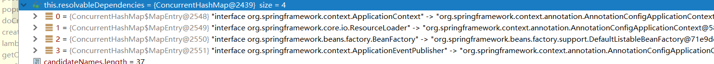
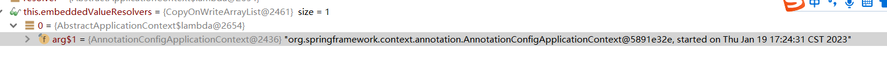
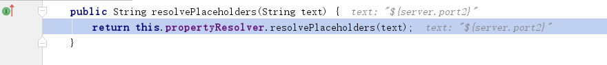

# Spring依赖注入分析(下)

@Resource, @Autowired, XML方式的autowired的自动注入最终都会经过此核心方法：

```java
//BeanFactory接口
@Nullable
Object resolveDependency(DependencyDescriptor descriptor, @Nullable String requestingBeanName,
  @Nullable Set<String> autowiredBeanNames, @Nullable TypeConverter typeConverter) throws BeansException;
```

目的：根据依赖描述(DependencyDescriptor)， 该方法根据依赖描述从BeanFactory中找出唯一的Bean对象；

## resolveDependency源码

1. 处理懒加载依赖注入getLazyResolutionProxyIfNecessary
2. 处理非懒加载依赖注入doResolveDependency

```java
@Override
@Nullable
public Object resolveDependency(DependencyDescriptor descriptor, @Nullable String requestingBeanName,
      @Nullable Set<String> autowiredBeanNames, @Nullable TypeConverter typeConverter) throws BeansException {
   descriptor.initParameterNameDiscovery(getParameterNameDiscoverer());
    // 1. 如果依赖属性或者方法参数被@Lazy修饰， 
    //或者bean标签中标记了lazy属性，则进行懒加载处理， 没有则返null
    Object result = getAutowireCandidateResolver().getLazyResolutionProxyIfNecessary(
            descriptor, requestingBeanName);
    //2. 非懒加载，则获取bean对象；
      if (result == null) {
         result = doResolveDependency(descriptor, requestingBeanName, autowiredBeanNames, typeConverter);
      }
      return result;
}
```

### 1. 懒加载属性注入getLazyResolutionProxyIfNecessary

- ContextAnnotationAutowireCandidateResolver类为AutowireCandidateResolver接口的实现类，处理懒加载依赖注入； 

- 返回的是AOP代理对象；代理TargetSource对象，代理对象时，会调用getTarget方法，获取真正的依赖对象

```java
public class ContextAnnotationAutowireCandidateResolver extends QualifierAnnotationAutowireCandidateResolver {

   //判断是否为懒加载， 是调用buildLazyResolutionProxy，否则返回null;
   @Override
   @Nullable
   public Object getLazyResolutionProxyIfNecessary(DependencyDescriptor descriptor, @Nullable String beanName) {
      return (isLazy(descriptor) ? buildLazyResolutionProxy(descriptor, beanName) : null);
   }

   protected boolean isLazy(DependencyDescriptor descriptor) {
      //处理Field的情况，判断Field是否被@Lazy标注，是则返回true;
      for (Annotation ann : descriptor.getAnnotations()) {
         Lazy lazy = AnnotationUtils.getAnnotation(ann, Lazy.class);
         if (lazy != null && lazy.value()) {
            return true;
         }
      }
      //处理MethodParameter情况， 如果方法参数被@Lazy标注，是则返回true；
      MethodParameter methodParam = descriptor.getMethodParameter();
      if (methodParam != null) {
         Method method = methodParam.getMethod();
         if (method == null || void.class == method.getReturnType()) {
            Lazy lazy = AnnotationUtils.getAnnotation(methodParam.getAnnotatedElement(), Lazy.class);
            if (lazy != null && lazy.value()) {
               return true;
            }
         }
      }
      return false;
   }

   //返回懒加载注入的对象；
   protected Object buildLazyResolutionProxy(final DependencyDescriptor descriptor, final @Nullable String beanName) {
      BeanFactory beanFactory = getBeanFactory();
      final DefaultListableBeanFactory dlbf = (DefaultListableBeanFactory) beanFactory;
	  //创建被代理的目标对象；
      TargetSource ts = new TargetSource() {
		 //....
         @Override
         public Object getTarget() {
            Set<String> autowiredBeanNames = (beanName != null ? new LinkedHashSet<>(1) : null);
            Object target = dlbf.doResolveDependency(descriptor, beanName, autowiredBeanNames, null);
            if (target == null) {
               throw new NoSuchBeanDefinitionException(descriptor.getResolvableType(),
                     "Optional dependency not present for lazy injection point");
            }
            if (autowiredBeanNames != null) {
               for (String autowiredBeanName : autowiredBeanNames) {
                  if (dlbf.containsBean(autowiredBeanName)) {
                     dlbf.registerDependentBean(autowiredBeanName, beanName);
                  }
               }
            }
            return target;
         }

      };
		//代理工厂，用来生产AOP代理对象；
      ProxyFactory pf = new ProxyFactory();
       //设置目标资源，即被代理对象；
      pf.setTargetSource(ts);
      Class<?> dependencyType = descriptor.getDependencyType();
      if (dependencyType.isInterface()) {
         pf.addInterface(dependencyType);
      }
       //获取代理对象
      return pf.getProxy(dlbf.getBeanClassLoader());
   }

}
```

即：**如果是懒加载依赖注入，最终返回的是AOP代理对象；**


### 2. 非懒加载依赖注入doResolveDependency

1. resolveShortcut：处理依赖注入的缓存方式；
2. 处理@Value注解的value值(${})， 通过resolveEmbeddedValue获取value的结果值；
3. resolveMultipleBeans处理@Autowired/@Resource注解的集合类型依赖注入， 根据类型找到所有符合的(bean对象/Class对象)，返回集合类型；
4. findAutowireCandidates根据类型找到符合依赖类型Type的所有(bean对象/Class对象)Map，若没找到，根据require值抛出异常或者返回空；
   -  若返回的bean数量大于1个，则determineAutowireCandidate确定最合适的依赖bean名称、再从Map中根据beanName获取(bean对象/Class对象)  ===> 这就是byType 再 byName的过程；
     - **determineAutowireCandidate  ： 找到最合适的依赖Bean的名称;**
       - 1. 处理多个bean类的Primary注解，**若一个Bean类上存在@Primary，返回该Bean对象**；若多个Bean类上同时存在@Primary， 则报错；
       - 2. 处理**多个bean类的@Priority注解**，代表优先级，值越小，优先级越高，返回值最小的Bean对象， 若存在两个优先级最高的bean, 则报错；
       - 3. 若类都没有@Primary, @Priority， 遍历Map,  **判断bean的名称和Field属性名称是否匹配，**匹配则返回该bean名称；
5. 若返回的value类型为class, 则从BeanFactory根据beanName获取bean对象；
6. 返回result

```java
@Nullable
public Object doResolveDependency(DependencyDescriptor descriptor, @Nullable String beanName,
      @Nullable Set<String> autowiredBeanNames, @Nullable TypeConverter typeConverter) throws BeansException {

   try {
      //处理缓存的依赖注入(ShortCutDependencyDescriptor)
      Object shortcut = descriptor.resolveShortcut(this);
      if (shortcut != null) {
         return shortcut;
      }
 
      Class<?> type = descriptor.getDependencyType();
	  // 处理@Value注解； 获取@Value的value值
      Object value = getAutowireCandidateResolver().getSuggestedValue(descriptor);
      if (value != null) {
         if (value instanceof String) {
            //从环境参数中获取value的替换值；${port} -> 8080的过程
            String strVal = resolveEmbeddedValue((String) value);
            BeanDefinition bd = (beanName != null && containsBean(beanName) ?
                  getMergedBeanDefinition(beanName) : null);
            value = evaluateBeanDefinitionString(strVal, bd);
         }
         //value的类型转换，获取的是字符串， 而属性Type可能是Integer等其他类型，
         TypeConverter converter = (typeConverter != null ? typeConverter : getTypeConverter());
         try {
            return converter.convertIfNecessary(value, type, descriptor.getTypeDescriptor());
         }
         catch (UnsupportedOperationException ex) {}
      }

      //处理集合类型，数组，Stream类型的依赖；
      Object multipleBeans = resolveMultipleBeans(descriptor, beanName, autowiredBeanNames, typeConverter);
      if (multipleBeans != null) {
         return multipleBeans;
      }

      //处理@Autowired, @Resource的属性依赖；根据类型获取符合类型type的Bean依赖;
      Map<String, Object> matchingBeans = findAutowireCandidates(beanName, type, descriptor);
      //没查找到符合类型的依赖，判断require的值， true则报错，false则返回null;
      if (matchingBeans.isEmpty()) {
         if (isRequired(descriptor)) {
            raiseNoMatchingBeanFound(type, descriptor.getResolvableType(), descriptor);
         }
         return null;
      }

      String autowiredBeanName;
      Object instanceCandidate;

      //找到了多个符合类型type的Bean依赖Map；
      if (matchingBeans.size() > 1) {
         //处理@Primary, @Priority注解， 再根据beanName确定唯一bean的注入Bean名称;
         autowiredBeanName = determineAutowireCandidate(matchingBeans, descriptor);
		 //...省略
          
         //根据名称，从多个符合类型type的Bean依赖Map中拿到目标bean;
         instanceCandidate = matchingBeans.get(autowiredBeanName);
      } 
      else {
         //只要查找了一个Bean依赖对象；
         Map.Entry<String, Object> entry = matchingBeans.entrySet().iterator().next();
         autowiredBeanName = entry.getKey();
         instanceCandidate = entry.getValue();
      }

      if (autowiredBeanNames != null) {
         autowiredBeanNames.add(autowiredBeanName);
      }
      //如果value的类型为class, 则从BeanFactory根据beanName获取bean对象；
      if (instanceCandidate instanceof Class) {
         instanceCandidate = descriptor.resolveCandidate(autowiredBeanName, type, this);
      }
      Object result = instanceCandidate;
	  //返回
      return result;
   }
   finally {}
}
```


### 3. findAutowiredCandidate  获取符合条件的bean对象

1. 从BeanFactory中获取requiredType类型的bean名称；
   - 遍历BeanDefinitionNames，根据Bean定义名称获取Bean定义， 根据BeanDefinition可判断是否为requiredType类型；
   - 也可以根据BeanDefitionName, 获取单例Bean， 判断Bean对象类型是否为requiredType；
2.  遍历resolvableDependencies， 判断key是否和requireType是否匹配，匹配则加入result；
   
   - resolvableDependencies包含类型为： ApplicationContext、 ResourceLoader、 BeanFactory, ApplicationEventPublisher；
   
   
3. 遍历根据类型找出来的beanNames，判断是否能被自动注入；
   - 判断是否为自引用， 是则跳过，否则下一步
   - 根据beanName获取BeanDefinition, 若isAutowiredCandidate为true, 则匹配， 进行下一步
   - 判断当前type是否为泛型， 如果为泛型， 则获取泛型的真正类型进行匹配， 如果匹配，进行下一步；
   - 处理DependencyDescriptor上的@Qualifier注解， 若存在，则判断beanName类是否定义了@Qualifier注解， 并且是否和当前的@Qualifier相等，相等则匹配；
   - 通过验证后，beanName就是可注入的，加入result中；
4. 处理自引用类型的依赖注入；

```java
protected Map<String, Object> findAutowireCandidates(
      @Nullable String beanName, Class<?> requiredType, DependencyDescriptor descriptor) {
   //从BeanFactory中获取类型为requiredType的bean名称
   String[] candidateNames = BeanFactoryUtils.beanNamesForTypeIncludingAncestors(
         this, requiredType, true, descriptor.isEager());
   Map<String, Object> result = new LinkedHashMap<>(candidateNames.length);
   //遍历resolvableDependencies， 判断key是否和requiredType匹配，匹配则加入；
   for (Map.Entry<Class<?>, Object> classObjectEntry : this.resolvableDependencies.entrySet()) {
      Class<?> autowiringType = classObjectEntry.getKey();
      if (autowiringType.isAssignableFrom(requiredType)) {
         Object autowiringValue = classObjectEntry.getValue();
         autowiringValue = AutowireUtils.resolveAutowiringValue(autowiringValue, requiredType);
         if (requiredType.isInstance(autowiringValue)) {
            result.put(ObjectUtils.identityToString(autowiringValue), autowiringValue);
            break;
         }
      }
   }
  	//非自引用， isAutowiredCandidate为true, 泛型处理、@Qualifier处理后，匹配则加入；
   for (String candidate : candidateNames) {
      if (!isSelfReference(beanName, candidate) && isAutowireCandidate(candidate, descriptor)) {
         addCandidateEntry(result, candidate, descriptor, requiredType);
      }
   }
   //处理自引用
   if (result.isEmpty()) {
      boolean multiple = indicatesMultipleBeans(requiredType);
      for (String candidate : candidateNames) {
      if (result.isEmpty() && !multiple) {
         for (String candidate : candidateNames) {
            if (isSelfReference(beanName, candidate) &&
                  (!(descriptor instanceof MultiElementDescriptor) || !beanName.equals(candidate)) &&
                  isAutowireCandidate(candidate, fallbackDescriptor)) {
               addCandidateEntry(result, candidate, descriptor, requiredType);
            }
         }
      }
   }
   return result;
}
```

```java
//DefaultListableBeanFactory#isAutowireCandidate
@Override
public boolean isAutowireCandidate(String beanName, DependencyDescriptor descriptor)
      throws NoSuchBeanDefinitionException {

   return isAutowireCandidate(beanName, descriptor, getAutowireCandidateResolver());
}
//省略方法...
protected boolean isAutowireCandidate(String beanName, RootBeanDefinition mbd,
      DependencyDescriptor descriptor, AutowireCandidateResolver resolver) {

   String bdName = BeanFactoryUtils.transformedBeanName(beanName);
   BeanDefinitionHolder holder = //....
   return resolver.isAutowireCandidate(holder, descriptor);
}

//QualifierAnnotationAutowireCandidateResolver#isAutowireCandidate
@Override
public boolean isAutowireCandidate(BeanDefinitionHolder bdHolder, DependencyDescriptor descriptor) {
   //泛型处理处理；
   boolean match = super.isAutowireCandidate(bdHolder, descriptor);
   //3. 处理@Qualifier注解
   if (match) {
      //Field处理@Qualifier注解；判断是否和当前BeanDefinition的@Qualifier匹配
      match = checkQualifiers(bdHolder, descriptor.getAnnotations());
      if (match) {
         //MethodParameter处理@Qualifier；判断是否和当前BeanDefinition的@Qualifier匹配
         MethodParameter methodParam = descriptor.getMethodParameter();
         if (methodParam != null) {
            Method method = methodParam.getMethod();
            if (method == null || void.class == method.getReturnType()) {
               match = checkQualifiers(bdHolder, methodParam.getMethodAnnotations());
            }
         }
      }
   }
   return match;
}
@Override
public boolean isAutowireCandidate(BeanDefinitionHolder bdHolder, DependencyDescriptor descriptor) {
   //获取Bean定义的isAutowireCandidate值,则不可注入
   if (!super.isAutowireCandidate(bdHolder, descriptor)) {
      // If explicitly false, do not proceed with any other checks...
      return false;
   }
   //2. 泛型处理，找到真正的类型；
   return checkGenericTypeMatch(bdHolder, descriptor);
}
//1. 获取Bean定义的isAutowireCandidate值；
@Override
public boolean isAutowireCandidate(BeanDefinitionHolder bdHolder, DependencyDescriptor descriptor) {
   return bdHolder.getBeanDefinition().isAutowireCandidate();
}
```


### 处理@Value值-resolveEmbeddedValue

StringValueResolver:字符串值处理器， 默认情况下，spring进行Bean的创建前，会通过lambda表达式创建StringValueResolver对象；

```java
@Override
@Nullable
public String resolveEmbeddedValue(@Nullable String value) {
   String result = value;
   for (StringValueResolver resolver : this.embeddedValueResolvers) {
      result = resolver.resolveStringValue(result);
      if (result == null) {
         return null;
      }
   }
   return result;
}
```




```java
void addEmbeddedValueResolver(StringValueResolver valueResolver);
protected void finishBeanFactoryInitialization(ConfigurableListableBeanFactory beanFactory) {

   //创建StringValueResolver实例； 获取环境参数，替换@Value的value值；
   if (!beanFactory.hasEmbeddedValueResolver()) {
      beanFactory.addEmbeddedValueResolver(strVal -> getEnvironment().resolvePlaceholders(strVal));
   }

   // 创建非懒加载的单例bean
   beanFactory.preInstantiateSingletons();
}
```

```java
//StandardElement#resolvePlaceholders，调用内部的属性解析器解析@Value的value值；PropertyResolver接口实现类为PropertySourcePropertyResolver; 
@Override
public String resolvePlaceholders(String text) {
   return this.propertyResolver.resolvePlaceholders(text);
}
```



```java
//PropertySourcePropertyResolver#resolvePlaceholders； 传入Helper对象，负责替换value值；
@Override
public String resolvePlaceholders(String text) {
   if (this.nonStrictHelper == null) {
      this.nonStrictHelper = createPlaceholderHelper(true);
   }
   return doResolvePlaceholders(text, this.nonStrictHelper);
}

private String doResolvePlaceholders(String text, PropertyPlaceholderHelper helper) {
   return helper.replacePlaceholders(text, this::getPropertyAsRawString);
}
```

```java
//PropertyPlaceHolderHelper#doResolvePlaceholders
public String replacePlaceholders(String value, PlaceholderResolver placeholderResolver) {
   Assert.notNull(value, "'value' must not be null");
   return parseStringValue(value, placeholderResolver, null);
}
```

核心方法

1. 找到前缀"${"的位置startIndex;
2. 找到后缀"}"的位置endIndex;
3. @Value的value值进行截取得到placeholder， "${server.port2}" ==> server.port
4. 递归调用parseStringValue，防止parseStringValue中还包含"${}";
5. placeholderResolver.resolvePlaceholder(placeholder) 获取到初步的替换值propVal
6. 再次递归parseStringValue解析替换值propVal， 防止该替换值是另一个配置的key
   - 替换后的值也可能是"${}"， 即 xxx=${yyy}, 这时候，拿到的${xxx}, 拿到的值为${yyy},需要将${yyy}解析出来；
7. 拿到最终结果，将key替换为value;

```java
protected String parseStringValue(
      String value, PlaceholderResolver placeholderResolver, @Nullable Set<String> visitedPlaceholders) {

   int startIndex = value.indexOf(this.placeholderPrefix);
   if (startIndex == -1) {
      return value;
   }

   StringBuilder result = new StringBuilder(value);
   while (startIndex != -1) {
      int endIndex = findPlaceholderEndIndex(result, startIndex);
      if (endIndex != -1) {
         String placeholder = result.substring(startIndex + this.placeholderPrefix.length(), endIndex);
         String originalPlaceholder = placeholder;
         //@Value("${serverName:${ip}}") 会出现多个嵌套，此时递归先解析内层的替换符；
         placeholder = parseStringValue(placeholder, placeholderResolver, visitedPlaceholders);
         //从环境参数中获取该key的值
         String propVal = placeholderResolver.resolvePlaceholder(placeholder);
		 //...
         if (propVal != null) {
            //获取的替换值可能 是一个环境参数的key 
            //解析出来的值，也可以包含${}， 因此，还需要递归解析值的${};
            propVal = parseStringValue(propVal, placeholderResolver, visitedPlaceholders);
            //替换原来的key，拿到真正结果result；
            result.replace(startIndex, endIndex + this.placeholderSuffix.length(), propVal);
            startIndex = result.indexOf(this.placeholderPrefix, startIndex + propVal.length());
         } 
         visitedPlaceholders.remove(originalPlaceholder);
      }
      else {
         startIndex = -1;
      }
   }
   return result.toString();
}
```

```java
@Override
@Nullable
protected String getPropertyAsRawString(String key) {
   return getProperty(key, String.class, false);
}
//获取环境参数集合， 判断某个PropertySource是否包含该key, 如果包含，则就是结果值；
@Nullable
protected <T> T getProperty(String key, Class<T> targetValueType, boolean resolveNestedPlaceholders) {
   if (this.propertySources != null) {
      //propertySources包含了系统参数，系统启动参数，配置文件参数等；
      for (PropertySource<?> propertySource : this.propertySources) {
         if (logger.isTraceEnabled()) {
            logger.trace("Searching for key '" + key + "' in PropertySource '" +
                  propertySource.getName() + "'");
         }
         //判断是否存在key的值；
         Object value = propertySource.getProperty(key);
         if (value != null) {
            if (resolveNestedPlaceholders && value instanceof String) {
               value = resolveNestedPlaceholders((String) value);
            }
            logKeyFound(key, propertySource, value);
            return convertValueIfNecessary(value, targetValueType);
         }
      }
   }
   return null;
}
```