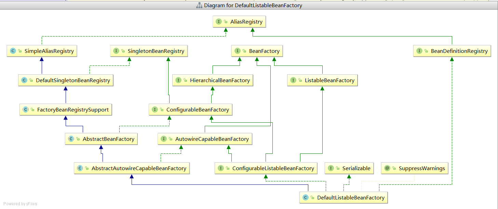
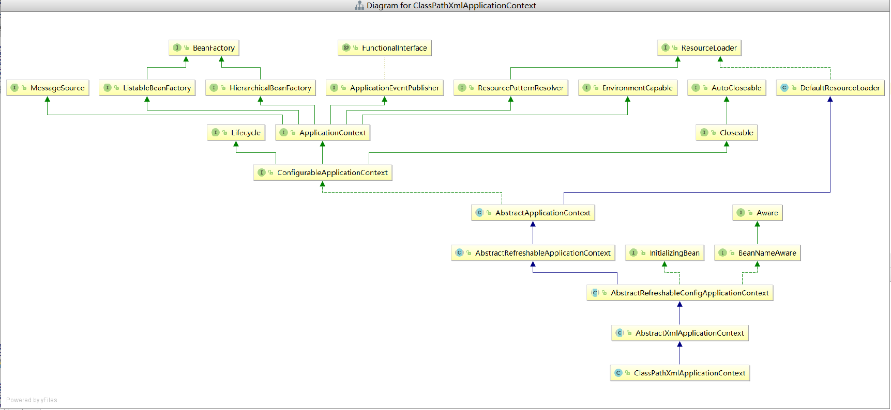

# Spring底层核心概念

## BeanDefinition

BeanDefinition表示为Bean定义、用来描述Bean的信息、Bean的信息通常包括clazz、scope、initMethodName、lazy等；

Spring中、存在几种方式定义Bean:

1. <bean />
2. @Bean
3. @Component

这通常为声明式定义Bean;

另外，还可以编程定义Bean、直接参加BeanDefinition对象；

```java
        AnnotationConfigApplicationContext context = new AnnotationConfigApplicationContext(Config.class);
//ClassPathXmlApplicationContext context = new ClassPathXmlApplicationContext("spring.xml");
        GenericBeanDefinition beanDefinition = new GenericBeanDefinition();
        beanDefinition.setBeanClass(Person.class);
        beanDefinition.setScope("singleton");
        beanDefinition.setBeanClassName("person");
        context.registerBeanDefinition(beanDefinition.getBeanClassName(), beanDefinition);


        BeanDefinition definition = context.getBeanDefinition(beanDefinition.getBeanClassName());
```


## BeanDefinitionReader

Bean定义读取器、ApplicationContext读取Bean是通过几种基础组件完成读取的。

### AnnotatedBeanDefinitionReader

该组件可以将某个Class转换为Bean定义、并解析Class的一些注解、@Scope、@Lazy、@Primary、@DependsOn、@Role、@Description；

```java
        AnnotationConfigApplicationContext context = new AnnotationConfigApplicationContext(Config.class);

        AnnotatedBeanDefinitionReader annotatedBeanDefinitionReader = new AnnotatedBeanDefinitionReader(context);

// 将User.class解析为BeanDefinition
        annotatedBeanDefinitionReader.register(User.class);

        System.out.println(context.getBean("user"));
```

### XmlBeanDefinitionReader

解析旧版的xml文件中的<bean>标签，将<bean>标签转换为Bean定义；

```java
AnnotationConfigApplicationContext context = new AnnotationConfigApplicationContext(Config.class);

XmlBeanDefinitionReader xmlBeanDefinitionReader = new XmlBeanDefinitionReader(context);
int i = xmlBeanDefinitionReader.loadBeanDefinitions("spring.xml");

System.out.println(context.getBean("pet"));
```


### ClassPathBeanDefinitionScanner

扫描器、扫描路径下的所有类、判断类是否被@Component修饰、是则将类转换为Bean定义；BeanFactory

```java
AnnotationConfigApplicationContext context = new AnnotationConfigApplicationContext();
context.refresh();

ClassPathBeanDefinitionScanner scanner = new ClassPathBeanDefinitionScanner(context);
scanner.scan("com.redis");

System.out.println(context.getBean("config"));
```

## BeanFactory

Bean工厂、用来生产Bean、而生产Bean的图纸就是BeanDefinition；即BeanFactory根据BeanDefinition生产Bean实例；

ApplicationContext是BeanFactory的一种、

```java
public interface ApplicationContext extends EnvironmentCapable, ListableBeanFactory, HierarchicalBeanFactory,
      MessageSource, ApplicationEventPublisher, ResourcePatternResolver {
}
```

ApplicationContext接口继承了ListableBeanFactory， HierarchicalBeanFactory接口， 这两个接口都继承BeanFactory， 意味着ApplicationContext拥有BeanFactory的能力；


创建ApplicationContext实例过程中，会创建DefaultListableBeanFactory、此BeanFactory的实现类是核心类，而AppContext的功能是通过调用BeanFactory实现类完成的；

### DefaultListableBeanFactory




继承很多接口，支持很多核心功能；

**BeanDefinitionRegistry: 拥有注册BeanDefinition的能力**；

**BeanFactory: 拥有生产Bean的能力**；

ListableBeanFactory ： 在BeanFactory基础上，获取Bean定义总数、获取所有的Bean定义名称、

根据Bean类型获取Bean的名称；

HierarchicalBeanFactory: 在BeanFactory基础上，添加父BeanFactory的功能；

AbstractBeanFactory ： 功能比较全面、缺少自动装配和获取Bean名称功能；

AbstractAutowireCapableBeanFactory： 继承AbstractBeanFactory， 拥有自动装配功能；

## ApplicationContext

ApplicationContext是BeanFactory的一种、还继承了其他接口，因此具备更强大的能力

- EnvironmentCapable： 获取环境变量功能；
- MessageSource ： 获取国际化功能
- ApplicationEventPublisher ： 拥有事件发布器功能；
- ResourcePatternResolver： 拥有资源加载器的功能

而AppContext接口有两个主要实现类：ClassPathXmlApplicationContext、AnnotationConfigApplicationContext;


ConfigurableApplicationContext: 拥有AppContext、另外拥有LifeCycle的功能

AbstractApplicationContext:  ConfigurableApplicationContext实现类，实现部分公共逻辑；

GenericApplicationContext： 继承AbstractApplicationContext， 另外实现了BeanDefinitionRegistry， 拥有注册Bean定义功能； 功能比较完整

AnnotationConfigApplicationContext:  继承GenericApplicationContext， 实现了AnnotationConfigRegistry， 拥有单独注册某个为类为BeanDefinition的能力；


### ClassPathXmlApplicationContext



比起AnnotationConfigApplicationContext,  没有继承BeanDefinitionRegistry功能，因此缺少注册Bean定义的功能；

### 资源加载

可以直接利用ApplicationContext获取某个文件的内容：

```java

```

```java
AnnotationConfigApplicationContext context = new AnnotationConfigApplicationContext(AppConfig.class);

Resource resource = context.getResource("file://D:\\IdeaProjects\\spring-framework\\luban\\src\\main\\java\\com\\luban\\entity\\User.java");
System.out.println(resource.contentLength());

AnnotationConfigApplicationContext context = new AnnotationConfigApplicationContext(Config.class);

Resource resource = context.getResource("file://E:\\新建文件夹 (4)\\zset\\weibo\\src\\main\\java\\com\\redis\\zset\\weibo\\test\\Person.java");
System.out.println(resource.contentLength());
System.out.println(resource.getFilename());

Resource resource1 = context.getResource("https://www.baidu.com");
System.out.println(resource1.contentLength());
System.out.println(resource1.getURL());

Resource resource2 = context.getResource("classpath:spring.xml");
System.out.println(resource2.contentLength());
System.out.println(resource2.getURL());
System.out.println(resource2.getFilename());
System.out.println(resource2.getDescription());
System.out.println(resource2.getURI());
```

### 获取运行时环境

```java
public static void main(String[] args) throws IOException {
    AnnotationConfigApplicationContext context = new AnnotationConfigApplicationContext(Config.class);

    Map<String, Object> systemEnvironment = context.getEnvironment().getSystemEnvironment();
    System.out.println(systemEnvironment);

    System.out.println("=======");

    Map<String, Object> systemProperties = context.getEnvironment().getSystemProperties();
    System.out.println(systemProperties);

    System.out.println("=======");

    MutablePropertySources propertySources = context.getEnvironment().getPropertySources();
    System.out.println(propertySources);

    System.out.println("=======");

    System.out.println(context.getEnvironment().getProperty("NO_PROXY"));
    System.out.println(context.getEnvironment().getProperty("sun.jnu.encoding"));
    System.out.println(context.getEnvironment().getProperty("zhouyu"));
}
```

## 类型转化

spring中存在许多类型转换相关的类、其中一种为实现JDK的接口的类PropertyEditorSupport,该类实现了PropertyEditor接口，为类型转换接口；

```java
public class StringToPetPropertyEditor extends PropertyEditorSupport  {
    @Override
    public void setAsText(String text) throws IllegalArgumentException {
        Pet pet = new Pet();
        pet.setName(text);
        this.setValue(pet);
    }

    public static void main(String[] args) {
        StringToPetPropertyEditor propertyEditor = new StringToPetPropertyEditor();
        propertyEditor.setAsText("1");
        Pet value = (Pet) propertyEditor.getValue();
        System.out.println(value);
    }
}
//注册到Spring
@Bean
public CustomEditorConfigurer customEditorConfigurer() {
    CustomEditorConfigurer customEditorConfigurer = new CustomEditorConfigurer();
    Map<Class<?>, Class<? extends PropertyEditor>> propertyEditorMap = new HashMap<>();

    // 表示StringToUserPropertyEditor可以将String转化成User类型，在Spring源码中，如果发现当前对象是String，而需要的类型是User，就会使用该PropertyEditor来做类型转化
    propertyEditorMap.put(Pet.class, StringToPetPropertyEditor.class);
    customEditorConfigurer.setCustomEditors(propertyEditorMap);
    return customEditorConfigurer;
}
```


```java

```

```java

@Value("test")
public Pet pet;

@PostMapping(value = "/testEditor")
@ResponseBody
public Boolean testEditor() throws IOException {
    System.out.println(pet);
    return Boolean.valueOf(true);
}
```


### ConversionService


```java
public class StringToUserConverter implements ConditionalGenericConverter {

    @Override
    public boolean matches(TypeDescriptor sourceType, TypeDescriptor targetType) {
        return sourceType.getType().equals(String.class) && targetType.getType().equals(User.class);
    }

    @Override
    public Set<ConvertiblePair> getConvertibleTypes() {
        return Collections.singleton(new ConvertiblePair(String.class, User.class));
    }

    @Override
    public Object convert(Object source, TypeDescriptor sourceType, TypeDescriptor targetType) {
        User user = new User();
        user.setUsername((String)source);
        return user;
    }

    public static void main(String[] args) {
        DefaultConversionService conversionService = new DefaultConversionService();
        conversionService.addConverter(new StringToUserConverter());
        User value = conversionService.convert("1", User.class);
        System.out.println(value);
    }
}
```

注册到Spring

```java
@Bean
public ConversionServiceFactoryBean conversionService() {
    ConversionServiceFactoryBean conversionServiceFactoryBean = new ConversionServiceFactoryBean();
    conversionServiceFactoryBean.setConverters(Collections.singleton(new StringToUserConverter()));

    return conversionServiceFactoryBean;
}
```

```java
@Value("user")
public User user;

@PostMapping(value = "/testEditor")
@ResponseBody
public Boolean testEditor() throws IOException {
    System.out.println(user);
    return Boolean.valueOf(true);
}
```

### TypeConverter

整合了PropertyEditor和ConversionService的功能，是Spring内部用的

```java
    public static void main(String[] args) throws IOException {
        SimpleTypeConverter typeConverter = new SimpleTypeConverter();
        typeConverter.registerCustomEditor(Pet.class, new StringToPetPropertyEditor());
//typeConverter.setConversionService(conversionService);
        Pet value = typeConverter.convertIfNecessary("1", Pet.class);
        System.out.println(value);
    }
```

## BeanPostProcessor

BeanPostProcess表示Bena的后置处理器，我们可以定义一个或多个BeanPostProcessor

一个BeanPostProcessor可以在**任意一个Bean**的**初始化之前**以及**初始化之后**去额外的做一些用户自定义的逻辑，当然，我们可以通过判断beanName来进行针对性处理（针对某个Bean，或某部分Bean）。

我们可以通过定义BeanPostProcessor来干涉Spring创建Bean的过程。

## BeanFactoryPostProcessor

BeanFactoryPostProcessor表示Bean工厂的后置处理器，其实和BeanPostProcessor类似，BeanPostProcessor是干涉Bean的创建过程，BeanFactoryPostProcessor是干涉BeanFactory的创建过程。比如，我们可以这样定义一个BeanFactoryPostProcessor：

```java
@Component
public class ZhouyuBeanFactoryPostProcessor implements BeanFactoryPostProcessor {

 @Override
 public void postProcessBeanFactory(ConfigurableListableBeanFactory beanFactory) throws BeansException {
  System.out.println("加工beanFactory");
 }
}
```

## FactoryBean

Bean的创建过程是可以使用BeanPostProcessor干涉， 若是想要一个Bean完全由我们自己创建，则可以通过FactoryBean接口。

```java
@Component
public class FactoryBeanService implements FactoryBean<Person> {
    @Override
    public Person getObject() throws Exception {
        Person person = new Person();
        person.setUserName("person");
        return person;
    }

    @Override
    public Class<?> getObjectType() {
        return Person.class;
    }
}
```

通过FactoryBean创建了Person类Bean,  该person不会经过Bean的生命周期流程、只会经过初始化、初始化后阶段(为了完成AOP)。FactoryBean和@Bean很多情况下是可以相互替换的， 主要差别在于@Bean方法产生的Bean经历了完整的生命周期流程；

## ExcludeFilter和IncludeFilter

这两个Filter是Spring扫描过程中用来过滤的。ExcludeFilter表示**排除过滤器**，IncludeFilter表示**包含过滤器**。


```java
@ComponentScan(value = "com.zhouyu",
  excludeFilters = {@ComponentScan.Filter(
             type = FilterType.ASSIGNABLE_TYPE, 
             classes = UserService.class)}.)
public class AppConfig {
}
```

表示扫描com.zhouyu这个包下面的所有类，但是排除UserService类，也就是就算它上面有@Component注解也不会成为Bean。

```java
@ComponentScan(value = "com.zhouyu",
  includeFilters = {@ComponentScan.Filter(
             type = FilterType.ASSIGNABLE_TYPE, 
             classes = UserService.class)})
public class AppConfig {
}
```

就算UserService类上没有@Component注解，它也会被扫描成为一个Bean。

在Spring的扫描逻辑中，默认会添加一个AnnotationTypeFilter给includeFilters，表示默认情况下Spring扫描过程中会认为类上有@Component注解的就是Bean。

## MetadataReader、ClassMetadata、AnnotationMetadata

在Spring中需要去解析类的信息，比如类名、类中的方法、类上的注解，这些都可以称之为类的元数据，所以Spring中对类的元数据做了抽象，并提供了一些工具类。

MetadataReader表示类的元数据读取器，默认实现类为**SimpleMetadataReader**。比如：

```java
public static void main(String[] args) throws IOException {
    SimpleMetadataReaderFactory simpleMetadataReaderFactory = new SimpleMetadataReaderFactory();

    // 构造一个MetadataReader
    MetadataReader metadataReader = simpleMetadataReaderFactory.getMetadataReader("com.redis.zset.weibo.test.ThymeleafController");

    // 得到一个ClassMetadata，并获取了类名
    ClassMetadata classMetadata = metadataReader.getClassMetadata();

    System.out.println(classMetadata.getClassName());

    // 获取一个AnnotationMetadata，并获取类上的注解信息
    AnnotationMetadata annotationMetadata = metadataReader.getAnnotationMetadata();
    for (String annotationType : annotationMetadata.getAnnotationTypes()) {
        System.out.println(annotationType);
    }
    
}
```

需要注意的是，SimpleMetadataReader去解析类时，使用的**ASM技术**。
​

为什么要使用ASM技术，Spring启动的时候需要去扫描，如果指定的包路径比较宽泛，那么扫描的类是非常多的，那如果在Spring启动时就把这些类全部加载进JVM了，这样不太好，所以使用了ASM技术。