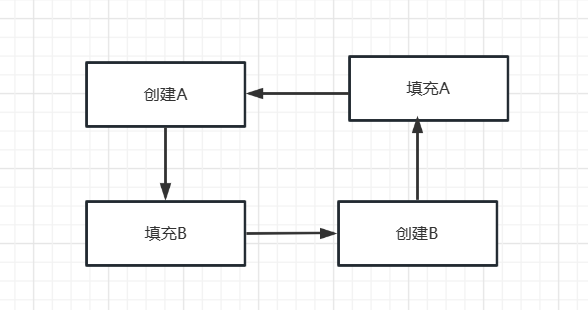
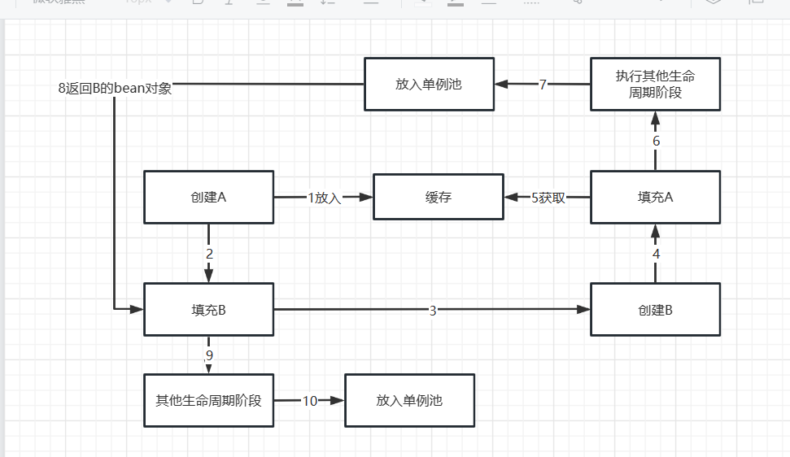
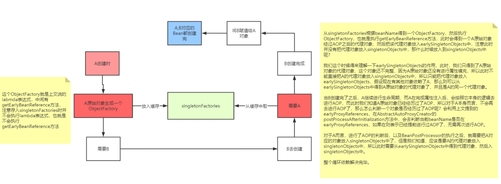

# Spring循环依赖分析


## 什么是循环依赖？

很简单，就是A对象依赖了B对象，B对象依赖了A对象。

```java
// A依赖了B
class A{
 public B b;
}

// B依赖了A
class B{
 public A a;
}
```

如果不考虑Spring，循环依赖并不是问题，因为对象之间相互依赖是很正常的事情。

```java
A a = new A();
B b = new B();

a.b = b;
b.a = a;
```

因为，在Spring中，一个对象并不是简单new出来了，而是会经过一系列的Bean的生命周期，就是因为Bean的生命周期所以才会出现循环依赖问题。当然，在Spring中，出现循环依赖的场景很多，有的场景Spring自动帮我们解决了，而有的场景则需要程序员来解决

## Bean的生命周期

Bean的生命周期指的就是：在Spring中，Bean是如何生成的？

被Spring管理的对象叫做Bean。Bean的生成步骤如下：

1. **Spring**扫描class得到BeanDefinition
2. 根据得到的BeanDefinition去生成bean
3. 首先根据class推断构造方法
4. 根据**推断出来的构造方法，反射，得到一个对象（暂时叫做原始对象）**
5. **填充原始对象中的属性（依赖注入）**
6. 如果原始对象中的***某个方法被AOP***了，那么则需要根据原始对象生成一个代理对象
7. 把最终生成的代理对象放入单例池（源码中叫做singletonObjects）中，下次getBean时就直接从单例池拿即可

这是简化版的生命周期；

当A经过(4)后， 会进行属性填充， A依赖B， spring根据属性类型和名称从BeanFactory获取B的bean对象，容器中还未创建B的bean对象， 就创建B的bean对象， 即B的生命周期；

B经过(4)后，进行属性填充，B依赖A, spring根据属性类型和名称从BeanFactory中获取A的bean对象， 因为A还没创建完成，容器中不存在A的bean对象， 就会创建A的bean对象；

这就出现了循环创建的问题，既无法创建A,也无法创建B；

在Spring中，通过某些机制帮开发者解决了部分循环依赖的问题，这个机制就是**三级缓存**。

## 三级缓存

- 一级缓存：singletonObjects; 
  - 存放经历了完整生命周期的bean对象

- 二级缓存：earlySingletonObjects;
  - 存放早期的生命周期的bean对象；即这些bean对象可能未经过属性填充、初始化等；

- 三级缓存：**singletonFactories**;
  - 存放的是ObjectFactory，是个函数式接口， 翻译即对象工厂， 用来创建早期的bean对象；




既然填充A需要拿A的bean对象， 前面创建A就已经生成Abean对象了，只是不完整的流程， 由于A的bean对象对应的是堆中一块内存， 这块内存中的数据怎么变化都没事，只要堆中地址不变就行；因此，需要缓存存储这个不完整的Abean对象；这样A，B的生命周期都能走通了。




存在的问题： 由于我们AOP的逻辑是 属性填充后的初始化后阶段执行的，如果A对象需要进行AOP，AOP返回代理对象，最终放入单例池的是AOP代理对象，而非原始对象，那么B对象属性填充拿到的A则是原始对象， 而非AOP代理对象；

**方案：只要B填充A时，从BeanFactory里获取到的是A的代理对象就可以解决这个问题；**

**实现一：在创建A后，执行AOP，生成代理对象，放入缓存，然后B属性填充A时，从缓存中获取的A的代理对象，完成生命周期；**

**实现一存在的问题：意味着每个Bean在实例化后，属性填充前都进行AOP，为了解决循环依赖，导致大部分非循环依赖的bean也执行了该流程，且AOP和Bean的生命周期强耦合， 而且Bean生命周期中，AOP是放在初始化后完成，打破了Bean生命周期的设计；**


实现二： 解决实现一存在的问题

**在A的生命周期中是无法知道A是否存在循环依赖的， 只有在B的生命周期中，属性填充A时， 从缓存中拿到A, 且A正在创建， 则可以说明A存在循环依赖**， 此时再执行AOP操作。才是合理的。  那么， 如何获取A实例化后的原始bean对象呢？ **搞一个Map存储？ 可以，然后再B填充A时，从Map中拿到，再进行AOP，这样做，代码太难看**；

有更好的方法：**获取A原始对象以及AOP操作，都是对象的操作， 可以创建一个对象， 保存BeanA, 以及调用AOP代码。而在Spring中，该对象用一个lambda表达式对象，表示一段逻辑，即存储A，以及A的AOP；lambda表达式对象类型为ObjectFactory, 是一个函数式接口；对应的就是第三级缓存singletonFactories, key为beanName, value为ObjectFactory;**


实现二存在的问题：

如果B属性填充A,  从singletonFactories拿到A的ObjectFactory缓存，执行AOP获取A的代理对象返回(也可能不执行AOP，返回原始对象)；如果存在其他的BeanC, BeanD, 都循环依赖A， 那每次都要获取ObjectFactory执行AOP，明显不合理，这样就会出现多个代理对象，BeanB, BeanC, BeanD拿到了不同的代理对象， 但是BeanA是单例的，违反了单例原则

实现三：解决实现二问题

拿到ObjectFactory, 执行AOP获取到A的代理对象，该对象需要缓存起来，且要将ObjectFactory移除掉(没有存在的意义)，  Spring中存储代理对象的缓存为二级缓存earlySingletonObjects，这样，属性填充A时，获取beanA对象流程就是： 

1. 先从singletonObjects获取，拿到就返回
2. 若没拿到则从earlySingletonObjects获取，拿到就返回；
3. 若也没拿到则从singletonFactories中获取，如果需要AOP则返回代理对象，不需要则返回原始对象， 再将返回对象放入earlySingletonObjects, 将singletonFactories中的缓存移除；


因此，Spring中解决循环依赖的关键缓存是singletonFactories缓存；

```java
//DefaultListableBeanFactory#doCreateBean
protected Object doCreateBean(String beanName, RootBeanDefinition mbd, @Nullable Object[] args)  throws BeanCreationException {

   //Bean实例化
   if (instanceWrapper == null) {
      instanceWrapper = createBeanInstance(beanName, mbd, args);
   }
   Object bean = instanceWrapper.getWrappedInstance();
   Class<?> beanType = instanceWrapper.getWrappedClass();
   //判断是否为单例、 且 是否支持循环依赖 且是否正在创建中， 成立  
   boolean earlySingletonExposure = (mbd.isSingleton() && this.allowCircularReferences &&
         isSingletonCurrentlyInCreation(beanName));
   if (earlySingletonExposure) {
      //加入第三级缓存singletonFactories, value为一段lambda表达式
      addSingletonFactory(beanName, () -> getEarlyBeanReference(beanName, mbd, bean));
   }

   Object exposedObject = bean;
   try {
      //属性填充
      populateBean(beanName, mbd, instanceWrapper);
      //初始化
      exposedObject = initializeBean(beanName, exposedObject, mbd);
   }
   catch (Throwable ex) {//...
   }
}
protected void addSingletonFactory(String beanName, ObjectFactory<?> singletonFactory) {
   synchronized (this.singletonObjects) {
      if (!this.singletonObjects.containsKey(beanName)) {
         this.singletonFactories.put(beanName, singletonFactory);
         this.earlySingletonObjects.remove(beanName);
         this.registeredSingletons.add(beanName);
      }
   }
}

//传入bean名称，bean原始对象， bean定义
protected Object getEarlyBeanReference(String beanName, RootBeanDefinition mbd, Object bean) {
   Object exposedObject = bean;
   if (!mbd.isSynthetic() && hasInstantiationAwareBeanPostProcessors()) {
      for (BeanPostProcessor bp : getBeanPostProcessors()) {
         if (bp instanceof SmartInstantiationAwareBeanPostProcessor) {
            SmartInstantiationAwareBeanPostProcessor ibp = (SmartInstantiationAwareBeanPostProcessor) bp;
            exposedObject = ibp.getEarlyBeanReference(exposedObject, beanName);
         }
      }
   }
   return exposedObject;
}
```

```java
//对InstantiationAwareBeanPostProcessor的扩展接口；
public interface SmartInstantiationAwareBeanPostProcessor extends InstantiationAwareBeanPostProcessor {

   //获取bean的类型
   @Nullable
   default Class<?> predictBeanType(Class<?> beanClass, String beanName) throws BeansException {
      return null;
   }
   //推断构造方法，当bean存在多个构造方法时，spring需要推断使用哪一个构造方法创建Bean对象
   @Nullable
   default Constructor<?>[] determineCandidateConstructors(Class<?> beanClass, String beanName)
         throws BeansException {

      return null;
   }

   /**
     为了早期访问特殊的bean,获取该bean的引用，典型目的是用来解决循环依赖
    */
   default Object getEarlyBeanReference(Object bean, String beanName) throws BeansException {
      return bean;
   }
}
```

Spring中，处理注解型AOP的类为AnnotationAwareAspectJAutoProxyCreator，该类继承了AbstractAutoProxyCreator，该抽象类实现了该方法；

```java
//AnnotationAwareAspectJAutoProxyCreator#getEarlyBeanReference
//earlyProxyReferences缓存已经执行了AOP的对象，避免重复执行AOP
public Object getEarlyBeanReference(Object bean, String beanName) throws BeansException {
   Object cacheKey = getCacheKey(bean.getClass(), beanName);
   if (!this.earlyProxyReferences.contains(cacheKey)) {
      this.earlyProxyReferences.add(cacheKey);
   }
   return wrapIfNecessary(bean, beanName, cacheKey);
}

//初始化后执行AOP， 先判断该bean对象是否执行过AOP， 执行过，则返回原始bean对象， 没执行过则执行AOP，返回代理对象；
@Override
public Object postProcessAfterInitialization(Object bean, String beanName) throws BeansException {
   if (bean != null) {
      Object cacheKey = getCacheKey(bean.getClass(), beanName);
      if (!this.earlyProxyReferences.contains(cacheKey)) {
         return wrapIfNecessary(bean, beanName, cacheKey);
      }
   }
   return bean;
}
```

- earlyProxyReferences ： 用来判断是否执行过AOP的缓存；



```java
@FunctionalInterface
public interface ObjectFactory<T> {

   T getObject() throws BeansException;

}
```

左边文字： 这个ObjectFactory是上面的lambda表达式，getObject中调用了getEarlyBeanReference，存入singletonFactories中不会执行lambda表达式，即不会调用getEarlyBeanReference；

右边文字：

从singeltonFactories中根据bean得到ObjectFactory, 调用ObjectFactory#getObject， getObject调用getEarlyBeanReference, 会得到A原始对象经过AOP后的代理对象， 再将放入earlySingletonObjects中， 此时并没有放入singletonObjects， 因为bean不完整；（应该什么时候放入？）

再来理解earlySingletonObjects,  只得到了A原始对象的代理对象， 该对象还不完整， 因为A原始对象还需要进行属性填充，此时不能直接把A的代理对象放入singletonObjects中，只能把代理对象放入earlySingletonObjects中，此时若是其他对象依赖A,那么可从earlySingletonObjects得到的是A的代理对象

当B创建完之后，A继续进行生命周期， A完成属性注入后，会按照本身的逻辑进行AOP， 此时A原始对象已经经历过AOP了， 所以A不需要再执行AOP； 判断的依据就是earlyProxyReference缓存中是否存在该beanName,  存在则表示提前执行AOP了， 无需再次执行AOP，且返回A原始对象；

对A而言， AOP判断后， 以及BeanPostProcessor执行后， 就需要把A的代理对象放入singletonObjects了，但是初始化后AOP返回原始对象， 而不是代理对象， 因此需要从earlySingletonObjects中得到代理对象，然后放入singletonObjects中；

因此，整个循环依赖就结束了；

## 总结

1. **singletonObjects**：缓存经过了**完整生命周期**的bean
2. **earlySingletonObjects**：缓存**未经过完整生命周期的bean**，如果某个bean出现了循环依赖，就会**提前**把这个暂时未经过完整生命周期的bean放入earlySingletonObjects中，这个bean如果要经过AOP，那么就会把代理对象放入earlySingletonObjects中，否则就是把原始对象放入earlySingletonObjects，但是不管怎么样，就是是代理对象，代理对象所代理的原始对象也是没有经过完整生命周期的，所以放入earlySingletonObjects我们就可以统一认为是**未经过完整生命周期的bean。**
3. **singletonFactories**：缓存的是一个ObjectFactory，也就是一个Lambda表达式。在每个Bean的生成过程中，经过**实例化**得到一个原始对象后，都会提前基于原始对象暴露一个Lambda表达式，并保存到三级缓存中，这个Lambda表达式**可能用到，也可能用不到**，如果当前Bean没有出现循环依赖，那么这个Lambda表达式没用，当前bean按照自己的生命周期正常执行，执行完后直接把当前bean放入singletonObjects中，如果当前bean在依赖注入时发现出现了循环依赖（当前正在创建的bean被其他bean依赖了），则从三级缓存中拿到Lambda表达式，并执行Lambda表达式得到一个对象，并把得到的对象放入二级缓存（(如果当前Bean需要AOP，那么执行lambda表达式，得到就是对应的代理对象，如果无需AOP，则直接得到一个原始对象)）。
4. 其实还要一个缓存，就是**earlyProxyReferences**，它用来记录某个原始对象是否进行过AOP了。

5. singletonsCurrentlyInCreation： 记录正在创建的Bean对象；

