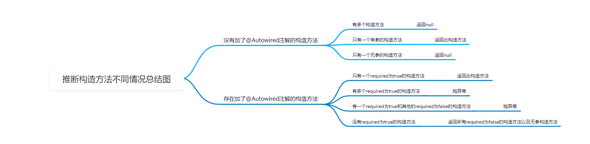

# Spring推断构造方法

Spring中的一个bean，需要实例化得到一个对象，而实例化就需要用到构造方法。

一般情况下，一个类只有一个构造方法：

1. 要么是无参的构造方法
2. 要么是有参的构造方法

如果只有**一个无参**的构造方法，那么实例化就只能使用这个构造方法了。

如果只有**一个有参**的构造方法，那么实例化时能使用这个构造方法吗？要分情况讨论：

1. 使用AnnotationConfigApplicationContext，会使用这个构造方法进行实例化，那么Spring会根据构造方法的参数信息去寻找bean，然后传给构造方法
2. 使用ClassPathXmlApplicationContext，表示使用XML的方式来使用bean，要么在XML中指定构造方法的参数值(手动指定)，要么配置**autowire=constructor**让Spring**自动**去寻找bean做为构造方法参数值。


若在多个构造方法，spring需要确定使用哪个构造方法；

1. 若指定了目标的构造方法，就是用该构造方法 ;
   -  **注解方式：@Autowired(required=true) / @Autowired 指定构造方法**
   - **XML方式： 通过<constructor-arg>标签的个数，指定构造方法的参数个数**
2. 若未指定目标构造方法， 看是否让Spring自动选择构造方法；
   -  **多个构造方法上加@Autowired(required=false) / autowired=constructor**
3. 若未让Spring自动选择，Spring会利用无参构造方法，没有则报错；


对于Spring自动选择， 只能用于ClassPathXMLApplicationContext， XML方式可以指定bean的autowired=constructor, 表示构造方法注入；

而AnnotationConfigApplicationContext没法指定某个bean自动选择构造方法；


@Autowired存在属性required，默认为true。

- **若存在多个构造方法标记了@Autowired | @Autowired(required=true), 则报错；**
  - 多个构造方法里，被 @Autowired | @Autowired(required=true)标记的只能是一个，且只能存在一个@Autowired，其他方法不能被标记
- **若存在一个@Autowired 和多个@Autowired(required=false)， 则报错；**
- **若存在多个@Autowired(required=false), Spring会自动选择；**
  - 这种情况下，相当于XML的autowired=constructor


##  Bean的实例化-createBeanInstance源码思路

Spring中doCreateBean中，调用createBeanInstance方法完成bean的实例化与构造方法推断；

1. 根据BeanDefinition加载类得到Class对象
2. 如果BeanDefinition绑定Supplier， 则调用Supplier得到对象返回；
3. 如果BeanDefinition存在factoryMethodName, 调用该工厂方法获得对象(@Bean)
4. 若BeanDefinition已经自动构造过了，则调用autowiredConstructor自动构造一个对象(prototype)
5. 调用SmartInstantiationBeanPostProcessor#determineCandidateConstructors得到哪些方法是可被使用的。
6. 若存在可用的构造方法，或者 BeanDefinition的autowired为constructor, 或者BeanDefinition指定了构造方法参数值， 或者getBean方法指定了参数args, 即getBean指定了构造方法参数值， 则调用**autowiredConstructor**自动构造一个对象；
7. 若不是，则利用无参构造方法实例化一个对象；

### 获取@Autowired标记的构造方法determineCandidateConstructors

Spring中，处理@Autowired注解是AutowiredAnnotationBeanPostProcessor, 该处理器实现了该接口；

1. 处理@Lookup注解

2. 获取类的所有构造方法

3. 遍历所有构造方法

   - 构造方法上是否存在@Autowired注解；
   - 若存在@Autowired注解
     - **判断 requiredConstructor 是否非空，非空则报错**
       - 场景：存在多个@Autowired | @Autowired(required=true)的构造方法；
       - 先遍历到required=true, 设置会requiredConstructor的值为上个构造方法， 再次遍历到required=true时， requiredConstructor就非空，此时会报错
     - **获取required属性值，若为true, 判断candidates集合是否非空，非空则报错**
       - 场景：先遍历到required=false, 构造方法会加入candidates集合， 再遍历到required=true
     - 只要存在@Autowired的**构造方法最终加入candidates集合;**
   - 若不存在注解，则判断构造方法的参数个数是否为0， 是则设置defaultConstructor为当前的无参构造方法

4.  拿到构造器数组结果candidateConstructors

   - 若candidates不为空， 同时若无参构造方法存在， 则加入candidates， 将集合转换为数组candidateConstructors返回；

     - 不为空的情况只有两种： 

       - 只有一个@Autowired | @Autowired(required=true)的构造方法 

       - 全是@Autowired(required=false)的构造方法

   - 若存在一个参构造方法（未被@Autowired标记）， 转换为数组赋值candidateConstructors

   - 否则创建长度为0的构造器数组赋值candidateConstructors；

5. 判断candidateConstructors长度大于0，则返回candidateConstructors，否则返回null;


不同情况返回结果如下：

1. 构造方法上没有+@Autowired
   - 有多个构造方法，返回null;
   - 只有一个有参构造方法，返回此构造方法
   - 只有一个无参构造方法，返回null;
2. 构造方法上有+@Autowired
   - 只有一个required=true的构造方法， 返回此构造方法；
   - 有多个required=true的构造方法，报错；
   - 有一个required=true, 多个required=false的构造方法， 报错；
   - 多个required=false的构造方法，返回所有required=false的构造方法，若存在无参构造方法，一起返回；



```java
@Override
@Nullable
public Constructor<?>[] determineCandidateConstructors(Class<?> beanClass, final String beanName) throws BeanCreationException {
	//处理lookup注解
    
   // Quick check on the concurrent map first, with minimal locking.
   Constructor<?>[] candidateConstructors = this.candidateConstructorsCache.get(beanClass);
   if (candidateConstructors == null) {
      // Fully synchronized resolution now...
      synchronized (this.candidateConstructorsCache) {
         candidateConstructors = this.candidateConstructorsCache.get(beanClass);
         if (candidateConstructors == null) {
            Constructor<?>[] rawCandidates;
            rawCandidates = beanClass.getDeclaredConstructors();
            List<Constructor<?>> candidates = new ArrayList<>(rawCandidates.length);
            Constructor<?> requiredConstructor = null;
            Constructor<?> defaultConstructor = null;

            for (Constructor<?> candidate : rawCandidates) {
               MergedAnnotation<?> ann = findAutowiredAnnotation(candidate);
               if (ann == null) {
                  Class<?> userClass = ClassUtils.getUserClass(beanClass);
                  if (userClass != beanClass) {
                     try {
                        Constructor<?> superCtor =
                              userClass.getDeclaredConstructor(candidate.getParameterTypes());
                        ann = findAutowiredAnnotation(superCtor);
                     }
                     catch (NoSuchMethodException ex) {
                        // Simply proceed, no equivalent superclass constructor found...
                     }
                  }
               }
               if (ann != null) {
                  if (requiredConstructor != null) {
                     throw new BeanCreationException(beanName,
                           "Invalid autowire-marked constructor: " + candidate +
                           ". Found constructor with 'required' Autowired annotation already: " +
                           requiredConstructor);
                  }
                  boolean required = determineRequiredStatus(ann);
                  if (required) {
                     if (!candidates.isEmpty()) {
                        throw new BeanCreationException(beanName,
                              "Invalid autowire-marked constructors: " + candidates +
                              ". Found constructor with 'required' Autowired annotation: " +
                              candidate);
                     }
                     requiredConstructor = candidate;
                  }
                  candidates.add(candidate);
               }
               else if (candidate.getParameterCount() == 0) {
                  defaultConstructor = candidate;
               }
            }
            if (!candidates.isEmpty()) {
               // Add default constructor to list of optional constructors, as fallback.
               if (requiredConstructor == null) {
                  if (defaultConstructor != null) {
                     candidates.add(defaultConstructor);
                  }
               }
               candidateConstructors = candidates.toArray(new Constructor<?>[0]);
            } else if (rawCandidates.length == 1 && rawCandidates[0].getParameterCount() > 0) {
               candidateConstructors = new Constructor<?>[] {rawCandidates[0]};
            } else {
               candidateConstructors = new Constructor<?>[0];
            }
            this.candidateConstructorsCache.put(beanClass, candidateConstructors);
         }
      }
   }
   return (candidateConstructors.length > 0 ? candidateConstructors : null);
}
```

### 构造器注入autowireConstructor()

1. 检查是否指定了构造方法参数值，或者 检查BeanDefinition是否缓存了构造方法和构造方法参数值，存在则使用这些参数进行实例化；

2. 若没有指定的构造方法或者构造参数值，则

   - 若没有确定的构造方法，则获取类的所有构造方法；

   - 若只有一个无参构造方法，则直接利用无参构造方法进行实例化；

   - 若存在多个可用的构造方法或者XML设置了autowired=constructor，则要参数自动注入；

   - 根据所指定的构造方法参数值，确定所需要的最少的构造方法参数值的个数,  正常情况下为0；

     ```java
     AbstractBeanDefinition beanDefinition = BeanDefinitionBuilder.genericBeanDefinition().getBeanDefinition();
     beanDefinition.getConstructorArgumentValues().addGenericArgumentValue("xxx");
     beanDefinition.getConstructorArgumentValues().addIndexedArgumentValue(1, "xxx");
     ```

   - 对可用的构造方法进行排序

     - 访问方式为public，构造参数个数多的排在前面

   - 遍历所有可用的构造方法

   - 检查是否找到了满足的构造方法，且当前构造参数个数小于满足的构造方法，是则不往下看

     - 因为剩下的构造方法参数只会越来越少

   - 已经找到了可以满足的贪婪构造函数，不再往下看，只剩下更少的贪婪构造函数。

   - 若getBean时未指定构造参数值，则根据构造器参数类型，参数名称从BeanFactory中找值；

     - 若是没找到，则报错，遍历下一个构造方法；

   - 若getBean时指定构造参数之，则直接利用这些值；

   - 计算构造方法的最佳分值，分值越小，优先级级别越高；

     - 若是存在两个参数类型相同，顺序不一致的构造方法，则使用前一个构造方法为准；
     - 如果根据当前构造方法找到了对应的构造方法参数值，那么这个构造方法就是可用的，但是不一定这个构造方法就是最佳的，所以这里会涉及到是否有多个构造方法匹配了同样的值，这个时候就会用值和构造方法类型进行匹配程度的打分，找到一个最匹配的

3. 若是最终没找合适的构造方法，则报错；

   - 场景： 如果有参构造方法的参数从BeanFactory无法获取到，则都不可用，就会报错；

```java
public BeanWrapper autowireConstructor(String beanName, RootBeanDefinition mbd,
      @Nullable Constructor<?>[] chosenCtors, @Nullable Object[] explicitArgs) {

   BeanWrapperImpl bw = new BeanWrapperImpl();
   this.beanFactory.initBeanWrapper(bw);

   Constructor<?> constructorToUse = null;
   ArgumentsHolder argsHolderToUse = null;
   Object[] argsToUse = null;

   if (explicitArgs != null) {
      argsToUse = explicitArgs;
   }
   else {
      Object[] argsToResolve = null;
      synchronized (mbd.constructorArgumentLock) {
         constructorToUse = (Constructor<?>) mbd.resolvedConstructorOrFactoryMethod;
         if (constructorToUse != null && mbd.constructorArgumentsResolved) {
            // Found a cached constructor...
            argsToUse = mbd.resolvedConstructorArguments;
            if (argsToUse == null) {
               argsToResolve = mbd.preparedConstructorArguments;
            }
         }
      }
      if (argsToResolve != null) {
         argsToUse = resolvePreparedArguments(beanName, mbd, bw, constructorToUse, argsToResolve);
      }
   }

   if (constructorToUse == null || argsToUse == null) {
      // Take specified constructors, if any.
      Constructor<?>[] candidates = chosenCtors;
      if (candidates == null) {
         Class<?> beanClass = mbd.getBeanClass();
         candidates = (mbd.isNonPublicAccessAllowed() ?
                  beanClass.getDeclaredConstructors() : beanClass.getConstructors());
      }

      if (candidates.length == 1 && explicitArgs == null && !mbd.hasConstructorArgumentValues()) {
         Constructor<?> uniqueCandidate = candidates[0];
         if (uniqueCandidate.getParameterCount() == 0) {
            synchronized (mbd.constructorArgumentLock) {
               mbd.resolvedConstructorOrFactoryMethod = uniqueCandidate;
               mbd.constructorArgumentsResolved = true;
               mbd.resolvedConstructorArguments = EMPTY_ARGS;
            }
            bw.setBeanInstance(instantiate(beanName, mbd, uniqueCandidate, EMPTY_ARGS));
            return bw;
         }
      }

      // Need to resolve the constructor.
      boolean autowiring = (chosenCtors != null ||
            mbd.getResolvedAutowireMode() == AutowireCapableBeanFactory.AUTOWIRE_CONSTRUCTOR);
      ConstructorArgumentValues resolvedValues = null;

      int minNrOfArgs;
      if (explicitArgs != null) {
         minNrOfArgs = explicitArgs.length;
      }
      else {
         ConstructorArgumentValues cargs = mbd.getConstructorArgumentValues();
         resolvedValues = new ConstructorArgumentValues();
         minNrOfArgs = resolveConstructorArguments(beanName, mbd, bw, cargs, resolvedValues);
      }

      AutowireUtils.sortConstructors(candidates);
      int minTypeDiffWeight = Integer.MAX_VALUE;
      Set<Constructor<?>> ambiguousConstructors = null;
      LinkedList<UnsatisfiedDependencyException> causes = null;

      for (Constructor<?> candidate : candidates) {
         int parameterCount = candidate.getParameterCount();

         if (constructorToUse != null && argsToUse != null && argsToUse.length > parameterCount) {
            // Already found greedy constructor that can be satisfied ->
            // do not look any further, there are only less greedy constructors left.
            break;
         }
         if (parameterCount < minNrOfArgs) {
            continue;
         }

         ArgumentsHolder argsHolder;
         Class<?>[] paramTypes = candidate.getParameterTypes();
         if (resolvedValues != null) {
            try {
               String[] paramNames = ConstructorPropertiesChecker.evaluate(candidate, parameterCount);
               if (paramNames == null) {
                  ParameterNameDiscoverer pnd = this.beanFactory.getParameterNameDiscoverer();
                  if (pnd != null) {
                     paramNames = pnd.getParameterNames(candidate);
                  }
               }
               argsHolder = createArgumentArray(beanName, mbd, resolvedValues, bw, paramTypes, paramNames,
                     getUserDeclaredConstructor(candidate), autowiring, candidates.length == 1);
            }
            catch (UnsatisfiedDependencyException ex) {
               if (logger.isTraceEnabled()) {
                  logger.trace("Ignoring constructor [" + candidate + "] of bean '" + beanName + "': " + ex);
               }
               // Swallow and try next constructor.
               if (causes == null) {
                  causes = new LinkedList<>();
               }
               causes.add(ex);
               continue;
            }
         }
         else {
            // Explicit arguments given -> arguments length must match exactly.
            if (parameterCount != explicitArgs.length) {
               continue;
            }
            argsHolder = new ArgumentsHolder(explicitArgs);
         }

         int typeDiffWeight = (mbd.isLenientConstructorResolution() ?
               argsHolder.getTypeDifferenceWeight(paramTypes) : argsHolder.getAssignabilityWeight(paramTypes));
         // Choose this constructor if it represents the closest match.
         if (typeDiffWeight < minTypeDiffWeight) {
            constructorToUse = candidate;
            argsHolderToUse = argsHolder;
            argsToUse = argsHolder.arguments;
            minTypeDiffWeight = typeDiffWeight;
            ambiguousConstructors = null;
         }
         else if (constructorToUse != null && typeDiffWeight == minTypeDiffWeight) {
            if (ambiguousConstructors == null) {
               ambiguousConstructors = new LinkedHashSet<>();
               ambiguousConstructors.add(constructorToUse);
            }
            ambiguousConstructors.add(candidate);
         }
      }

      if (constructorToUse == null) {
         if (causes != null) {
            UnsatisfiedDependencyException ex = causes.removeLast();
            for (Exception cause : causes) {
               this.beanFactory.onSuppressedException(cause);
            }
            throw ex;
         }
         throw new BeanCreationException(mbd.getResourceDescription(), beanName,
               "Could not resolve matching constructor " +
               "(hint: specify index/type/name arguments for simple parameters to avoid type ambiguities)");
      }

      if (explicitArgs == null && argsHolderToUse != null) {
         argsHolderToUse.storeCache(mbd, constructorToUse);
      }
   }
   bw.setBeanInstance(instantiate(beanName, mbd, constructorToUse, argsToUse));
   return bw;
}
```

## 为什么分越少优先级越高？

主要是计算找到的bean和构造方法参数类型匹配程度有多高。

假设bean的类型为A，A的父类是B，B的父类是C，同时A实现了接口D
如果构造方法的参数类型为A，那么完全匹配，得分为0
如果构造方法的参数类型为B，那么得分为2
如果构造方法的参数类型为C，那么得分为4
如果构造方法的参数类型为D，那么得分为1

可以直接使用如下代码进行测试：

```java
Object[] objects = new Object[]{new A()};

// 0
System.out.println(MethodInvoker.getTypeDifferenceWeight(new Class[]{A.class}, objects));

// 2
System.out.println(MethodInvoker.getTypeDifferenceWeight(new Class[]{B.class}, objects));

// 4
System.out.println(MethodInvoker.getTypeDifferenceWeight(new Class[]{C.class}, objects));

// 1
System.out.println(MethodInvoker.getTypeDifferenceWeight(new Class[]{D.class}, objects));
```

所以，我们可以发现，越匹配分数越低。

## @Bean的情况

首先，Spring会把@Bean修饰的方法解析成BeanDefinition：

1. 如果方法不是static的，那么解析出来的BeanDefinition中：
   1. factoryBeanName为AppConfig所对应的beanName，比如"appConfig"
   2. factoryMethodName为对应的方法名，比如"aService"
   3. factoryClass为AppConfig.class
2. 如果方法是static的，那么解析出来的BeanDefinition中：
   1. factoryBeanName为null
   2. factoryMethodName为对应的方法名，比如"aService"
   3. factoryClass也为AppConfig.class

在由@Bean生成的BeanDefinition中，有一个重要的属性isFactoryMethodUnique，表示factoryMethod是不是唯一的，在普通情况下@Bean生成的BeanDefinition的isFactoryMethodUnique为true，但是如果出现了方法重载，那么就是特殊的情况，比如：

```java
 @Bean
 public static AService aService(){
  return new AService();
 }

 @Bean
 public AService aService(BService bService){
  return new AService();
 }
```

虽然有两个@Bean，但是肯定只会生成一个aService的Bean，那么Spring在处理@Bean时，也只会生成一个aService的BeanDefinition，比如Spring先解析到第一个@Bean，会生成一个BeanDefinition，此时isFactoryMethodUnique为true，但是解析到第二个@Bean时，会判断出来beanDefinitionMap中已经存在一个aService的BeanDefinition了，那么会把之前的这个BeanDefinition的isFactoryMethodUnique修改为false，并且不会生成新的BeanDefinition了。

并且后续在根据BeanDefinition创建Bean时，会根据isFactoryMethodUnique来操作，如果为true，那就表示当前BeanDefinition只对应了一个方法，那也就是只能用这个方法来创建Bean了，但是如果isFactoryMethodUnique为false，那就表示当前BeanDefition对应了多个方法，先拿到FactoryBeanClass的所有方法， 再根据当前BeanDefinition是否静态且factoryMethodName是否相同做过滤，拿到相同方法名的@Bean方法，然后需要和推断构造方法的逻辑一样，去选择用哪个方法来创建Bean。