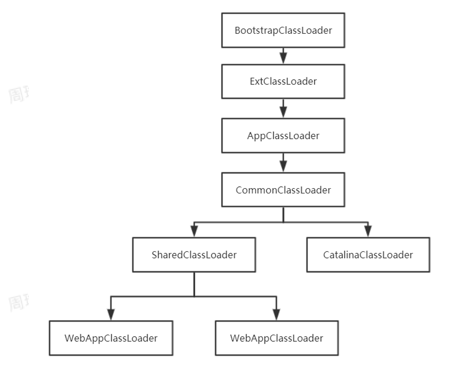
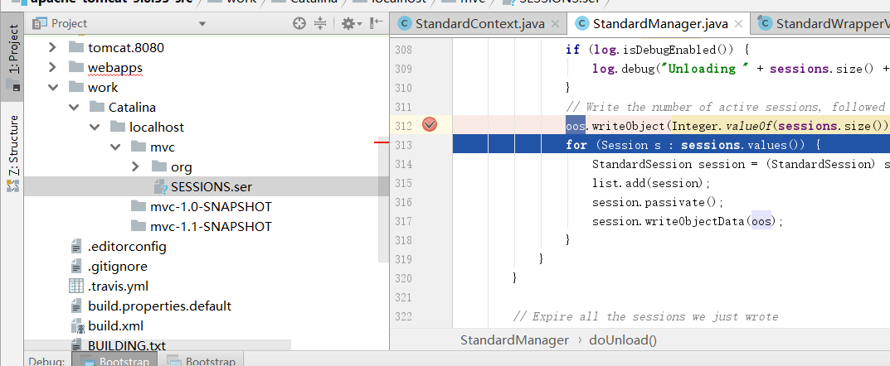
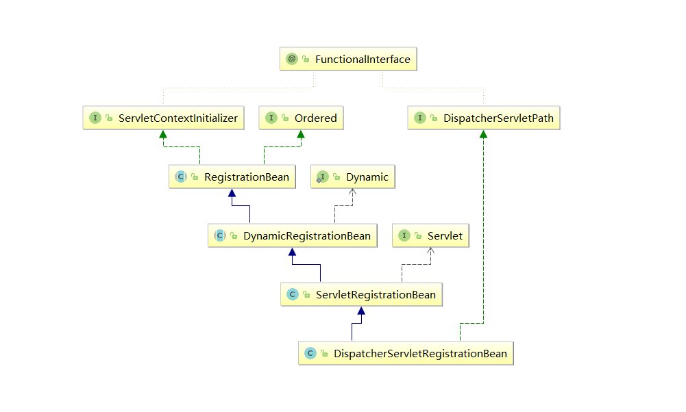

# Tomcat 启动与类加载机制

## Tomcat类加载机制

类加载器，就是⽤于加载 Java 类到 Java 虚拟机中的组件，它负责读取 Java 字节码，并转换成  java.lang.Class 类的⼀个实例，使字节码.class ⽂件得以运⾏；

JDK内置三种类加载器，分别负责执行不同目录下的类加载；

1. BootstrapClassLoader : 启动类加载器、由c语言实现，加载JDK的核心类库、如rt.jar
2. ExtClassLoader :  扩展类加载器、加载JDK的扩展类库、如ext.jar
3. AppClassLoader : 应用类加载器、也称系统类加载器、加载classpath路径下的类；


父子关系：

AppClassLoader.parent => ExtClassLoader :  应用类加载器的父加载器为扩展类加载器；

ExtClassLoader.parent = null  => BootstrapClassLoader  :  扩展类加载器的父加载器为启动类加载器；


双亲委派：

每个类进行加载时、当前类加载器 会先交由父类进行 加载、 如果父类无法加载、则交由子类进行加载；

AppLoader  交给  ExtLoader ；

ExtLoader交给BootStrapLoader；

BootStrapLoader进行类加载、 若可加载、则加载结束、若无法加载、则返回；

由ExtLoader进行加载、若可加载、则加载结束、若ExtLoader无法加载、返回；

由AppLoader加载、 最终加载类；


双亲委派好处：

类的安全性更强、 即不允许用户自己创建与核心类相同的类、防止执行危险操作；


双亲委派流程:

- AppClassLoader#loadClass  => super.loadClass : 调用父类的loadClass
  - LoaderClass#loadClass  ： 双亲委派流程
    - findLoadedClass(name) :  从已加载的类中查找；
      - parent.loadClass(name, false);  若未被加载、则先交给父类进行加载；
      - c = findBootstrapClassOrNull(name); 若父加载器为空、则交由启动类加载器进行加载
    - c = findClass(name) ： 若父类无法加载、则由自己加载；
    - resolveClass(c) ： 解析类信息；


**打破双亲委派机制： 需要重写loadClass方法；**


Tomcat打破双亲委派机制 ： tomcat为什么要打破双亲委派？

1. tomcat下会部署多个相同App应用， 若不打破双亲委派， 则tomcat会有AppLoader执行类加载、由于应用相同，因此类只会加载一次； 当一个应用停止时、 类会销毁 =>  由于类被销毁、 其他App执行会出现异常；

   即tomcat需要实现每个应用进行单独的类加载、且应用间的类加载时隔离的、 而双亲委派是无法完成的。

   

   解决方案： Tomcat设计了WebAppClassLoader类加载器负责加载App应用类、每个App创建一个 WebAppClassLoader类加载器、即每个App应用都有自己的WebAppClassLoader类加载器执行类加载；

2. tomcat本身的应用类加载

​       tomcat本身应用的类是需要和App应用隔离的、不然可能会出现相同包名的类、这会破坏tomcat的功能；因此需要打破双亲委派， 否则由AppClassLoader加载、Tomcat应用类和App应用类出现同名时，只会加载一次、因此要么破坏App功能、要么破坏Tomcat功能；

​	    

​		解决方案：Tomcat设计CatalinaClassloader类加载、专门负责执行Tomcat的类加载；

3. 两个App 可能需要共享类库；  

   由于每个App应用都有自己的AppLoader执行类加载、 App之间需要共享类库、只能加载一次；

   即两个 Web 应用之间怎么共享库类，并且不能重复加载相同的类；若加载多次、则JVM内存膨胀；

   

   解决方案： Tomcat设计SharedClassLoader类加载器、专门负责App共享类库的类加载， 因此SharedClassLoader是AppLoader的父加载器；

4. Tomcat 和 App 可能需要共享类库；

   Tomcat 和 App之间是隔离的。 共享类不能加载多次、若加载多次、JVM内存膨胀；


​		解决方案： Tomcat设置commonClassLoader 类加载器、 专门负责App与Tomcat的共享类加载；


   Tomcat类加载器父子关系

​	

 

## Tomcat类加载器

Tomcat类加载器创建过程：

- Bootstrap#main

  - Bootstrap bootstrap = new Bootstrap() : 创建服务端应用

  - bootstrap.init();

    - initClassLoaders(); 

      - commonLoader = createClassLoader("common", null) ： 创建common类加载器、父加载器为空；

        - String value = CatalinaProperties.getProperty(name + ".loader") ： 读取catalina.properties的common.loader配置的加载路径；

        - if ((value == null) || (value.equals(""))) {return parent;} ： 若加载路径为空、则返回parent加载器；

        - ClassLoaderFactory.createClassLoader(repositories, parent) 

          - ```java
            if (parent == null) {
                return new URLClassLoader(array);
            } else {
                return new URLClassLoader(array, parent);
            }
            ```

          - 创建类加载器对象、类型为URLClassLoader;

      - catalinaLoader = createClassLoader("server", commonLoader) ： 创建catalina类加载器、父加载器为common类加载器， 由于server.loader配置的加载路径默认为空、因此返回parent父加载器；

      - sharedLoader = createClassLoader("shared", commonLoader); 创建shared类加载器、父加载器为common类加载器， 由于shared.loader配置的加载路径默认为空、因此返回parent父加载器；

    - Thread.currentThread().setContextClassLoader(catalinaLoader); 当前线程类加载器设置为catalinaLoader

  - daemon.start() ： 通过反射方式调用Catalina方法

    - Catalina#start  :  
      - StandardServer#start => StandardServer#startInternal
      - StandardService#start =>  StandardService#startInternal
      - StandardEngine#start => StandardEngine#startInternal
      - StandardHost#start => StandardHost#startInternal
      - StandardContext#start => StandardContext#startInternal
        - Loader loader = getLoader() ; 
        - loader.start() 
          - WebappLoader#startInternal
            - classLoader = createClassLoader(); 
              - parentClassLoader = context.getParentClassLoader() : 拿到StandardContext的类加载器、为SharedLoader;
            - return new ParallelWebappClassLoader(parentClassLoader)；
          - ParallelWebappClassLoader#start() : 扫描目录下的资源
            - WebResource[] classesResources = resources.getResources("/WEB-INF/classes");
            - WebResource[] jars = resources.listResources("/WEB-INF/lib");
        - oldCCL = bindThread() ： 将WebAppClassLoader设置给线程类加载器；
          - ClassLoader oldContextClassLoader = bind(false, null)
            - **Thread.currentThread().setContextClassLoader(webApplicationClassLoader)**;

总结：

在tomcat启动过程中、会创建commonLoader,  catalinaLoader,  sharedLoader、若没有配置catalina.loader, shared.loader的加载路径、 catalinaLoader,  sharedLoader引用commonLoader、不会重新创建新的类加载器；

Tomcat启动过程中、server.xml的context会被加载为StandardContext对象， 通过启动方法创建ParallelWebappClassLoader对象、并加载WEB_INF/classess、/WEB-INF/lib下的资源，再将将WebAppClassLoader设置给线程类加载器、 后续当前线程加载类时、都会使用线程的类加载器执行加载；


- StandardContext指定应用类加载器为 loaderClass = ParallelWebappClassLoader.class.getName();
- Tomcat 7 为WebappClassLoader, Tomcat 9为ParallelWebappClassLoader

## Tomcat类加载器加载流程

Tomcat打破双亲委派、重写了loadClass方法；ParallelWebappClassLoader继承了WebappClassLoaderBase抽象类、该类重写loadClass方法

- WebappClassLoaderBase#loadClass
  - clazz = findLoadedClass0(name) : 从本地Map缓存中获取类信息、若无加载、返回空；
  - clazz = JreCompat.isGraalAvailable() ? null : findLoadedClass(name) :  从系统类加载器的加载过的缓存类中查找、若无加载、返回空；
  - ClassLoader javaseLoader = getJavaseClassLoader() ： 获取加载Javase类的类加载器、默认为ExtClassLoader
  - **clazz = javaseLoader.loadClass(name); 调用扩展类加载器执行加载类，加载不到、执行下一步**
  - **clazz = findClass(name) ： 由WebAppLoader执行类加载**
    - **clazz = findClassInternal(name) ： 从WEB-INF/classes， WEB-INF/lib目录资源下寻找该类。**
    - **clazz = super.findClass(name); 由父类执行加载、shareloader加载。**
  - **clazz = Class.forName(name, false, parent); 调用AppClassLoader系统类加载器执行类的加载；**
  - **throw new ClassNotFoundException(name) ： 若上述类加载都无法加载、抛出异常**


疑问1： 为什么要从系统类加载器加载过的缓存中查找类信息？

思考答案： 有些类来源于JDK、这些类要由系统类加载器进行、因此需要从系统类加载器的缓存中查找 加载过的类信息；


疑问2：为什么要先用ExtClassLoader执行加载？

思考答案：JDK的核心类例如扩展目录下、以及核心类库rt.jat交由扩展类加载器加载、使用双亲委派、保证安全；如java.lang.String， java.util包类等JDK类；


总结： 

1. **先从WebAppLoader的Map缓存中查找加载过的类、若已加载、则返回；**
2. **再从系统类加载器的本地缓存中查找加载过的类、若已加载、则返回；**
3. **先调用扩展类加载器执行类加载、 保证JDK核心类的安全加载、 若加载到、则返回；**
4. **再调用WebAppLoader负责的目录中查找类信息、若查找不到、则交由父加载器SharedLoader执行加载、若加载到、则返回；**
5. **扩展类加载器、WebAppLoader都无法加载、由系统类加载器执行类加载、若加载到、则返回；**
6. **若都加载不到、抛出异常；**


## 类加载的全盘负责委托机制

当ClassLoader加载一个类时、该类所依赖的其他类都由当前的ClassLoader负责加载；


### Spring的加载问题

Spring的BeanFactory创建类过程时、 是通过Class.forName执行类加载的、而对于Spring的依赖包、是多个App应用的共享包、会放在tomcat的lib目录下、由sharedLoader负责加载、 那么当执行BeanFactory创建Bean实例时、Bean的类放在WEB-INF/classes目录下、应该由WebAppLoader负责加载；

但是按照全盘委托机制、BeanFactory创建Bean过程中涉及到的classes包中的类 应该是由SharedLoader执行加载


#### 线程上下文加载器

线程上下文加载器登场了，它其实是一种类加载器传递机制。

因为这个类加载器保存在线程私有数据里，只要是同一个线程，一旦设置了线程上下文加载器， 在线程后续执行过程中就能把这个类加载器取出来用。因此 Tomcat 为每个 Web 应用创建一个 WebAppClassLoarder 类加载器，并在启动 Web 应用的线程里设置线程上下文加载器，这样 Spring 在启动时就将线程上下文加载器取出来，用来加载 Bean。

```java
 cl = Thread.currentThread().getContextClassLoader()
```

##  Tomcat热加载

### Tomcat热加载操作

```xml
<Context docBase="E:\Java_tomcat\apache-tomcat-9.0.55-src\webapps\mvc-1.0-SNAPSHOT"
         path="/mvc"  reloadable="true" />
```

热加载针对Context容器、需要设置reloadable为true;

当我们Java类频繁改动、需要**重新编译后、新的Class文件覆盖旧的Class文件，通过热加载、扫描到新Class文件， 自动刷新Context容器、不需要重启tomcat,  就完成功能更新**；避免频繁重启tomcat，浪费时间；


### Tomcat热加载原理与Context启动流程分析

若是由我们来实现、怎么及时感知Class文件的变动、 通常情况下实现一个定时任务、然后比对新旧Class文件的内容、可通过MD5、Sha256进行哈希摘要、若文件内容发生变动、摘要结果值就不一致、 出现不一致、则刷新StandardContext;


- StandardEngine#<init> 

  - backgroundProcessorDelay = 10 : 任务延迟时间为10s

- StandardEngine#startInternal

  - super.startInternal() => ContainerBase#startInternal()

    - if (backgroundProcessorDelay > 0)

    - monitorFuture = Container.getService(ContainerBase.this).getServer()
              .getUtilityExecutor().scheduleWithFixedDelay(
                      new ContainerBackgroundProcessorMonitor(), 0, 60, TimeUnit.SECONDS)

      开启后台容器监视任务、首次延迟60s执行；


- ContainerBackgroundProcessorMonitor#run
  - threadStart();
    - backgroundProcessorFuture = Container.getService(this).getServer().getUtilityExecutor()
              .scheduleWithFixedDelay(new ContainerBackgroundProcessor(),
                      backgroundProcessorDelay, backgroundProcessorDelay,
                      TimeUnit.SECONDS) : 重新创建后台容器处理任务、延迟10s执行；

- ContainerBackgroundProcessor#run

  - processChildren(ContainerBase.this);

    - if (container instanceof Context) :  false跳过
    - container.backgroundProcess() ： 调用当前容器处理； 为StandardEngine
    - for (Container child : children)  processChildren(child) : 调用子容器的后台处理

  - processChildren(child)  => processChildren(Container container);

    - if (container instanceof Context) :  false跳过
    - container.backgroundProcess() ： 调用当前容器处理、为StandardHost
    - for (Container child : children)  processChildren(child) : 调用子容器的后台处理

  - processChildren(child)  => processChildren(Container container);

    - if (container instanceof Context) :  true

      - originalClassLoader = ((Context) container).bind(false, null) : 绑定webapploader

        - Thread.currentThread().setContextClassLoader(webApplicationClassLoader) 

          目的：设置此刻的线程类加载器为ParallelWebappClassLoader;

    - container.backgroundProcess() :   调用当前容器处理； 为StandardContext

      - loader.backgroundProcess() :  由WebAppLoader处理；
        - if (reloadable && modified()) : 通过modified比对Class文件的最后修改时间、若存在不一致返回true;
        - context.reload() : 重新加载Context容器；

- WebAppLoader#modified() 

  - classLoader.modified() ： 默认为ParallelWebappClassLoader，由父类WebappClassLoaderBase实现

    - ```java
      for (Entry<String,ResourceEntry> entry : resourceEntries.entrySet()) {
          long cachedLastModified = entry.getValue().lastModified;
          long lastModified = resources.getClassLoaderResource(
                  entry.getKey()).getLastModified();
          if (lastModified != cachedLastModified) {
              if( log.isDebugEnabled() ) {
                  log.debug(sm.getString("webappClassLoader.resourceModified",
                          entry.getKey(),
                          new Date(cachedLastModified),
                          new Date(lastModified)));
              }
              return true;
          }
      }
      ```

      - 获取内存文件资源resourceEntries.entrySet()并遍历文件的最后修改时间cachedLastModified
      - 从本地资源中获取entry的目标资源的最后修改时间lastModified
      - 内存修改时间与本地修改时间不一致、则返回true, 代表类发生变动，需要执行热加载；

  

- StandardContext#reload()

  - StandardContext#stop => StandardContext#stopInternal
    - ClassLoader oldCCL = bindThread() :  线程类加载器设置为ParallelWebappClassLoader， 返回为AppClassLoader
    - threadStop() ：停止后台任务线程、避免占用资源
    - for (Container child : children)  child.stop() ： 遍历调用停止子容器Wrapper、即销毁Servlet
    - filterStop();  销毁过滤器；
    - listenerStop(); 销毁监听器
    - ((Lifecycle) pipeline).stop(); 销毁StandardContext的管道链
    - Loader loader = getLoader() =》((Lifecycle) loader).stop();
      - WebAppLoader#stopInternal 
        - classLoader.stop() : 停止类加载器、清除类加载器的引用，清除缓存的类信息，清除本地目录资源
        - classLoader.destroy() ： 销毁类加载器
        - classLoader = null ： 断掉引用、使JVM GC回收类加载器；
    - unbindThread(oldCCL) ： 设置线程类加载器为AppLoader、解绑ParallelWebappClassLoader类加载器、无法引用该类加载后、会被回收； 类信息的回收需要满足类加载器被销毁、因此回收类信息更简单一些；
    
  - StandardContext#start => StandardContext#startInternal
    
    - postWorkDirectory() ： 设置工作目录
    - **Loader loader = getLoader() => ((Lifecycle) loader).start() :  重新创建ParallelWebappClassLoader类加载器**
    - **ClassLoader oldCCL = bindThread()  ： 设置线程类加载器为ParallelWebappClassLoader**
    - **for (Container child : findChildren()) child.start() ： 调用子容器启动方法**
    - **((Lifecycle) pipeline).start() ： 调用管道链启动方法**
    - **for (Map.Entry<ServletContainerInitializer, Set<Class<?>>> entry :**
          **initializers.entrySet()) entry.getKey().onStartup(entry.getValue(),getServletContext()); 遍历调用**
              **ServletContainerInitializer的回调方法；**
    - **listenerStart() ： 反射创建ServletContextListener、并调用contextInitialized方法**
    - **filterStart() ： 反射创建HttpFilter对象并调用init方法**
    - **loadOnStartup(findChildren()) ：若Servlet的loadOnStartup属性大于0， 则会提前反射创建Servlet对象、并调用init方法完成初始化；**
    
    

传统SpringMVC中、web.xml通常会配置SpringContextListener监听器、DispatchServlet并设置load-on-startup为1、相应的处理阶段就是在StandardContext的startInternal阶段负责处理的, 也解释了为什么Listener会比Servlet先创建；

```xml
  <listener>
    <listener-class>org.springframework.web.context.ContextLoaderListener</listener-class>
  </listener>

  <context-param>
    <param-name>contextConfigLocation</param-name>
    <param-value>classpath:applicationContext.xml</param-value>
  </context-param>

  <servlet>
    <servlet-name>dispatcherServlet</servlet-name>
    <servlet-class>org.springframework.web.servlet.DispatcherServlet</servlet-class>
    <init-param>
      <param-name>contextConfigLocation</param-name>
      <param-value>classpath:spring-mvc.xml</param-value>
    </init-param>
    <!-- httpServletBean init()  tomcat容器启动，spring容器启动  没有配，第一次请求启动容器-->
    <load-on-startup>1</load-on-startup>
  </servlet>
```


**Tomcat的App容器启动总结：核心处理逻辑StandardContext#startInternal**

1. **创建类加载器ParallelWebappClassLoader并绑定给线程的类加载器**
2. **调用子容器Wrapper,   Pipeline启动方法**
3. **调用ServletContainerInitializer回调方法**
4. **创建并初始化ServletContextListener监听器、并调用contextInitialized回调方法**
5. **创建并初始化Filter过滤器、并调用init回调方法**
6. **扫描并创建loadOnStartup大于0的Servlet， 并调用init回调方法**


## Tomcat热部署

热加载相当于重新刷新Context容器、并不会销毁Context对象、 而热部署则会销毁Context对象、并清除会话信息等操作、是属于Host级别操作； 由StandardHost的后台线程并没有处理热部署任务、而是交由HostConfig负责处理；

热部署设置 ： <host>中设置autoDeploy为true;

```xml
<Host name="localhost"  appBase="webapps"  startStopThreads="0"
      unpackWARs="true" autoDeploy="true" >
```

热部署触发条件：

1.  App引用的WEB-INF/web.xml发生更新
2. tomcat应用conf/context.xml发生更新；
3. tomcat应用conf/web.xml发生更新；
4. tomcat的webapps目下的app目录被删除；
5. tomcat的webapps目录下新增war包；
6. tomcatwebapps目录下新增App目录；


### Tomcat热部署源码

前面步骤与热加载的后台线程流程相似、直至执行StandardHost的后台任务；

- ContainerBackgroundProcessor#run

  - container.backgroundProcess() ： 执行StandardHost的后台线程任务
    - fireLifecycleEvent(Lifecycle.PERIODIC_EVENT, null) ： 由父类ContainerBase实现、发布周期性事件
      - for (LifecycleListener listener : lifecycleListeners)listener.lifecycleEvent(event) ： 遍历生命周期监听器、 负责处理事件为HostConfig
        -  HostConfig#lifecycleEvent
          - if (event.getType().equals(Lifecycle.PERIODIC_EVENT))   check();

- HostConfig#check()

  - for (DeployedApplication app : apps) checkResources(app, false) : 检查webapps目录、conf/web.xml、WEB-INF/web.xml, conf/context.xml是否发生变更

    - String[] resources =  app.redeployResources.keySet().toArray(new String[0]) ： 获取已部署应用需要检查的资源，并遍历，如context.xml等

      -  File resource = new File(resources[i]) ；
      -  long lastModified =  app.redeployResources.get(resources[i]).longValue() ： 上次修改时间；
      -  resource.exists() || lastModified == 0  =》 undeploy(app) ： 若目录被删除、则条件不成立；异常已部署的应用；

    - resources = app.reloadResources.keySet().toArray(new String[0]) ： 拿到待检查的文件、如web.xml, context.xml

      - File resource = new File(s) : 获取本地文件信息；
      - long lastModified = app.reloadResources.get(s).longValue() ： 获取缓存文件的最后修改时间
      - resource.lastModified() != lastModified ：若是web.xml,发生变更、则条件成立
        - reload(app, null, null) :  获取应用StandardContext容器、重新加载一次、与热加载一致；
          - Context context = (Context) host.findChild(app.name);
          - context.reload(); **执行热加载**

      

  - deployApps() ： 执行热部署

    - deployWARs(appBase, filteredAppPaths) ：若webapps目录下新增war包、则执行部署

      - ExecutorService es = host.getStartStopExecutor() : 获取线程池

      - for (String file : files) ： 遍历目录文件

        - File war = new File(appBase, file) ：加载应用目录文件信息
        - deploymentExists(cn.getName()) : 判断应用目录是否已被部署
          - results.add(es.submit(new DeployWar(this, cn, war))) ： 若无部署、代表新增war包、则提交部署war包任务

        

      - DeployWar#run => config.deployWAR(cn, war) : 执行部署war包；

        - context = (Context) Class.forName(contextClass).getConstructor().newInstance() ：反射创建StandardContext对象
        - host.addChild(context) ： 设置给Host子容器；
          - super.addChild(child) => addChildInternal(child);
            - child.start() : 启动StandardContext子容器

      

    - deployDirectories(appBase, filteredAppPaths) ： 若webapps目录下新增app目录、则执行部署

      - ExecutorService es = host.getStartStopExecutor() ： 获取线程池

      - for (String file : files） ： 遍历目录文件

        - deploymentExists(cn.getName()) ： 判断应用目录是否已部署；
          - results.add(es.submit(new DeployDirectory(this, cn, dir))) ： 若无部署、代表新增App目录、提交部署目录任务；

        

        - DeployDirectory#run => config.deployDirectory(cn, dir);
          - context = (Context) Class.forName(contextClass).getConstructor().newInstance(); 反射创建StandardContext容器
          - host.addChild(context) ： 设置给Host子容器；
            - super.addChild(child) => addChildInternal(child);
              - child.start() : 启动StandardContext子容器

        

总结 ：

1. 通过StandardHost后台线程任务发布周期性事件、触发监听器HostConfig；

2. 在HostConfig中、先获取已部署的应用， 获取应用需要检查的资源、如conf/context.xml, conf/web.xml,  WEB-INF/web.xml发生变更、则重新加载已部署的资源、 即重新加载StandardContext容器； 
3.   再遍历webapps下的文件和目录、若新增war包、则新建并执行部署War包任务、解压war包、解析xml文件，再创建StandardContext、并设置给StandardHost，并启动StandardContext容器；
4. 若新增App目录， 则新建并执行部署App目录任务、 会创建，再创建StandardContext、并设置给StandardHost，并启动StandardContext容器；


## Tomcat会话机制

单机Web项目中，可通过HttpSession完成会话功能；

```java
httpServletRequest.getSession().setAttribute("user", "fox");
```

HttpSession是接口、Tomcat的默认实现为StandardSession、一个Session代表一个用户会话； 

Tomcat中管理Sessiond的组价为StandardManager, 包括Session检查、新增、删除、热加载不丢失会话等；


### Session创建过程

首次往调用getSession会创建HttpSession对象

- HttpServletRequset#getSession :  Tomcat的实现类为RequestFacade
  - RequestFacade#getSession(true);
    -  request.getSession(create) : 此处request对象为tomcat的rquest对象、非Servlet的request对象
    - org.apache.catalina.connector.Request#getSession
      - Session session = doGetSession(create) :  获取Session对象、若没有则创建
        - Context context = getContext() ： 获取StandardContext容器对象
        - Manager manager = context.getManager() ： 获取会话管理器StandardManager
        - String sessionId = getRequestedSessionId() : 获取会话ID、Cookie的JsessionId值；
        - session = manager.createSession(sessionId) ： 通过会话管理器创建会话
          - Session session = createEmptySession() ： 创建空的会话对象
            - return new StandardSession(this)
          - String id = sessionId;   首次创建SessionId默认为空
          - if (id == null) id = generateSessionId() ：通过会话Id生成器生成sessionId;
            - result = sessionIdGenerator.generateSessionId();
          - **session.setId(id) : 设置会话iD、并添加到会话管理器的缓存会话Map中**
            - **manager.add(this) => sessions.put(session.getIdInternal(), session);**
          - session.setMaxInactiveInterval(getContext().getSessionTimeout() * 60) : 设置会话有效时间，默认为30分钟；
          - session.setCreationTime(System.currentTimeMillis()) ： 设置创建时间、最后访问时间lastAccessedTime、此刻访问时间；
        - response.addSessionCookieInternal(cookie) ： 往Response的Header响应头设置Cookie, JSESSIONID=D4F3522082FEB65AB3FC5BA58E5AFB2D; Path=/mvc; HttpOnly


首次获取会话时、会创建StandardSession对象、设置访问时间、创建时间、会话ID、 并放入StandardManager的会话缓存Map中、再往Http响应头中放入Cookie、key为JSESSIONID，value为会话ID

其中 SessionId 会作为 Cookie的Jsessionid字段返回、 下次浏览器发起请求会将该Jsessionid带上、Tomcat识别jsessionid，从StandardManager查找到目标会话；


### 请求过程中更新访问时间

用户发送请求、会携带jsessionid的cookie，Tomcat解析请求过程中、会根据jessionid通过StandardManager获取HttpSession会话信息、并更新访问时间；

- StandardHostValve#invoke 
  - context.getPipeline().getFirst().invoke(request, response) : Pipeline的首个valve为NonLoginAuthenticator
    - NonLoginAuthenticator#invoke
      - Session session = request.getSessionInternal(false) 
        - org.apache.catalina.connector.Request#getSessionInternal
          - doGetSession(create);
            - session = manager.findSession(requestedSessionId) ： 根据jessionid从StandardManager会话管理器中获取会话信息
              - return sessions.get(id) ： 从会话Map根据获取session
            - session.access() : 更新会话的访问时间
    - ==> 执行StandardContextValve#invoke


每次发送请求、会讲过Context的管道链阀门、在阀门中会根据Jsessionid从会话管理器的会话缓存Map中获取会话信息、调用访问方法更新会话的访问时间；

### 会话检查机制

用户访问应用服务、 Tomcat会更新用户会话的访问时间、Tomcat会后台定时任务线程、检查会话时间是否超时、若会话超时、则从缓存Map中清除；

- StandardContext#backgroundProcess
  - Manager manager = getManager() : 获取会话管理器
  - manager.backgroundProcess() ： 调用会话管理器处理
- StandardManager#backgroundProcess :  父类实现该方法
  - processExpires()
    - Session sessions[] = findSessions() ： 获取缓存Map中所有Session信息；
      - return sessions.values().toArray(new Session[0]);
    - session.isValid() ： 检查是否过期
      - **int timeIdle = (int) (getIdleTimeInternal() / 1000L) ： 获取会话空闲时间**
        - timeIdle = timeNow - thisAccessedTime ： 当前时间减去上次访问时间； 默认情况下lastAccessedTime，thisAccessedTime 值想等；
      - **if (timeIdle >= maxInactiveInterval) expire(true) ： 空闲时间大于最大空闲时、则过期**
        - manager.remove(this, true);  调用会话管理器删除会话信息
          - sessions.remove(session.getIdInternal()) ： Map根据sessionId删除会话信息


总结： 在处理Context的后台任务时、会拿到会话管理器StandardManager，调用其后台处理方法、遍历会话缓存Map,  获取每个会话空闲时间与最大空时间比较、若大于最大空时间、则会话过期、从会话缓存Map中根据ID清除；

### 热加载下的会话保存

热加载时、会话重新刷新Context重新、会话信息不可被删除;

Tomcat解决方案：在发生热部署时、会话管理器取出会话缓存Map的所有会话、写入到work/Catalina/项目名/SESSIONS.ser文件中、当Context启动时、调用会话管理器读取SESSION.ser文件、写入会话缓存Map；

- StandardContext#backgroundProcess
  - Loader loader = getLoader();
  - loader.backgroundProcess();
    - context.reload();
      - stop() =>  stopInternal() 
        - Manager manager = getManager();
        - ((Lifecycle) manager).stop() => StanardManager#stopInternal
      - start() => startInternal()
        - Manager manager = getManager();
        - ((Lifecycle) manager).start() => StanardManager#startInternal

 

- StanardManager#stopInternal

  - unload() => doUnload();

    - File file = file() =>  在work/Catalina/项目名目录下创建SESSION.ser的文件描述、 

    - ```java
      FileOutputStream fos = new FileOutputStream(file.getAbsolutePath());
              BufferedOutputStream bos = new BufferedOutputStream(fos);
              ObjectOutputStream oos = new ObjectOutputStream(bos) 
      ```

      根据文件创建文件输出流、包装为缓存输出流、再包装为对象输出流；

    - List<StandardSession> list = new ArrayList<>();

    - oos.writeObject(Integer.valueOf(sessions.size())) ：往SEESSION.ser写入会话的总数量

    -  for (Session s : sessions.values()) ：遍历缓存Map的所有会话

      - list.add(session);
      - session.writeObjectData(oos);　会话信息写入SESSION.ser临时文件中

    - for (StandardSession session : list)

      - session.expire(false) ：设置会话信息过期、从缓存map中移除

- StanardManager#startInternal

  - load() => doLoad();

    - File file = file() : 创建临时文件SESSION.ser的访问信息

    - FileInputStream fis = new FileInputStream(file.getAbsolutePath());

    - BufferedInputStream bis = new BufferedInputStream(fis)

    - ```java
      ObjectInputStream ois = new CustomObjectInputStream(bis, classLoader, logger,
              getSessionAttributeValueClassNamePattern(),
              getWarnOnSessionAttributeFilterFailure())
      ```

      创建文件输入流、包装为缓存输入流、包装为对象输入流；

    - Integer count = (Integer) ois.readObject() ： 读取会话总数

    - for (int i = 0; i < n; i++) ： 创建N个会话

      - StandardSession session = getNewSession() ：创建会话
      - session.readObjectData(ois) ： 从对象输入流中读取会话详情数据
      - sessions.put(session.getIdInternal(), session);  放入会话缓存Map中
      - session.activate() ： 激活会话；


总结：处理Context后台任务时、当部署目录文件发生变动、触发热部署时，触发StandardContext重新加载， 先停止、停止过程会调用会话管理器StandardManager停止处理、 在work目录下创建SESSION.ser临时文件、先写入会话总数、 遍历会话缓存Map的所有会话、将每个会话的详情数据写入临时文件SESSION.tar里，当Context启动、调用会话管理器StandardManager启动处理、读取SESSION.ser文件、读取会话总数、 逐个创建会话， 并读取会话详情信息、放入会话缓存Map中；




## SpringBoot启动扫描Servlet

SpringBoot应用里、DispatchServlet是如何注册的？

```java
@AutoConfigureAfter({ DispatcherServletAutoConfiguration.class, TaskExecutionAutoConfiguration.class,
      ValidationAutoConfiguration.class })
public class WebMvcAutoConfiguration
```

SpringMVC自动配置类在DispatcherServletAutoConfiguration之前执行解析；

```java
@Configuration(proxyBeanMethods = false)
public class DispatcherServletAutoConfiguration {}
```

- DispatcherServletAutoConfiguration$DispatcherServletConfiguration

  - DispatcherServletConfiguration#dispatcherServlet

    ```java
    @Bean(name = DEFAULT_DISPATCHER_SERVLET_BEAN_NAME)
    public DispatcherServlet dispatcherServlet(WebMvcProperties webMvcProperties) {
       DispatcherServlet dispatcherServlet = new DispatcherServlet();
    	//...
       return dispatcherServlet;
    }
    ```

    创建往容器Map中注入DispatchServlet的Bean定义；

    

- DispatcherServletAutoConfiguration$DispatcherServletRegistrationConfiguration

  ```java
  @Import(DispatcherServletConfiguration.class)
  protected static class DispatcherServletRegistrationConfiguration {
  
     @Bean(name = DEFAULT_DISPATCHER_SERVLET_REGISTRATION_BEAN_NAME)
     @ConditionalOnBean(value = DispatcherServlet.class, name = DEFAULT_DISPATCHER_SERVLET_BEAN_NAME)
     public DispatcherServletRegistrationBean dispatcherServletRegistration(DispatcherServlet dispatcherServlet,
           WebMvcProperties webMvcProperties, ObjectProvider<MultipartConfigElement> multipartConfig) {
        DispatcherServletRegistrationBean registration = new DispatcherServletRegistrationBean(dispatcherServlet,
              webMvcProperties.getServlet().getPath());
        registration.setName(DEFAULT_DISPATCHER_SERVLET_BEAN_NAME);
        registration.setLoadOnStartup(webMvcProperties.getServlet().getLoadOnStartup());
        multipartConfig.ifAvailable(registration::setMultipartConfig);
        return registration;
     }
  
  }
  ```

  解析该DispatcherServletRegistrationConfiguration配置类时、在Spring解析配置类时、先解析@Import注解、再解析@Bean、 因此会先解析DispatcherServletConfiguration， 往Bean定义Map中注入DispatchServlet的Bean定义； 然后解析@Bean方法、注入DispatcherServletRegistrationBean的Bean定义； 

  扫描完Bean之后、创建DispatcherServletRegistrationBean的实例化时、依赖dispatcherServlet， 会先从一级缓存中拿到dispatcherServlet、拿不到则先生成dispatcherServlet实例、结束返回dispatcherServlet实例；

  

  DispatcherServletRegistrationBean有什么特别？

  

  



DispatcherServletRegistrationBean实现了ServletContextInitializer接口;

ApplicationContext创建嵌入式Tomcat对象、

会创建ServletContextInitializer的lambda对象、 该对象从容器中获取所有ServletContextInitializer的Bean,

 再把ServletContextInitializer的lambda设置给Tomcat对象、

Tomcat对象创建TomcatEmbeddedContext对象、该对象实现了StandardContext接口、就代表SpringBoot的应用；

Tomcat队形创建TomcatStarter保存ServletContextInitializer的lambda对象、TomcatStarter实现了ServletContainerInitializer接口；

Tomcat把TomcatStarter设置到TomcatEmbeddedContext的starter；

调用Tomcat启动后、容器StandardContext启动回调方法执行时、即会TomcatEmbeddedContext#startInternal方法中、调用ServletContainerInitializer#onStartup方法、进而调用ServletContextInitializer接口onStartup方法、进而调用DispatcherServletRegistrationBean#onStarup方法、调用ServletContext.addServlet添加DispatchServlet,  ServletContext底层包装DispatchServlet为Wrapper容器、设置给TomcatEmbeddedContext


同理、若是使用Filter、注册FilterRegistrationBean、最终Tomcat会调用FilterRegistrationBean#onStartup、调用ServletContext#addFilter添加Filter, ServletContext底层包装Filter为FilterDef，设置给TomcatEmbeddedContext


以上是基于SpringBoot内嵌Tomcat、 SpringBoot可以打成war包、war包又是如何解析？

1. 打成war包、放入tomcat的webapps目录下；
2. Tomat启动后、会解压war包为App目录、 然后解析war包为StandardContext
3. SpringBoot的SpringServletContainerInitializer实现了ServletContextInitializer接口、并在META-INF/service/org.springframework.web.ServletContainerInitializer文件中指定了org.springframework.web.SpringServletContainerInitializer；
4. StandardContext启动时、发布CONFIGURE_START_EVENT事件、触发ContextConfig监听器、监听器进行SPI扫描到ServletContainerInitializer文件，加载SpringServletContainerInitializer类；
5. 监听器ContextConfig扫描SpringServletContainerInitializer类上的注解HandlesTypes， 拿到WebApplicationInitializer类型、然后扫描类路径和依赖的Jar包、 扫描实现了WebApplicationInitializer接口的类、以key为SpringServletContainerInitializer， value为Set集合放入Map中；
   1. SpringBoot的SpringBootServletInitializer实现了WebApplicationInitializer接口；
6. 监听器ContextConfig遍历Map、 设置给StandardContext的initializers的Map,
   1. key为 ServletContainerInitializer， value为WebApplicationInitializer的Set集合
7. StandardContext遍历initializers、调用ServletContainerInitializer#onStartUp方法， 
   1. 调用SpringServletContainerInitializer#onStartUp方法，传入WebApplicationInitializer接口实现类的Set集合作为第一个参数、第二个参数为ServletContext;
   2. SpringServletContainerInitializer遍历WebApplicationInitializer接口实现类、并调用onStartUp方法
   3. WebApplicationInitializer实现类SpringBootServletInitializer#onStartUp中、创建SpringApplication、并启动、最终创建IOC容器；


