# Tomcat类、操作

Tomcat 9 默认支持为IO为NIO、 编程模型为主从Reactor模型；

Bootstrap启动类；

init创建serverSockerChannel;

start调用ServerSoceketChannel#accept接收请求；

创建Http11Processor对象时、创建了Request对象

Http11Processor#service负责解析Socket的请求行、请求头、请求体的字节流数据设置给Request

**Connector：在Tomcat启动时构造方法创建了ProtocolHandler,  init初始化阶段创建属性adapter = new CoyoteAdapter(this),并设置给ProtocolHandler；**

CoyoteAdapter ：解析字节流数据重新设置给Request、如参数解码、URL解码；

Valve：阀门，增强功能；

StandardWrapperValve：Wrapper层的阀门链最后一个阀门，Request#getRequest方法获取Servlet/Filter需要的Request对象、 类型为RequestFacade， Response#get方法获取Servlet/Filter需要的Response, 类型为ResponseFacade，Servlet的request和response为RequestFacade/ResponseFacade

ApplicationFilterChain：若没有过滤器Filter、则调用Servlet#service方法、否则、先调用过滤器链；


# Tomcat架构分析

linux系统源码实现了 socket.c实现了 TCP三次握手， 建立TCP连接， 即建立TCP连接的操作是由操作系统完成；


java网络通信方面、通过new ServerSocket创建服务器、 通过ServerSocket#accept接收客户端连接、 客户端通过new Socket方式创建TCP连接、 而linux系统通过工具方法的方式 调用socket.c、而不是暴露底层的socket.c的代码、  Java new Socket方式底层native调用linux系统的工具类、进而创建TCP连接 => linux安全


new Socket时、OS进行三次握手、 ServerSocket#accpet时、为第三次握手、 ServerSocket#accept执行完后， TCP三次握手结束；

Tomcat中、Connector负责创建TCP连接；

## Tomcat核心： Http服务器+Servlet容器


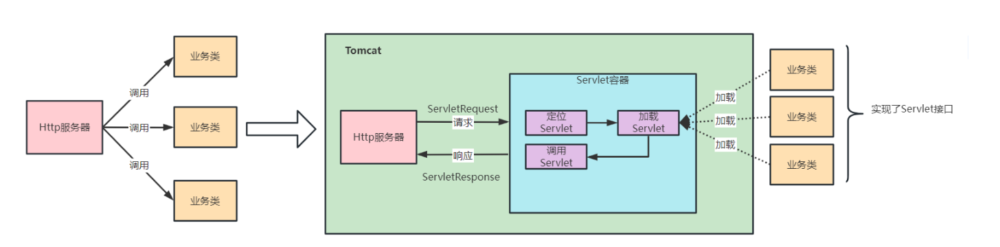

tomcat目录：

- bin : 存放tomcat脚本、start.sh, stop.sh等
- conf: 存放配置文件、核心为server.xml
- webapps : 存放应用程序、tomcat启动后会加载目录下的应用成；


## Tomcat常见部署方式

1. war包拷贝到webapp目录

   ```xml
   <Host name="localhost"  appBase="webapps"  unpackWARs="true" autoDeploy="true">
   ```

   tomcat启动时、会自动解压war包；

2. server.xml 的Context标签下配置Context

   ```xml
   <Context docBase="D:\mvc" path="/mvc"  reloadable="true" />
   ```


## Tomcat核心业务

1. 请求到Tomcat， 在网络层需要接收字节流数据， 解析字节流数据为Request/Response对象
2. 加载并管理Servlet, 调用Servlet处理Request请求；


## Tomcat核心角色

1. Server : 代表一台Tomcat服务器，负责管理和启动各个Service
2. Service: 包含了若干用于接收客户端消息的 Connector 组件和处理请求的 Engine 组 件。可通过不同端口部署多个应用；
3. Connector ： Tomcat连接器、监听网络请求、负责将请求转发给容器。连接器对 Servlet 容器屏蔽了不同的应用层协议及 I/O 模型，在容器中获取到的都是一个标准的 ServletRequest 对象

4. 容器Container组件：4 种容器不是平行关系，而是父子关系。
   1. Engine ：Tomcat引擎、 管理容器的生命周期、分配请求；一个 Service 最多只能有一个 Engine；
   2. Host ： 虚拟主机、每个主机可部署多个应用程序，负责 web 应用的部署和 Context 的创建
   3. Context ： 应用程序、 对应每个war包程序
   4. Wrapper ： Servlet的包装器、处理请求与响应；对 Servlet 的封装，负责 Servlet 实例的创建、执行 和销毁

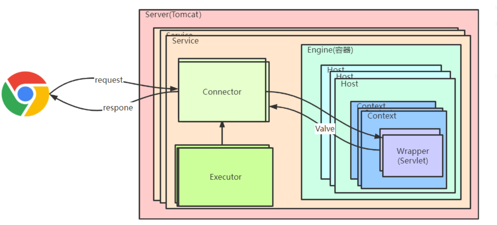

Tomcat的架构是一个分层的架构，每一层都有其自己的功能和职责。该架构可以提高 Tomcat的性能和可维护性，并使得Tomcat可以支持大量的Java Web应用程序

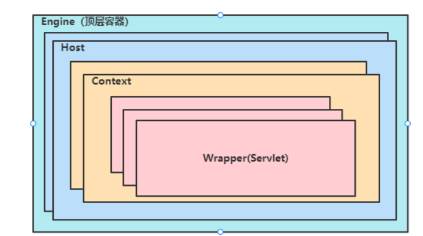

## server.xml

```xml
 <Server>
    //顶层组件，可以包括多个Service
     <Service>  //顶层组件，可包含一个Engine，多个连接器
     	 <Connector/>//连接器组件，代表通信接口     
         <Engine>//容器组件，一个Engine组件处理Service中的所有请求，包含多个Host
             <Host>  //容器组件，处理特定的Host下客户请求，可包含多个Context
                 <Context/>  //容器组件，为特定的Web应用处理所有的客户请求
             </Host>
         </Engine>
     </Service> 
 </Server> 
```

Tomcat启动期间会通过解析 server.xml，利用反射创建相应的组件，所以xml中的标签和源码一一对应

##  请求定位 Servlet 的过程

Tomcat 是用 Mapper 组件来完成这个任务的。Mapper 组件的功能就是将用户请求的 URL 定位到一个 Servlet; Mapper 组件里保存了 Web 应用的配置信息，其实就是容器组件 与访问路径的映射关系

1. Tomcat根据URL的端口号找到目标Service;
2. 从Service中拿到Engine引擎、 根据URL的Host名称从Engine的子容器中找到Host虚拟主机；
3. 从URL中获取ContextPath， 根据ContextPath从Host虚拟主机下找到目标Context;
4. 根据URL的请求路径从Context下找到目标Wrapper、利用Wrapper创建Servlet并处理业务请求；

# Tomcat架构设计精髓分析

## Connector高内聚低耦合设计

优秀的模块化设计应该考虑高内聚、低耦合。

高内聚是指相关度比较高的功能要尽可能集中，不要分散。 

低耦合是指两个相关的模块要尽可能减少依赖的部分和降低依赖的程度，不要让两个模块产生强依赖。

连接器需要实现的功能：

1. 监听网络端口
2. 接收网络请求
3. 读取网络的请求字节流数据
4. 根据应用层协议解析字节流数据并Tomcat Request对象
5. 将Tomcat Request 转换为 Servlet需要的HttpServletRequest/HttpServletResponse对象；
6. 调用Servlet，传入HttpServletRequest对象处理请求，返回HttpServletResponse对象；
7. HttpServletResponse转换为为Tomcat Response对象；
8. 将 Tomcat Response 转成网络字节流
9. 将响应字节流写回给浏览器。

分析连接器详细功能列表，我们会发现连接器需要完成 3 个高内聚的功能

1. 网络通信 => Socket
2. 应用层协议处理 => Http
3. Tomcat Request对象转换；=> Servlet

3 个组件来实现这 3 个功能，分别是 EndPoint、Processor 和 Adapter；

EndPoint:  根据IO模型从网络中读取字节流数据、并传给Processor;

Processor  : 根据应用层协议 解析字节流数据并创建Tomcat Request对象、并传给Adapter

Adapter: Tomcat Request转换为Servlet Request， 并调用容器Container处理请求, 最终调用Servlet容器；


由于 I/O 模型和应用层协议可以自由组合，比如 NIO + HTTP 或者 NIO2 + AJP。Tomcat 将网络通信和应用层协议解析放在一起考虑，设计了一个叫 ProtocolHandler 的接口。各种协议和通信模型的组合有相应的具体实现类。比如：**Http11NioProtocol** 和 AjpNioProtocol

除了这些变化点，系统也存在一些相对稳定的部分，因此 Tomcat 设计了一系列抽象基类来封装这 些稳定的部分，抽象基类 **AbstractProtocol** 实现了 **ProtocolHandler** 接口。每一种应用层协议有自 己的抽象基类，比如 AbstractAjpProtocol 和 **AbstractHttp11Protocol**，具体协议的实现类扩展了协 议层抽象基类

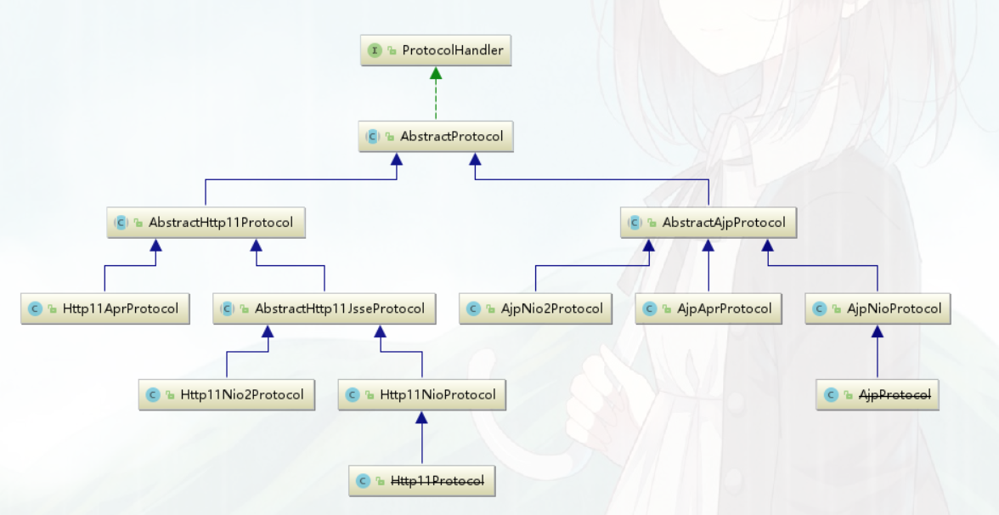

### ProtocolHandler

连接器用 ProtocolHandler 来处理网络连接和应用层协议，包含了 2 个重要部件：EndPoint 和 Processor。

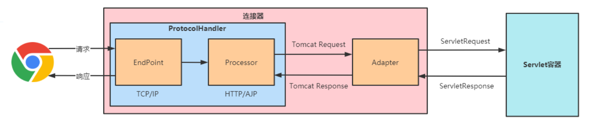

连接器用 ProtocolHandler 接口来封装通信协议和 I/O 模型的差异，ProtocolHandler 内部又分 为 EndPoint 和 Processor 模块，**EndPoint 负责底层 Socket 通信，Proccesor 负责应用层协议解 析。连接器通过适配器 Adapter 调用容器**

### EndPoint

- EndPoint 是通信端点，即通信监听的接口，是具体的 Socket 接收和发送处理器，是对传输层的 抽象，因此 EndPoint 是用来实现 TCP/IP 协议的。
- **在init阶段、创建Acceptor线程任务接收socket连接、**
- 有两个重要的子组件：**Acceptor** 和 **SocketProcessor**。其中 Acceptor 用于监听 Socket 连接请求。SocketProcessor 用于处理接收到的 Socket 请求，它实现 Runnable 接口，在 Run 方法里调用协议处理组件 Processor 进行处理。为了 提高处理能力，SocketProcessor 被提交到线程池来执行，而这个线程池叫作执行器（Executor)。

### Processor

- Processor 用来实现 HTTP/AJP 协议，Processor 接收来自 EndPoint 的 Socket，**读取字节流解析 成 Tomcat Request 和 Response 对象，并通过 Adapter 将其提交到容器处理，Processor 是对应用 层协议的抽象**
- 默认为Http11Processor对象


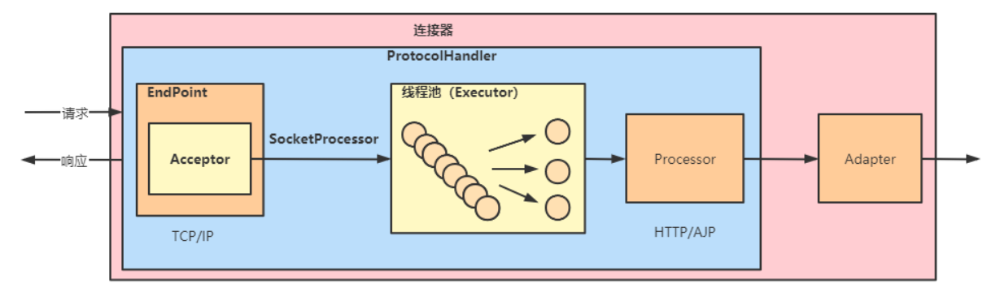

### Adapter

ProtocolHandler 接口负责解析请求并生成 Tomcat Request 类。但是这个 Request 对象不是标准的 ServletRequest

Tomcat 引入 CoyoteAdapter，这是适配器模式的经典运用，**连接器调用 CoyoteAdapter 的 Sevice 方法，传入的是 Tomcat Request 对象，CoyoteAdapter 负责将 Tomcat Request 转成 ServletRequest**，再调用容器的 Service 方法。

### ProtocolHandler处理流程

**EndPoint 接收到 Socket 连接后，生成一个 SocketProcessor 任务提交到线程池去处理， SocketProcessor 的 Run 方法会调用 Processor 组件去解析应用层协议，Processor 通过解析生成 Request 对象后，会调用 Adapter 的 Service 方法**


### 设计复杂系统的基本思路

 首先要分析需求，根据高内聚低耦合的原则确定子模块，然后找出子模块中的变化点和不变点，用 接口和抽象基类去封装不变点，在抽象基类中定义模板方法，让子类自行实现抽象方法，也就是具体 子类去实现变化点。

## 父子容器组合模式设计

Tomcat 设计了 4 种容器，分别是 Engine、Host、Context 和 Wrapper，Tomcat 是怎么管 理这些容器的？

**Tomcat 采用组合模式来管理这些容器。具体实现方法是，所有容器组件都实现了 Container 接口；**

```java
public interface Container extends Lifecycle {
 public void setName(String name);
 public Container getParent();
 public void setParent(Container container);
 public void addChild(Container child);
 public void removeChild(Container child);
 public Container findChild(String name);
 }
```

###  Pipeline-Valve 责任链模式设计

Tomcat调用顺序 ： Engine => Host => Context => Wrapper => Servlet;

具体实现：是使用 Pipeline-Valve 管道；

Pipeline-Valve 是责任链模式，责任链模式是指在一个请求处理的过程中有很多处理者依次对请求 进行处理，每个处理者负责做自己相应的处理，处理完之后将再调用下一个处理者继续处理。

```java
public interface Valve {
    public Valve getNext();
    public void setNext(Valve valve);
    public void backgroundProcess();
    public void invoke(Request request, Response response)
        throws IOException, ServletException;
    public boolean isAsyncSupported();
}
```

### Pipline接口设计

用来存放Valve对象

```java
public interface Pipeline extends Contained {
    public Valve getBasic();
    public void setBasic(Valve valve);
    public void addValve(Valve valve);
    public Valve[] getValves();
    public void removeValve(Valve valve);
    public Valve getFirst();
    public boolean isAsyncSupported();
    public void findNonAsyncValves(Set<String> result);
}
```

- Pipeline 中维护了 Valve 链表，Valve 可以插入到 Pipeline 中，对请求做某些处理。整个调用链 的触发是 Valve 来完成的，Valve 完成自己的处理后，调用 getNext.invoke() 来触发下一个 Valve 调 用。
- 每一个容器都有一个 Pipeline 对象，只要触发这个 Pipeline 的第一个 Valve，这个容器里 Pipeline 中的 Valve 就都会被调用到。
- **Basic Valve 处于 Valve 链表的末端，它是 Pipeline 中必不可 少的一个 Valve，负责调用下层容器的 Pipeline 里的第一个 Valve**; 
  - 每个容器都有自己BaseValve
  - Engine => StandardEngineValve
  - Host => StandardHostValve
  - Context => StandardContextValve
  - Wrapper => StandardWrapperValve


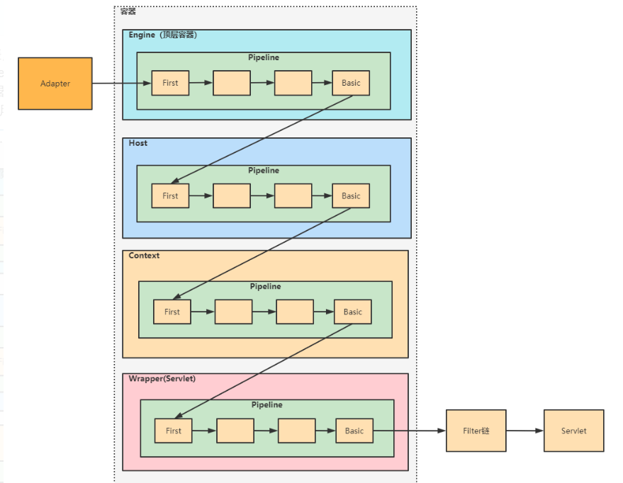


### Pipeline 调用流程

整个调用过程由连接器中的 Adapter 触发的，它会调用 Engine 的第一个 Valve

- Http11Processor#service
  - inputBuffer.parseRequestLine(keptAlive, protocol.getConnectionTimeout(),
          protocol.getKeepAliveTimeout()) ： 解析并读取请求行内容，包括URI，URL参数等
  - prepareRequestProtocol() ： 解析并读取请求协议，默认为HTTP/1.1
  - inputBuffer.parseHeaders()： 解析并读取请求头数据；
  - prepareRequest() ： 解析请求、例如端口号；
  - getAdapter().service(request, response) ： 调用适配器处理

-------------------------------------------

- CoyoteAdapter#service
  
  - request = connector.createRequest() ： 创建Servlet的Request对象
  - **postParseSuccess = postParseRequest(req, request, res, response) ：执行请求路径解析、获取处理该请求的StandardHost、StandardContext、StandardWrapper、并封装到Request的MappingData属性**
    - connector.getService().getMapper().map(serverName, decodedURI,
              version, request.getMappingData()) 
      - internalMap(host.getCharChunk(), uri.getCharChunk(), version, mappingData);
      - MappedHost mappedHost = exactFindIgnoreCase(hosts, host) ： Tomcat可以部署多个Host， 进行域名匹配， 拿到包装目标StandardHost的对象
      - mappingData.host = mappedHost.object ： 设置host属性为目标StandardHost；
      - ContextList contextList = mappedHost.contextList ： 拿到Host包装的Context列表；
      - MappedContext[] contexts = contextList.contexts; 拿到包装Context的数组列表
      - int pos = find(contexts, uri) ： 根据URI与Context的contextpath进行拦截匹配、获取目标Context的索引；
      - context = contexts[pos] ： 拿到包装StandardContext的对象， context包装contextversion对象、contextversion对象包装StandardContext;
      - mappingData.context = contextVersion.object;  设置context为目标StandardContext：
      - internalMapWrapper(contextVersion, uri, mappingData) ： Servlet路径匹配，遵循多种规则
        - mappingData.wrapper = contextVersion.defaultWrapper.object ：根据不同的Servlet处理路径、设置目标StandardWrapper对象；对于SpringBoot只有一个Servlet、即DispatchServlet、该Wrapper代表DispatchServlet;
  
  ------------
  
  - connector.getService().getContainer().getPipeline().getFirst().invoke(
           request, response) :  调用Engine的Pipeline处理， 最终调用到StandardEngineValve
  - StandardEngineValve#invoke
    - host.getPipeline().getFirst().invoke(request, response); 最终调用到StandardHostValve
  - StandardHostValve#invoke
    - context.getPipeline().getFirst().invoke(request, response); 最终调用到StandardContextValve
  - StandardContextValve#invoke
    - wrapper.getPipeline().getFirst().invoke(request, response); 最终调用到StandardWrapperValve
  - StandardWrapperValve#invoke
    - servlet = wrapper.allocate() : 创建Servlet对象实例
    - ApplicationFilterChain filterChain =ApplicationFilterFactory.createFilterChain(request, wrapper, servlet) ： 创建过滤器链，并设置了Servlet
    - **filterChain.doFilter (request.getRequest(), response.getResponse()) : 调用过滤器链， 将Tomcat Request对象 转换为 Servlet Request对象；**
  - ApplicationFilterChain#doFilter
    - filter.doFilter(request, response, this) : 若还有过滤器没执行、则调用下个过滤器；
    - servlet.service(request, response) ： 若过滤器链执行完、则调用Servlet#service处理请求；

若是SpringMVC项目、则Servlet为DispatchServlet、然后就是SpringMVC的请求调用流程；

Valve 和 Filter 的区别： 

Valve 是 Tomcat 的私有机制，与 Tomcat 的基础架构 /API 是紧耦合的。

Servlet API 是公有的标准，所有的 Web 容器包括 Jetty 都支持 Filter 机制。

 **Valve 工作在 Web 容器级别，拦截所有应用的请求；**

**而 Servlet Filter 工作在应用级别，只能拦截某个 Web 应 用的所有请求。**

## Tomcat请求路径映射处理

在Tomcat启动阶段、会加载容器组件之间的映射关系、即Engine下有几个Host, Host下有几个Context, Context下有几个Wrapper,  这些数据会缓存起来、当请求访问、拿到请求URL解析、拿到Hsot,Context,Wrapper，拿到Servlet处理请求；


SpringBoot自动注入DispatchServlet， 处理路径为“/”

```java
@Bean(name = DEFAULT_DISPATCHER_SERVLET_REGISTRATION_BEAN_NAME)
public DispatcherServletRegistrationBean dispatcherServletRegistration(DispatcherServlet dispatcherServlet) {
   DispatcherServletRegistrationBean registration = new DispatcherServletRegistrationBean(dispatcherServlet,
         this.webMvcProperties.getServlet().getPath());
	//...
   return registration;
}

this.webMvcProperties.getServlet().getPath() = "/"
```


对于SpringBoot内置Tomcat来说、 Egine、Host、Context都是一对一的关系、一个Hsot下只有一个Context：


### 路径映射加载

在StandardService的启动阶段、启动MappedListener组件完成路径映射加载；

- StandardService#startInternal

  - mapperListener.start();

    - Engine engine = service.getContainer();

    - Container[] conHosts = engine.findChildren() ： 获取所有Host

    - for (Container conHost : conHosts) registerHost(host) 遍历 

      - mapper.addHost(host.getName(), aliases, host) : 添加host映射

      - for (Container container : host.findChildren()) registerContext((Context) container) ： 解析并添加Context、wrapper的映射

        

Mapper ： hosts数组属性保存了Engine下的所有Host映射关系、数组元素类型为MappedHost,  该类属性contextList类型为ContextList,  该类内部数组MappedContext[]  保存Host下所有的Context容器、 MappedContext类的ContextVersion数组、保存Context用于处理请求的Servlet

- Mapper#addHost
  - MappedHost newHost = new MappedHost(name, host);
  - insertMap(hosts, newHosts, newHost) : 数组扩容后、插入数组尾部；

- MappedListener#registerContext

  - String contextPath = context.getPath() 

  - String[] welcomeFiles = context.findWelcomeFiles() ： 获取首页欢迎页、index.jsp/index.html等；

  - List<WrapperMappingInfo> wrappers = new ArrayList<>() : 存储Servlet映射集合；

  - for (Container container : context.findChildren()) ： 遍历所有的子容器Wrapper

    - prepareWrapperMappingInfo(context, (Wrapper) container, wrappers) : 包装Wrapper为WrapperMappingInfo放入wrappers;

  - mapper.addContextVersion(host.getName(), host, contextPath,
            context.getWebappVersion(), context, welcomeFiles, resources,
            wrappers) ： 解析Servlet的请求路径、创建MappedContext对象放入ContextVersion中；

    - hostName = renameWildcardHost(hostName) ： 拿到Context对应的Host;

    - MappedHost mappedHost  = exactFind(hosts, hostName) : 根据hostName从Hosts获取目标

    - ContextVersion newContextVersion = new ContextVersion(version,
              path, slashCount, context, resources, welcomeResources) ： 包装为ContextVersion;

    - **addWrappers(newContextVersion, wrappers) : 解析Context的Servlet请求路径、设置Wrapper；**

      - ```java
        for (WrapperMappingInfo wrapper : wrappers) {
            addWrapper(contextVersion, wrapper.getMapping(),
                wrapper.getWrapper(), wrapper.isJspWildCard(),
                wrapper.isResourceOnly());
        }
        ```

        - **if (path.endsWith("/*"))  :  接收的请求路径以 “/ *  ” 结尾**
          - MappedWrapper newWrapper = new MappedWrapper(name, wrapper,
                    jspWildCard, resourceOnly) 
          - MappedWrapper[] newWrappers = new MappedWrapper[oldWrappers.length + 1]; 旧数组扩容
          - insertMap(oldWrappers, newWrappers, newWrapper) ：插入数组中
          - context.wildcardWrappers = newWrappers ： 更新数组；
        - **if (path.startsWith("*.")) ：接收的请求路径以” / * “ 开头**
          - MappedWrapper newWrapper = new MappedWrapper(name, wrapper,
                    jspWildCard, resourceOnly);
          - MappedWrapper[] newWrappers =new MappedWrapper[oldWrappers.length + 1] 
          - insertMap(oldWrappers, newWrappers, newWrapper) ： 插入数组扩容后的尾部；
          - context.extensionWrappers = newWrappers ： 更新扩展数组；
        - **if (path.equals("/"))  ： 接收的请求路径为 “/”**
          - MappedWrapper newWrapper = new MappedWrapper("", wrapper,
                    jspWildCard, resourceOnly) 
          - context.defaultWrapper = newWrapper ： 设置默认的Wrapper，即默认Servlet, SpringBoot中，即DispatchServlet的Wrapper;
        - **以上都不成立、代表接收的请求路径是精确路径、是精确匹配**
          - MappedWrapper newWrapper = new MappedWrapper(name, wrapper,
                    jspWildCard, resourceOnly) 
          - MappedWrapper[] newWrappers = new MappedWrapper[oldWrappers.length + 1];
          - insertMap(oldWrappers, newWrappers, newWrapper) ：插入扩容后的数组尾部；
          - context.exactWrappers = newWrappers ： 更新精确Servlet的集合；

    ------------------------

    解析完毕、ContextVersion的wildcardWrappers、extensionWrappers 、defaultWrapper、exactWrappers 保存不同类型的处理请求的Servlet;

    --------

    - mappedContext = new MappedContext(path, newContextVersion);  解析后的ContextVersion设置给MappedContext;
    - ContextList newContextList = contextList.addContext(mappedContext, slashCount) : 往ContextList的数组属性设置mappedContext;
    - updateContextList(mappedHost, newContextList) ： 更新contextList对象；
      - 更新MappedHost的contextList属性；

    -------------------

    至此每个应用的Servlet映射关系解析完毕；

    -----------------

    

在Adapter调用Pipeline前，会将Tomcat的Request 转换为Servlet的Request,  解析请求过程中、会根据域名拿到StandardHost,  再根据contextpath拿到Context,  再根据请求URI拿到Wrapper,  把这些容器设置进Servlet的Request;

- CoyoteAdapter#service
  - request = connector.createRequest() : 创建Servlet的Request对象
  - postParseSuccess = postParseRequest(req, request, res, response); 解析请求URL、给Request设置容器组件
    - serverName = req.serverName() : 获取URL的域名；
    - MessageBytes decodedURI = req.decodedURI() ： 获取请求的URI、即/ContextPath/XXX
    - connector.getService().getMapper().map(serverName, decodedURI, version, request.getMappingData()) : 调用Mapper处理URL、设置request容器组件；
  - connector.getService().getContainer().getPipeline().getFirst().invoke(request, response) ： 调用Engine的Pipeline处理....执行容器的管道链....

---------

request.getMappingData() ： Request中、使用MappingData存储请求关联的容器；

--------


- Mapper#map(MessageBytes host, MessageBytes uri, String version,MappingData mappingData)
  - internalMap(host.getCharChunk(), uri.getCharChunk(), version, mappingData);
    - MappedHost[] hosts = this.hosts :  获取所有Host
    - MappedHost mappedHost = exactFindIgnoreCase(hosts, host) ： 根据域名匹配，拿到Host；
    - mappingData.host = mappedHost.object ： 设置目标StandardHost
    - ContextList contextList = mappedHost.contextList ：拿到MappedHost属性contextList;
    - MappedContext[] contexts = contextList.contexts : 拿到ContextList的MappedContext数组
    - int pos = find(contexts, uri) ：粗略匹配、contextpath与Context容器名称匹配，容器名称若包含contextpath, 则总数+1， 若容器设置了contextpath, 则contextPath即为容器名称；
      - while (pos >= 0) context = contexts[pos] 
      - length = context.name.length() 
      - uri.startsWith(context.name) =》 if (uri.startsWithIgnoreCase("/", length)： uri以容器名称开头、且uri的length位置是否为“/”， 是则找到目标Context；
    - ContextVersion[] contextVersions = context.versions : 拿到ContextVersion数组、SpringBoot应用下一个Host只有一个Context， 因此contextVersions 长度为1；
    - contextVersion = contextVersions[versionCount - 1];
    - mappingData.context = contextVersion.object ： 设置目标StandardContext;
    - internalMapWrapper(contextVersion, uri, mappingData) ： 设置Wrapper
      - int length = contextVersion.path.length() : 拿到contextpath的长度
      - int servletPath = pathOffset + length ： 拿到servletPath的起始位置
      - path.setOffset(servletPath) ： path偏移、拿到servletPath;
      - MappedWrapper[] exactWrappers = contextVersion.exactWrappers : 拿到精确匹配的Servlet
      - internalMapExactWrapper(exactWrappers, path, mappingData) : 先精确匹配
        - MappedWrapper wrapper = exactFind(wrappers, path) :  ServletPath与Servlet列表匹配，拿到目标Servlet的Wrapper;
        - mappingData.wrapper = wrapper.object， 设置目标Wrapper;
      - MappedWrapper[] wildcardWrappers = contextVersion.wildcardWrappers ： 拿到以“/*”结尾的Wrapper；
      - internalMapWildcardWrapper(wildcardWrappers, contextVersion.nesting,
                                   path, mappingData) ： 匹配
        - mappingData.wrapper = wrappers[pos].object;
      - MappedWrapper[] extensionWrappers = contextVersion.extensionWrappers ： 拿到"/*"开头的wrapper;   如 "/ * . jsp"
      - internalMapExtensionWrapper(extensionWrappers, path, mappingData,true) :
        - mappingData.wrapper = wrapper.object;
      - if (contextVersion.defaultWrapper != null) 
      - mappingData.wrapper = contextVersion.defaultWrapper.object ： 前缀匹配，后缀匹配，精确匹配都无法拿到wrapper, 则使用默认wrapper, 即DispatchServlet;


思考问题： ‘/*’ 与 ‘/’的拦截路径差别？

前者的路径匹配优先级更高、若是DispatchServlet设置为/*， 则所有请求都被接管、包括Tomcat内置的JspServlet请求路径为  * .jsp / *.jspx 也就无法接受到了。设置为/， 则可以匹配到JspServlet的请求路径、以及一些伪静态资源；


## Tomcat IO线程模型

### Socket请求连接过程

在Http11Processor通过Adapter调用Pipeline管道前、是属于网络通信的内容、与 IO编程模型有关；

#### Connector加载过程

##### Connector创建过程

- Connector#<init> : 构造方法创建ProtocolHandler对象, 类型为**Http11NioProtocol**
  - ProtocolHandler p = ProtocolHandler.create(protocol, apr)
    - **return new org.apache.coyote.http11.Http11NioProtocol()** 
      - Http11NioProtocol#<init>  
        - super(new NioEndpoint())  : super为AbstractHttp11JsseProtocol#<init>
          - super(endpoint) ： super为AbstractHttp11Protocol#<init>
            - AbstractHttp11Protocol#<init> 
              - **this.endpoint = endpoint : 最终设置endpoint属性；**

##### Connector初始化过程

Connector#init : 初始化阶段、 init方法由父类LifecycleBase实现

- Connector#initInternal()
  - **adapter = new CoyoteAdapter(this) ： 创建Adapter，用来调用Pipeline**
  - protocolHandler.setAdapter(adapter) :  设置给ProtocolHandler
  - protocolHandler.init() ： 执行协议处理器的初始化

Http11NioProtocol :  间接继承AbstractHttp11Protocol, AbstractProtocol抽象类、init方法由父类AbstractHttp11Protocol处理

NioEndPoint:  间接继承AbstractEndpoint， init方法由父类AbstractEndpoint实现；

- AbstractHttp11Protocol#init()
  - super.init() => AbstractProtocol#init()
    - endpoint.init() :  调用endpoint组件进行初始化
- AbstractEndpoint#init()
  - bindWithCleanup();
    - bind() : bind方法由NioEndPoint实现
      - initServerSocket() ： 初始化服务器 NIO socket连接
        - **serverSock = ServerSocketChannel.open() ： 创建服务器Socket连接**
        - **InetSocketAddress addr = new InetSocketAddress(getAddress(), getPortWithOffset()) ： 获取主机IP和端口号；**
        - **serverSock.bind(addr, getAcceptCount()) : 绑定IP端口号；**
        - **serverSock.configureBlocking(true); ：设置为阻塞模式**

从这个初始化阶段、可看出组件的父子关系、 Connector包含ProtocolHandler， Adapter; ProtocolHandler包含Endpoint， 初始化目的： **创建服务端Socket连接并绑定IP端口号；**

##### Connector开始阶段

- Connector#start ： start由父类实现
  - Connector#startInternal()
    - protocolHandler.start() : 调用组件协议处理的开始阶段
      - AbstractEndpoint#start()
        - endpoint.start() : 调用Endpoint组件的开始阶段
- AbstractEndpoint#start()
  - NioEndpoint#startInternal() 
    - **poller = new Poller();**
    - **Thread pollerThread = new Thread(poller, getName() + "-Poller") : 创建poll线程**
    - pollerThread.setDaemon(true) ： 设置为守护线程
    - **pollerThread.start() ：启动poller线程；**
    - startAcceptorThread() ： 启动客户端Socket接收器线程
      - **acceptor = new Acceptor<>(this) ： 创建接收器任务**
      - **Thread t = new Thread(acceptor, threadName) ： 创建接收器线程**
      - t.setDaemon(getDaemon());设置为守护线程
      - **t.start() ：启动接收器线程；**

Connector开始阶段最终调用子组件EndPoint 创建poller拉取线程， acceptor接收器线程并启动；

#### Acceptor接收器线程

- Acceptor#<init>

  - this.endpoint = endpoint;

- Acceptor#run

  - U socket = null : 声明Socket变量

  - socket = endpoint.serverSocketAccept() ： 接收客户端连接

    - return **serverSock.accept() ：若接收不到请求、则会被阻塞此位置；**

  - endpoint.setSocketOptions(socket) ： 将socket客户端连接交由Poller处理；

    - ```java
      SocketBufferHandler bufhandler = new SocketBufferHandler(
              socketProperties.getAppReadBufSize(),
              socketProperties.getAppWriteBufSize(),
              socketProperties.getDirectBuffer());
      ```

    - channel = new NioChannel(bufhandler) ： 创建NIO通道

    - NioSocketWrapper newWrapper = new NioSocketWrapper(channel, this) ： 创建Socket包装器

    - channel.reset(socket, newWrapper) ： NIO通道设置socket客户端连接

    - poller.register(socketWrapper) ：往Poller线程注册客户端连接

      - socketWrapper.interestOps(SelectionKey.OP_READ) ：设置客户端关注事件为read事件；
      - event = new PollerEvent(socketWrapper, OP_REGISTER) ： 创建Poller事件
      - addEvent(event)
        - events.offer(event) ： 往Poller的阻塞队列中放入时间、由Poller接收处理；

#### Poller接收器线程

- Poller#<init>
  - **this.selector = Selector.open() : 创建选择器**
- Poller#run
  - while(true) ： 任务会不断轮询
  - hasEvents = events() : 判断是否有时间发生
    - pe = events.poll() : 从阻塞队列中取出任务事件；
    - int interestOps = pe.getInterestOps() ： 为Register注册事件
    - if (interestOps == OP_REGISTER) 
      - sc.register(getSelector(), SelectionKey.OP_READ, socketWrapper) : 调用选择器注册socket连接，socket关注事件为读事件；
  - keyCount = selector.selectNow() ：拉取socket客户端通道发起的读事件总数；
  - Iterator<SelectionKey> iterator =  keyCount > 0 ? selector.selectedKeys().iterator() : null; 获取发生事件的通道key；
  - SelectionKey sk = iterator.next() ： 遍历通道key;
  - processKey(sk, socketWrapper) : 处理通道的事件；
    - processSocket(socketWrapper, SocketEvent.OPEN_READ, true) : 处理读事件
      - sc = createSocketProcessor(socketWrapper, event):创建Socket处理任务
        - return **new SocketProcessor(socketWrapper, event);**
      - Executor executor = getExecutor() ： 获取Tomcat定制的线程池执行；
      - executor.execute(sc) ： 提交Socket处理任务


- SocketProcessor#doRun 
  - state = getHandler().process(socketWrapper, event) : 处理socket通道的读事件
    - Processor processor = (Processor) wrapper.getCurrentProcessor() ： 获取类型为Http11Processor的处理器
      - state = processor.process(wrapper, status)  ：处理事件；
        - if (status == SocketEvent.OPEN_READ) state = service(socketWrapper);
          -  **Http11Processor#service: 处理socket请求数据，通过adapter调用Pipeline, 然后调用servlet**

#### Socket连接处理总结

- **Tomcat组件创建过程中、创建父组件Connector, 子组件ProtocolHandler, Adapter; 创建ProtocolHandler的子组件Endpoint;**
-  **Tomcat组件初始化阶段、 Connector初始化过程最终调用Endpoint创建 ServerSocketChannel服务器Socket连接并设置为阻塞方式；**
- **Tomcat组件启动阶段、Connector启动阶段最终调用Endpoint创建Acceptor接收器任务守护线程、Poller拉取任务守护线程**
- **Acceptor接收器运行过程中、不断轮询调用ServerSocketChannel#accept接收客户端Socket通道、接收到Socket通道后、往Poller的阻塞队列 放入PollerEvent事件；**
- **Poller拉取器运行过程中、死循环执行、不断轮训阻塞队列、从队列中取出PollerEvent事件后、往selector选择器注册socket通道、 事件为读事件；  调用select#selectNow拉取事件的SelectionKey  ， 为每个事件关联的通道 创建 SocketProcessor任务、 由Tomcat定制的线程池执行；**
- **SocketProcessor处理器任务执行过程中、 会调用Http11Processor处理socket请求数据，通过Adapter调用Pipeline，最终调用Servlet处理请求；**


### IO模型

在 Tomcat 中，EndPoint 组件的主要工作就是处理 I/O，而 NioEndpoint 利用 Java NIO API 实现了 多路复用 I/O 模型。Tomcat的NioEndpoint 是基于主从Reactor多线程模型设计的

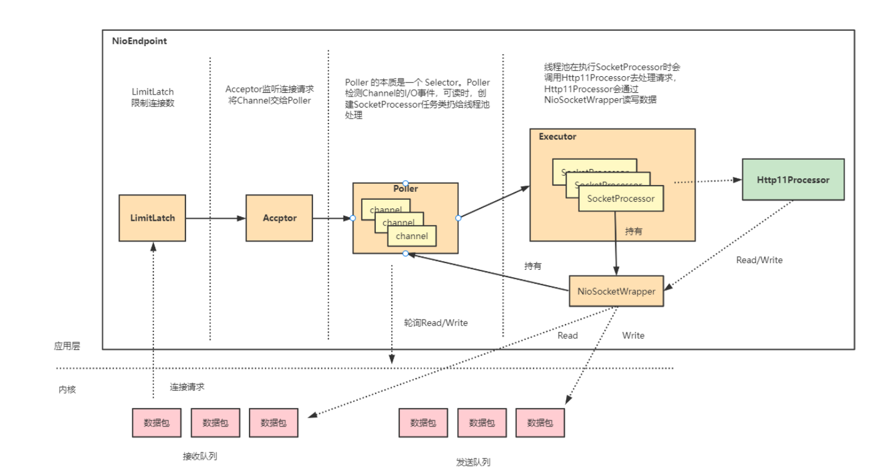

- LimitLatch 是连接控制器，它负责控制最大连接数，NIO 模式下默认是 10000(tomcat9中8192)，当连接数到 达最大时阻塞线程，直到后续组件处理完一个连接后将连接数减 1。注意到达最大连接数后操作系统底层还是会 接收客户端连接，但用户层已经不再接收。
- Acceptor 跑在一个单独的线程里，它在一个死循环里调用 accept 方法来接收新连接，一旦有新的连接请求到 来，accept 方法返回一个 Channel 对象，接着把 Channel 对象交给 Poller 去处理。


# Tomcat性能调优

Tomcat 的关键指标 ：**吞吐量、响应时间、错误数、线程池、CPU 以及 JVM 内存**

前三个指标是 我们最关心的业务指标，Tomcat 作为服务器，就是要能够又快有好地处理请求，因此吞吐量要大、响 应时间要短，并且错误数要少。

后面三个指标是跟系统资源有关的，当某个资源出现瓶颈就会影响前 面的业务指标，比如线程池中的线程数量不足会影响吞吐量和响应时间；但是线程数太多会耗费大量 CPU，也会影响吞吐量；当内存不足时会触发频繁地 GC，耗费 CPU，最后也会反映到业务指标上 来。


tomcat调优中主要针对线程池调优、即如何确定线程池的最大线程数；

```xml
    <!--
    namePrefix: 线程前缀
    maxThreads: 最大线程数，默认设置 200，一般建议在 500 ~ 1000，根据硬件设施和业务来判断
    minSpareThreads: 核心线程数，默认设置 25
    prestartminSpareThreads: 在 Tomcat 初始化的时候就初始化核心线程
    maxQueueSize: 最大的等待队列数，超过则拒绝请求 ，默认 Integer.MAX_VALUE
    maxIdleTime: 线程空闲时间，超过该时间，线程会被销毁，单位毫秒
    className: 线程实现类,默认org.apache.catalina.core.StandardThreadExecutor
-->
    <Executor name="tomcatThreadPool" namePrefix="catalina-exec-Fox"
              prestartminSpareThreads="true"
              maxThreads="500" minSpareThreads="10"  maxIdleTime="10000"/>
```

通过压测工具压测应用服务接口、 然后不断调整maxThreads， 通常要使吞吐量达到最大值同时错误数量最少的原则， 最终确定maxThreads的值；


## Tomcat生命周期设计

如果想让Tomcat能够对外提供服务，我们需要创建、组装并 启动Tomcat组件；在服务停止的时候，我们还需要释放资源，销毁Tomcat组件，这是一个动态的过 程。Tomcat 需要动态地管理这些组件的生命周期

在我们实际的工作中，如果你需要设计一个比较大的系统或者框架时，你同样也需要考虑这几个问 题：如何统一管理组件的创建、初始化、启动、停止和销毁？如何做到代码逻辑清晰？如何方便地添 加或者删除组件？如何做到组件启动和停止不遗漏、不重复？

### 一键式启停：LifeCycle 接口

系统设计就是要找到系统的变化点和不变点。这里的不变点就是每个组件都要经历创建、初始化、 启动这几个过程，这些状态以及状态的转化是不变的。而变化点是每个具体组件的初始化方法，也就 是启动方法是不一样的。

因此，我们把不变点抽象出来成为一个接口，这个接口跟生命周期有关，叫 作 LifeCycle。LifeCycle 接口里应该定义这么几个方法：init()、start()、stop() 和 destroy()，每个具 体的组件去实现这些方法


```java
public interface Lifecycle {

    public static final String BEFORE_INIT_EVENT = "before_init";

    public static final String AFTER_INIT_EVENT = "after_init";

    public static final String START_EVENT = "start";

    public static final String BEFORE_START_EVENT = "before_start";

    public static final String AFTER_START_EVENT = "after_start";

    public static final String STOP_EVENT = "stop";

    public static final String BEFORE_STOP_EVENT = "before_stop";

    public static final String AFTER_STOP_EVENT = "after_stop";

    public static final String AFTER_DESTROY_EVENT = "after_destroy";

    public static final String BEFORE_DESTROY_EVENT = "before_destroy";

    public static final String PERIODIC_EVENT = "periodic";

    public static final String CONFIGURE_START_EVENT = "configure_start";

    public static final String CONFIGURE_STOP_EVENT = "configure_stop";

    public void addLifecycleListener(LifecycleListener listener);

    public LifecycleListener[] findLifecycleListeners();

    public void removeLifecycleListener(LifecycleListener listener);

    public void init() throws LifecycleException;

    public void start() throws LifecycleException;

    public void stop() throws LifecycleException;

    public void destroy() throws LifecycleException;

    public LifecycleState getState();

    public String getStateName();

    public interface SingleUse {
    }
}
```

在**父组件的 init() 方法里需要创建子组件并调用子组件的 init() 方法。**同样，在父组件的 start() 方 法里也需要调用子组件的 start() 方法，因此调用者可以无差别的调用各组件的 init() 方法和 start() 方 法，这就是组合模式的使用，并且只要调用最顶层组件，也就是 Server 组件的 init() 和 start() 方法， 整个 Tomcat 就被启动起来了。


### 可扩展性：LifeCycle 事件

因为各个组件 init() 和 start() 方法的具体实现是复杂多变的，比如在 Host 容器的启动方法里需要 扫描 webapps 目录下的 Web 应用，创建相应的 Context 容器，如果将来需要增加新的逻辑，直接 修改 start() 方法？这样会违反开闭原则，那如何解决这个问题呢？开闭原则说的是为了扩展系统的功 能，**你不能直接修改系统中已有的类，但是你可以定义新的类。**

组件的 init() 和 start() 调用是由它的父组件的状态变化触发的，上层组件的初始化会触发子组件 的初始化，上层组件的启动会触发子组件的启动，**因此我们把组件的生命周期定义成一个个状态，把 状态的转变看作是一个事件**。而**事件是有监听器的，在监听器里可以实现一些逻辑，并且监听器也可 以方便的添加和删除，这就是典型的观察者模式**。 具体来说就是在 LifeCycle 接口里加入两个方法：**添加监听器和删除监听器**。


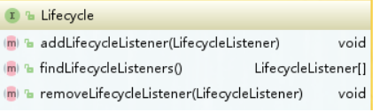

若是业务代码中、则通过定义State状态枚举；

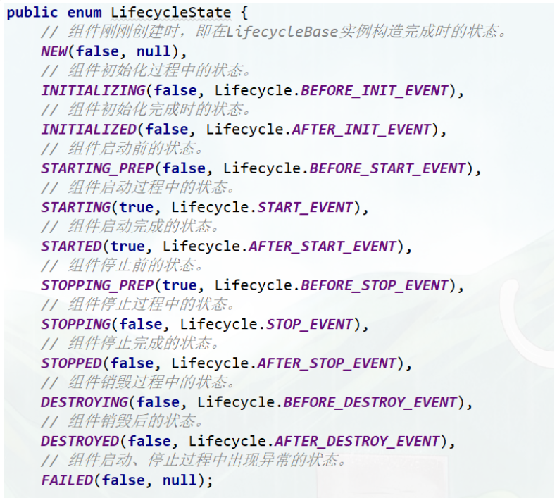

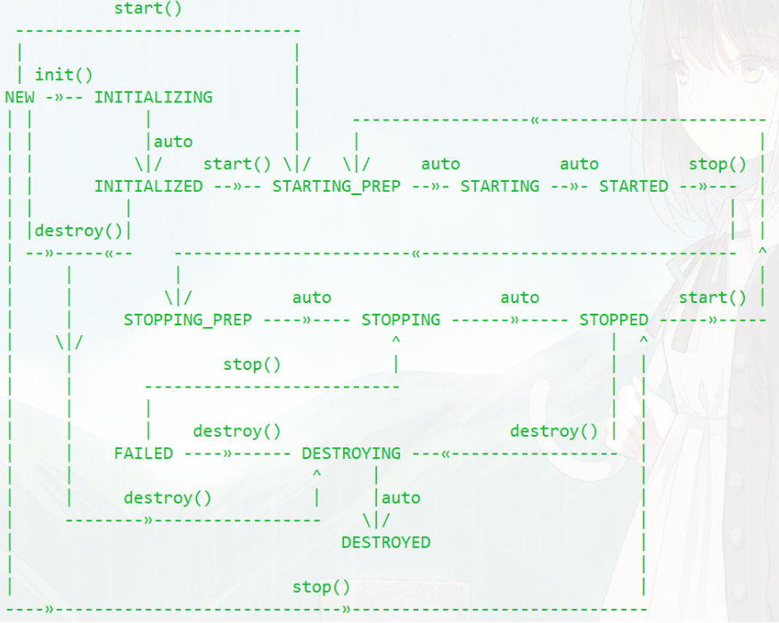


### 重用性：LifeCycleBase 抽象基类

有了接口，我们就要用类去实现接口。一般来说实现类不止一个，不同的类在实现接口时往往会有 一些相同的逻辑，**如果让各个子类都去实现一遍，就会有重复代码**。那子类如何重用这部分逻辑呢？ **其实就是定义一个基类来实现共同的逻辑，然后让各个子类去继承它，就达到了重用的目的**。

而基类 中往往会定义一些抽象方法，**所谓的抽象方法就是说基类不会去实现这些方法，而是调用这些方法来 实现骨架逻辑**。抽象方法是留给各个子类去实现的，并且子类必须实现，否则无法实例化。

Tomcat 定义一个基类 LifeCycleBase 来实现 LifeCycle 接口，把一些公共的逻辑放到基类中去， 比如生命状态的转变与维护、生命周期事件的触发以及监听器的添加和删除等，而子类就负责实现自 己的初始化、启动和停止等方法。

为了避免跟基类中的方法同名，我们把具体子类的实现方法改个名 字，在后面加上 Internal，叫 initInternal()、startInternal() 等。


```java
@Override
public final synchronized void init() throws LifecycleException {
    if (!state.equals(LifecycleState.NEW)) {
        invalidTransition(Lifecycle.BEFORE_INIT_EVENT);
    }

    try {
        setStateInternal(LifecycleState.INITIALIZING, null, false);
        initInternal();
        setStateInternal(LifecycleState.INITIALIZED, null, false);
    } catch (Throwable t) {
        handleSubClassException(t, "lifecycleBase.initFail", toString());
    }
}
```

Tomcat 自定义了一些监听器，这些监听器是父组件在创建子组件的过程中注册到子组件的。

比如 MemoryLeakTrackingListener监听器，用来检测 Context 容器中的内存泄漏，这个监听器是 Host 容器在创建 Context 容器时注册到 Context 中的。

 我们还可以在 server.xml 中定义自己的监听器，Tomcat 在启动时会解析 server.xml，创建监听器并注册到容器 组件

### LifeCycleBase实现类

- StandardServer、StandardService 是 Server 和 Service 组件的具体实现类，它们都继承了 LifeCycleBase。StandardEngine、StandardHost、StandardContext 和 StandardWrapper 是相应 容器组件的具体实现类，因为它们都是容器，所以继承了 ContainerBase 抽象基类，而 ContainerBase 实现了 Container 接口，也继承了 LifeCycleBase 类，它们的生命周期管理接口和功能接口是分开的，这也符合设计中接口分离的原则

- Tomcat 为了实现一键式启停以及优雅的生命周期管理，并考虑到了可扩展性和可重用性，将面向 对象思想和设计模式发挥到了极致，分别运用了组合模式、观察者模式、骨架抽象类和模板方法。如 果你需要维护一堆具有父子关系的实体，可以考虑使用组合模式。观察者模式听起来“高大上”，其 实就是当一个事件发生后，需要执行一连串更新操作。
- 传统的实现方式是在事件响应代码里直接加更 新逻辑，当更新逻辑加多了之后，代码会变得臃肿，并且这种方式是紧耦合的、侵入式的。观察者模 式实现了低耦合、非侵入式的通知与更新机制。模板方法在抽象基类中经常用到，用来实现通用逻 辑


